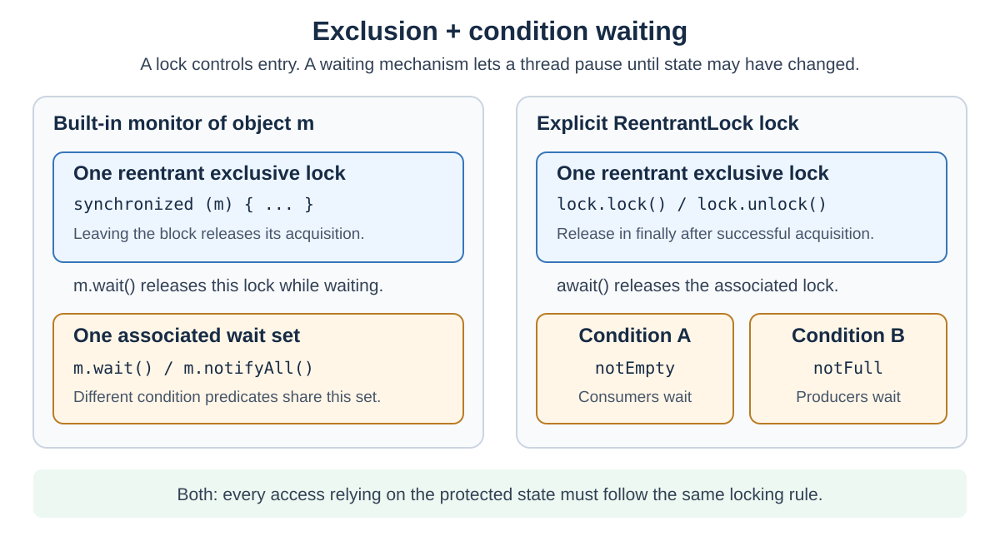
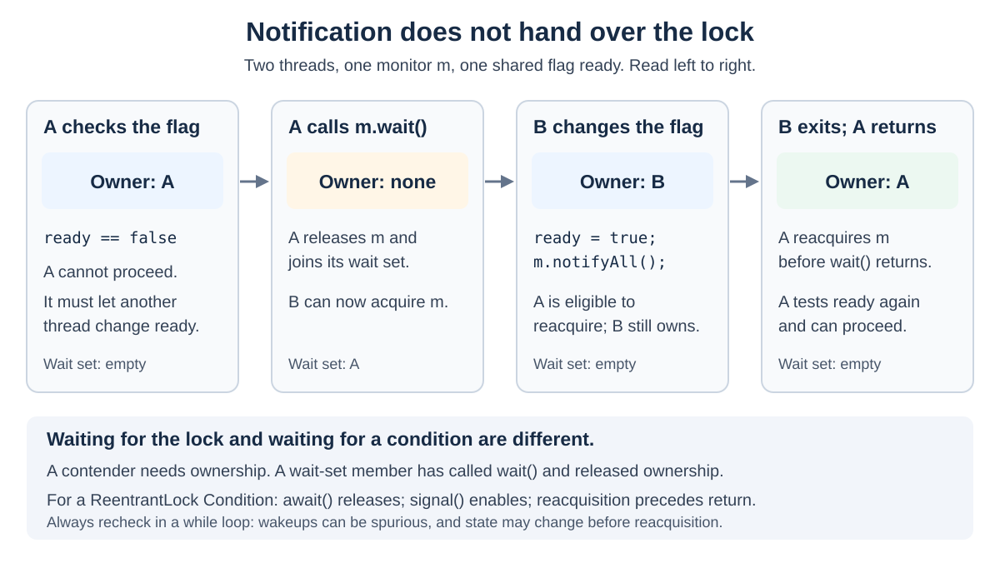

# Concurrency. Lock vs Monitor

<sub>[Back to Java](../Readme.md#content)</sub>

**A lock controls access to shared state. A monitor combines mutual exclusion with a way for threads to wait for that state to change.** In Java, `synchronized` uses an object's built-in monitor lock; `Object.wait()` and notification provide its condition-waiting mechanism. An explicit `ReentrantLock` offers the same basic exclusion and visibility guarantees, with additional controls.

Prefer `synchronized` for a straightforward critical section. Choose `ReentrantLock` when you need timed or interruptible acquisition, separate condition queues, an explicit fairness policy, or more flexible locking scope. Performance depends on the workload and Java Virtual Machine (JVM); neither is universally faster.

This article develops the original Anki card's distinction between **mutual exclusion** and **cooperation**, corrects its misleading details, and compares the two Java approaches with examples and performance guidance.

## The vocabulary: lock, monitor, and `Lock`

A **critical section** is code that accesses shared state under a locking rule. **Mutual exclusion** means that only one thread at a time may own the same exclusive lock. **Contention** occurs when threads compete for that lock.

These terms describe different levels:

| Term | Meaning here |
| --- | --- |
| **lock** | The general mechanism controlling access; in this comparison, an exclusive lock with one owning thread |
| **monitor** | Java's built-in synchronization facility associated with an object, used together with its **wait set** (the group of threads waiting through that object's `wait` methods) |
| **`Lock`** | The `java.util.concurrent.locks.Lock` interface for explicit locking; its implementations can have different properties |
| **`ReentrantLock`** | The explicit, reentrant, exclusive lock compared with `synchronized` throughout this article |
| **condition predicate** | A rule about state, such as “the queue is not empty,” that a waiting thread needs to become true |

The Java Language Specification associates each object with a monitor and a wait set. Calling these a “monitor with a lock and wait set” is a useful conceptual model, not a promise about object-header bits or a particular JVM's memory layout.

The diagram separates ownership from condition waiting. A **`Condition`** is a waiting mechanism associated with an explicit lock. A `ReentrantLock` can have several such objects, such as one for consumers waiting for items and another for producers waiting for space.



The `Lock` interface alone does not guarantee reentrancy or exclusive access: for example, a read lock can permit concurrent readers. The comparison below specifically uses `ReentrantLock`.

## What `synchronized` actually locks

`synchronized` acquires the monitor of a particular object. The object identifies the lock; it does not need to contain the protected fields.

| Form | Monitor acquired |
| --- | --- |
| `synchronized (guard) { ... }` | The object referenced by `guard` |
| An instance `synchronized` method | The receiver, `this` |
| A `static synchronized` method declared in `Example` | The class object `Example.class` |

Consequently, a static synchronized method and an instance synchronized method generally use different monitors. Two instance synchronized methods called on the **same instance** use the same monitor and exclude one another.

Ownership is **reentrant**: the owner may acquire the same monitor again. It becomes available to another thread only after all nested acquisitions have been released. Each `synchronized` block or method releases its acquisition when its body exits, including through a return or exception.

This complete class uses a private, stable guard for both reads and updates:

```java
public final class MonitorCounter {
    private final Object guard = new Object();
    private int value;

    public void increment() {
        synchronized (guard) {
            value++;
        }
    }

    public int get() {
        synchronized (guard) {
            return value;
        }
    }
}
```

The guard is private so callers cannot directly acquire it. It is `final` so these operations keep using the same object.

**Locking is a protocol, not an automatic barrier around an object's fields.** An unsynchronized method can still access `value` while another thread owns `guard`. Every access that relies on the protected state must follow the same locking rule. Creating a fresh guard on every call would also defeat coordination between calls.

## Visibility comes with the locking rule

**Happens-before** is Java's relationship that orders memory effects across threads. An unlock of a monitor happens-before a subsequent lock of that same monitor. `Lock` implementations must provide the corresponding memory synchronization effects for successful acquisition and release.

Thus, if A updates state and fully releases the shared lock, B can observe those writes after acquiring it. This applies to both approaches. It explains why the counter above does not also need a `volatile` field when all reads and updates use `guard`.

A failed `tryLock()` does not supply the successful-acquisition guarantee. Acquiring an unrelated lock does not establish this relationship either.

## Cooperation: waiting for state, not just ownership

A thread may own a lock but still be unable to do useful work: a consumer can have exclusive access to an empty queue. It needs to let a producer change the state.

Those wait-set members are distinct from threads trying to enter `synchronized`, which are contenders for ownership. The original card calls contenders the **entry set**. That is a helpful teaching label; it does not imply a first-in, first-out queue or a Java fairness guarantee.

In this trace, A needs `ready` to become true. `wait()` lets B acquire the monitor and change the flag. Notification makes A eligible to resume; A must reacquire ownership before returning from `wait()`.



The essential rules are:

- The caller must already own `m`'s monitor to call `m.wait()`, `m.notify()`, or `m.notifyAll()`; otherwise these calls throw `IllegalMonitorStateException`.
- `wait()` releases all of the caller's holds on **that monitor**, suspends the caller, and restores those holds through reacquisition before completing. The call does not release other locks the caller holds.
- `notify()` selects one wait-set member; `notifyAll()` selects all. Neither releases the notifier's lock or guarantees which thread acquires next.
- Unlocking alone does not notify the wait set. Waiting can also end through interruption, timeout, or a **spurious wakeup** that has no notification.

This complete one-way signal starts closed and stays open after `open()`:

```java
public final class ReadySignal {
    private final Object monitor = new Object();
    private boolean ready;

    public void awaitReady() throws InterruptedException {
        synchronized (monitor) {
            while (!ready) {
                monitor.wait();
            }
        }
    }

    public void open() {
        synchronized (monitor) {
            ready = true;
            monitor.notifyAll();
        }
    }
}
```

The **state** is durable: if `open()` happens first, a later caller sees `ready` and skips waiting. A notification is not stored as a permit. Checking the predicate and starting the wait under the same monitor prevents a missed state-change gap.

Always wait in a `while` loop. Besides spurious wakeups, another thread could consume the desired state before a notified thread reacquires the lock. This particular signal never closes again, but queues and reusable buffers do change back.

With a `ReentrantLock`, `Condition.await()` and `signal()`/`signalAll()` serve the corresponding roles. Its condition operations require ownership of the associated lock; `await()` releases and reacquires that lock. Multiple conditions let a buffer signal consumers separately from producers. A condition does not evaluate its predicate for you. For a production buffer, an existing `BlockingQueue` often already supplies the required protocol.

## Explicit locking: more control and manual release

The equivalent counter with `ReentrantLock` is:

```java
import java.util.concurrent.locks.ReentrantLock;

public final class ExplicitCounter {
    private final ReentrantLock lock = new ReentrantLock();
    private int value;

    public void increment() {
        lock.lock();
        try {
            value++;
        } finally {
            lock.unlock();
        }
    }

    public int get() {
        lock.lock();
        try {
            return value;
        } finally {
            lock.unlock();
        }
    }
}
```

Acquire immediately before `try`, then release in `finally`. Every successful acquisition needs a matching `unlock()` by the owner. The language does not release an explicit lock just because a method returns or throws.

This alternative counter demonstrates a capability `synchronized` lacks: abandoning acquisition after a requested wait.

```java
import java.util.concurrent.TimeUnit;
import java.util.concurrent.locks.ReentrantLock;

public final class TimedCounter {
    private final ReentrantLock lock = new ReentrantLock();
    private int value;

    public boolean tryIncrement(long timeout, TimeUnit unit)
            throws InterruptedException {
        if (!lock.tryLock(timeout, unit)) {
            return false;
        }
        try {
            value++;
            return true;
        } finally {
            lock.unlock();
        }
    }
}
```

Only the successful path unlocks. The timeout limits acquisition waiting, not execution of the critical section or a guaranteed wall-clock return deadline. Interruption is propagated so the caller can apply its cancellation policy.

A `ReentrantLock` object also has an ordinary intrinsic monitor. **`synchronized (lock)` and `lock.lock()` acquire different locks.** They can admit two threads at once and must not be mixed as protection for the same state.

## When each approach is the better fit

| Requirement | `synchronized` | `ReentrantLock` |
| --- | --- | --- |
| Simple, lexically scoped exclusion | Usually the clearest choice; automatic release | Works, with more cleanup code |
| Reentrancy and memory visibility | Both supported | Both supported |
| Try immediately and do something else if busy | No acquisition API for this | `tryLock()` |
| Limit acquisition waiting | No acquisition timeout | `tryLock(timeout, unit)` |
| Cancel while waiting to acquire | Monitor entry is not interruptible | `lockInterruptibly()` or timed `tryLock()` |
| Wait for a state predicate | One wait set per object | Multiple `Condition` objects per lock |
| Favor the longest-waiting acquirer | No configurable fairness policy | Optional fair constructor |
| Acquire and release in different scopes | Must follow block/method scope | Possible, with careful cleanup |

**Choose `synchronized`** when a short operation must maintain an invariant, such as updating two related fields together, and you do not need extra acquisition controls. Automatic release makes this code easier to review. A private guard can keep the locking policy internal to the class.

**Choose `ReentrantLock`** when a requirement makes those controls useful: a cancellable task must stop waiting for ownership, a request needs a timeout or fallback, or producers and consumers need distinct condition queues. An advanced traversal may also acquire the next node's lock before releasing the previous one; explicit locking can express that scope.

`new ReentrantLock()` is nonfair. Fair mode favors the longest-waiting acquirer under contention, but does not control operating-system scheduling or promise a response-time deadline. Untimed `tryLock()` can bypass queued threads even in fair mode.

Two distinctions prevent common mistakes:

- **Interruptible waiting is not the same as interruptible acquisition.** `Object.wait()` is interruptible, although entering `synchronized` is not. Plain `ReentrantLock.lock()` also does not cancel its acquisition wait on interruption.
- **Flexibility does not prevent deadlock automatically.** Either approach can deadlock if threads acquire multiple locks in inconsistent orders. Timeouts help only if failure handling releases held locks and makes useful progress.

For a longer treatment of explicit-lock ownership and condition queues, see [Concurrency. ReentrantLock](../Concurrency.%20ReentrantLock/Readme.md).

## Performance comparison

**The API contracts do not establish a universal speed ranking.** A useful comparison distinguishes **throughput** (completed operations per second), **latency** (time per operation), and **scalability** (how useful work changes as concurrency increases).

The following is a qualitative comparison, not measured benchmark results:

| Workload or choice | What matters | Practical implication |
| --- | --- | --- |
| Short, mostly uncontended sections | Acquisition overhead and JVM optimization | Start with `synchronized` for simplicity; a faster explicit-lock result must be demonstrated for the target workload. |
| Many threads sharing one lock | Time holding the lock, contention, and handoff costs | Either implementation may win a particular test. There is no general rule that `ReentrantLock` wins under contention. |
| Fair versus nonfair `ReentrantLock` | Waiting-order policy versus throughput | The API warns that fair mode can substantially reduce throughput. Choose it for its policy, then measure the cost. |
| Several groups waiting for different predicates | How many ineligible threads wake and contend again | Separate conditions can avoid broad notifications. This is a protocol advantage, not proof that each lock operation is faster. |
| Long work while holding either exclusive lock | Other owners cannot enter during that work | Reduce the protected work or partition independent state where correctness allows. A different lock class does not remove serialization. |
| Virtual threads with blocking operations | Whether blocked virtual threads retain the platform threads executing them (their **carriers**) | The answer changes at JDK 24; see below. |

The last two rows concern different bottlenecks. Freeing an execution thread does not free the application lock.

As an **idealized calculation**, if every operation holds the same exclusive lock for 1 ms, the protected work alone limits throughput to at most about 1,000 operations per second. Acquisition, handoff, and other costs can lower it further. Adding threads or switching between these lock APIs cannot make two owners execute that section simultaneously.

### JVM optimization makes tiny tests deceptive

HotSpot can use **escape analysis** to determine that an object is confined to one thread, and can remove synchronization that is consequently unnecessary. This is an implementation optimization, not permission to omit synchronization on shared state.

A benchmark that creates a fresh monitor inside every invocation may therefore measure eliminated locking. Even without elimination, independent locks do not measure contention. Benchmark the sharing pattern your application actually uses, and report the JDK and JVM build because optimization behavior changes.

### Virtual threads: JDK 21–23 versus JDK 24+

**Pinning** prevents a virtual thread from unmounting from its carrier during blocking.

On **JDK 21–23**, blocking while inside `synchronized` could keep the carrier occupied and limit scalability. The official guidance recommended considering `ReentrantLock` for frequently executed synchronized regions containing potentially long blocking input/output operations. That was a specific scaling concern, not a claim that every monitor acquisition was slow.

**JDK 24 delivered JEP 491, Synchronize Virtual Threads without Pinning.** Virtual threads blocked in synchronized code can release their carriers. Ordinary `synchronized` use is therefore no longer, by itself, a reason to replace a monitor with `ReentrantLock` on JDK 24 and later. Native or foreign-function execution can still involve pinning.

With either API, a thread performing slow work while holding the application lock still excludes other owners. Monitor unmounting improves carrier availability; it does not turn a serialized resource into a parallel one.

### How to make a defensible measurement

Use the OpenJDK **Java Microbenchmark Harness (JMH)** for acquisition-cost experiments and a representative application load test for the overall decision.

- Compare `synchronized`, default nonfair `ReentrantLock`, and fair `ReentrantLock` as separate cases doing equivalent useful work.
- Share the protected state between workers, for example with JMH `@State(Scope.Benchmark)`. A separate `Scope.Thread` lock per worker tests a different situation.
- Sweep thread count and work inside and outside the critical section. Include one-thread and genuinely contended cases.
- Use warmup, measurement iterations, and separate JVM forks. Keep results observable and let the harness drive repetitions; avoid a hand-timed empty loop.
- Record the JDK/JVM, processor, operating system, JVM flags, fairness setting, and thread type. A platform-thread microbenchmark does not establish virtual-thread application scalability.
- Report uncertainty and both throughput and relevant latency percentiles. Confirm that an apparent gain survives the real application's workload.

These are measurement-design recommendations, not a promised outcome. No fixed nanosecond cost or speedup applies to all machines and workloads.

## Corrections to the original Anki card

The extracted card's useful core is that exclusion protects shared state while waiting enables cooperation, such as producer/consumer coordination. These details need correction:

| Original implication | Correct interpretation |
| --- | --- |
| Reading instance variables requires owning the object's lock | The JVM does not enforce that discipline automatically; the program must use a consistent protocol. |
| `wait` and `notify` acquire a monitor for the caller | The caller must already own it. `wait` releases and later reacquires it; `notify` retains ownership. |
| All blocked threads belong to the wait set | Monitor-entry contenders and threads suspended by `wait` are different groups. |
| Unlocking notifies all waiters | Unlocking and notification are separate actions. |
| The lock is necessarily a flag in every object's header | Object association is specified; physical representation is JVM- and version-dependent. |

# Sources

- [Java Language Specification, Java SE 27, §17: synchronization, wait sets, and happens-before](https://docs.oracle.com/javase/specs/jls/se27/html/jls-17.html)
- [Java Language Specification, Java SE 27, §14.19: the synchronized statement](https://docs.oracle.com/javase/specs/jls/se27/html/jls-14.html#jls-14.19)
- [Java Language Specification, Java SE 27, §8.4.3.6: synchronized methods](https://docs.oracle.com/javase/specs/jls/se27/html/jls-8.html#jls-8.4.3.6)
- [Java SE 27 API: Object — wait, notify, and notifyAll](https://docs.oracle.com/en/java/javase/27/docs/api/java.base/java/lang/Object.html)
- [Java SE 27 API: Lock — scope, acquisition controls, memory semantics, and intrinsic-monitor distinction](https://docs.oracle.com/en/java/javase/27/docs/api/java.base/java/util/concurrent/locks/Lock.html)
- [Java SE 27 API: ReentrantLock — ownership, cleanup, fairness, and timed acquisition](https://docs.oracle.com/en/java/javase/27/docs/api/java.base/java/util/concurrent/locks/ReentrantLock.html)
- [Java SE 27 API: Condition — separate wait sets and predicate loops](https://docs.oracle.com/en/java/javase/27/docs/api/java.base/java/util/concurrent/locks/Condition.html)
- [Oracle HotSpot performance guide, JDK 27: escape analysis and synchronization elimination](https://docs.oracle.com/en/java/javase/27/vm/java-hotspot-virtual-machine-performance-enhancements.html)
- [Oracle JDK 21 guide: virtual-thread pinning and synchronized regions](https://docs.oracle.com/en/java/javase/21/core/virtual-threads.html)
- [Oracle JDK 24 Migration Guide, “Performance and Runtime Improvements”: JEP 491](https://docs.oracle.com/en/java/javase/24/migrate/jdk-migration-guide.pdf#page=11)
- [Oracle JDK 27 guide: virtual-thread scheduling and remaining pinning cases](https://docs.oracle.com/en/java/javase/27/core/virtual-threads.html)
- [OpenJDK JMH: setup and benchmarking guidance](https://github.com/openjdk/jmh)
- [OpenJDK JMH sample 03: shared and per-thread state](https://github.com/openjdk/jmh/blob/master/jmh-samples/src/main/java/org/openjdk/jmh/samples/JMHSample_03_States.java)
- [OpenJDK JMH sample 12: separate JVM forks and profile contamination](https://github.com/openjdk/jmh/blob/master/jmh-samples/src/main/java/org/openjdk/jmh/samples/JMHSample_12_Forking.java)
