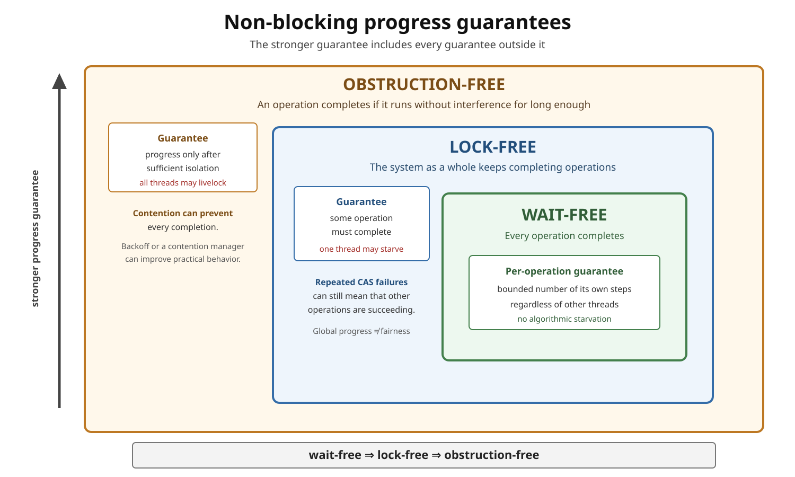
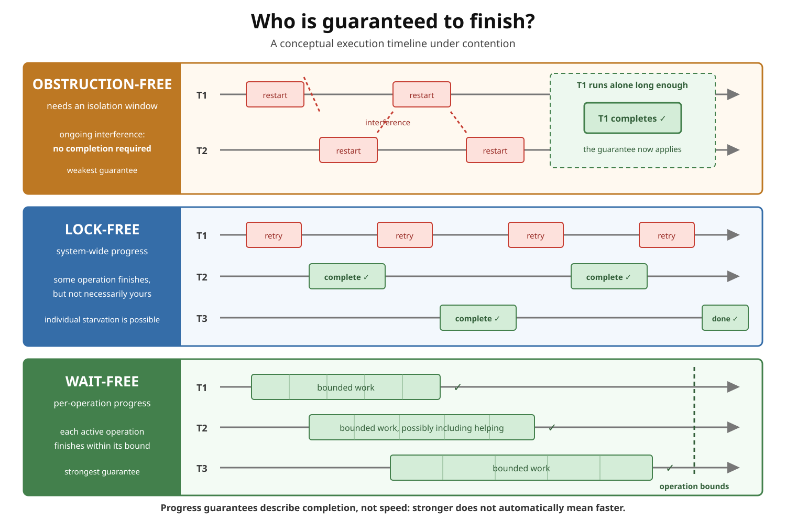

# Concurrency. Lock-Free vs. Wait-Free vs. Obstruction-Free

## Front

What is the difference between **obstruction-free**, **lock-free**, and **wait-free** concurrent algorithms, and what do these progress guarantees mean in modern Java?

## Back

These terms describe **progress guarantees** for concurrent operations.

They answer different versions of this question:

> When threads interfere, which operations are guaranteed to finish?

From weakest to strongest:

```text
obstruction-free  →  lock-free  →  wait-free
```

The implication runs in the opposite direction:

```text
wait-free ⇒ lock-free ⇒ obstruction-free
```

The reverse implications are not true.



## Short comparison

| Guarantee | What must finish? | Can the whole system livelock? | Can one thread starve? |
|---|---|---:|---:|
| Obstruction-free | An operation running alone for long enough | Yes, under continuing interference | Yes |
| Lock-free | Some operation in the system | No, while execution steps continue | Yes |
| Wait-free | Every operation | No | No, under the algorithm's model assumptions |



## Obstruction-free

An operation is **obstruction-free** when:

> If one thread eventually runs in isolation for sufficiently many of its own steps, its operation completes.

Other threads do not have to terminate; they only have to stop interfering long enough.

```text
T1 and T2 keep colliding → no completion is guaranteed

T2 stops interfering
T1 runs alone long enough → T1 must complete
```

Obstruction-freedom is the weakest of the three guarantees.

It avoids dependency on another thread releasing an exclusive lock, but continuing contention can cause all operations to repeatedly abort or restart without any of them completing.

A contention manager, randomized delay, or backoff can improve practical progress, but that policy is separate from the underlying obstruction-free guarantee.

Conceptual transactional shape:

```java
for (;;) {
    Snapshot before = readConsistentState();
    Update next = calculateUpdate(before);

    if (validateAndCommit(before, next)) {
        return;
    }

    // Interference may force another restart.
}
```

This shape alone does not prove a particular progress guarantee. The implementation of validation, commit, conflict detection, and contention management determines whether the complete algorithm is obstruction-free, lock-free, or stronger.

## Lock-free

An implementation is **lock-free** when:

> While threads continue taking execution steps, the system as a whole is guaranteed to complete operations.

The winning thread may change each time. Lock-freedom guarantees **global progress**, not progress for a particular caller.

```text
T1 fails → T2 succeeds
T1 fails → T3 succeeds
T1 fails → T2 succeeds

System: progressing
T1: possibly starving
```

A suspended or delayed thread cannot indefinitely prevent all other threads from completing operations merely because it stopped in the middle of an operation.

### Typical CAS retry loop

```java
static int increment(AtomicInteger counter) {
    for (;;) {
        int current = counter.get();
        int next = current + 1;

        if (counter.compareAndSet(current, next)) {
            return next;
        }

        Thread.onSpinWait();
    }
}
```

Under the usual lock-free CAS assumption, this algorithm is lock-free:

- If this thread's `compareAndSet()` succeeds, its operation completes.
- If it fails because the value changed, some competing update made progress.
- Therefore, repeated failures still imply system-wide progress.

It is **not wait-free**. One unlucky thread can repeatedly lose every CAS race and retry without a fixed bound.

`Thread.onSpinWait()` is only a processor hint for a spin loop. It does not turn a lock-free algorithm into a wait-free one.

### Java example

`ConcurrentLinkedQueue` uses a non-blocking queue algorithm based on the Michael–Scott queue. It is a common Java example of lock-free data-structure design.

The `java.util.concurrent.atomic` package provides atomic operations used to build lock-free algorithms on individual variables.

Do not infer a formal per-operation progress guarantee merely from seeing `AtomicInteger`, `VarHandle`, or CAS. The entire retry algorithm and the platform/API contract must be considered.

## Wait-free

An implementation is **wait-free** when:

> Every operation completes after a finite, bounded number of its own steps, regardless of the relative execution speeds or failures of other threads.

Wait-freedom provides **per-thread progress**.

```text
T1 starts → completes within its bound
T2 starts → completes within its bound
T3 starts → completes within its bound
```

One aggressive thread cannot force another thread to retry forever.

The bound may depend on properties such as:

- The number of participating threads.
- The size or capacity of the data structure.
- The particular operation being performed.

But it must not depend on other threads eventually being scheduled or voluntarily cooperating in the future.

### Helping

Many wait-free algorithms use **helping**:

```text
1. A thread publishes a pending operation descriptor.
2. Threads process pending descriptors in a defined order.
3. A thread may complete another thread's operation before its own.
4. A bounded helping rule prevents one request from being ignored forever.
```

Helping converts global progress into per-operation progress, but it makes algorithms and their correctness proofs substantially more complex.

Wait-free algorithms are useful when a proven upper bound on interference-related delay matters, such as specialized real-time or fault-tolerant systems.

## The guarantee hierarchy

### Wait-free implies lock-free

If every active operation completes within a bounded number of its own steps, then some operation certainly completes. Therefore the system makes progress.

### Lock-free implies obstruction-free

If only one active operation is taking steps, lock-free system progress must come from that operation. Therefore it completes when it runs without interference.

### Obstruction-free does not imply lock-free

Two or more threads can continually interfere, causing every operation to restart without any completion.

### Lock-free does not imply wait-free

The system can complete infinitely many operations while one unlucky thread loses every race and starves.

## Non-blocking vs. blocking

Obstruction-free, lock-free, and wait-free are all forms of **non-blocking progress**.

A blocking algorithm may require another thread to take a future action:

```java
synchronized (lock) {
    updateSharedState();
}
```

If the lock owner is suspended inside the critical section, other callers needing that lock cannot complete until the owner runs again and releases it.

This does not make locks incorrect. Locks are often simpler, easier to verify, and faster under appropriate contention patterns.

### “Lock-free” does not merely mean “no `synchronized` keyword”

Code can avoid Java locks and still fail to be lock-free:

```java
while (!condition) {
    // No lock, but no progress guarantee either.
}
```

Conversely, an application can contain locks in unrelated paths while a particular data-structure operation has a lock-free progress guarantee.

The guarantee belongs to a specific algorithm or operation under stated assumptions—not automatically to an entire application.

## Progress is different from correctness

Progress guarantees are **liveness** properties: whether operations eventually finish.

They do not by themselves prove **safety** properties such as:

- Atomicity.
- Linearizability.
- Correct memory ordering.
- Preservation of data-structure invariants.
- Freedom from ABA problems.
- Safe reclamation of removed nodes.

An algorithm may be linearizable but blocking, obstruction-free, lock-free, or wait-free.

Correct non-blocking Java code usually needs both:

```text
safety:   operations appear correct and properly ordered
liveness: operations satisfy the claimed progress guarantee
```

## Starvation, fairness, and scheduling

These concepts are related but not interchangeable:

- **Starvation** means one operation can be postponed indefinitely while others progress.
- **Fairness** is a scheduling or admission policy that tries to give contenders opportunities.
- **Lock-freedom** permits individual starvation.
- **Wait-freedom** rules out algorithmic starvation for active operations under its model assumptions.
- An operating-system scheduler can still stop scheduling a thread; no user-space algorithm can make an unscheduled thread execute instructions.

When definitions say “regardless of other threads,” they measure the operation's own steps once that operation is allowed to execute.

## CAS does not automatically mean wait-free

CAS is one atomic step, but an operation containing an unbounded CAS retry loop is not wait-free:

```java
do {
    current = state.get();
    next = transform(current);
} while (!state.compareAndSet(current, next));
```

The loop may be lock-free if every failed CAS implies that another operation advanced the state. The current thread still has no bounded retry count.

Even a fixed retry count does not necessarily create a wait-free implementation of the original operation. Returning “failed, try again” changes the operation's contract unless failure is an allowed result.

## Performance is not implied

The hierarchy describes guaranteed progress, not speed:

- A lock-free algorithm can waste CPU on retries under heavy contention.
- Cache-line bouncing can dominate a CAS-based algorithm.
- A wait-free algorithm can perform more bookkeeping and helping than a lock-based algorithm.
- A well-designed lock can outperform non-blocking code for larger critical sections.
- Backoff can improve throughput without strengthening the formal guarantee.

Always measure the real workload.

## Practical selection

| Requirement | Typical direction |
|---|---|
| Complex multi-field invariant and ordinary latency requirements | Lock or higher-level synchronization |
| High-concurrency queue or single-state update with acceptable retries | Lock-free structure or CAS loop |
| Simplified optimistic algorithm with a separate contention policy | Obstruction-free design |
| Proven bound on interference-related steps for every operation | Wait-free algorithm |
| Standard Java concurrent collection | Read its exact API and implementation guarantee |

## Common interview traps

### Does lock-free mean every thread progresses?

No. It guarantees that **some** operation progresses. Individual starvation remains possible.

### Does wait-free mean an operation completes within a wall-clock deadline?

No. It bounds algorithmic steps, not operating-system scheduling delays, page faults, JVM safepoints, or arbitrary hardware delays.

### Is every CAS loop lock-free?

No. A retry loop is lock-free only when failures imply system progress and all other parts of the algorithm preserve that guarantee.

### Is `tryLock()` automatically obstruction-free?

No. If another suspended thread owns the lock, an operation depending on that lock cannot complete even when it runs alone. Returning failure can be wait-free as a *try operation*, but it is not the same contract as eventually performing the protected update.

### Is lock-free always faster than locking?

No. Progress guarantees and performance are different properties.

## Summary

```text
Obstruction-free:
    I finish if I run alone long enough.

Lock-free:
    The system keeps finishing operations,
    but I might starve.

Wait-free:
    Every active operation finishes within
    a bounded number of its own steps.

Strength:
    wait-free ⇒ lock-free ⇒ obstruction-free
```

## Official and primary references

- [Maurice Herlihy — Wait-Free Synchronization](https://cs.brown.edu/people/mph/Herlihy91/p124-herlihy.pdf)
- [Herlihy, Luchangco, and Moir — Obstruction-Free Synchronization](https://cs.brown.edu/people/mph/HerlihyLM03/main.pdf)
- [Java 25 atomic package](https://docs.oracle.com/en/java/javase/25/docs/api/java.base/java/util/concurrent/atomic/package-summary.html)
- [Java 25 ConcurrentLinkedQueue](https://docs.oracle.com/en/java/javase/25/docs/api/java.base/java/util/concurrent/ConcurrentLinkedQueue.html)
- [Java 25 AtomicInteger](https://docs.oracle.com/en/java/javase/25/docs/api/java.base/java/util/concurrent/atomic/AtomicInteger.html)
