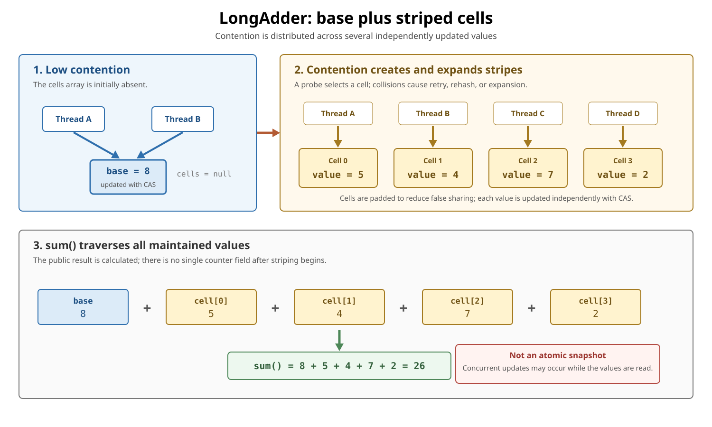
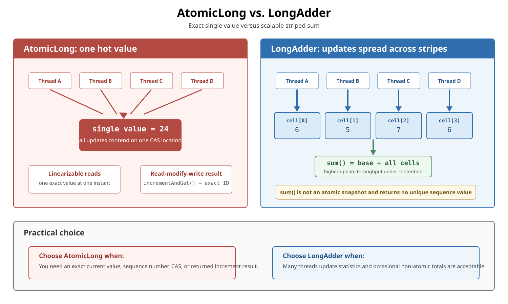

# Concurrency. LongAdder

## Front

How does `LongAdder` reduce counter contention, why is `sum()` not an atomic snapshot, and when should `AtomicLong` or a higher-level synchronizer be used instead?

## Back

**LongAdder** was introduced in **Java 8.**

`LongAdder` is a thread-safe, scalable **sum** for workloads where many threads update one statistic. Under contention it spreads updates across several internal values and later adds them together.

The central trade-off is:

> **Faster expected updates under heavy contention, in exchange for more memory and no atomic snapshot from `sum()`.**

Use it for request counts, event totals, or statistics. Use `AtomicLong` when one authoritative value, compare-and-set (CAS), or the exact value returned by an increment is part of correctness.

## Public API mental model

The API describes “one or more variables” that maintain an initially zero sum:

| Method | Meaning |
|---|---|
| `increment()` | Adds `1`; returns `void` |
| `decrement()` | Adds `-1`; returns `void` |
| `add(x)` | Adds any `long`; returns `void` |
| `sum()` / `longValue()` | Reads and combines the maintained values |
| `reset()` | Sets the maintained values to zero |
| `sumThenReset()` | Collects the values and resets them |

There is deliberately no `getAndIncrement()`, `incrementAndGet()`, `set()`, or `compareAndSet()`. Such methods need one indivisible value and do not fit a striped sum.

## Current OpenJDK structure

The public behavior does not require a particular layout. Current OpenJDK implements `LongAdder` on the package-private `Striped64` class with:

- a `base` value for the low-contention path;
- a lazily created power-of-two `Cell[]` for contended updates;
- padded `Cell` objects whose values can be updated independently;
- a small `cellsBusy` CAS guard used only while creating or resizing the array and installing cells.



Conceptually, the total is:

```text
base + cell[0] + cell[1] + ... + cell[n]
```

`base`, `Cell`, the array size, and the collision policy are implementation details. Code must use only the public methods.

## How an update is distributed

**Compare-and-set (CAS)** changes a value only if it still equals the expected old value. A failed CAS means another updater won the race.

Current OpenJDK follows this broad path:

1. If no cells exist, `add(x)` first attempts `CAS(base, base + x)`.
2. A failed base CAS reveals contention and sends the update to the accumulation logic.
3. The implementation lazily creates two cell slots and selects a slot using a probe associated with the current carrier thread.
4. It attempts CAS on that cell rather than on the shared base.
5. On collisions, it may change the probe, fill an empty slot, retry, use `base` as a fallback, or double the cells array.

The array expands in powers of two up to a CPU-based bound in the current implementation. There can be more cells than active updaters, empty slots, and cells that later become unused. None of this changes the public sum.

### Why stripes help

With `AtomicLong`, every update targets one memory location. Under heavy write contention, CAS failures and cache-line ownership transfers concentrate on that location.

With `LongAdder`, different workers can update different cells. This reduces the chance that unrelated increments fight over the same cache line. OpenJDK marks each `Cell` with `@Contended` padding to reduce **false sharing**—independent values accidentally occupying the same cache line.

The padding and extra cells consume more memory. Under low contention, the API documentation says `LongAdder` and `AtomicLong` have similar characteristics; striping is valuable only when contention exists.

## What `sum()` guarantees

`sum()` reads `base`, traverses the cells, and adds the values it observes.

- With **no concurrent updates**, the result is accurate.
- With concurrent updates, an update that occurs while traversal is in progress might not be included.
- The result is not corrupted; it is simply not a snapshot of all cells at one common instant.
- After writers become quiescent, a later `sum()` returns the complete maintained total.

Imagine `sum()` reading `cell[0]`, another thread incrementing it, and then `sum()` reading `cell[1]`. The returned combination mixes observations from different moments. That is acceptable for monitoring; it is not an atomic decision point.

Broken hard-limit logic:

```java
if (inUse.sum() < limit) {
    inUse.increment(); // check and increment are not one atomic action
}
```

Several threads can pass the check together. Use a `Semaphore`, lock, bounded queue, or another mechanism that enforces the invariant atomically.

## `AtomicLong` versus `LongAdder`



| Requirement | Better fit | Reason |
|---|---|---|
| Highly contended request or event count | `LongAdder` | Updates can spread across cells |
| Statistics read occasionally | `LongAdder` | A non-atomic concurrent observation is acceptable |
| Unique sequence number | `AtomicLong` | `getAndIncrement()` returns one exact distinct value |
| CAS state transition | `AtomicLong` | One value supports atomic conditional replacement |
| Exact check-and-update rule | Higher-level synchronizer | Multiple actions must form one invariant-preserving operation |
| Very low contention and frequent reads | Measure; often `AtomicLong` | Striping may provide no benefit and `sum()` must scan cells |

“Atomic snapshot” does not mean `AtomicLong` freezes every variable in the program. It means an operation on its **single contained value** has the documented atomic semantics. Neither class makes a multi-variable business rule atomic by itself.

## Scalable metrics example

The API documentation recommends combining `ConcurrentHashMap` and `LongAdder` for a scalable frequency map. This complete Java 8-compatible class keeps a total and a counter per route:

```java
import java.util.concurrent.ConcurrentHashMap;
import java.util.concurrent.atomic.LongAdder;

public final class RequestMetrics {
    private final LongAdder total = new LongAdder();
    private final ConcurrentHashMap<String, LongAdder> byRoute =
            new ConcurrentHashMap<>();

    public void record(String route) {
        total.increment();
        byRoute.computeIfAbsent(route, key -> new LongAdder())
                .increment();
    }

    public long total() {
        return total.sum();
    }

    public long countFor(String route) {
        LongAdder count = byRoute.get(route);
        return count == null ? 0L : count.sum();
    }
}
```

`computeIfAbsent()` safely installs one adder for a missing key. The adder for a hot key can then stripe internally. Reads remain monitoring observations, not transactional snapshots across all keys.

For a sequence number, use one atomic value instead:

```java
AtomicLong nextId = new AtomicLong();
long id = nextId.getAndIncrement();
```

## Resetting requires a quiet boundary

`reset()` is intrinsically racy and is effective only when no threads update concurrently.

`sumThenReset()` is equivalent in effect to `sum()` followed by `reset()`. Current OpenJDK atomically exchanges each maintained component with zero, but the **whole traversal is not one atomic operation**. With concurrent writers, its result is not guaranteed to be the final value that occurred before reset.

Use these operations at a **quiescent point** between computations. For continuously written interval metrics, prefer a design or metrics library that explicitly owns window rotation.

## Performance checklist

`LongAdder` is promising when:

- many threads frequently update the same logical sum;
- updates are much more frequent than reads;
- a concurrent total may omit in-flight updates;
- extra cells and padding are affordable.

It is a poor default when:

- input is lightly contended;
- code reads the value far more often than it updates it;
- every update must return its exact previous or new total;
- the count controls a limit, state transition, or transaction.

The API promises **higher expected throughput under high contention**, not that `LongAdder` is faster in every application. Measure representative workloads: thread count, core count, update/read ratio, key distribution, and surrounding work all matter.

## API contract versus implementation detail

| Safe to rely on | Current OpenJDK detail |
|---|---|
| One or more values maintain a sum | `Striped64`, `base`, and `Cell[]` |
| High-contention throughput/space trade-off | Two initial slots and power-of-two expansion |
| `sum()` is not an atomic snapshot | Probe-based cell selection and collision retries |
| `reset()` requires no concurrent writers | `cellsBusy` structural guard |
| No value-based `equals()`, `hashCode()`, or `compareTo()` | `@Contended` cell padding |

Because instances are mutable and do not define value equality, do not use a `LongAdder` as a collection key whose meaning depends on its count. If the required operation is an associative function other than addition, consider `LongAccumulator`.

## One-sentence summary

> `LongAdder` turns one contended counter into a striped sum: updates scale better, but reading or resetting every stripe cannot provide one atomic snapshot.

## Sources

- [Java SE 25 `LongAdder` API](https://docs.oracle.com/en/java/javase/25/docs/api/java.base/java/util/concurrent/atomic/LongAdder.html)

  Defines the public operations, Java 8 introduction, contention trade-off, frequency-map pattern, and non-atomic `sum()`, `reset()`, and `sumThenReset()` behavior.

- [Java SE 25 `AtomicLong` API](https://docs.oracle.com/en/java/javase/25/docs/api/java.base/java/util/concurrent/atomic/AtomicLong.html)

  Defines atomic single-value reads, updates, CAS operations, and returned increment values.

- [Java SE 25 `java.util.concurrent.atomic` package specification](https://docs.oracle.com/en/java/javase/25/docs/api/java.base/java/util/concurrent/atomic/package-summary.html)

  Explains the single-variable atomic toolkit and sequence-number use case.

- [OpenJDK `LongAdder` source](https://github.com/openjdk/jdk/blob/master/src/java.base/share/classes/java/util/concurrent/atomic/LongAdder.java)

  Shows the current base/cell update path and the traversal used by `sum()`, `reset()`, and `sumThenReset()`.

- [OpenJDK `Striped64` source](https://github.com/openjdk/jdk/blob/master/src/java.base/share/classes/java/util/concurrent/atomic/Striped64.java)

  Shows current cell padding, probe selection, initialization, collision retries, structural guard, and expansion policy.
