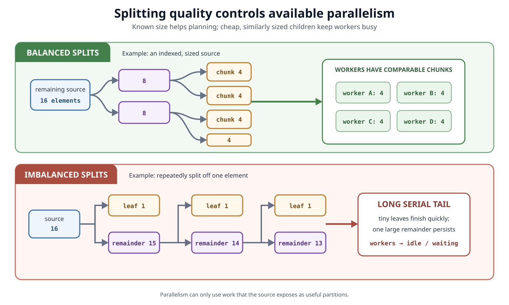
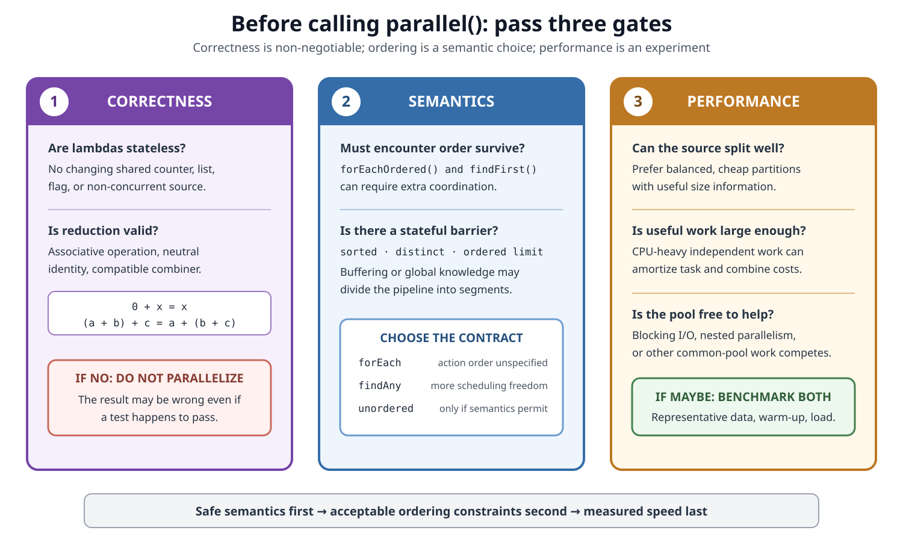

# Concurrency. Parallel Stream Internals

## Front

How does a parallel stream split a source, run one pipeline on several workers, and combine the results? Which rules make the result correct—and when is parallel execution actually faster?

## Back

**The Stream API, including parallel streams, was added in Java 8.**

A parallel stream is a **lazy pipeline evaluated as a divide-and-combine computation**. A `Spliterator` divides the source into chunks; fork/join tasks process those chunks; the terminal operation either combines partial results or publishes effects according to its contract.

It does **not** create one thread per element, and `parallel()` is not a promise that execution will be faster.


## The four parts to remember

| Part | Job |
|---|---|
| **Source** | Supplies elements, for example an array, `ArrayList`, range, or generated stream |
| **Pipeline** | Records intermediate operations such as `filter()` and `map()`; it is lazy |
| **Spliterator** | Traverses the source and, when possible, partitions it with `trySplit()` |
| **Terminal operation** | Starts evaluation and defines the result: reduction, collection, search, or side effect |

For example:

```java
long total = orders.parallelStream()
        .filter(Order::isCompleted)
        .mapToLong(Order::amountInCents)
        .sum();
```

Before `sum()` is called, Java has only built a recipe. The terminal call starts traversal. Conceptually, the recipe becomes:

```text
source → split into chunks → filter + map + local sum
                               ↓
                         combine local sums
                               ↓
                            one total
```

The most recent `parallel()` or `sequential()` setting applies to the **whole pipeline** when its terminal operation runs:

```java
stream.parallel().map(transform).sequential().reduce(identity, combine);
// The whole pipeline is evaluated sequentially.
```

## How splitting works

`Spliterator` is the bridge between a data source and parallel traversal:

- `trySplit()` returns a new spliterator for part of the remaining elements, or `null` when it cannot or should not split.
- `estimateSize()` estimates how many elements remain.
- `tryAdvance()` and `forEachRemaining()` traverse elements.
- Characteristics describe useful facts about the source.

Important characteristics include:

| Characteristic | Meaning useful to parallel evaluation |
|---|---|
| `ORDERED` | Elements have an encounter order that some operations must preserve |
| `SIZED` | The pre-traversal size estimate is exact |
| `SUBSIZED` | Every child produced by splitting is also `SIZED` and `SUBSIZED` |
| `DISTINCT` / `SORTED` | The source already guarantees uniqueness or order |
| `IMMUTABLE` / `CONCURRENT` | Describes how structural modification can be handled |

Current OpenJDK stream tasks repeatedly split while a partition is larger than a target leaf size and `trySplit()` succeeds. Its default heuristic aims for **more leaf tasks than workers**—currently about four target leaves per pool-parallelism unit—so work stealing has spare tasks to rebalance. This number is an **implementation detail**, not a Stream API guarantee.



A source is a good parallel input when `trySplit()` is cheap and produces similarly sized children. Arrays, `ArrayList`, and numeric ranges normally split well. An unknown-size iterator, a source with expensive traversal, or a badly designed spliterator may create an imbalanced tree and leave workers idle.

`SIZED` alone does not promise balanced splitting. `SUBSIZED` says child sizes are known; it still does not promise that the split is cheap or exactly half-and-half.

## What current OpenJDK executes

The public Stream API specifies results and behavioral rules, but it does not expose an `Executor` parameter. In current OpenJDK:

- many parallel terminal operations use internal `CountedCompleter` / `ForkJoinTask` trees;
- an ordinary call from outside a fork/join computation uses fork/join task mechanics associated with `ForkJoinPool.commonPool()`;
- a caller may perform work while the root computation is running;
- workers use **work stealing** to pick up available leaf tasks;
- when invoked from a worker in another `ForkJoinPool`, forked subtasks normally stay in that current pool.

That last behavior is useful to understand, but **pool selection is not a contract of `Stream`**. Do not rely on `customPool.submit(() -> stream.parallel()...)` when strict executor ownership, isolation, quotas, or cancellation policy is required. Use a concurrency API that explicitly accepts or owns an executor.

The number of chunks is not the number of threads. One worker can process many chunks, and one chunk normally contains many elements.

## A leaf runs the fused pipeline

For stateless stages such as `filter()` and `map()`, a leaf task usually pushes each element through a chain of internal pipeline stages. It does not normally build a new collection after every intermediate operation.

The earlier pipeline behaves roughly like this inside one chunk:

```java
long localSum = 0;
for (Order order : chunk) {
    if (order.isCompleted()) {
        localSum += order.amountInCents();
    }
}
```

This is **operation fusion**: traversal, filtering, mapping, and local accumulation happen together. The same recorded pipeline runs over every leaf partition.

Stateful intermediate operations need coordination across elements:

- `sorted()` must arrange the data;
- `distinct()` must remember values already seen;
- ordered `limit()`, `skip()`, `takeWhile()`, and `dropWhile()` may need buffering or prefix coordination.

In a parallel pipeline, such an operation may act as a barrier between segments, require extra passes, or materialize intermediate data. That can reduce or erase the benefit of parallelism.

## How results are combined

For `sum()`, `reduce()`, and most non-concurrent collectors, each partition builds a local result. Parent tasks combine child results up the task tree:

```text
chunk A → 10 ─┐
              ├→ 25 ─┐
chunk B → 15 ─┘      │
                     ├→ 50
chunk C → 20 ─┐      │
              ├→ 25 ─┘
chunk D →  5 ─┘
```

The grouping can change, so a reduction must obey its algebraic contract:

- the operation must be **associative**: `(a op b) op c == a op (b op c)`;
- the identity must be neutral: `identity op x == x`;
- in three-argument `reduce()`, the combiner must also be compatible with the accumulator.

Correct:

```java
int sum = numbers.parallelStream().reduce(0, Integer::sum);
```

Broken because `5` is not the identity for addition:

```java
int sumPlusFive = numbers.parallelStream().reduce(5, Integer::sum);
// A parallel evaluation may add 5 to multiple partial results.
```

Subtraction is also unsuitable because it is not associative. Floating-point addition is mathematically associative but not exactly associative under finite IEEE 754 rounding, so sequential and parallel groupings can differ slightly in low-order bits.

### Why ordinary `collect()` can use mutable containers safely

A non-concurrent collector normally creates a separate container for each partition, confines that container while accumulating, and merges containers only after their local accumulation is finished. Thus `Collectors.toList()` does not require several workers to mutate one shared `ArrayList`.

A collector marked `CONCURRENT` permits accumulation into the same result container from multiple threads. Stream collection uses concurrent reduction only when:

- the stream is parallel;
- the collector is `CONCURRENT`; and
- the stream is unordered **or** the collector is `UNORDERED`.

`CONCURRENT` describes how the collector may accumulate; it does not make arbitrary state touched by the lambdas safe.

## Encounter order and short-circuiting

An ordered source such as a `List` has encounter order. Parallel scheduling may process later elements before earlier ones, while an order-sensitive terminal result must still meet its contract.

```java
values.parallelStream().forEach(System.out::println);
// Action order is unspecified.

values.parallelStream().forEachOrdered(System.out::println);
// Actions follow encounter order.
```

`forEachOrdered()` preserves action order; it does not imply that every upstream calculation ran on one thread. Its ordering constraint can limit throughput.

Short-circuiting operations such as `anyMatch()` and `findAny()` use cooperative cancellation. When one task finds enough information, other tasks may already be running, so some extra elements can still be processed. `findFirst()` must respect encounter order; `findAny()` has more freedom in parallel execution.

Do not use `peek()` or another intermediate side effect as if it were guaranteed to run once for every source element. The implementation may avoid processing elements or even elide stages when that cannot change the terminal result.

## Correctness rules for lambdas

Stream behavioral parameters must be **non-interfering** and, in most cases, **stateless**:

- do not modify a non-concurrent source while its pipeline is executing;
- do not make a result depend on mutable state that changes during the pipeline;
- do not mutate an unsynchronized shared result from `forEach()`;
- prefer a reduction or collector that owns partial results.

Broken shared mutation:

```java
List<Integer> output = new ArrayList<>();

numbers.parallelStream()
        .map(n -> n * 2)
        .forEach(output::add); // data race; ArrayList may be corrupted
```

Correct collection:

```java
List<Integer> output = numbers.parallelStream()
        .map(n -> n * 2)
        .collect(Collectors.toList());
```

Making the shared list synchronized can prevent corruption, but contention and nondeterministic action order can still make it a poor design. Thread-safe does not automatically mean deterministic or fast.



## Complete Java example

This Java 8-compatible example uses stateless functions and library reductions:

```java
import java.util.List;
import java.util.Map;
import java.util.stream.Collectors;

public final class ParallelStreamExample {
    private ParallelStreamExample() {
    }

    static long completedTotal(List<Order> orders) {
        return orders.parallelStream()
                .filter(Order::isCompleted)
                .mapToLong(Order::amountInCents)
                .sum();
    }

    static Map<String, Long> completedTotalsByRegion(List<Order> orders) {
        return orders.parallelStream()
                .filter(Order::isCompleted)
                .collect(Collectors.groupingBy(
                        Order::region,
                        Collectors.summingLong(Order::amountInCents)));
    }

    static final class Order {
        private final String region;
        private final long amountInCents;
        private final boolean completed;

        Order(String region, long amountInCents, boolean completed) {
            this.region = region;
            this.amountInCents = amountInCents;
            this.completed = completed;
        }

        String region() {
            return region;
        }

        long amountInCents() {
            return amountInCents;
        }

        boolean isCompleted() {
            return completed;
        }
    }
}
```

Each leaf calculates independently. `sum()` combines primitive partial sums, while `groupingBy()` creates isolated partial maps and merges them according to the collector contract.

## When parallel execution is likely to help

Parallelism adds splitting, scheduling, stealing, buffering, and combining overhead. A rough question is whether useful per-element work is large enough to amortize those costs.

| Better candidate | Poor candidate |
|---|---|
| Large, finite source | Small source |
| Array, `ArrayList`, or balanced range | Expensive or imbalanced splitting |
| CPU-heavy independent work | Tiny operations such as one cheap field read |
| Stateless stages | Shared mutable state or a contended lock |
| Associative, cheap combination | Expensive merge or invalid reduction |
| Little ordering pressure | Ordered/stateful barriers dominate |
| Spare CPU capacity | Shared pool is already busy |

Blocking network, file, or database calls are a poor default fit. Fork/join can compensate for some recognized blocking, but it does not guarantee enough workers for arbitrary blocked I/O or unmanaged synchronization. For blocking tasks, prefer an explicit design with bounded resource use, timeouts, cancellation, and—when appropriate—virtual threads.

Nested parallel streams do not create unlimited extra processors. They add tasks and coordination to the fork/join environment already in use, which may increase contention rather than speed.

Benchmark the real pipeline on representative data and hardware, with warm-up and realistic surrounding load. Compare `.stream()` and `.parallelStream()`; do not infer performance from core count alone.

## API guarantee vs. implementation detail

| Safe to rely on | Do not treat as a permanent Stream API promise |
|---|---|
| Parallel/sequential mode and terminal-operation semantics | Exact task classes or split threshold |
| Non-interference and statelessness requirements | Exactly four leaves per worker |
| Associativity and identity requirements | A fixed worker count |
| Encounter-order contracts | A caller always running a particular amount of work |
| Collector characteristics | Selecting a custom pool by invoking the stream inside it |

## One-sentence mental model

> A parallel stream is one lazy pipeline applied to many `Spliterator` partitions, with fork/join scheduling between them and a terminal-operation contract that decides how their work becomes one observable result.

## Sources

- [Java SE 25 `java.util.stream` package specification](https://docs.oracle.com/en/java/javase/25/docs/api/java.base/java/util/stream/package-summary.html)

  Defines laziness, parallel mode, stateless and stateful operations, non-interference, reduction, side effects, ordering, and low-level construction from a `Spliterator`.

- [Java SE 25 `Stream` API](https://docs.oracle.com/en/java/javase/25/docs/api/java.base/java/util/stream/Stream.html)

  Specifies reduction contracts, `forEach`, `forEachOrdered`, short-circuiting behavior, and order-sensitive operations.

- [Java SE 25 `Spliterator` API](https://docs.oracle.com/en/java/javase/25/docs/api/java.base/java/util/Spliterator.html)

  Defines `trySplit()`, size estimates, characteristics, thread confinement, and the performance effect of balanced splitting.

- [Java SE 25 `Collector` API](https://docs.oracle.com/en/java/javase/25/docs/api/java.base/java/util/stream/Collector.html)

  Defines isolated partial containers, associativity and identity constraints, and the conditions for concurrent reduction.

- [Java SE 25 `ForkJoinPool` API](https://docs.oracle.com/en/java/javase/25/docs/api/java.base/java/util/concurrent/ForkJoinPool.html)

  Documents work stealing, the common pool, target parallelism, and limits around blocked I/O and unmanaged synchronization.

- [OpenJDK `AbstractTask` source](https://github.com/openjdk/jdk/blob/master/src/java.base/share/classes/java/util/stream/AbstractTask.java)

  Shows the current `CountedCompleter` task tree, alternating forks, leaf-size heuristic, and recursive `Spliterator.trySplit()` loop.

- [OpenJDK `AbstractPipeline` source](https://github.com/openjdk/jdk/blob/master/src/java.base/share/classes/java/util/stream/AbstractPipeline.java)

  Shows lazy pipeline representation and the selection of sequential or parallel terminal evaluation.

- [OpenJDK `ReduceOps` source](https://github.com/openjdk/jdk/blob/master/src/java.base/share/classes/java/util/stream/ReduceOps.java)

  Shows leaf accumulation and tree-shaped combination for parallel reductions.

- [JSR 335 final specification page](https://www.jcp.org/en/jsr/detail?id=335)

  Records the Java 8-era language and library work that enabled lambda-oriented, multicore-ready APIs.
