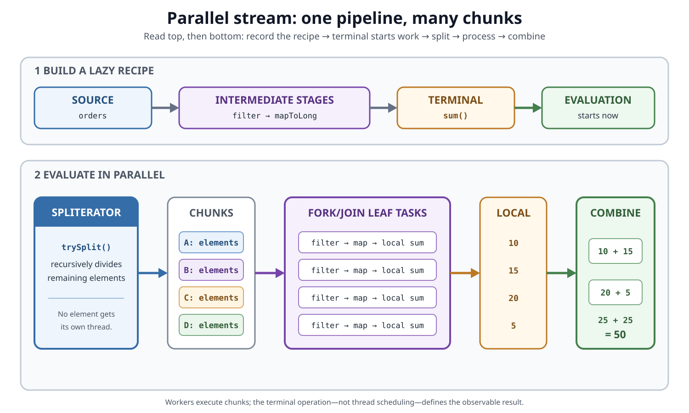
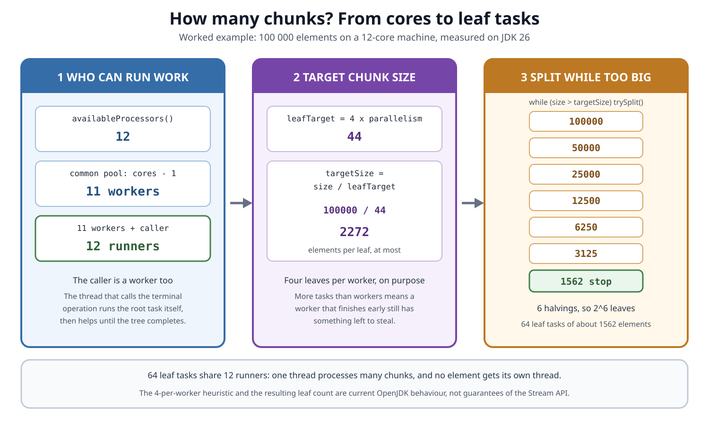
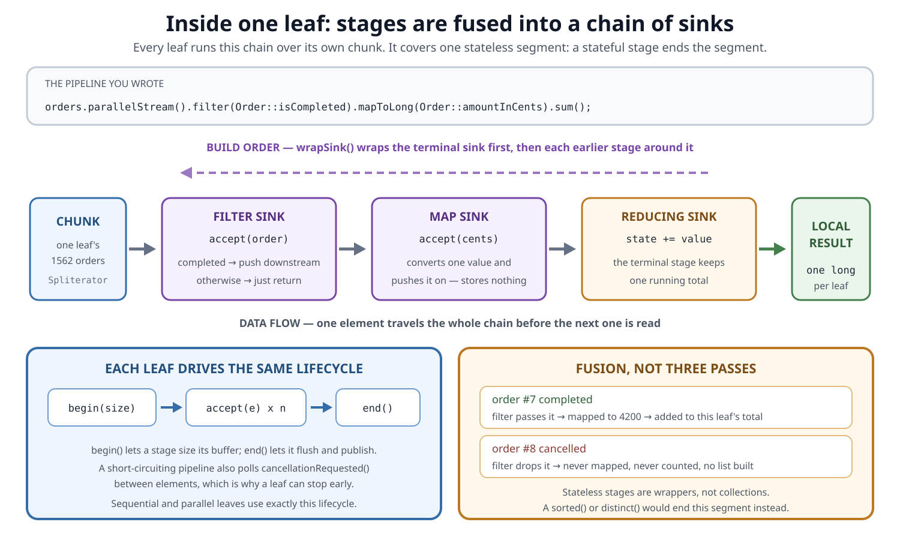
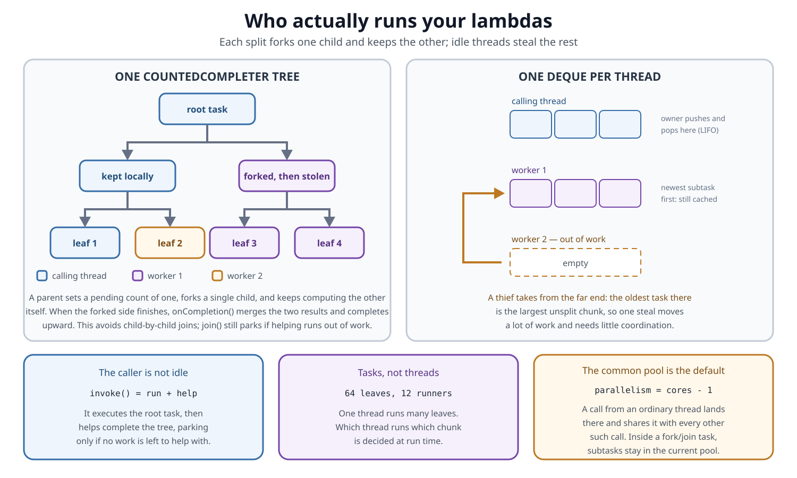
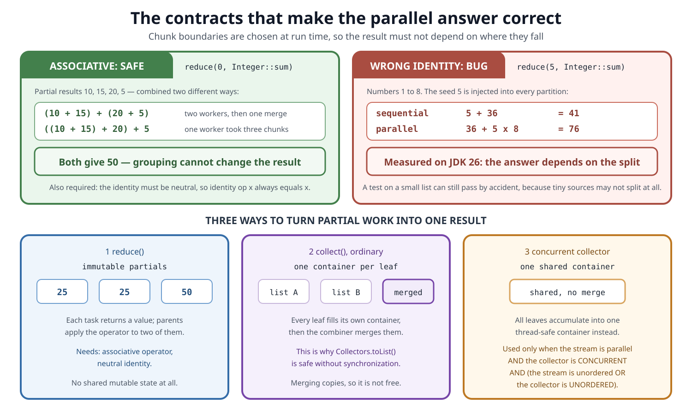
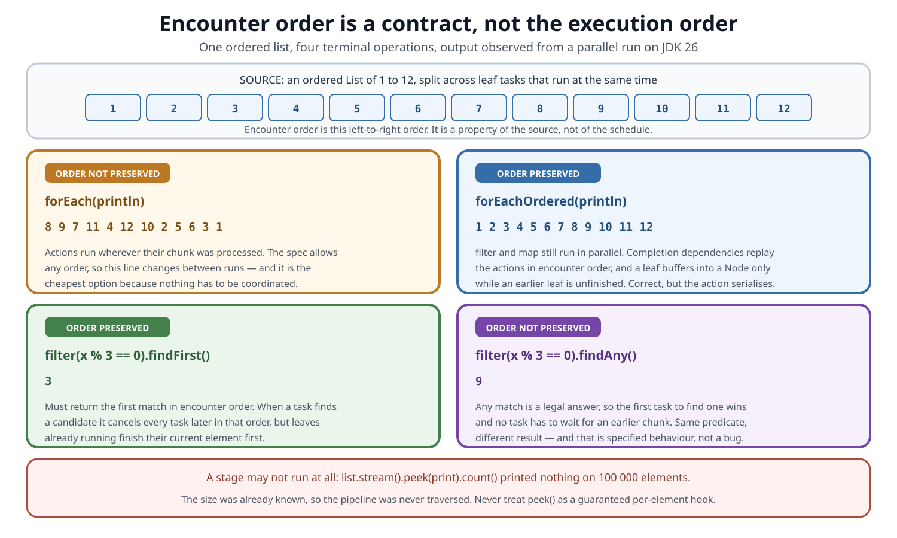

# Concurrency. Parallel Stream Internals

## Front

You call `orders.parallelStream()`. Explain what the JDK actually does: how the source becomes chunks, what runs those chunks, how the pipeline stages execute inside one chunk, and how partial results become one answer. Which of those details does the Stream API guarantee, and which are only today's implementation?

## Back

**The Stream API, including parallel streams, was introduced in Java 8 under JSR 335.**

A parallel stream is **one lazy pipeline evaluated as a divide-and-combine computation**. Nothing runs while you chain `filter()` and `map()`. When the terminal operation is called, a `Spliterator` cuts the source into chunks, fork/join tasks run the pipeline over each chunk independently, and the terminal operation's contract decides how those partial results become one observable result.

One qualification that the rest of the card keeps returning to: that single fused pass covers a **stateless** pipeline. A stateful operation such as `sorted()` or `distinct()` ends a segment, and a parallel pipeline containing one is evaluated segment by segment, each segment's result feeding the next.

Two things it is not: it does **not** give each element a thread, and `parallel()` is **not** a promise of speed.



The rest of this card rebuilds that sentence one layer at a time. Each level assumes the previous one.

| Level | The question it answers |
|---|---|
| 1 | What is the short answer? |
| 2 | What are the moving parts, and why does laziness matter? |
| 3 | How does one source become a tree of chunks? |
| 4 | What actually executes inside a single chunk? |
| 5 | Which threads run those chunks, and who schedules them? |
| 6 | Why does the parallel answer equal the sequential answer? |
| 7 | What happens to encounter order and short-circuiting? |
| 8 | When is parallel execution actually faster? |

The measured numbers in this card come from a 12-core machine running JDK 26. Treat them as illustrations of the mechanism, not as constants.

## Level 1 — The short answer

Four sentences, in this order:

1. A stream pipeline is a **recipe**; intermediate operations only record what to do.
2. The terminal operation starts evaluation, and the pipeline's **most recent** `parallel()` or `sequential()` setting decides the mode for the whole pipeline.
3. In parallel mode a `Spliterator` recursively splits the source into chunks, and fork/join tasks apply the same recorded stages to each chunk — in one fused pass per stateless segment.
4. The terminal operation defines how partial results are merged — or, for side-effecting terminals, what ordering guarantee you get instead.

Three claims that sound right and are wrong:

- *"Each element gets its own thread."* No. Chunks get tasks; tasks share a small pool of threads.
- *"`parallel()` makes it faster."* It adds splitting, scheduling and merging work. Whether that pays back depends on the source, the per-element cost, and the machine.
- *"The calling thread just waits."* It runs the root task itself and then helps finish the tree.

## Level 2 — The moving parts, and why laziness matters

| Part | Job |
|---|---|
| **Source** | Supplies elements: an array, an `ArrayList`, a range, a generator |
| **Pipeline** | Records intermediate operations such as `filter()` and `map()`; it is lazy and single-use |
| **Spliterator** | Traverses the source and, when possible, partitions it with `trySplit()` |
| **Terminal operation** | Starts evaluation and defines the result: reduction, collection, search, or side effect |

```java
long total = orders.parallelStream()
        .filter(Order::isCompleted)
        .mapToLong(Order::amountInCents)
        .sum();
```

Before `sum()` is called, nothing has been read and no thread has been touched. `sum()` triggers everything.

Two consequences that interviews like:

```java
Stream<Order> pipeline = orders.stream().filter(Order::isCompleted);
long a = pipeline.count();
long b = pipeline.count(); // IllegalStateException: stream has already been operated upon or closed
```

A pipeline is consumed once. And the mode is a property of the pipeline, not of the position where you set it:

```java
stream.parallel().map(transform).sequential().reduce(identity, combine);
// The whole pipeline is evaluated sequentially: sequential() was set last.
```

## Level 3 — From one source to a tree of chunks

`Spliterator` is the bridge between a data source and parallel traversal:

- `trySplit()` returns a new spliterator covering part of the remaining elements, or `null` when it cannot or should not split;
- `estimateSize()` estimates how many elements remain;
- `tryAdvance()` and `forEachRemaining()` traverse elements;
- characteristics describe facts the implementation can exploit.

| Characteristic | Why parallel evaluation cares |
|---|---|
| `ORDERED` | Elements have an encounter order that some operations must preserve |
| `SIZED` | The pre-traversal size estimate is exact, so the split plan can be computed up front |
| `SUBSIZED` | Every child produced by a split is also `SIZED` and `SUBSIZED` |
| `DISTINCT` / `SORTED` | The source already guarantees uniqueness or order, so a stage can be skipped |
| `IMMUTABLE` / `CONCURRENT` | Describes how structural modification is handled during traversal |

### How many chunks does it make?

The current implementation picks a **target chunk size** and then splits while a chunk is bigger than that target.

```text
leafTarget = 4 x parallelism          // over-partition on purpose
targetSize = estimateSize / leafTarget // at least 1
while (chunkSize > targetSize && trySplit() != null) { split again }
```



Reading the diagram left to right: the common pool's parallelism is `availableProcessors() - 1`, so 12 cores give 11 worker threads — plus the calling thread, which also runs work. The target is four leaves per worker, so 44 leaves for 100 000 elements means a target of 2272 elements each. Because an `ArrayList` spliterator halves cleanly, splitting continues until a chunk fits, which lands on the smallest power of two at or above the target: **64 leaf tasks**, measured.

Over-partitioning is deliberate. If the JDK made exactly one chunk per worker, a worker that finished early would have nothing to do and a worker with a slow chunk would hold up the result. Surplus tasks are what makes rebalancing possible.

### Good splitting versus bad splitting


A source is a good parallel input when `trySplit()` is cheap and produces similarly sized children. Arrays, `ArrayList` and numeric ranges qualify: the split is index arithmetic.

The counter-example is worth knowing by name. A `LinkedList` reports `ORDERED | SIZED | SUBSIZED`, which looks encouraging, but its `trySplit()` **copies elements into a fresh array** in growing batches (1024, then 2048, then 3072, …) because there is no way to jump to the middle of a linked structure. The same batching applies to any iterator-backed spliterator. So the first chunks are tiny, the remainder stays large, and one thread ends up with a long serial tail.

`Stream.iterate(seed, f)` is a different failure. Its spliterator extends `AbstractSpliterator`, which *does* split: `trySplit()` hands out arithmetically growing array batches and, by its own comment, produces `O(sqrt(n))` splits allowing `O(sqrt(cores))` potential speedup. So it is **unsized and batch-splittable**, not unsplittable. The problem is that it reports an estimated size of `Long.MAX_VALUE` and is not `SIZED`, so the target-size plan has nothing to work with, and the batches are uneven by construction.

**`SIZED` does not promise balanced splitting, and `SUBSIZED` does not promise a cheap one.** Splitting quality is a property of the source's implementation, not of its characteristic bits.

## Level 4 — What runs inside one chunk

Within one **segment**, a leaf task runs every stage of that segment over its own chunk — the same code path a sequential stream uses. Internally each stage is a `Sink`, and the stages are chained.

For a stateless pipeline there is exactly one segment, so "the leaf runs the whole pipeline" is accurate. The next subsection covers what changes when it is not.



Two directions matter, and they are opposite:

- **Construction** runs backwards. The terminal sink is created first, then each earlier stage wraps it. That is why a stage always knows its `downstream`.
- **Data** runs forwards. The chunk's spliterator pushes one element into the first sink; that element travels the whole chain before the next element is read.

Every sink follows the same lifecycle: `begin(size)`, then `accept(element)` repeatedly, then `end()`. A short-circuiting pipeline additionally polls `cancellationRequested()` between elements, which is the mechanism that lets a leaf stop early.

For the example pipeline, one chunk behaves like this:

```java
long localSum = 0;
for (Order order : chunk) {
    if (order.isCompleted()) {
        localSum += order.amountInCents();
    }
}
```

This is **operation fusion**: traversal, filtering, mapping and accumulation happen in one pass, and nothing is materialised between `filter` and `sum`.

### The stateful operations that end a segment

Some intermediate operations cannot be a simple wrapper, because they need knowledge across elements. The implementation notes state it directly: a sequential stream, or a parallel stream **without** stateful operations, is evaluated in a single pass that jams all the operations together; a parallel stream **with** stateful operations is divided into segments, each stateful operation ends a segment, and each segment is evaluated separately with its result feeding the next.

So a pipeline like `filter().sorted().map().collect()` is not one fused pass over each chunk — it is two segments, with a full materialisation in between. Knowing *how* each barrier is implemented is the difference between a vague answer and a good one:

| Operation | What parallel evaluation actually does |
|---|---|
| `sorted()` | Collects the whole stream into an array, then runs `Arrays.parallelSort`. Two passes and full materialisation |
| `distinct()` on an **ordered** stream | Reduces into a `LinkedHashSet`, merging sets with `addAll` — order preservation forces a barrier |
| `distinct()` on an **unordered** stream | Feeds a shared `ConcurrentHashMap`, which parallelises far better |
| `limit()` / `skip()` when the pipeline is `SIZED` and `SUBSIZED` | Cheap: the slice is computed directly from the source indexes |
| `limit()` / `skip()` on an **ordered** stream that is no longer sized (for example after `filter()`) | Runs a slice task that **buffers leaf output** so the correct prefix can be chosen. This is where ordered `limit()` gets expensive |

That last row explains a classic trap: `Stream.iterate(...).filter(...).limit(n).parallel()` combines an unsized, unevenly batch-splitting source with a buffering ordered slice, and can perform far worse than the sequential version.

## Level 5 — Who runs the chunks

The public Stream API specifies results and behavioural rules; it never exposes an `Executor`. Underneath, the current implementation builds a tree of `CountedCompleter` tasks and, when the terminal operation is called from an ordinary thread, runs that tree on `ForkJoinPool.commonPool()`.



The splitting loop is the part worth remembering:

```text
while (size > targetSize && trySplit() succeeds) {
    make a left child and a right child
    setPendingCount(1)          // wait for exactly one of them
    fork one child into the queue
    keep computing the other one on this thread
}
run the leaf, then tryComplete()
```

Because a parent forks only **one** child and keeps the other, the tree avoids child-by-child joins: the pending count records the dependency, and when the forked side finishes, the parent's `onCompletion()` merges the two child results and completes upward. The side that is forked alternates between left and right, which spreads the stealable work across the tree.

That reduces blocking but does not abolish it. `join()` on a `CountedCompleter` first tries `helpComplete` — running available tasks to drive the computation forward — and only parks the thread if it cannot finish the work by helping. Helping is the fast path, not a guarantee.

Scheduling itself is **work stealing**:

- each thread owns a deque and takes its own newest task first (LIFO), because that task's data is most likely still in cache;
- a thread with nothing to do picks a random victim and steals from the **far** end of that queue (FIFO), where the oldest — and therefore largest, least-split — task sits;
- one steal moves a lot of work and needs little coordination.

Three facts that come up in interviews:

1. **The caller participates.** `invoke()` executes the root task on the calling thread and then helps complete the tree. On a 12-core machine, 11 common-pool workers plus `main` means 12 threads ran elements — measured by recording thread names inside the pipeline.
2. **The common pool is JVM-wide, and it is the default rather than the only option.** A terminal operation called from an ordinary thread — outside any fork/join computation — goes to `ForkJoinPool.commonPool()`, and every such pipeline in the process shares it, so one that blocks delays unrelated work. Its parallelism defaults to `availableProcessors() - 1` and can be set with the `java.util.concurrent.ForkJoinPool.common.parallelism` system property.
3. **Submitting inside another pool keeps the work there.** `fork()` pushes into the current thread's own queue when that thread is a `ForkJoinWorkerThread`, and only falls back to the common pool's submission queue otherwise. So wrapping a parallel stream in `customPool.submit(...)` really does run it on that pool's threads (measured: only `ForkJoinPool-1-worker-*` names appeared).

That third point is a consequence of fork/join mechanics, **not a contract of `Stream`**. If you need strict executor ownership, isolation, quotas or a cancellation policy, use an API that accepts an executor explicitly.

## Level 6 — Why the parallel answer equals the sequential answer

Chunk boundaries are chosen at run time, so the result must not depend on where they fall.



A reduction must obey its algebraic contract:

- the operation must be **associative**: `(a op b) op c == a op (b op c)`;
- the identity must be **neutral**: `identity op x == x`;
- in three-argument `reduce()`, the combiner must be compatible with the accumulator.

```java
int sum = numbers.parallelStream().reduce(0, Integer::sum);        // correct
int broken = numbers.parallelStream().reduce(5, Integer::sum);     // 5 is not the identity
```

For the numbers 1 to 8 the second line returns **41 sequentially and 76 in parallel**: the list is small enough to split into eight leaves, each seeded with 5, so `36 + 8 × 5 = 76`. Subtraction fails for the other reason — it is not associative. Floating-point addition is associative in mathematics but not under IEEE 754 rounding, so sequential and parallel groupings can differ in the low bits.

### Why ordinary `collect()` can use mutable containers safely

A non-concurrent collector gives **each leaf its own container**, confines it while accumulating, and merges containers only after local accumulation has finished. That is why `Collectors.toList()` needs no synchronisation: several workers never touch one `ArrayList`.

The merge is not free. `Collectors.toList()` combines with `left.addAll(right)`, so elements are copied at every level of the task tree — one reason a parallel `collect(toList())` often loses to the sequential version on cheap pipelines.

A collector marked `CONCURRENT` instead accumulates into one shared container with no merge at all. The implementation uses that path only when **all three** conditions hold:

1. the stream is parallel;
2. the collector is `CONCURRENT`;
3. the stream is unordered **or** the collector is `UNORDERED`.

`Collectors.groupingByConcurrent(...)` is `CONCURRENT | UNORDERED | IDENTITY_FINISH`, so it always takes that path in a parallel stream. `Collectors.groupingBy(...)` carries only `IDENTITY_FINISH`, so it always builds per-leaf maps and merges them. Note that `UNORDERED` alone is not enough: `Collectors.toSet()` is `UNORDERED` but not `CONCURRENT`, so it still uses per-leaf `HashSet`s.

`CONCURRENT` describes how the collector accumulates. It does not make arbitrary state touched by your lambdas safe.

### Correctness rules for the lambdas themselves

Behavioural parameters must be **non-interfering** and, in most cases, **stateless**:

- do not modify a non-concurrent source while its pipeline is running;
- do not let the result depend on mutable state that changes during the run;
- do not mutate an unsynchronised shared result from `forEach()`;
- prefer a reduction or collector that owns its partial results.

```java
List<Integer> output = new ArrayList<>();
numbers.parallelStream().map(n -> n * 2).forEach(output::add); // data race
```

```java
List<Integer> output = numbers.parallelStream()
        .map(n -> n * 2)
        .collect(Collectors.toList()); // correct
```

Wrapping that list in `Collections.synchronizedList` prevents corruption but leaves the order nondeterministic and adds contention. Thread-safe is not the same as correct, deterministic, or fast.

## Level 7 — Encounter order and short-circuiting

An ordered source such as a `List` has an **encounter order**. Parallel scheduling may process later elements first, while an order-sensitive terminal must still meet its contract.



The diagram shows one run over `[1..12]`:

- `forEach` printed `8 9 7 11 4 12 10 2 5 6 3 1` — action order is unspecified, and this is the cheapest option;
- `forEachOrdered` printed `1 … 12` — the upstream stages still ran in parallel, and completion dependencies replay the actions in encounter order. Leaves **may** buffer: a leaf whose left predecessor has not completed yet collects its output into a `Node` first, while a leaf that is already free to complete runs its pipeline straight into the action. So the memory cost is real but paid only where the ordering dependency is still outstanding;
- `findFirst()` returned `3`, the first match in encounter order; when a task finds a candidate it cancels the tasks later in that order, though leaves already running finish their current element;
- `findAny()` returned `9` — any match is a legal answer, so no task waits for an earlier chunk.

Calling `unordered()` on a stream whose order you do not care about is a real optimisation for `distinct()`, `limit()` and concurrent collectors.

One more trap: an intermediate side effect is not a guaranteed per-element hook. `list.stream().peek(print).count()` printed **nothing** for 100 000 elements, because the size was already known and the pipeline was never traversed. The `count()` javadoc documents exactly this case.

## Level 8 — When parallel execution actually pays

Parallelism adds fixed costs: computing the split plan, allocating tasks, forking, stealing, buffering and merging. The useful question is whether the real work is large enough to amortise them.

Two rules of thumb that hold up:

- The total work is roughly `N × Q` — element count times per-element cost. Growing either one helps; a large `N` with a trivial `Q` (reading one field) usually does not pay.
- The `ForkJoinTask` documentation suggests a task should perform **more than 100 and fewer than 10 000 basic computational steps**. With roughly four leaves per worker, a 12-core machine produces around 64 leaves, so a pipeline whose total work is only a few thousand steps gives each leaf less than that useful minimum.

| Better candidate | Poor candidate |
|---|---|
| Large, finite source | Small source |
| Array, `ArrayList`, or a balanced range | `LinkedList`, iterator-backed, or unsized `Stream.iterate` |
| CPU-heavy independent work per element | One cheap field read |
| Stateless stages | Shared mutable state or a contended lock |
| Associative, cheap combination | Expensive merge (`toList`, `groupingBy` on many keys) |
| Little ordering pressure | Ordered `limit()`, `sorted()`, `distinct()` barriers |
| Spare CPU capacity | Common pool already busy |


Blocking network, file or database calls are a poor default fit. Fork/join can compensate for *recognised* blocking through `ManagedBlocker`, but it does not guarantee enough workers for arbitrary blocked I/O or unmanaged synchronisation — and every blocked common-pool worker is one the rest of the JVM has lost. For blocking work, use an explicit design with bounded resources, timeouts and cancellation, and consider virtual threads.

Nested parallel streams do not add processors. They add tasks and coordination to the pool already in use, which usually increases contention rather than throughput.

Finally, measure. Compare `.stream()` and `.parallelStream()` on representative data and hardware, with warm-up and realistic surrounding load. Do not infer performance from core count.

## Putting it together

This Java 8-compatible example uses stateless functions and library reductions:

```java
import java.util.List;
import java.util.Map;
import java.util.stream.Collectors;

public final class ParallelStreamExample {
    private ParallelStreamExample() {
    }

    static long completedTotal(List<Order> orders) {
        return orders.parallelStream()
                .filter(Order::isCompleted)
                .mapToLong(Order::amountInCents)
                .sum();
    }

    static Map<String, Long> completedTotalsByRegion(List<Order> orders) {
        return orders.parallelStream()
                .filter(Order::isCompleted)
                .collect(Collectors.groupingBy(
                        Order::region,
                        Collectors.summingLong(Order::amountInCents)));
    }

    static final class Order {
        private final String region;
        private final long amountInCents;
        private final boolean completed;

        Order(String region, long amountInCents, boolean completed) {
            this.region = region;
            this.amountInCents = amountInCents;
            this.completed = completed;
        }

        String region() {
            return region;
        }

        long amountInCents() {
            return amountInCents;
        }

        boolean isCompleted() {
            return completed;
        }
    }
}
```

`sum()` combines primitive partial sums up the task tree. `groupingBy()` builds an isolated partial map per leaf and merges them — correct, but the merge cost grows with the number of distinct keys, which is exactly when `groupingByConcurrent` becomes worth considering.

## Interview drill

| Question | Short answer |
|---|---|
| How many threads does a parallel stream use? | Common pool parallelism, `availableProcessors() - 1` by default, plus the calling thread, which also runs work |
| How many tasks? | Roughly four leaves per worker; the tree splits while a chunk exceeds `estimateSize / (4 × parallelism)` |
| Where does `filter` run relative to `map`? | In the same pass over the same element, inside one leaf — stages within a segment are fused, not run as separate phases |
| Is the whole pipeline always one fused pass? | Only for a stateless pipeline. Each stateful operation ends a segment; a parallel pipeline with one is evaluated segment by segment |
| Why is `Collectors.toList()` safe without synchronisation? | Each leaf accumulates into its own container; containers are merged only after local accumulation ends |
| When does a collector write into one shared container? | Parallel stream **and** `CONCURRENT` collector **and** (unordered stream **or** `UNORDERED` collector) |
| `findFirst()` versus `findAny()`? | `findFirst()` must respect encounter order and cancels later tasks; `findAny()` may return any match and needs no ordering coordination |
| Does `forEachOrdered` disable parallelism? | No. Upstream stages still run in parallel; only the action is replayed in encounter order, and a leaf buffers only while an earlier leaf has not completed |
| Why is `LinkedList` a bad parallel source? | `trySplit()` copies elements into growing batch arrays instead of halving, so chunks are uneven |
| Can you choose the pool? | Calls from an ordinary thread use the common pool; from inside a fork/join computation, subtasks stay in the current pool, so `customPool.submit(...)` works in practice — but pool selection is not part of the `Stream` contract |
| Why did my `peek()` not run? | A terminal such as `count()` may compute the answer from the source size and skip traversal entirely |

## API guarantee versus implementation detail

| Safe to rely on | Do not treat as a permanent promise |
|---|---|
| Parallel or sequential mode, and terminal-operation semantics | Exact task classes or the split threshold |
| Non-interference and statelessness requirements | Four leaves per worker, or 64 leaves on 12 cores |
| Associativity and identity requirements | A fixed worker count |
| Encounter-order contracts | The caller always doing a particular amount of work |
| Collector characteristics and the concurrent-reduction conditions | Selecting a custom pool by invoking the stream inside it |

## One-sentence mental model

> A parallel stream is one lazy pipeline applied to many `Spliterator` partitions, with fork/join scheduling between them and a terminal-operation contract that decides how their partial work becomes one observable result.

## Sources

- [Java SE 26 `java.util.stream` package specification](https://docs.oracle.com/en/java/javase/26/docs/api/java.base/java/util/stream/package-summary.html)

  Defines laziness, parallel mode, stateless and stateful operations, non-interference, reduction, side effects, and the ordering section quoted for `unordered()` and buffering.

- [Java SE 26 `Stream` API](https://docs.oracle.com/en/java/javase/26/docs/api/java.base/java/util/stream/Stream.html)

  Specifies reduction contracts, `forEach` and `forEachOrdered`, short-circuiting, and the `count()` note that a pipeline may not be traversed at all.

- [Java SE 26 `Spliterator` API](https://docs.oracle.com/en/java/javase/26/docs/api/java.base/java/util/Spliterator.html)

  Defines `trySplit()`, size estimates, characteristics, thread confinement, and the effect of balanced splitting.

- [Java SE 26 `Collector` API](https://docs.oracle.com/en/java/javase/26/docs/api/java.base/java/util/stream/Collector.html)

  Defines isolated partial containers, the associativity and identity constraints, and the `CONCURRENT`, `UNORDERED` and `IDENTITY_FINISH` characteristics.

- [Java SE 26 `Collectors` API](https://docs.oracle.com/en/java/javase/26/docs/api/java.base/java/util/stream/Collectors.html)

  Documents which factory methods produce concurrent collectors, including `groupingByConcurrent`.

- [Java SE 26 `ForkJoinPool` API](https://docs.oracle.com/en/java/javase/26/docs/api/java.base/java/util/concurrent/ForkJoinPool.html)

  Documents work stealing, the common pool, its parallelism system property, and the limits around blocked I/O and unmanaged synchronisation.

- [Java SE 26 `ForkJoinTask` API](https://docs.oracle.com/en/java/javase/26/docs/api/java.base/java/util/concurrent/ForkJoinTask.html)

  Gives the task-granularity rule of thumb of more than 100 and fewer than 10 000 basic computational steps.

- [OpenJDK `AbstractTask` source (jdk-26-ga)](https://github.com/openjdk/jdk/blob/jdk-26-ga/src/java.base/share/classes/java/util/stream/AbstractTask.java)

  Shows `LEAF_TARGET`, `suggestTargetSize`, the `compute()` splitting loop, the alternating fork, and `setPendingCount(1)`.

- [OpenJDK `Sink` source (jdk-26-ga)](https://github.com/openjdk/jdk/blob/jdk-26-ga/src/java.base/share/classes/java/util/stream/Sink.java)

  Documents the `begin`, `accept`, `end` and `cancellationRequested` protocol and the chained downstream design.

- [OpenJDK `AbstractPipeline` source (jdk-26-ga)](https://github.com/openjdk/jdk/blob/jdk-26-ga/src/java.base/share/classes/java/util/stream/AbstractPipeline.java)

  Shows `wrapSink()` building the chain backwards, `copyInto` versus `copyIntoWithCancel`, the sequential or parallel terminal dispatch, and the implementation note that a parallel pipeline with stateful operations is evaluated in segments rather than one jammed pass.

- [OpenJDK `ReduceOps` source (jdk-26-ga)](https://github.com/openjdk/jdk/blob/jdk-26-ga/src/java.base/share/classes/java/util/stream/ReduceOps.java)

  Shows leaf accumulation and the `onCompletion()` combination for parallel reductions.

- [OpenJDK `ForEachOps` source (jdk-26-ga)](https://github.com/openjdk/jdk/blob/jdk-26-ga/src/java.base/share/classes/java/util/stream/ForEachOps.java)

  Shows `ForEachOrderedTask` and its `if (task.getPendingCount() > 0)` guard: a leaf buffers into a `Node` only when an ordering dependency is still outstanding, and otherwise copies straight into the action.

- [OpenJDK `SortedOps` source (jdk-26-ga)](https://github.com/openjdk/jdk/blob/jdk-26-ga/src/java.base/share/classes/java/util/stream/SortedOps.java)

  Shows that parallel `sorted()` flattens the stream into an array and then calls `Arrays.parallelSort`.

- [OpenJDK `DistinctOps` source (jdk-26-ga)](https://github.com/openjdk/jdk/blob/jdk-26-ga/src/java.base/share/classes/java/util/stream/DistinctOps.java)

  Shows the ordered `LinkedHashSet` reduction and the unordered `ConcurrentHashMap` path.

- [OpenJDK `SliceOps` source (jdk-26-ga)](https://github.com/openjdk/jdk/blob/jdk-26-ga/src/java.base/share/classes/java/util/stream/SliceOps.java)

  Shows the cheap sized-and-subsized slice, the unordered slice, and the buffering `SliceTask` used for an ordered, no-longer-sized `limit()`.

- [OpenJDK `Spliterators` source (jdk-26-ga)](https://github.com/openjdk/jdk/blob/jdk-26-ga/src/java.base/share/classes/java/util/Spliterators.java)

  Shows `AbstractSpliterator.trySplit()` and `IteratorSpliterator.trySplit()`: arithmetically growing array batches, `O(sqrt(n))` splits, and the `BATCH_UNIT` of 1024.

- [OpenJDK `ForkJoinTask` source (jdk-26-ga)](https://github.com/openjdk/jdk/blob/jdk-26-ga/src/java.base/share/classes/java/util/concurrent/ForkJoinTask.java)

  Shows that `fork()` pushes to the current thread's own queue when it is a `ForkJoinWorkerThread` and only otherwise reaches for the common pool; that `invoke()` is `doExec()` followed by `join()`; and that `join()` on a `CountedCompleter` tries `helpComplete` first and falls through to a `LockSupport.park()` wait when helping does not finish the task.

- [OpenJDK `ForkJoinPool` source (jdk-26-ga)](https://github.com/openjdk/jdk/blob/jdk-26-ga/src/java.base/share/classes/java/util/concurrent/ForkJoinPool.java)

  Documents the LIFO own-queue and randomised FIFO steal preference, and the `availableProcessors() - 1` default for the common pool.

- [JSR 335 final specification page](https://www.jcp.org/en/jsr/detail?id=335)

  Records the Java 8-era language and library work that introduced lambdas and the Stream API.
