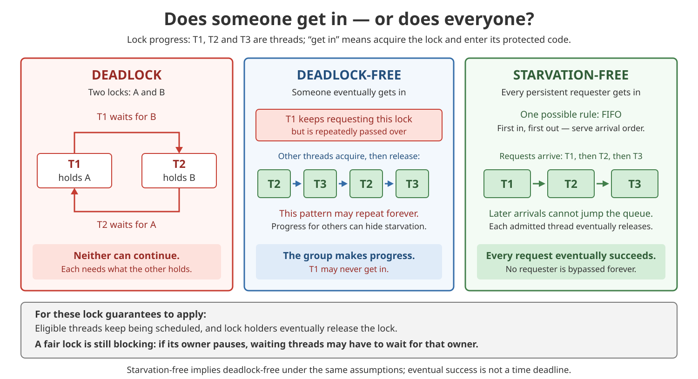
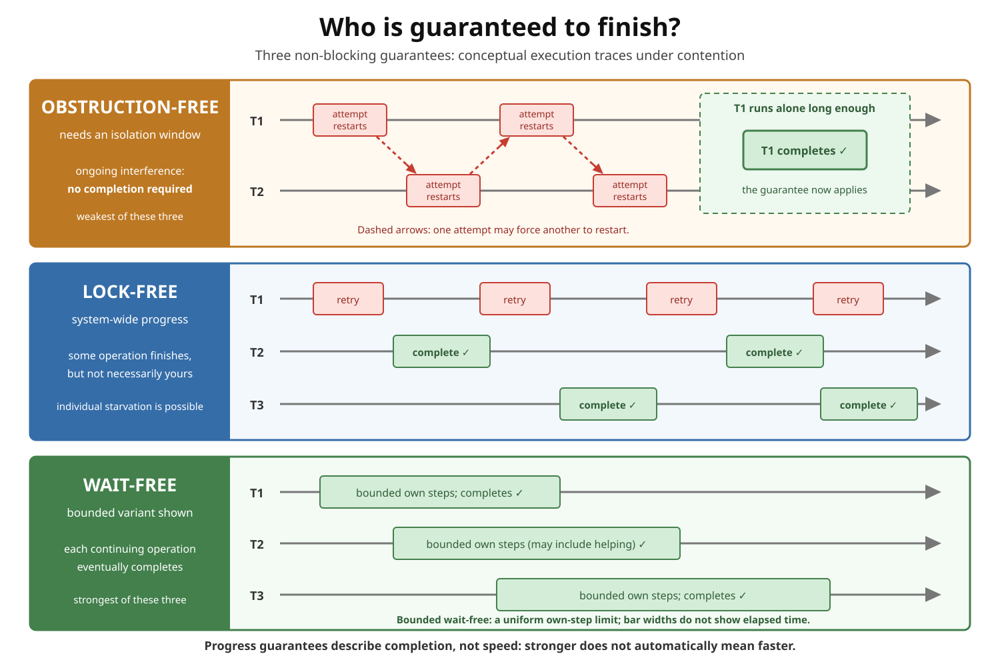
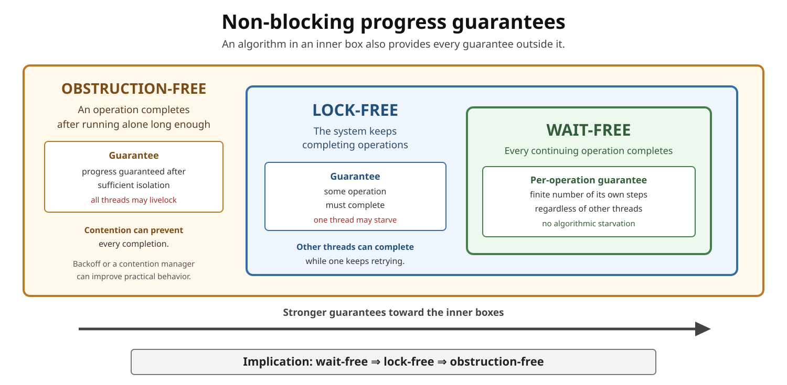

# Concurrency. Progress Guarantees

<sub>[Back to Java](../Readme.md#content)</sub>

**Progress guarantees answer two questions: whose operation must finish, and under what conditions?**
* Deadlock-Free and Starvation-Free describe progress commonly promised by locks.
* Obstruction-Free, Lock-Free, and Wait-Free describe non-blocking progress.

Start with **someone versus everyone**. Then ask whether progress depends on another thread eventually releasing a lock, an opportunity to run alone, or continuing execution without requiring stopped participants to resume. We will compare the five guarantees, follow concrete executions, and apply the distinctions to Java.

## Vocabulary first

- An **operation** is one call such as `increment()`, `offer()`, or `poll()`.
- An **active operation** has started but has not yet returned.
- A thread takes an **own step** when it executes one step of that operation. Progress bounds concern these steps, not wall-clock time.
- **Interference** means another thread changes shared state in a way that invalidates the current attempt.
- A **critical section** is code protected by a lock so that only one thread at a time can execute it. The **holder** owns that lock until it releases it.
- A **blocking** algorithm can depend on another thread resuming and doing something, such as unlocking. **Non-blocking** guarantees avoid this dependency; their requirements under continuing contention differ.
- **Deadlock** means threads remain stuck waiting on one another. A deadlocked group can coexist with unrelated threads that still run.
- **Starvation** means one operation can be postponed forever even while other operations finish.
- **Livelock** means threads keep reacting or retrying without completing useful work.
- **Fair scheduling**, as used here, means runnable participants keep getting opportunities to execute. It does not mean equal speed or a fixed time between turns.

For the lock examples below, assume runnable participants keep being scheduled and each holder finishes its critical section and releases the lock. These assumptions matter: a lock cannot compensate for an owner that never unlocks.

## The comparison in one table

For a lock, the operation being compared is **acquiring the lock**. Completing the protected application operation also requires its critical section to finish.

| Guarantee | Who must make progress? | Required condition | Can a persistent request starve? |
|---|---|---|---|
| **Deadlock-free** | Some pending lock request eventually succeeds | Fair scheduling; holders eventually release | Yes |
| **Starvation-free** | Every pending lock request eventually succeeds | Fair scheduling; holders eventually release | No, under those assumptions |
| **Obstruction-free** | The operation that runs alone long enough completes | Sufficient execution without interference | Yes, if it never gets that opportunity |
| **Lock-free** | Some operation completes; system progress continues | Threads keep taking steps, even if others stop | Yes |
| **Wait-free** | Every continuing operation completes in finitely many of its own steps | That operation keeps taking its own steps | No, within the algorithm's model |

The essential question is **what completion does the complete algorithm guarantee?** An operation sleeping for a while is not necessarily a liveness failure; an allowed execution that postpones completion forever is.

## Deadlock-free: “someone gets through, if holders release”

For lock acquisition, **deadlock-free** means pending requests cannot all wait forever under the stated assumptions: some request must eventually acquire the lock. This is a guarantee about progress of the group, not about a particular caller.

First, recognize a deadlock:

```text
T1 holds lock A → waits for lock B → held by T2
T2 holds lock B → waits for lock A → held by T1

Neither can reach the code that releases its first lock.
```

Now consider one lock that lets contenders race for it whenever it becomes free. A **spinlock** waits by repeatedly trying instead of putting the thread to sleep. A **test-and-set** spinlock uses an atomic instruction that sets a shared flag and reports its previous value: the caller that finds it clear wins. Under the lock assumptions, someone gets in, but a particular contender can lose every race:

```text
T1 keeps requesting the lock.
Admissions: T2 → T3 → T2 → T3 → ...
Each winner releases; the pattern may repeat forever without T1.
```

This is deadlock-free but permits starvation. Giving T1 CPU time does not force T1 to win the lock.

Here we use the formal **progress** meaning of deadlock-free. Merely removing a circular wait is insufficient if a replacement retry scheme lets everyone livelock forever.

## Starvation-free: “everyone eventually gets a turn”

For lock acquisition, **starvation-free** means every persistent request eventually succeeds under the same scheduling and release assumptions. It rules out the endless bypassing of T1 above.

A conceptual **first-in, first-out (FIFO)** lock illustrates how: requests join a queue, and a new arrival cannot pass requests already ahead of it.

```text
Request order: T1, T2, T3
Admissions:   T1 enters and releases → T2 enters and releases → T3 enters
```

With finitely many requests ahead and each predecessor eventually releasing, your turn eventually arrives. FIFO is one way to provide starvation-freedom; the definition requires eventual admission, not one particular order.

Read the diagram from left to right: a waiting cycle, progress that can exclude one caller, and progress that eventually includes every caller. The repeated pattern illustrates a possibility, not proof from a short test run.



### Why starvation-free is not wait-free

Pause the owner of a FIFO lock immediately before it releases. Every queued caller must wait for that owner to resume. The queue prevents overtaking, but cannot remove this dependency.

Even a bound on **how many callers go before you** does not remove this dependency. A spinning waiter can keep taking its own steps forever if the owner never resumes. Starvation-freedom promises eventual service under its assumptions; wait-freedom requires each continuing caller to finish despite other threads stopping.

## Obstruction-free: “I finish if interference stops”

An operation is **obstruction-free** if it completes after running alone for sufficiently many of its own steps.

“Alone” does not mean every other thread has terminated. It means other threads stop taking conflicting steps long enough for this operation to finish.

```text
T1 tries → T2 interferes → T1 restarts
T2 tries → T1 interferes → T2 restarts

No isolation window → no completion is required
T2 stops interfering → T1 runs alone → T1 must complete
```

Under continuous contention, all operations may repeatedly restart. A contention manager, randomized delay, or backoff may make this unlikely in practice, but it does **not** strengthen the underlying guarantee unless the complete mechanism proves stronger progress.

Conceptual shape—not a complete implementation:

```java
for (;;) {
    Snapshot before = readConsistentState();
    Update after = calculateUpdate(before);

    if (validateAndCommit(before, after)) {
        return;
    }

    // Interference invalidated this attempt.
}
```

The loop's shape alone proves nothing. The guarantees of `readConsistentState()`, `validateAndCommit()`, conflict handling, and memory reclamation all matter.

## Lock-free: “the system keeps finishing operations”

An algorithm is **lock-free** when continued execution guarantees that **some** operation completes in a finite number of system-wide steps.

It promises **global progress**, not fairness:

```text
T1 loses → T2 succeeds
T1 loses → T3 succeeds
T1 loses → T2 succeeds

The system progresses, but T1 may starve.
```

A paused thread cannot indefinitely prevent every other thread from completing merely because it paused during its operation. That is the important difference from a thread that pauses while holding an exclusive lock needed by everybody else.

### Typical compare-and-set retry loop

`compareAndSet(expected, update)`—usually abbreviated **CAS**—atomically changes a value only if it still equals the expected value.

```java
import java.util.concurrent.atomic.AtomicInteger;

final class LockFreeCounter {
    private final AtomicInteger value = new AtomicInteger();

    int increment() {
        for (;;) {
            int current = value.get();
            int next = current + 1;

            if (value.compareAndSet(current, next)) {
                return next;
            }

            Thread.onSpinWait();
        }
    }
}
```

For this counter:

- a successful CAS completes the current operation;
- a failed strong CAS means the expected value no longer matched, so another update changed the counter;
- repeated failures can therefore accompany system-wide progress;
- one unlucky caller can still lose every race, so the loop is **not wait-free**.

`Thread.onSpinWait()` is only a runtime hint for a busy-wait loop. Removing it does not change correctness, and adding it does not strengthen the progress guarantee.

## Wait-free: “every continuing operation finishes”

An algorithm is **wait-free** when every operation whose caller keeps taking steps completes after finitely many of its own steps, regardless of other threads' relative speeds or failures.

This is **per-operation progress**. An aggressive competitor cannot force one active operation to retry forever.

**Bounded wait-free** adds a stronger requirement: a uniform upper bound on the number of own steps across all allowed executions for the stated parameters. Each call finishing after some finite amount of work does not, by itself, establish one limit that covers every call. We follow Herlihy's distinction here; some sources use *wait-free* for the bounded variant too.

A bound may depend on a fixed parameter, such as the number of participants, the structure's capacity, or the chosen operation. Once those parameters are fixed, the limit must hold regardless of the execution schedule. Neither form may depend on another thread eventually resuming and completing some future action.

Many wait-free designs use **helping**:

```text
1. A thread publishes a description of its pending operation.
2. Threads find pending descriptions in a controlled order.
3. A thread may finish another thread's operation before its own.
4. A bounded helping rule prevents an active request from being ignored forever.
```

Helping can turn system-wide progress into per-operation progress, but it adds state, work, and a substantially harder correctness proof.

### Compare the non-blocking executions

Read each row from left to right. Red blocks are failed attempts; green blocks are completed operations. The wait-free row illustrates the **bounded variant** just described.



- **Obstruction-free:** completion appears only after T1 gets an isolation window.
- **Lock-free:** T2 and T3 complete while T1 may retry forever.
- **Wait-free, bounded variant shown:** every continuing operation finishes within a uniform own-step limit for the stated parameters.

## How the guarantees relate

Here, `A ⇒ B` means a guarantee of A also supplies B, for the same operations under the corresponding assumptions.

```text
Lock acquisition, with fair scheduling and eventual release:
starvation-free ⇒ deadlock-free

Non-blocking operations:
wait-free ⇒ lock-free ⇒ obstruction-free
```

Starvation-free implies deadlock-free because if every waiting caller eventually enters, some caller certainly enters. The converse fails when a lock continually admits other callers ahead of one unlucky waiter.

The nested boxes below show the non-blocking implications. Read from the innermost box outward: every wait-free algorithm is also lock-free and obstruction-free. The horizontal arrow points toward the stronger guarantees as the boxes nest farther to the right.



### Wait-free implies lock-free

If every operation whose caller keeps taking steps completes, then at least one operation completes while execution continues. Per-operation progress necessarily gives system-wide progress.

### Lock-free implies obstruction-free

If only one active operation keeps taking steps, any lock-free system progress must come from that operation. It therefore completes while running without interference.

### The reverse directions fail

- **Obstruction-free does not imply lock-free:** two threads can continually invalidate each other, so neither finishes.
- **Lock-free does not imply wait-free:** the system can complete infinitely many operations while one caller loses every race.

### Compare the assumptions across the two groups

| Similar promise | What the non-blocking guarantee adds |
|---|---|
| Deadlock-free and lock-free: someone progresses | Lock-free progress survives another participant stopping mid-operation. A deadlock-free lock can wait for its owner. |
| Starvation-free and wait-free: everyone progresses | Wait-free completion does not depend on others continuing. A starvation-free lock depends on predecessors continuing. |

For the same object operations, wait-freedom also supplies starvation-free progress under fair scheduling, and lock-freedom supplies deadlock-free progress. The reverse implications do not hold.

These relationships do **not** put all five terms into one strength order. For example, a starvation-free FIFO lock can block behind a paused owner, while a lock-free retry loop can starve one caller. Neither of those two guarantees implies the other.

## Progress is not correctness

All five terms describe **liveness**: whether operations finish. They do not by themselves prove **safety**: whether the results are correct.

A usable concurrent algorithm may also need:

- atomic updates and correct memory ordering;
- **linearizability**, so each completed operation appears to take effect at one instant between its call and return;
- preservation of data-structure invariants;
- protection from the **ABA problem**, where a value changes from A to B and back to A, so an equality check misses the intervening changes; see [Concurrency. CAS](../Concurrency.%20CAS/Readme.md#the-aba-problem);
- safe reclamation of removed nodes.

An algorithm may be linearizable and still be blocking, obstruction-free, lock-free, or wait-free.

## Java example: a fair lock is still blocking

As specified for Java SE 26, `new ReentrantLock(true)` enables a fair admission policy: under contention, it favors the longest-waiting thread. This counter uses that policy through `lock()`:

```java
import java.util.concurrent.locks.ReentrantLock;

final class FairLockedCounter {
    private final ReentrantLock lock = new ReentrantLock(true);
    private int value;

    int increment() {
        lock.lock();
        try {
            return ++value;
        } finally {
            lock.unlock();
        }
    }
}
```

The API documents freedom from starvation for fair lock admission, subject to threads being scheduled and owners releasing the lock. `finally` releases ownership when the protected code exits, including through an exception.

Apply the pause test: if T1 stops after acquiring this lock, T2 cannot increment until T1 resumes and unlocks. The counter is therefore **blocking**, even with its fair policy.

Two Java details matter:

- Lock fairness does not guarantee fairness of thread scheduling.
- Untimed `tryLock()` ignores the fairness setting and may acquire a free lock ahead of queued callers. Do not transfer the example's admission guarantee to a loop using that method.

Fair admission also cannot fix the earlier two-lock cycle: if each thread holds one lock and waits for the other, neither reaches `unlock()`.

That does not make locks bad. Locks are often simpler to design and verify, and they may perform better for a real workload. A progress guarantee is not a speed ranking.

## How to interpret Java APIs

The `java.util.concurrent.atomic` package supplies atomic operations intended to support lock-free programming on single variables. `ConcurrentLinkedQueue` is documented as using a non-blocking algorithm based on the Michael–Scott queue.

Still, do not label arbitrary Java code lock-free merely because it contains `AtomicInteger`, `VarHandle`, or CAS. The claim belongs to a **specific operation of a complete algorithm under stated assumptions**. An unrelated blocking call, an unsafe reclamation scheme, or a retry condition that does not imply competing progress can invalidate the claim.

Likewise, do not call an operation wait-free solely because one atomic instruction appears to be constant-time. The Java API may not promise wait-free completion, let alone a uniform step bound, for the entire path.

## Common traps

| Claim | Correct interpretation |
|---|---|
| “Deadlock-free means my request finishes.” | It guarantees progress for someone; your request may starve. |
| “Starvation-free means wait-free.” | Eventual admission can depend on other threads running and releasing a lock. |
| “Fair scheduling makes every lock fair.” | CPU time lets a thread try; it does not ensure that the thread wins acquisition. |
| “Lock-free means every thread progresses.” | No. Some operation progresses; one caller may starve. |
| “Wait-free means a wall-clock deadline.” | No. It guarantees finite own-step completion; even bounded wait-free does not bound scheduling pauses, JVM safepoints, page faults, or hardware delays. |
| “Finite and bounded mean the same thing here.” | Finite completion for each call does not establish a uniform step limit across all allowed executions. The latter is bounded wait-freedom. |
| “Every CAS loop is lock-free.” | No. Failures must imply system progress, and the entire operation must preserve the guarantee. |
| “No `synchronized` means non-blocking.” | No. A spin loop can avoid locks and still have no progress guarantee. |
| “A fixed retry limit makes the update wait-free.” | Only if returning failure is part of the operation's contract; otherwise the requested update did not complete. |
| “Wait-free is always fastest.” | No. Helping and bookkeeping can cost more than retries or locking. |

## Check your understanding

Try to explain the reason before reading the last column. These are reasoning examples; a finite stress test cannot establish a guarantee for every possible execution.

| Situation | Classification | Why? |
|---|---|---|
| T1 holds A and waits for B; T2 holds B and waits for A | Deadlock | Each needs the other to release first. Fair admission cannot break the cycle. |
| A spinlock always admits someone after release, but may bypass T1 forever | Deadlock-free; not starvation-free | Collective progress leaves one caller behind. |
| A FIFO lock serves every queued request, provided predecessors keep running and release | Starvation-free; still blocking | A stopped owner can hold up everyone behind it. |
| Any pending call finishes if it runs alone long enough, but two competing calls may continually invalidate one another and both retry forever | Obstruction-free; not lock-free | Isolation guarantees completion; continued contention need not produce any completion. |
| Every failed counter CAS accompanies another successful update, but T1 may always lose | Lock-free; not wait-free | Competing updates progress; T1 may never finish. |
| For a fixed participant count, a proven helping rule finishes each call within a uniform own-step limit, even if all other threads stop | Bounded wait-free, and therefore wait-free | Each continuing caller finishes independently of others, with an additional uniform limit on its work. |

## Memory aid

```text
Deadlock-free:     Someone gets the lock, if holders release.
Starvation-free:   Everyone gets a turn, if predecessors continue.
Obstruction-free:  I finish after interference stops.
Lock-free:         The system keeps finishing operations.
Wait-free:         Every continuing operation finishes in finite own steps.
Bounded wait-free: Also has a uniform own-step limit for fixed parameters.

For the first two: assume fair scheduling and eventual release.

Useful implications, not one five-term ranking:
starvation-free ⇒ deadlock-free
wait-free ⇒ lock-free ⇒ obstruction-free
```

# Sources

- [Hongjin Liang, Jan Hoffmann, Xinyu Feng, and Zhong Shao — “Characterizing Progress Properties of Concurrent Objects via Contextual Refinements”](https://www.cs.yale.edu/homes/hoffmann/papers/LHXZ13progress.pdf)

  *CONCUR 2013*, Sections 1–2 and Figure 1. Defines the five guarantees, explains fair-scheduling assumptions, and establishes their implications and partial order.

- [James Aspnes — “Mutual Exclusion”](https://www.cs.yale.edu/homes/aspnes/pinewiki/MutualExclusion.html)

  *Yale University teaching notes*, Sections 2–3. Explains deadlock-freedom, lockout-freedom (starvation-freedom), test-and-set starvation, FIFO admission, and bounded bypass.

- [Maurice Herlihy and Nir Shavit — “On the Nature of Progress”](https://lrita.github.io/images/posts/datastructure/on-the-nature-of-progress.pdf)

  Author paper, mirrored PDF, Sections 2–4. Explains how progress depends on scheduling, why lock holders must eventually release, and the distinction between collective and individual progress.

- [Oracle — “Deadlock”](https://docs.oracle.com/javase/tutorial/essential/concurrency/deadlock.html) and [“Starvation and Livelock”](https://docs.oracle.com/javase/tutorial/essential/concurrency/starvelive.html)

  *The Java Tutorials*. Supports the failure-mode vocabulary and the distinction between waiting on one another, being denied service, and repeatedly reacting without progress.

- [Oracle — Java SE 26 `ReentrantLock`](https://docs.oracle.com/en/java/javase/26/docs/api/java.base/java/util/concurrent/locks/ReentrantLock.html)

  *Java SE 26 API Specification*. Supports fair admission, the separate scheduling caveat, untimed `tryLock()` barging, blocking acquisition, and the `try`/`finally` release pattern.

- [Maurice Herlihy, Victor Luchangco, and Mark Moir — “Obstruction-Free Synchronization: Double-Ended Queues as an Example”](https://cs.brown.edu/people/mph/HerlihyLM03/main.pdf)

  *Proceedings of the 23rd International Conference on Distributed Computing Systems (ICDCS)*, IEEE Computer Society, 2003, pp. 522–529. [DOI: 10.1109/ICDCS.2003.1203503](https://doi.org/10.1109/ICDCS.2003.1203503). Supports the obstruction-free definition, the progress hierarchy, contention management, and helping discussion.

- [Maurice Herlihy — “Wait-Free Synchronization”](https://cs.brown.edu/people/mph/Herlihy91/p124-herlihy.pdf)

  *ACM Transactions on Programming Languages and Systems*, vol. 13, no. 1, January 1991, pp. 124–149. [DOI: 10.1145/114005.102808](https://doi.org/10.1145/114005.102808). Section 2, pp. 129–130, explicitly distinguishes wait-free completion from the stronger bounded wait-free condition. Also supports own-step reasoning and the safety-versus-liveness distinction.

- [Maged M. Michael and Michael L. Scott — “Simple, Fast, and Practical Non-Blocking and Blocking Concurrent Queue Algorithms”](https://www.cs.rochester.edu/~scott/papers/1996_PODC_queues.pdf)

  *Proceedings of the 15th Annual ACM Symposium on Principles of Distributed Computing (PODC ’96)*, ACM, 1996, pp. 267–275. [DOI: 10.1145/248052.248106](https://doi.org/10.1145/248052.248106). Supports the queue algorithm and global progress, which this paper calls **non-blocking**. Its older use of **lock-free** means absence of locks and does not imply that progress guarantee; do not apply the article's modern hierarchy to those historical labels. Footnote 2 uses **wait-free** for a bounded-step guarantee.

- [Oracle — Java SE 26 `java.util.concurrent` package summary](https://docs.oracle.com/en/java/javase/26/docs/api/java.base/java/util/concurrent/package-summary.html)

  *Java Platform, Standard Edition and Java Development Kit, Version 26 API Specification*. Supports Java’s distinction between non-blocking queues, blocking queues, and atomic utilities.

- [Oracle — Java SE 26 `ConcurrentLinkedQueue`](https://docs.oracle.com/en/java/javase/26/docs/api/java.base/java/util/concurrent/ConcurrentLinkedQueue.html)

  *Java Platform, Standard Edition and Java Development Kit, Version 26 API Specification*. Supports the statement that this queue uses a non-blocking algorithm based on the Michael–Scott queue.

- [Oracle — Java SE 26 `Thread.onSpinWait()`](https://docs.oracle.com/en/java/javase/26/docs/api/java.base/java/lang/Thread.html#onSpinWait())

  *Java Platform, Standard Edition and Java Development Kit, Version 26 API Specification*. Supports the statement that `onSpinWait()` is an optional runtime hint and is not required for correctness.
