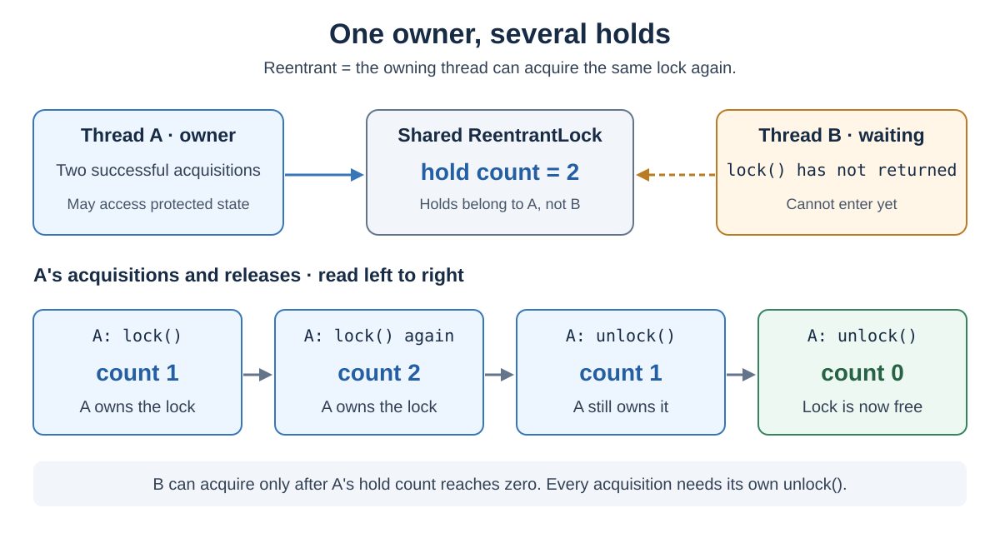
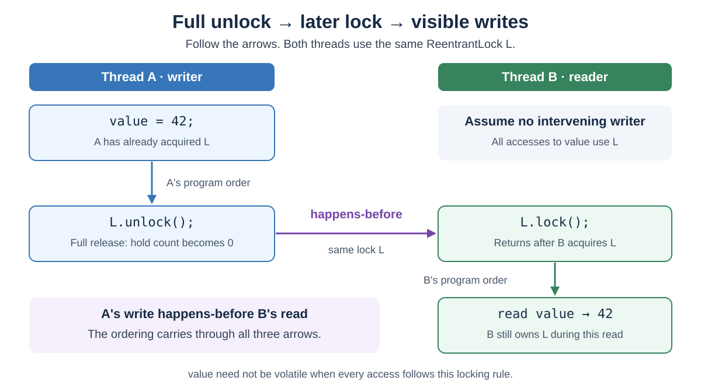
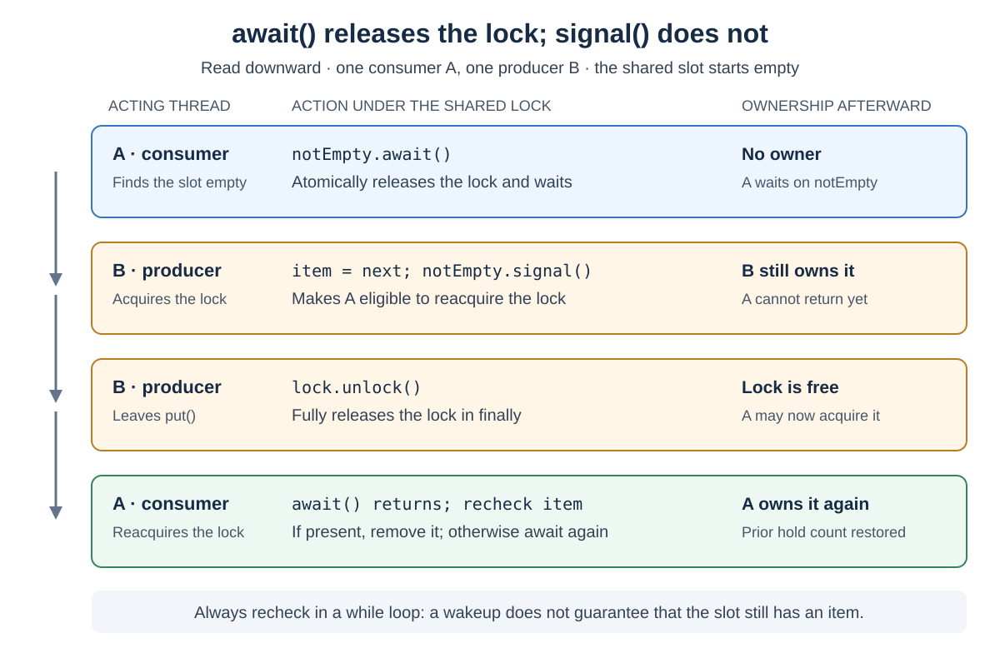

# Concurrency. ReentrantLock

<sub>[Back to Java](../Readme.md#content)</sub>

**`ReentrantLock` was introduced in Java 5 (JDK 1.5).**

`ReentrantLock`, in `java.util.concurrent.locks`, gives one thread exclusive access to a protected operation. The owner can acquire the same lock again, but must balance every successful acquisition with an `unlock()`.

Use it when you need timed or interruptible acquisition, an explicit fairness policy, or several condition queues. The article moves from ownership and safe acquisition to memory visibility, fairness, and `Condition` waiting. It then compares `synchronized`, including virtual-thread behavior, reviews common mistakes, and closes with a memory aid. API behavior is checked against Java SE 26; the examples use Java 8-compatible syntax and APIs.

## One shared lock, one owner

A **critical section** is code that accesses shared state under a lock. **Mutual exclusion** means that two threads cannot own that same lock simultaneously. **Contention** occurs when threads compete to acquire it.

The lock does not automatically intercept field access. Every operation that relies on the protected state must follow the same locking rule. A fresh lock created inside each method call provides no coordination between calls.

**Reentrant** means that the current owner may enter again. Its **hold count** records acquisitions that have not yet been balanced by releases. In the diagram, A acquires twice; B cannot acquire after A's first `unlock()` because A still has one hold.



Reentrancy lets a locked method call another method using the same lock without waiting for itself. It does not prevent deadlocks involving different locks.

## Acquire before `try`, release in `finally`

This complete class guards both updates and reads with one private, stable lock:

```java
import java.util.concurrent.locks.ReentrantLock;

public final class LockedCounter {
    private final ReentrantLock lock = new ReentrantLock();
    private int value;

    public void increment() {
        lock.lock();
        try {
            value++;
        } finally {
            lock.unlock();
        }
    }

    public void incrementTwice() {
        lock.lock();              // Hold count: 1
        try {
            increment();          // 1 -> 2 -> 1
            increment();          // 1 -> 2 -> 1
        } finally {
            lock.unlock();        // 1 -> 0: another thread may acquire
        }
    }

    public int get() {
        lock.lock();
        try {
            return value;
        } finally {
            lock.unlock();
        }
    }
}
```

The outer hold makes both increments one critical section: another caller of `get()` cannot observe the intermediate value. The same rule can protect a relationship between multiple fields, such as a queue's contents and its element count.

Put acquisition immediately before `try`, and `unlock()` first in `finally`. Cleanup then runs on normal return and exceptions from the body. Acquiring inside a `try` with an unconditional `unlock()` is unsafe when acquisition can fail or throw.

Only the owner may call `unlock()`; otherwise it throws `IllegalMonitorStateException`. A missing release can leave other threads waiting indefinitely. Releasing the lock also does not roll back changes made before an exception: preserve the data's consistency inside the critical section.

## Choose how to acquire

| Method | If another thread owns the lock | Result |
| --- | --- | --- |
| `lock()` | Waits until acquisition; interruption does not cancel this wait | Returns with ownership |
| `lockInterruptibly()` | Waits, but responds to interruption | Acquires or throws `InterruptedException` |
| `tryLock()` | Does not wait | `true` if acquired, otherwise `false` |
| `tryLock(timeout, unit)` | Waits with a time limit and responds to interruption | `true`, `false` on timeout, or `InterruptedException` |

Successful reentrant calls also add a hold. For interruptible acquisition, an already-set interrupt takes priority even over reentrant acquisition. Throwing `InterruptedException` clears the interrupt status.

This complete example returns `false` when it cannot acquire within the requested wait:

```java
import java.util.concurrent.TimeUnit;
import java.util.concurrent.locks.ReentrantLock;

public final class TimedCounter {
    private final ReentrantLock lock = new ReentrantLock();
    private int value;

    public boolean tryIncrement(long timeout, TimeUnit unit)
            throws InterruptedException {
        if (!lock.tryLock(timeout, unit)) {
            return false;
        }
        try {
            value++;
            return true;
        } finally {
            lock.unlock();
        }
    }
}
```

The `false` path never enters the critical section or calls `unlock()`. The timeout limits acquisition waiting, not the duration of work after acquisition or a guaranteed wall-clock return deadline.

Let `InterruptedException` propagate when the caller owns cancellation policy, as here. If a task boundary catches it, a common policy is to restore the status with `Thread.currentThread().interrupt()` and stop the task. Do not silently retry an operation the caller wanted to cancel.

## Visibility as well as exclusion

**Happens-before** is Java's rule for ordering memory effects between threads. Writes before a full release of a lock are visible to another thread after it successfully acquires that same lock.

The diagram connects A's write to B's read through a full release and later acquisition of the same lock `L`. Read down the writer's column, across the lock boundary, then down the reader's column. Assume no intervening writer changes `value`.



This is why `LockedCounter.value` does not need `volatile`: all its reads and updates follow the same lock discipline. Simply adding `volatile` would not make an increment's read-modify-write sequence exclusive.

A failed `tryLock()` does not provide the successful-acquisition memory guarantee.

Every Java object has a built-in lock called its **intrinsic monitor**. `synchronized (object)` acquires that monitor and automatically releases it when the block exits. A `ReentrantLock` object therefore has both its intrinsic monitor and the separate explicit lock controlled by `lock()` and `unlock()`.

A thread inside `synchronized (lock)` and another thread holding `lock.lock()` can execute their protected bodies simultaneously: they own different locks. Mixing these two mechanisms does not provide mutual exclusion for the shared state.

## Fairness is an acquisition policy

`new ReentrantLock()` uses nonfair acquisition. `new ReentrantLock(true)` favors the longest-waiting thread under contention, potentially at a throughput cost. It does not control thread scheduling or guarantee equal execution time.

The important exception is **untimed `tryLock()`**, which can acquire an available lock ahead of waiting threads even in fair mode. Timed `tryLock` honors fairness; `tryLock(0, TimeUnit.SECONDS)` is the immediate, interruption-aware alternative when fairness matters. An owner can still reenter its fair lock.

Choose fairness for a specific waiting-order requirement. Do not assume it makes every workload faster or provides a maximum response time.

## `Condition`: wait for state to change

A lock answers “may I access the state?” A **condition predicate** is a boolean rule such as “the slot contains an item.” A `Condition` is the associated waiting mechanism, created with `lock.newCondition()`; it does not store or evaluate that rule for you.

The diagram follows one consumer A and one producer B sharing an initially empty slot. Read downward: A waits without holding the lock, B supplies an item, and A checks again after reacquiring.



With a `ReentrantLock` condition, the caller must own the lock to wait or signal. `await()` atomically releases it and waits; before completing, it reacquires it and restores the previous hold count. Other locks held by the thread are unaffected.

`signal()` selects one condition waiter; `signalAll()` selects all. **Signalling does not release the lock or hand ownership to a waiter.** A signalled thread still has to acquire it before continuing.

### A slot with two waiting conditions

This complete teaching example holds one non-null item. Producers wait on `notFull`; consumers wait on `notEmpty`. Both conditions share one lock.

```java
import java.util.Objects;
import java.util.concurrent.locks.Condition;
import java.util.concurrent.locks.ReentrantLock;

public final class SingleSlot<T> {
    private final ReentrantLock lock = new ReentrantLock();
    private final Condition notEmpty = lock.newCondition();
    private final Condition notFull = lock.newCondition();
    private T item;                // null means empty

    public void put(T next) throws InterruptedException {
        Objects.requireNonNull(next);
        lock.lockInterruptibly();
        try {
            while (item != null) {
                notFull.await();
            }
            item = next;
            notEmpty.signal();
        } finally {
            lock.unlock();
        }
    }

    public T take() throws InterruptedException {
        lock.lockInterruptibly();
        try {
            while (item == null) {
                notEmpty.await();
            }
            T result = item;
            item = null;
            notFull.signal();
            return result;
        } finally {
            lock.unlock();
        }
    }
}
```

Use **`while`, not `if`**. Waiting may end with a **spurious wakeup**, meaning no signal caused it. Even after a real signal, another consumer could take the item before this consumer reacquires the lock.

The state is the durable fact: if `put()` runs before `take()`, the consumer sees the item and skips waiting. Signals are not saved as permits for future waiters. Checking the predicate and calling `await()` under one lock prevents a gap in which the producer's relevant state change could be missed.

One signal is sufficient here because one inserted item enables one consumer, and one removed item enables one producer. More complex predicates may require `signalAll()`. For a production buffer, usually use an existing `BlockingQueue`, such as `ArrayBlockingQueue`, instead of maintaining this protocol yourself.

## Compared with `synchronized`

An object's **wait set** is the group of threads suspended through that object's `wait` methods. Threads merely waiting to enter `synchronized` are not in this set. Each monitor has one wait set; multiple `Condition` objects let a `ReentrantLock` support separate groups of waiting threads.

| Requirement | `synchronized` | `ReentrantLock` |
| --- | --- | --- |
| Mutual exclusion and reentrancy | Yes | Yes |
| Memory visibility through release/acquire | Yes | Yes |
| Release on leaving the protected scope | Automatic | Explicit `finally` required |
| Immediate or timed acquisition attempt | No | `tryLock` variants |
| Interruptible acquisition | No | `lockInterruptibly()` or timed `tryLock` |
| Waiting for a predicate | One monitor wait set with `wait`/`notify`/`notifyAll` | Multiple `Condition` objects per lock |
| Configurable fairness | No | Optional |

Interruptible **acquisition** is different from interruptible **condition waiting**: `Object.wait()` can be interrupted even though entering a `synchronized` block cannot be cancelled this way.

Prefer `synchronized` when a straightforward scoped critical section is enough. Choose `ReentrantLock` when its additional controls solve a concrete problem; performance depends on the workload and JDK.

### Virtual threads and JDK versions

JDK 21 guidance recommended replacing frequently used `synchronized` regions containing long blocking operations with `ReentrantLock` to avoid **pinning**: tying a virtual thread to its carrier platform thread while blocked.

**JDK 24 delivered JEP 491, Synchronize Virtual Threads without Pinning.** On current JDKs, ordinary `synchronized` use is no longer a reason by itself to migrate to `ReentrantLock`. Native or foreign-function execution can still cause pinning. Either lock still serializes its protected work; virtual threads do not remove contention.

## Mistakes to catch in review

- **Different locks protect the same state.** All participating paths must agree on the lock, including getters and helper methods.
- **Checking `isLocked()` before acting.** The answer can become stale immediately. Use acquisition itself to obtain ownership; queue-length observations are for diagnostics.
- **Treating reentrancy as deadlock prevention.** A thread holding L1 can still wait for L2 while another holds L2 and waits for L1. Use a consistent order when acquiring multiple locks.
- **Assuming a timeout undoes earlier work.** It only reports that acquisition failed; code must release locks it already owns and preserve state consistency.
- **Calling `wait()` on the lock or condition object.** Those methods belong to object monitors. Use the associated `Condition.await()` and signalling methods for this protocol.

## Memory aid

- **One lock, one owner, possibly many holds.** Reentrancy adds a hold; another thread can acquire only after the count reaches zero.
- **Acquire, then `try`; release in `finally`.** Balance every successful acquisition. A failed `tryLock()` needs no `unlock()`.
- **Release publishes; acquisition observes.** A full release makes earlier writes visible after another thread successfully acquires the same lock.
- **Wait on the predicate.** `await()` releases and reacquires; `signal()` leaves ownership with the signalling thread. Recheck the predicate in a `while` loop.
- **Choose the controls you need.** Use `synchronized` for a simple scoped critical section; use `ReentrantLock` for timed or interruptible acquisition, fairness, or multiple conditions. Untimed `tryLock()` can bypass fairness.

# Sources

- [Oracle — Java SE 26 `ReentrantLock` API](https://docs.oracle.com/en/java/javase/26/docs/api/java.base/java/util/concurrent/locks/ReentrantLock.html)

  introduction, ownership, hold counts, fairness exceptions, interruption, conditions, and diagnostics.

- [Oracle — Java SE 26 `Lock` API](https://docs.oracle.com/en/java/javase/26/docs/api/java.base/java/util/concurrent/locks/Lock.html)

  acquisition patterns, explicit cleanup, memory effects, and independence from an object's intrinsic monitor.

- [Oracle — Java SE 26 `Condition` API](https://docs.oracle.com/en/java/javase/26/docs/api/java.base/java/util/concurrent/locks/Condition.html)

  atomic release and waiting, spurious wakeups, signalling, and separate producer/consumer wait sets.

- [Java Language Specification, Java SE 26 — Chapter 17: Threads and Locks](https://docs.oracle.com/javase/specs/jls/se26/html/jls-17.html)

  monitors, interruption, happens-before, and lack of automatic deadlock prevention.

- [Oracle — Java SE 26 `java.util.concurrent` package](https://docs.oracle.com/en/java/javase/26/docs/api/java.base/java/util/concurrent/package-summary.html#memory-consistency-properties)

  memory consistency and existing concurrent queues.

- [Oracle Java Tutorials — Intrinsic Locks and Synchronization](https://docs.oracle.com/javase/tutorial/essential/concurrency/locksync.html)

  shared locking discipline, reentrancy, and scoped monitor release.

- [Oracle Java Tutorials — Lock Objects](https://docs.oracle.com/javase/tutorial/essential/concurrency/newlocks.html)

  cancellable acquisition and releasing previously acquired locks when a multi-lock attempt fails.

- [Oracle Java Tutorials — Guarded Blocks](https://docs.oracle.com/javase/tutorial/essential/concurrency/guardmeth.html)

  predicate loops and producer/consumer coordination. The examples here propagate interruption instead of copying the tutorial's ignored interrupts.

- [Oracle — Java SE 21 Virtual Threads guide](https://docs.oracle.com/en/java/javase/21/core/virtual-threads.html)

  JDK 21 pinning behavior and the migration guidance for that release.

- [Oracle — Significant Changes in JDK 24](https://docs.oracle.com/en/java/javase/24/migrate/significant-changes-jdk-24.html)

  delivery of JEP 491 and removal of monitor-induced virtual-thread pinning.

- [Oracle — Java SE 26 Virtual Threads guide](https://docs.oracle.com/en/java/javase/26/core/virtual-threads.html)

  carrier scheduling and remaining native/foreign-function pinning.

- [Oracle Java Tutorials — Interrupts](https://docs.oracle.com/javase/tutorial/essential/concurrency/interrupt.html)

  cooperative cancellation and the interrupt status flag.

- [Oracle Java Tutorials — Atomic Access](https://docs.oracle.com/javase/tutorial/essential/concurrency/atomic.html)

  why an increment remains a compound action even with a volatile field.
