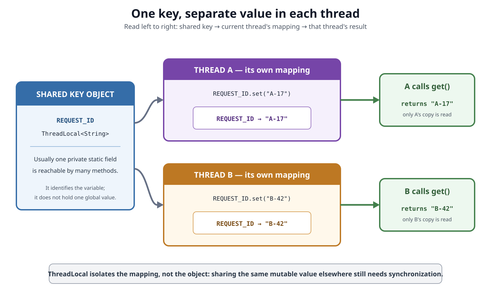
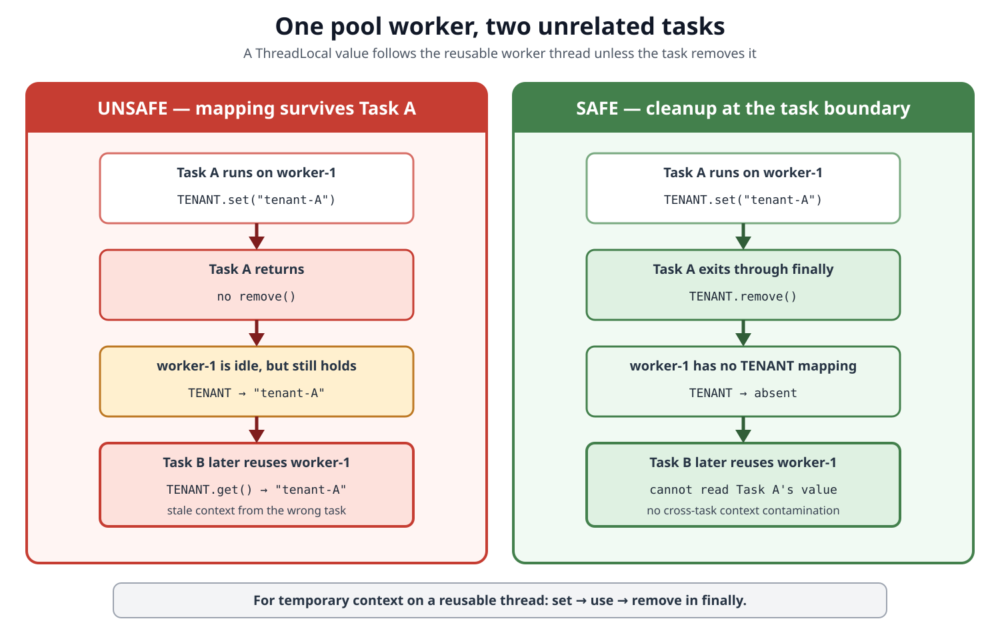
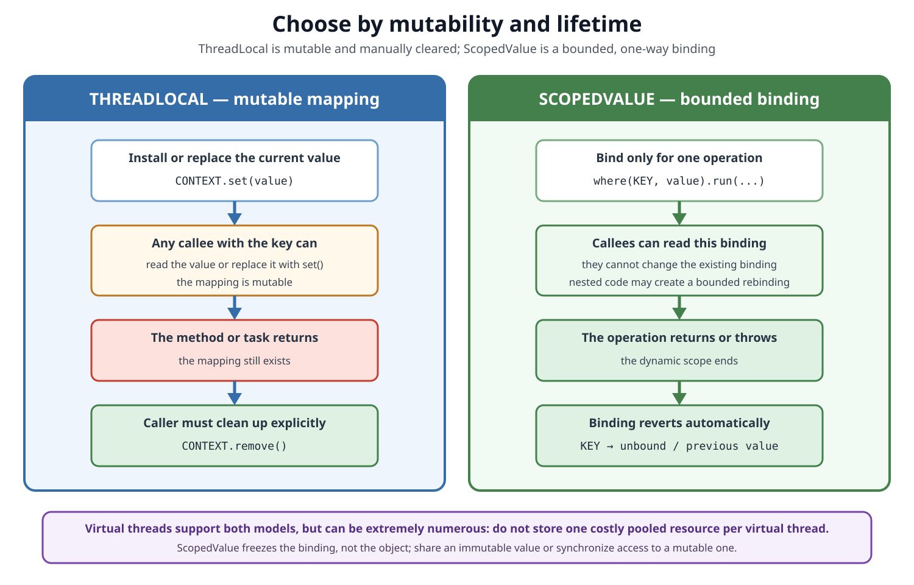

# Concurrency. ThreadLocal

## Front

How does `ThreadLocal` give each thread a separate value, how should it be cleaned up safely, and when should modern Java use `ScopedValue` instead?

## Back

**ThreadLocal** has been available since **Java 1.2**

**ScopedValue** its bounded-context alternative, became final in **JDK 25** with JEP 506.

`ThreadLocal<T>` associates a value with the **current Java thread**. The `ThreadLocal` object is normally one shared key, but each thread has an independently initialized mapping from that key to its own value.

The core rules are:

- `get()` and `set()` operate on the calling thread's mapping.
- Another thread sees its own mapping, not this thread's value.
- A reusable worker can carry an old mapping into its next task unless code calls `remove()`.
- For immutable context that should exist only during one bounded operation, prefer `ScopedValue`.

The first diagram separates the shared key from the per-thread values.



## Mental model

Suppose both Thread A and Thread B can access this field:

```java
private static final ThreadLocal<String> REQUEST_ID = new ThreadLocal<>();
```

`static final` means both threads use the same `ThreadLocal` **key object**. It does not mean they share one `String` value.

Conceptually, a lookup uses the pair:

```text
(current Java thread, ThreadLocal key) → that thread's value
```

Therefore, after A stores `"A-17"` and B stores `"B-42"`, the same call `REQUEST_ID.get()` returns a different result depending on which thread executes it.

`ThreadLocal` provides **thread confinement of the mapping**, not automatic thread safety for the stored object. If two threads are deliberately given the same mutable object through some other reference, that object is still shared and needs normal synchronization.

## Core API and lifecycle

| Method | Effect on the current thread only |
|---|---|
| `get()` | Returns the current value; initializes it first if no mapping exists |
| `set(value)` | Creates or replaces the current mapping |
| `remove()` | Deletes the current mapping |
| `withInitial(supplier)` | Creates a key whose supplier initializes each thread independently on first `get()` |

Example with lazy per-thread initialization:

```java
final class PerThreadCounter {
    private static final ThreadLocal<Integer> COUNT =
            ThreadLocal.withInitial(() -> 0);

    static int increment() {
        int next = COUNT.get() + 1;
        COUNT.set(next);
        return next;
    }

    static void clear() {
        COUNT.remove();
    }
}
```

For each thread, the supplier runs on the first `get()` unless that thread already called `set()`. After `remove()`, a later `get()` initializes a new value again.

Two details matter:

- `set(null)` stores a mapping whose value is `null`; it is **not** the same operation as `remove()`.
- `withInitial(ArrayList::new)`, for example, creates one mutable list per thread—not one list per method call. Its contents survive between calls until cleared or removed.

## Why thread pools require `finally`

Platform-thread pools normally reuse a small set of long-lived worker threads for many unrelated tasks. A `ThreadLocal` value follows the worker, not the logical request.



If Task A sets `TENANT` and returns without removing it, Task B may later run on the same worker and read A's tenant. This is both a correctness and security risk: request identity, authorization data, tracing metadata, or other context can cross task boundaries.

The safe pattern is to make one outer boundary own both installation and cleanup:

```java
import java.util.Objects;

final class RequestHandler {
    private static final ThreadLocal<String> REQUEST_ID = new ThreadLocal<>();

    static void handle(String requestId) {
        REQUEST_ID.set(Objects.requireNonNull(requestId));
        try {
            processRequest();
        } finally {
            REQUEST_ID.remove();
        }
    }

    private static void processRequest() {
        String requestId = REQUEST_ID.get();
        System.out.println("handling " + requestId);
    }
}
```

`finally` runs whether `processRequest()` returns normally or throws. Cleanup must be owned by code that knows the temporary value's intended lifetime; unrelated library code should not remove mappings it does not own.

### Nested overrides are harder

If nested code temporarily calls `set()` on the same `ThreadLocal`, simply calling `remove()` destroys the caller's outer value rather than restoring it. Code must explicitly save and restore the previous value, including whether a mapping originally existed—a distinction the public API does not expose directly.

This difficulty is one reason `ScopedValue` is safer for read-only, dynamically scoped context: nested rebinding automatically restores the previous binding.

## Memory retention and weak keys

The Java API states that a thread keeps its thread-local copy while the thread is alive and the `ThreadLocal` instance remains accessible. When the thread terminates, its copies can be garbage-collected unless other references keep them alive.

Long-lived pool workers change the practical lifetime: a forgotten value can remain reachable for far longer than its task.

The current OpenJDK implementation uses a per-thread `ThreadLocalMap`:

- each entry refers **weakly** to its `ThreadLocal` key;
- the entry holds its value normally;
- if the key is garbage-collected, the entry becomes stale;
- stale entries are cleaned during later map operations and are guaranteed to be removed only when the table needs space.

This is an implementation detail, not the `ThreadLocal` API contract. The practical rule is stable: **dropping the key reference is not deterministic cleanup; call `remove()` when the value's lifetime ends.**

Prefer a long-lived `private static final` key over constructing a new `ThreadLocal` for every task. A stable key avoids accidentally abandoning mappings, but it does not remove the need to clean temporary values.

## Thread boundaries and inheritance

An ordinary `ThreadLocal` value does not automatically move with work:

- submitting a task to an `Executor` uses whichever mapping belongs to the worker that runs it;
- a `CompletableFuture` stage running on another thread sees that other thread's mapping;
- starting an ordinary child thread does not copy regular `ThreadLocal` values.

`InheritableThreadLocal` is different: a child thread receives initial values derived from its parent when the child `Thread` is created. This is a creation-time snapshot mechanism, not general task-context propagation.

It is often a poor fit for executors because pool workers usually exist before a request is submitted. If the inherited value is a mutable object, parent and child may also end up referring to the same object unless `childValue()` creates an appropriate copy.

Prefer explicit method parameters when the data only crosses a few calls. Hidden context makes dependencies harder to see and test.

## Virtual threads

Virtual threads became final in JDK 21 with JEP 444 and fully support thread-local variables. A `ThreadLocal` belongs to the virtual `Thread` object, not to whichever platform carrier happens to run it. Mounting the virtual thread on another carrier does not change its thread-local context.

The design trade-off changes because virtual threads can be extremely numerous:

| Platform-thread pool | Virtual-thread-per-task style |
|---|---|
| Few long-lived workers are reused | Usually one short-lived virtual thread per task |
| Main risk: stale values cross tasks | Main risk: per-thread values multiply memory use |
| Temporary context requires `remove()` | Thread termination bounds lifetime, but large values can still be expensive |
| A per-worker cache may sometimes be deliberate | Do not create one costly resource for every virtual thread |

Virtual threads should not be pooled. If only 20 tasks may access a scarce service, use a concurrency limiter such as `Semaphore`; do not pool virtual threads or hide one database connection inside each thread-local mapping.

During migration, the JDK can print a stack trace whenever a virtual thread sets a thread-local value:

```text
-Djdk.traceVirtualThreadLocals=true
```

This is a diagnostic aid, not a switch that disables `ThreadLocal`.

## `ScopedValue`: bounded one-way context

`ScopedValue<T>` is designed for context that a caller binds, distant callees read, and callees should not mutate through the context key. The binding exists only while a chosen `run()` or `call()` operation executes.



JDK 25 example:

```java
import java.util.Objects;

record RequestContext(String requestId) {
    RequestContext {
        Objects.requireNonNull(requestId);
    }
}

final class ScopedRequestHandler {
    private static final ScopedValue<RequestContext> CONTEXT =
            ScopedValue.newInstance();

    static void handle(String requestId) {
        var context = new RequestContext(requestId);
        ScopedValue.where(CONTEXT, context)
                .run(ScopedRequestHandler::processRequest);
    }

    private static void processRequest() {
        System.out.println("handling " + CONTEXT.get().requestId());
    }
}
```

During `run()`:

- `CONTEXT.get()` reads the binding for the current dynamic scope;
- a callee cannot use `CONTEXT` to replace the existing binding;
- nested code may establish a new bounded binding, called **rebinding**;
- when the nested operation ends, the previous binding returns;
- when the outer operation returns or throws, the outer binding disappears automatically.

“Immutable binding” does not make the bound object immutable. Prefer an immutable value such as a record. If structured child threads share a mutable bound object, access must still be synchronized.

## Choosing the right mechanism

| Need | Prefer | Why |
|---|---|---|
| Data used by only a few nearby methods | Ordinary parameters | Dependencies remain explicit |
| Immutable request identity, principal, or tracing context read by callees | `ScopedValue` | One-way binding and automatic bounded lifetime |
| Existing library or framework requires thread-local context | `ThreadLocal` | Compatibility with its established API |
| Genuinely mutable state confined to one known thread | `ThreadLocal` | `set()` supports controlled mutation |
| Communication or synchronization between threads | Neither | Use queues, futures, locks, atomics, or structured concurrency |
| Pooling database connections or other scarce resources | A real resource pool or limiter | Resource count should not equal thread count |

## Common mistakes

### “`ThreadLocal` makes any value thread-safe”

No. It isolates the mapping. A mutable object shared through another path remains shared.

### “The task owns the value”

No. The current `Thread` owns the mapping. A pooled worker can execute many tasks.

### “Garbage collection replaces `remove()`”

No. Cleanup timing is not deterministic, especially for long-lived workers and stale OpenJDK map entries.

### “`set(null)` cleans the entry”

No. Use `remove()` to delete the mapping and permit a later `get()` to initialize again.

### “`InheritableThreadLocal` propagates request context through executors”

No. Inheritance happens when a child thread is created; executor workers commonly predate the request.

### “Virtual threads make every `ThreadLocal` use wrong”

No. They support it for compatibility. The warning is about scale and design: avoid per-thread copies of costly resources and prefer bounded `ScopedValue` context when it fits.

### “`ScopedValue` replaces every `ThreadLocal`”

No. It is preferred for one-way transmission of bounded context. It is not a mutable per-thread cell.

## Memory aid

```text
ThreadLocal lookup:
    (current thread, shared key) → this thread's value

Reusable worker:
    set → use → remove in finally

ScopedValue:
    bind → run/call → automatically restore or unbind

Rule of thumb:
    explicit parameter first
    ScopedValue for bounded read-only context
    ThreadLocal for deliberate mutable thread state or compatibility
```

## Sources

- [Oracle — Java SE 26 `ThreadLocal` API](https://docs.oracle.com/en/java/javase/26/docs/api/java.base/java/lang/ThreadLocal.html)

  Documents the independently initialized per-thread copy, API methods, initialization behavior, lifetime, and Java 1.2 introduction.

- [Oracle — Java SE 26 Thread-Local Variables guide](https://docs.oracle.com/en/java/javase/26/core/thread-local-variables.html)

  Documents declaration conventions, non-inheritance of ordinary `ThreadLocal`, mutable and unbounded-lifetime design issues, pool-task leakage, and the role of `remove()`.

- [OpenJDK — JEP 444: Virtual Threads](https://openjdk.org/jeps/444)

  Documents final virtual threads in JDK 21, guaranteed thread-local support, the diagnostic property, the instruction not to pool virtual threads, and the warning against pooling costly resources in thread-local variables.

- [OpenJDK — JEP 506: Scoped Values](https://openjdk.org/jeps/506)

  Finalized the `ScopedValue` API in JDK 25 and explains its bounded, one-way context model.

- [Oracle — Java SE 26 `ScopedValue` API](https://docs.oracle.com/en/java/javase/26/docs/api/java.base/java/lang/ScopedValue.html)

  Documents dynamic scope, automatic restoration, rebinding, per-thread bindings, structured inheritance, and why `ScopedValue` is preferred for one-way transmission.

- [Oracle — Java SE 26 `Thread` API](https://docs.oracle.com/en/java/javase/26/docs/api/java.base/java/lang/Thread.html)

  Documents thread-local support, inheritable-thread-local behavior at thread creation, virtual threads, and carrier-thread scheduling.

- [OpenJDK — current `ThreadLocal.java` source](https://github.com/openjdk/jdk/blob/master/src/java.base/share/classes/java/lang/ThreadLocal.java)

  Supports the explicitly labeled implementation details about per-thread maps, weak key references, ordinary value references, and stale-entry cleanup.
