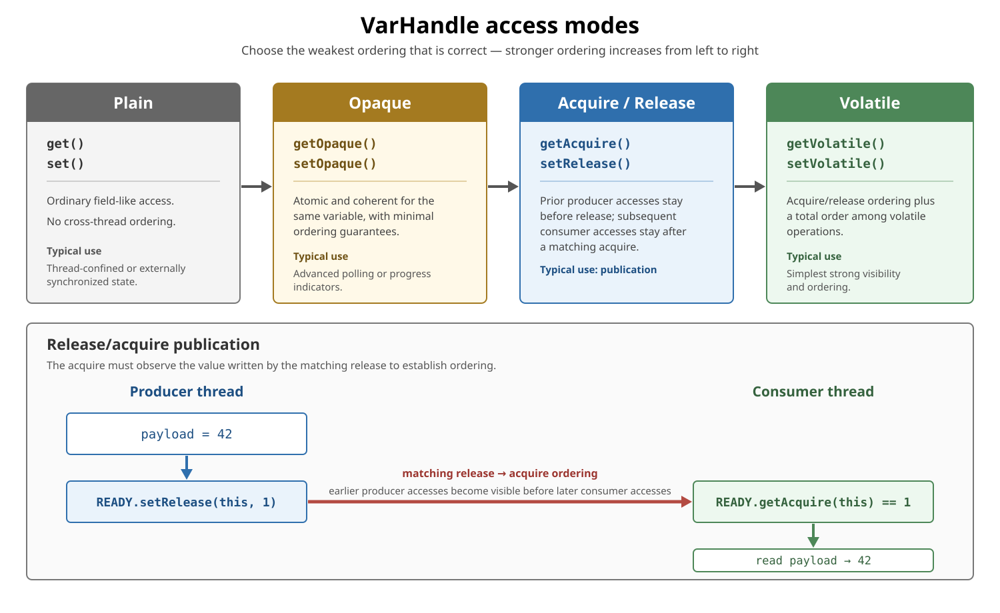
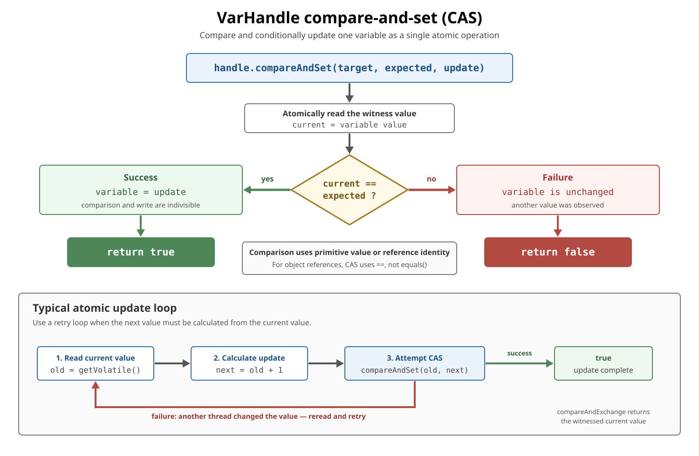

# VarHandle in Modern Java

## Front

What is `VarHandle`, how do its access and memory-ordering modes work, and when should it be used?

## Back

**`VarHandle` was added in JDK 9** by JEP 193.

A `VarHandle` is an immutable, strongly typed handle to a variable or a family of variables. It allows the same target to be accessed with different semantics, including:

- Plain reads and writes.
- Opaque reads and writes.
- Acquire and release ordering.
- Volatile reads and writes.
- Compare-and-set and compare-and-exchange.
- Atomic numeric and bitwise updates.

It is the supported Java API for many low-level operations that previously required internal `sun.misc.Unsafe` functionality.

## What can a VarHandle reference?

A handle can target:

- An instance field.
- A static field.
- Array elements.
- Views of byte arrays or byte buffers.
- Variables exposed by other supported low-level APIs.

The handle describes both:

1. The **variable type** — the value stored in the target.
2. The **coordinate types** — the information required to locate that target.

| Target | Variable type | Coordinates |
|---|---|---|
| Instance field `Counter.value` | `int` | `Counter` receiver |
| Static field | Field type | No receiver |
| `String[]` element | `String` | `String[]` and index |

## Creating a field VarHandle

Use `MethodHandles.Lookup` to find an accessible field:

```java
import java.lang.invoke.MethodHandles;
import java.lang.invoke.VarHandle;

final class Counter {
    private int value;

    private static final VarHandle VALUE;

    static {
        try {
            VALUE = MethodHandles.lookup().findVarHandle(
                    Counter.class,
                    "value",
                    int.class
            );
        } catch (ReflectiveOperationException exception) {
            throw new ExceptionInInitializerError(exception);
        }
    }
}
```

For an instance field, the object containing the field is the first coordinate:

```java
int current = (int) VALUE.getVolatile(counter);
VALUE.setVolatile(counter, 10);
```

Because the handle is created inside `Counter`, its lookup has access to the private field.

Access checks happen when the handle is created, not on every operation. A handle to private state is therefore a capability and should not be exposed to untrusted code.

## Array element VarHandle

An array handle uses the array and index as coordinates:

```java
private static final VarHandle ELEMENT =
        MethodHandles.arrayElementVarHandle(String[].class);

String[] values = new String[10];

ELEMENT.setRelease(values, 3, "ready");
String value = (String) ELEMENT.getAcquire(values, 3);
```

Conceptually, its access-mode signature is:

```text
(String[] array, int index, String value)
```

Normal array type and bounds checks still apply.

## Access modes and memory ordering



### Plain

```java
int value = (int) VALUE.get(counter);
VALUE.set(counter, 10);
```

`get()` and `set()` behave like ordinary non-`volatile` field access. They do not establish cross-thread visibility or ordering.

Use plain access for thread-confined state or when synchronization is supplied elsewhere.

### Opaque

```java
int value = (int) VALUE.getOpaque(counter);
VALUE.setOpaque(counter, 10);
```

Opaque access is atomic and coherently ordered for the same variable but supplies minimal ordering relative to other memory accesses.

It is an advanced mode, sometimes useful for polling or progress indicators where acquire/release ordering is unnecessary.

### Acquire and release

```java
VALUE.setRelease(counter, 10);             // writer
int value = (int) VALUE.getAcquire(counter); // reader
```

Release prevents earlier loads and stores in the producer from moving after the release write. Acquire prevents later loads and stores in the consumer from moving before the acquire read.

When the acquire read observes the value published by the release write, earlier producer actions are ordered before later consumer actions.

### Volatile

```java
VALUE.setVolatile(counter, 10);
int value = (int) VALUE.getVolatile(counter);
```

These operations have volatile-field semantics. They provide acquire/release ordering and participate in the total synchronization order of volatile operations.

This is the strongest and usually easiest mode to reason about.

## Release/acquire publication example

```java
final class Publication {
    private int payload;
    private int ready;

    private static final VarHandle READY;

    static {
        try {
            READY = MethodHandles.lookup().findVarHandle(
                    Publication.class,
                    "ready",
                    int.class
            );
        } catch (ReflectiveOperationException exception) {
            throw new ExceptionInInitializerError(exception);
        }
    }

    void publish() {
        payload = 42;
        READY.setRelease(this, 1);
    }

    int consume() {
        if ((int) READY.getAcquire(this) == 1) {
            return payload; // observes 42
        }
        return -1;
    }
}
```

If `getAcquire()` observes the `1` written by `setRelease()`, the earlier `payload = 42` is visible to the consumer before it reads `payload`.

## The access mode overrides the field declaration

The memory semantics are selected by the VarHandle operation itself.

Even if a target field is declared `volatile`, this performs a plain read:

```java
Object value = HANDLE.get(receiver);
```

This performs a volatile read even if the target field is not declared `volatile`:

```java
Object value = HANDLE.getVolatile(receiver);
```

Mixing access modes requires care. A plain access does not automatically inherit volatile semantics from the declaration when performed through a VarHandle.

## Atomic compare-and-set



`compareAndSet()` atomically checks the current value and replaces it only when it equals the expected value:

```java
boolean changed = VALUE.compareAndSet(
        counter,
        expectedValue,
        newValue
);
```

Conceptually:

```text
if current == expected:
    current = update
    return true
else:
    return false
```

The comparison and conditional write form one indivisible operation.

For references, the comparison uses reference identity (`==`), not `equals()`.

`compareAndSet()` has volatile read/write memory semantics.

## CAS retry loop

Use a loop when the new value depends on the current value:

```java
int incrementAndGet(Counter counter) {
    int current;
    int next;

    do {
        current = (int) VALUE.getVolatile(counter);
        next = current + 1;
    } while (!VALUE.compareAndSet(counter, current, next));

    return next;
}
```

If another thread changes the value between the read and CAS, the CAS fails and the loop recalculates from the latest value.

For supported numeric types, the same operation can be expressed directly:

```java
int previous = (int) VALUE.getAndAdd(counter, 1);
int updated = previous + 1;
```

## `compareAndSet` vs. `compareAndExchange`

```java
boolean success = VALUE.compareAndSet(
        counter, expected, update
);

int witnessed = (int) VALUE.compareAndExchange(
        counter, expected, update
);
```

- `compareAndSet()` returns `true` or `false`.
- `compareAndExchange()` returns the value actually witnessed.
- When the witnessed value matches the expected value according to CAS comparison rules, the exchange succeeded.

Returning the witnessed value can avoid a separate reread in some retry algorithms.

## Weak compare-and-set

Methods such as `weakCompareAndSetPlain`, `weakCompareAndSetAcquire`, and `weakCompareAndSetRelease` may fail spuriously: they may report failure even when the expected value appears to match.

They must normally be used in a retry loop and with the memory-ordering variant appropriate for the algorithm.

Use ordinary `compareAndSet()` unless the weaker operation is deliberately required and its semantics are understood.

## Other atomic operations

Depending on the target type, VarHandle can provide:

```java
VALUE.getAndSet(counter, replacement);
VALUE.getAndAdd(counter, delta);
VALUE.getAndBitwiseOr(counter, mask);
VALUE.getAndBitwiseAnd(counter, mask);
VALUE.getAndBitwiseXor(counter, mask);
```

Acquire and release variants exist for many atomic methods.

Not every access mode is supported by every VarHandle. For example, a handle to a `final` field is read-only. Unsupported operations throw `UnsupportedOperationException`.

Support can be checked explicitly:

```java
boolean supported = VALUE.isAccessModeSupported(
        VarHandle.AccessMode.GET_AND_ADD
);
```

## Signature-polymorphic methods

VarHandle access methods are signature-polymorphic. Their coordinates and value types depend on the particular handle:

```java
// Instance field coordinates: receiver
VALUE.compareAndSet(counter, 0, 1);

// Array coordinates: array and index
ELEMENT.compareAndSet(values, 3, "old", "new");
```

The source declarations look like `Object...`, but the JVM checks the handle-specific method type. Incorrect coordinate or value types can cause `WrongMethodTypeException` or `ClassCastException`.

## Memory fences

`VarHandle` also provides low-level fence methods:

```java
VarHandle.acquireFence();
VarHandle.releaseFence();
VarHandle.fullFence();
```

Fences constrain memory reordering without directly accessing a variable. They are advanced building blocks; using a correctly matched access mode is usually clearer and safer.

## VarHandle compared with alternatives

| Mechanism | Best fit |
|---|---|
| `volatile` field | Simple visibility and ordering for one field |
| `AtomicInteger` / `AtomicReference` | Convenient atomic wrapper API |
| `VarHandle` | Atomic or ordered access to existing fields and array elements |
| `synchronized` / locks | Compound invariants involving multiple variables or operations |
| `Unsafe` | Internal JDK mechanism; avoid in application code |

VarHandle does not turn several field operations into one transaction. Use a lock or another higher-level design when an invariant spans multiple variables.

## When to use it

VarHandle is most appropriate for:

- Concurrent collection implementations.
- Queues, ring buffers, and state machines.
- Low-level frameworks and runtime libraries.
- Atomic array-element access without wrapper objects.
- Carefully optimized publication and synchronization protocols.

For ordinary application code, prefer higher-level concurrency utilities because they are easier to review and maintain.

## Summary

`VarHandle` is a typed capability for accessing a variable with a selected memory-ordering or atomic mode. Plain, opaque, acquire/release, and volatile modes provide increasingly strong guarantees. CAS and atomic update methods support lock-free algorithms, while coordinates let one API target fields, static variables, and array elements. It replaces many unsafe low-level operations, but correct memory-ordering choices still require careful Java Memory Model reasoning.

## Official references

- [Java 25 API: VarHandle](https://docs.oracle.com/en/java/javase/25/docs/api/java.base/java/lang/invoke/VarHandle.html)
- [JEP 193: Variable Handles — JDK 9](https://openjdk.org/jeps/193)
