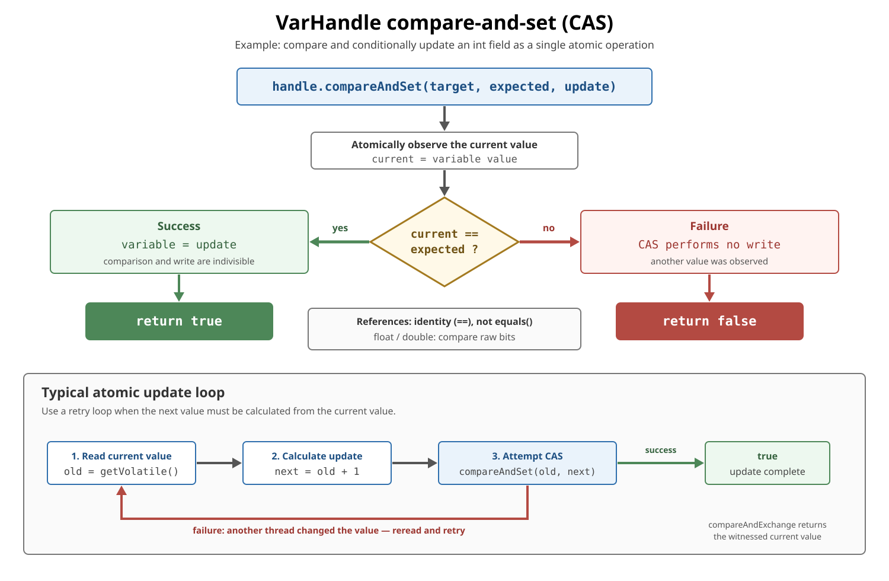

# Concurrency. VarHandle

## Front

What is a `VarHandle`, how do its memory-ordering modes differ, and how does it support atomic updates such as compare-and-set?

## Back

**The VarHandle API** was introduced in **JDK 9** by JEP 193.

`VarHandle` should be used when you need **low-level, fine-grained control over memory access and atomic operations.**

It is mainly for:
* concurrent data structures
* lock-free algorithms
* high-performance libraries
* frameworks/runtime code
* places where volatile, AtomicInteger, or synchronized are too limited or too expensive

A `VarHandle` is an immutable, strongly typed handle to a variable—or a family of variables such as array elements. The handle identifies **what can be accessed**; each operation selects **how it is accessed**: plain, opaque, acquire/release, volatile, or atomic read-modify-write.

The two diagrams build the model: first choose the required ordering strength, then follow an atomic compare-and-set (CAS) decision and retry loop.

### Variable type and coordinates

Every handle has:

- one **variable type**: the type stored at the target; and
- zero or more **coordinate types**: the values needed to locate one target variable.

| Target | Variable type | Coordinates |
|---|---|---|
| Instance field `Counter.value` | `int` | `Counter` receiver |
| Static field | field type | none |
| `String[]` element | `String` | `String[]` and `int` index |

For an instance field, create the handle with an appropriately privileged `MethodHandles.Lookup`:

```java
import java.lang.invoke.MethodHandles;
import java.lang.invoke.VarHandle;

final class Counter {
    private int value;

    private static final VarHandle VALUE;

    static {
        try {
            VALUE = MethodHandles.lookup().findVarHandle(
                    Counter.class, "value", int.class);
        } catch (ReflectiveOperationException exception) {
            throw new ExceptionInInitializerError(exception);
        }
    }

    int getVolatile() {
        return (int) VALUE.getVolatile(this);
    }

    void setRelease(int next) {
        VALUE.setRelease(this, next);
    }

    boolean compareAndSet(int expected, int update) {
        return VALUE.compareAndSet(this, expected, update);
    }
}
```

`VALUE` has variable type `int` and coordinate type `Counter`. Thus `this` is the first argument to each access operation. Access checking happens when `findVarHandle()` creates the handle, so keep a handle private unless callers should receive that access capability.

An array-element handle uses the array and index as coordinates:

```java
VarHandle element =
        MethodHandles.arrayElementVarHandle(String[].class);

String[] values = new String[10];
element.setRelease(values, 3, "ready");
String value = (String) element.getAcquire(values, 3);
```

Array type, null, and bounds checks still apply. The handle-specific argument types are checked at invocation time because access methods are **signature-polymorphic**. Wrong coordinate or value types can cause `WrongMethodTypeException` or `ClassCastException`.

### Access modes choose the memory semantics

Read the top row from weaker to stronger ordering, then use the lower flow to see release/acquire publication.


| Mode | Main guarantee | Typical use |
|---|---|---|
| `get` / `set` | Ordinary non-volatile field semantics; no cross-thread ordering | Thread confinement or synchronization supplied elsewhere |
| `getOpaque` / `setOpaque` | Atomic access and a consistent order for the same variable, with minimal ordering of other accesses | Specialized polling or progress state |
| `getAcquire` / `setRelease` | Earlier producer accesses stay before the release; later consumer accesses stay after a matching acquire | One-way publication |
| `getVolatile` / `setVolatile` | Volatile semantics plus a total order among volatile operations | Strong, straightforward visibility and ordering |

Plain `get()` and `set()` are guaranteed bitwise atomic for references and primitive values up to 32 bits. Plain `long` or `double` access can have the same 32-bit-platform caveat as ordinary non-volatile field access. Other supported read/write modes provide atomic access for references and all primitive types.

#### Release/acquire publication

```java
import java.lang.invoke.MethodHandles;
import java.lang.invoke.VarHandle;

final class Publication {
    private int payload;
    private int ready;

    private static final VarHandle READY;

    static {
        try {
            READY = MethodHandles.lookup().findVarHandle(
                    Publication.class, "ready", int.class);
        } catch (ReflectiveOperationException exception) {
            throw new ExceptionInInitializerError(exception);
        }
    }

    void publish() {
        payload = 42;
        READY.setRelease(this, 1);
    }

    int consume() {
        if ((int) READY.getAcquire(this) != 1) {
            return -1;
        }
        return payload;
    }
}
```

If `getAcquire()` observes the `1` published by `setRelease()`, the producer's earlier `payload = 42` is ordered before the consumer's later read of `payload`.

The operation overrides the field declaration's ordering. `HANDLE.get(receiver)` is a plain access even if the field is declared `volatile`; `HANDLE.getVolatile(receiver)` has volatile semantics even when the field is not declared `volatile`. Mixing modes is valid only when the whole protocol remains correct.

### Compare-and-set is one atomic conditional update

The diagram first shows success versus failure, then the retry loop used when the new value depends on the current value.



`compareAndSet(target, expected, update)` atomically:

1. observes the target's current value;
2. compares it with `expected` using `==`;
3. writes `update` only if they match;
4. returns `true` on success or `false` on failure.

For references, `==` means reference identity, not `equals()`. `compareAndSet()` uses volatile read and write memory semantics.

Use a retry loop when another thread may change the value between the read and the attempted update:

```java
int incrementAndGet(Counter counter, VarHandle valueHandle) {
    int current;
    int next;

    do {
        current = (int) valueHandle.getVolatile(counter);
        next = current + 1;
    } while (!valueHandle.compareAndSet(counter, current, next));

    return next;
}
```

If the CAS fails, the loop rereads and recalculates instead of overwriting the winning thread's update.

For supported numeric types, the built-in atomic operation is shorter:

```java
int previous = (int) valueHandle.getAndAdd(counter, 1);
int updated = previous + 1;
```

`compareAndExchange()` performs the same conditional exchange but returns the value it actually witnessed, which can avoid a separate reread. Weak compare-and-set variants may fail spuriously even when the value appears to match, so they normally belong in retry loops with a deliberately selected ordering variant.

### Supported operations and fences

Not every handle supports every mode:

- a handle to a `final` field is read-only;
- numeric updates such as `getAndAdd()` require a supported numeric variable type;
- bitwise updates require a supported integral or boolean type;
- unsupported operations throw `UnsupportedOperationException`.

Check a mode when building generic low-level code:

```java
boolean supported = valueHandle.isAccessModeSupported(
        VarHandle.AccessMode.GET_AND_ADD);
```

Static methods such as `VarHandle.acquireFence()`, `releaseFence()`, and `fullFence()` constrain reordering without accessing a variable. They are advanced primitives; a correctly paired access mode is usually clearer because the synchronization point remains visible in the code.

### Choosing the right abstraction

| Need | Prefer |
|---|---|
| Simple visibility for one declared field | `volatile` |
| Convenient atomic counter or reference | `AtomicInteger`, `AtomicReference`, etc. |
| Ordered or atomic access to an existing field or array element | `VarHandle` |
| Several operations or fields protected as one invariant | `synchronized` or `Lock` |

`VarHandle` is useful in concurrent collections, queues, state machines, runtime libraries, and atomic array algorithms. It is a safe standard replacement for many on-heap `sun.misc.Unsafe` memory-access operations, but it is **not** a transaction over multiple variables. Prefer higher-level concurrency utilities in ordinary application code when they express the intent directly.

### Memory aid

**Handle = target type + coordinates.**

**Access mode = ordering and atomicity for this operation.**

**CAS = compare and conditionally replace one variable atomically.**

## Sources

- [JEP 193 — Variable Handles](https://openjdk.org/jeps/193)
- [Java SE 26 API — `VarHandle`](https://docs.oracle.com/en/java/javase/26/docs/api/java.base/java/lang/invoke/VarHandle.html)
- [Java SE 26 API — `MethodHandles.Lookup.findVarHandle()`](https://docs.oracle.com/en/java/javase/26/docs/api/java.base/java/lang/invoke/MethodHandles.Lookup.html#findVarHandle(java.lang.Class,java.lang.String,java.lang.Class))
- [Java SE 26 API — `MethodHandles.arrayElementVarHandle()`](https://docs.oracle.com/en/java/javase/26/docs/api/java.base/java/lang/invoke/MethodHandles.html#arrayElementVarHandle(java.lang.Class))
- [JEP 471 — Deprecate the Memory-Access Methods in `sun.misc.Unsafe` for Removal](https://openjdk.org/jeps/471)
