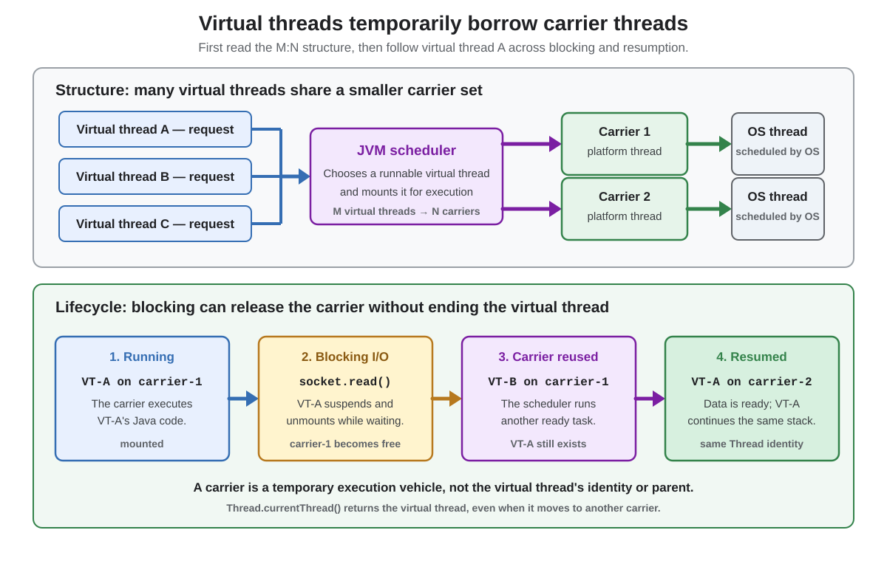
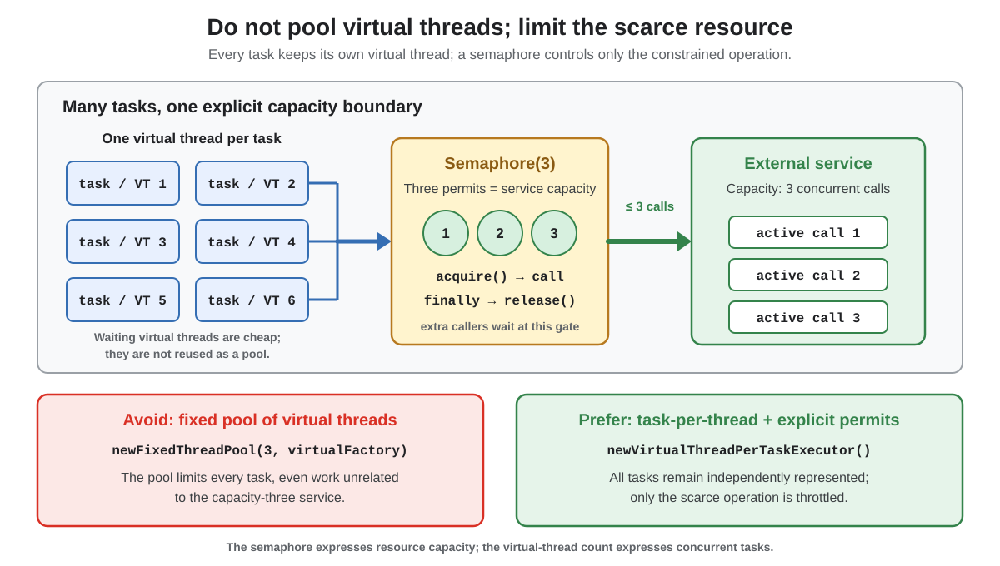
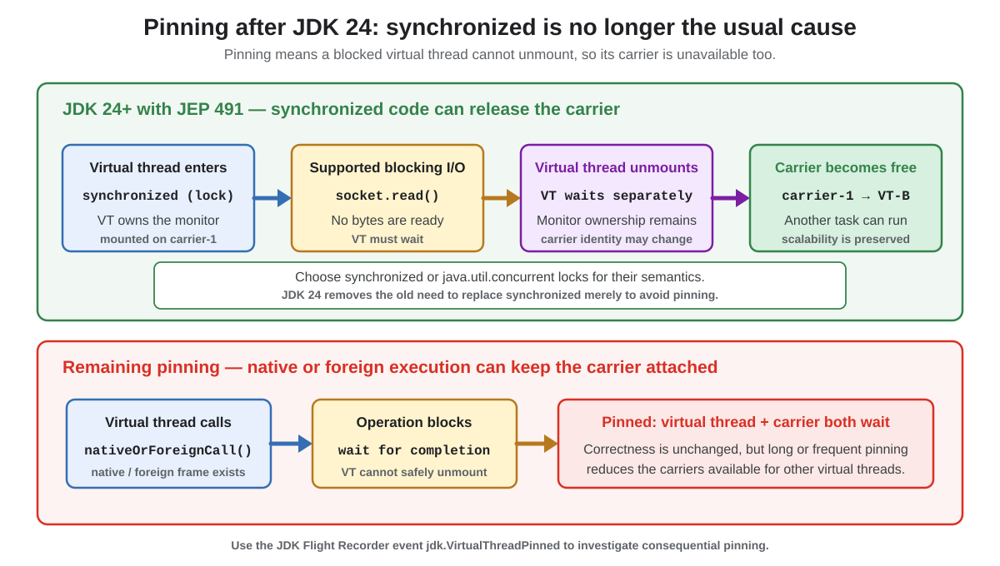

# Concurrency. Virtual Threads

## Front

What are virtual threads, how do mounting and pinning work, and when should they be used?

## Back

**Virtual threads** became final in **JDK 21** with JEP 444.

A virtual thread is a lightweight `java.lang.Thread` scheduled primarily by the Java runtime rather than permanently tied to one operating-system thread. Virtual threads let applications keep straightforward thread-per-task code while supporting many tasks that spend most of their time waiting. They improve **throughput under high blocking concurrency**, not the speed or latency of one task.

The diagrams build the practical model: how virtual threads borrow carriers, how to limit scarce resources without pooling virtual threads, and what pinning means since JDK 24.

### Virtual threads, carriers, and operating-system threads

The upper half shows the M:N structure; the lower half follows one virtual thread as it blocks and later resumes.



| Term | Meaning |
|---|---|
| **Virtual thread** | The task's `Thread` identity, call stack, local variables, interruption state, and thread-local state |
| **Carrier** | A platform thread temporarily executing a mounted virtual thread |
| **Platform thread** | A Java thread backed by an operating-system thread |
| **Mounted** | The virtual thread is currently using a carrier to execute code |
| **Unmounted** | The virtual thread is suspended without occupying its previous carrier |
| **Pinned** | The virtual thread is blocked but cannot unmount, so its carrier is blocked too |

A carrier is not the virtual thread's parent or identity. `Thread.currentThread()` returns the virtual `Thread`, not its current carrier. A virtual thread can unmount from one carrier and later resume on another while preserving the same stack and state.

Virtual-thread stacks are represented by resizable stack chunks in the Java heap rather than by one large, permanently reserved native stack. This is one reason many virtual threads can coexist.

### Mount, block, and resume

When a virtual thread is runnable, the JVM scheduler mounts it on a carrier. The operating system then schedules that carrier normally.

When the virtual thread invokes a supported blocking operation, such as blocking socket I/O or `BlockingQueue.take()`:

1. the virtual thread suspends and normally unmounts;
2. its carrier becomes available for another virtual thread;
3. when the operation can continue, the virtual thread becomes runnable again;
4. the scheduler mounts it, possibly on a different carrier.

Mounting and unmounting are transparent to ordinary application code. A carrier executes only one virtual thread at an instant, but it can execute many different virtual threads over time.

### Creating virtual threads

Start and join one directly, or submit tasks to an executor that creates a new virtual thread for each task:

```java
import java.util.concurrent.ExecutorService;
import java.util.concurrent.Executors;
import java.util.concurrent.Future;

final class VirtualThreadDemo {
    public static void main(String[] args) throws Exception {
        Thread one = Thread.startVirtualThread(() ->
                System.out.println(Thread.currentThread().isVirtual()));
        one.join();

        try (ExecutorService executor =
                     Executors.newVirtualThreadPerTaskExecutor()) {
            Future<String> result =
                    executor.submit(VirtualThreadDemo::loadData);
            System.out.println(result.get());
        }
    }

    private static String loadData() throws InterruptedException {
        Thread.sleep(50); // represents a blocking call
        return "loaded";
    }
}
```

`newVirtualThreadPerTaskExecutor()` does not maintain a small reusable virtual-thread pool. Every submitted task gets a new virtual thread. Closing the executor waits for its submitted tasks to terminate.

Use `Thread.ofVirtual().name("request-", 0).start(task)` when you need builder configuration such as useful thread names.

### Do not pool virtual threads

Virtual threads are meant to represent tasks. If a database, remote service, or other dependency has limited capacity, restrict access to **that resource**, not the total number of virtual threads.



```java
import java.util.concurrent.Semaphore;

final class LimitedServiceClient {
    private final Semaphore permits = new Semaphore(20);

    String call() throws InterruptedException {
        permits.acquire();
        try {
            return callRemoteService();
        } finally {
            permits.release();
        }
    }

    private String callRemoteService() {
        return "ok";
    }
}
```

Here, any number of independent tasks can exist, but at most 20 can be inside `callRemoteService()` simultaneously. Waiting for a semaphore permit can suspend a virtual thread without consuming a carrier.

### Where virtual threads help

| Workload | Fit | Reason |
|---|---|---|
| Many concurrent HTTP, database, socket, or queue waits | **Strong** | Carriers can run other tasks while virtual threads wait |
| Synchronous thread-per-request server code | **Strong** | Keeps readable blocking code while increasing concurrency |
| A few short tasks | **Small benefit** | Platform-thread scarcity was probably not the bottleneck |
| Long CPU-intensive tasks | **Usually little benefit** | Virtual threads do not add processor cores or make computation faster |
| Data-parallel computation | **Use a parallel algorithm or bounded CPU executor** | The problem is CPU parallelism, not cheap blocking |

Virtual threads improve scale when the application has enough waiting work to overlap. They do not automatically improve every application, and they do not turn asynchronous callback pipelines into faster code.

### Pinning since JDK 24

**JEP 491 changed the JVM in JDK 24 so virtual threads can unmount while holding, entering, or waiting on `synchronized` monitors.** Therefore, `synchronized` is no longer a routine reason to replace monitor-based code merely for virtual-thread scalability.



Pinning is a **scalability** concern, not a correctness failure. Short or rare pinning is usually unimportant; frequent long blocking while pinned can occupy many carriers and reduce throughput.

Remaining pinning can occur notably when a native method or foreign function is on the virtual thread's stack and the thread blocks. JDK Flight Recorder exposes the `jdk.VirtualThreadPinned` event for consequential cases. Diagnose measured pinning before rewriting synchronization.

### Important limits and misconceptions

- A virtual thread is still a real `Thread`: interruption, exceptions, stack traces, `ThreadLocal`, and ordinary synchronization rules still apply.
- Virtual threads do not remove data races. Shared mutable state still needs `volatile`, atomics, locks, confinement, or immutability as appropriate.
- Virtual threads support `ThreadLocal`, but per-thread caches can multiply memory use when there are thousands or millions of threads. Use thread-local state only when it is genuinely per task.
- Virtual threads are daemon threads and do not keep the JVM alive. Wait with `join()`, futures, or an executor lifecycle when completion matters.
- Do not depend on carrier identity or affinity. A virtual thread may resume on a different carrier.
- A virtual-thread-per-task executor creates threads for tasks; it does not express the capacity of a database or remote service. Use an explicit resource limit.

### Memory aid

**One task = one virtual thread.**

**A carrier is borrowed only while code runs.**

**Limit scarce resources explicitly; investigate long pinning; keep normal concurrency safety rules.**

## Sources

- [JEP 444 — Virtual Threads](https://openjdk.org/jeps/444)
- [Oracle Java SE 26 Guide — Virtual Threads](https://docs.oracle.com/en/java/javase/26/core/virtual-threads.html)
- [JEP 491 — Synchronize Virtual Threads without Pinning](https://openjdk.org/jeps/491)
- [Java SE 26 API — `Thread`](https://docs.oracle.com/en/java/javase/26/docs/api/java.base/java/lang/Thread.html)
- [Java SE 26 API — `Executors.newVirtualThreadPerTaskExecutor()`](https://docs.oracle.com/en/java/javase/26/docs/api/java.base/java/util/concurrent/Executors.html#newVirtualThreadPerTaskExecutor())
- [Java SE 26 API — `Semaphore`](https://docs.oracle.com/en/java/javase/26/docs/api/java.base/java/util/concurrent/Semaphore.html)
