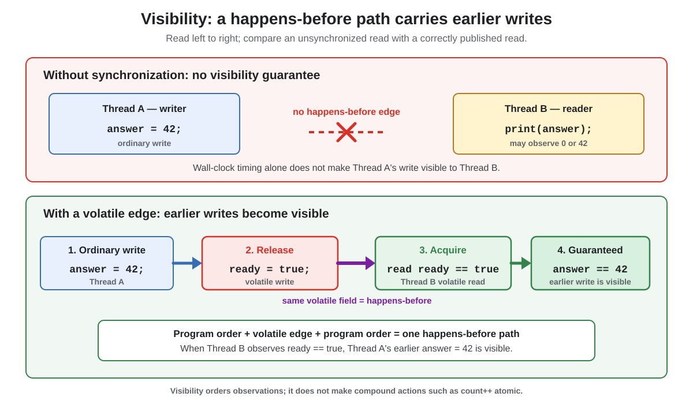

# Concurrency. Visibility

## Front

What does **visibility** mean in Java concurrency, and how is it guaranteed between threads?

## Back

**Visibility means that a write performed by one thread is guaranteed to be observable by another thread when the two actions are connected by a happens-before relationship.**



Read the diagram from left to right. In the upper case, wall-clock order is not enough: Thread B has no synchronization edge telling the Java Memory Model that it must observe Thread A's ordinary write. In the lower case, the volatile write and read form that edge.

### Safe publication example

```java
final class Result {
    private int answer;
    private volatile boolean ready;

    void publish() {
        answer = 42;   // ordinary write
        ready = true;  // volatile release write
    }

    int readIfReady() {
        if (!ready) {  // volatile acquire read
            return -1;
        }
        return answer;
    }
}
```

If `readIfReady()` observes `ready == true`, it must also observe the earlier `answer = 42`. This follows from one transitive path:

1. `answer = 42` happens-before `ready = true` through Thread A's program order.
2. The volatile write to `ready` happens-before the subsequent volatile read of the **same field**.
3. That read happens-before `return answer` through Thread B's program order.

Without such ordering, conflicting reads and writes form a **data race**. A reader may observe an older value; in a plain `while (!ready) {}` loop, it is not guaranteed to observe the update and terminate.

Common happens-before edges include:

- unlocking and then locking the same monitor;
- writing and then subsequently reading the same volatile field;
- calling `Thread.start()` before actions in the started thread;
- a thread's actions before another thread successfully returns from `join()` on it.

> Visibility is not atomicity. Making `count` volatile makes individual reads and writes visible, but `count++` is still a non-atomic read-modify-write sequence.

## Sources

- [Java Language Specification, §17.4 — Memory Model](https://docs.oracle.com/javase/specs/jls/se26/html/jls-17.html#jls-17.4)
- [Java Language Specification, §17.4.4–§17.4.5 — Synchronization and Happens-before Order](https://docs.oracle.com/javase/specs/jls/se26/html/jls-17.html#jls-17.4.4)
