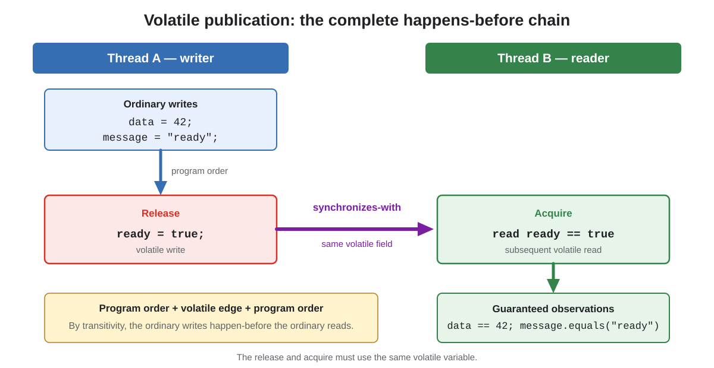
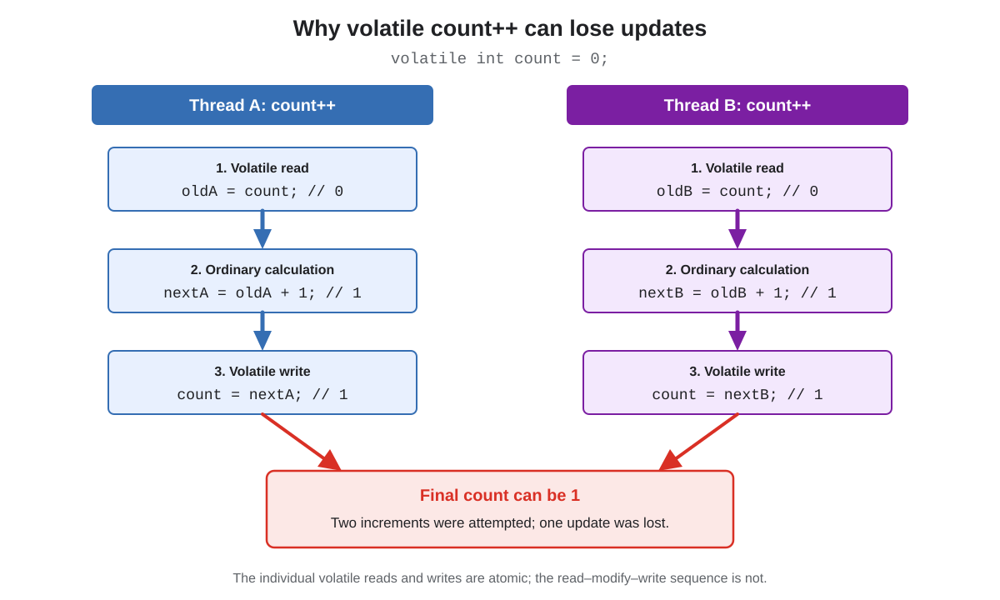

# Volatile in Modern Java

## Front

What does `volatile` mean in the Java Memory Model?

Explain its visibility, ordering, happens-before, and atomicity guarantees; its limitations; safe use cases; common mistakes; and how it differs from atomic classes and locking.

## Back

A `volatile` field is a shared variable whose reads and writes have special **visibility and ordering semantics** under the Java Memory Model (JMM).

```java
private volatile boolean ready;
```

The central rule is:

> A write to a volatile field happens-before every subsequent read of that same field.

In practical terms, `volatile` provides three important properties:

1. A thread repeatedly reading the field cannot indefinitely reuse a previously cached value as if no other thread could modify it.
2. A volatile write publishes earlier writes in that thread to a reader that subsequently reads the same volatile field.
3. Each individual volatile read or write is atomic, including volatile `long` and `double` reads and writes.

`volatile` does **not** provide mutual exclusion, and it does not make a compound operation such as `count++` atomic.

## The happens-before chain



```java
final class MessageBox {
    private int data;
    private String message;
    private volatile boolean ready;

    void publish() {
        data = 42;          // ordinary write
        message = "ready"; // ordinary write
        ready = true;       // volatile write: release
    }

    void consume() {
        if (ready) {        // volatile read: acquire
            System.out.println(data);    // guaranteed to see 42
            System.out.println(message); // guaranteed to see "ready"
        }
    }
}
```

If `consume()` observes `ready == true` from the publication, the complete chain is:

```text
data = 42; message = "ready"
        │
        │ program order
        ▼
volatile write: ready = true
        │
        │ synchronizes-with / happens-before
        ▼
volatile read: ready == true
        │
        │ program order
        ▼
read data and message
```

By transitivity, the ordinary writes before the volatile write happen-before the ordinary reads after the volatile read.

This is why one volatile flag can safely publish several ordinary fields written before it.

### The same volatile field is required

This does not establish the required edge:

```java
volatile boolean published;
volatile boolean observed;

// Thread A
data = 42;
published = true;

// Thread B
if (observed) {       // reads a different volatile field
    use(data);
}
```

The release and acquire must form a complete synchronization path. Merely accessing some unrelated volatile variable is not a substitute for reading the field used for publication.

## Release and acquire intuition

A volatile write acts as a **release**:

```text
ordinary operations before the volatile write
cannot be observably moved after that release
in a way that violates the JMM
```

A volatile read acts as an **acquire**:

```text
ordinary operations after the volatile read
cannot be observably moved before that acquire
in a way that violates the JMM
```

The JVM and CPU may still optimize and reorder instructions internally. The guarantee concerns legally observable behavior, not a literal execution sequence on every processor.

## Do not explain volatile as “always reading main memory”

The JMM does not define correctness in terms of every access physically travelling to RAM or every CPU cache being flushed.

Modern processors use caches and cache-coherence protocols, and JVMs use architecture-specific instructions and barriers. The portable statement is:

> Volatile accesses participate in the JMM synchronization order and create the specified visibility and ordering guarantees.

“Read directly from main memory every time” is an oversimplification and can be physically false while the program is still completely correct.

## Basic use case: a state or cancellation flag

```java
final class Worker implements Runnable {
    private volatile boolean shutdown;

    void shutdown() {
        shutdown = true;
    }

    @Override
    public void run() {
        while (!shutdown) {
            performOneUnitOfWork();
        }
    }
}
```

This works because:

- The shared state is represented by one field.
- Each operation is a simple read or write.
- No multi-field invariant must be protected.
- It is acceptable for the worker to observe one state and then the other.

However, real cancellation often needs interruption:

```java
workerThread.interrupt();
```

Interruption can wake a thread blocked in interruptible operations. A volatile flag by itself cannot wake a thread blocked in `sleep`, `wait`, queue operations, or I/O.

## Busy spinning and `Thread.onSpinWait()`

A short spin loop can use the runtime hint introduced in Java 9:

```java
while (!ready) {
    Thread.onSpinWait();
}
```

`Thread.onSpinWait()`:

- May allow the JVM or CPU to optimize a short busy-wait loop.
- Does not create visibility or happens-before by itself.
- Does not block, sleep, yield, or guarantee progress.
- Does not make a non-volatile condition safe.

Correctness still comes from `ready` being volatile or from another synchronization mechanism.

Busy spinning continuously consumes processor time. It is normally appropriate only when waits are expected to be extremely short and the design has been measured.

This remains true with virtual threads: volatile semantics are unchanged, but a virtual thread that spins instead of blocking consumes execution time on its carrier. Prefer `CountDownLatch`, queues, futures, locks, or other blocking coordination for ordinary waits.

## Safe publication through a volatile reference


```java
record Config(String host, int timeoutSeconds) {}

final class ConfigurationService {
    private volatile Config current =
            new Config("api.example.com", 30);

    Config current() {
        return current; // volatile read
    }

    void reload() {
        Config next = loadConfig(); // fully construct first
        current = next;             // volatile publication
    }
}
```

A reader that obtains `next` through the volatile read is guaranteed to see writes performed before the writer published that reference.

This pattern is especially useful with immutable objects:

```text
construct complete snapshot
        ↓
replace one volatile reference
        ↓
readers observe either the old snapshot or the new snapshot
```

The reference update is atomic, so a reader does not observe a reference that is half old and half new.

### Volatile reference does not mean volatile object

```java
final class MutableConfig {
    int timeoutSeconds;
}

private volatile MutableConfig current;
```

Only the field `current` has volatile semantics. The fields inside the referenced object do not automatically become volatile:

```java
MutableConfig config = current;
config.timeoutSeconds = 60; // ordinary write after publication
```

The volatile publication guarantees visibility of object state written **before** the volatile reference write. It does not automatically publish every later mutation of that object.

Use one of these designs for later changes:

- Replace the whole object with a new immutable snapshot.
- Make the relevant inner fields independently volatile when their invariants permit it.
- Protect mutations and reads with the same lock.
- Use an appropriate concurrent data structure.

## Volatile array reference does not make array elements volatile

```java
private volatile int[] values = new int[10];
```

Reads and writes of the `values` reference are volatile. Element accesses are ordinary array accesses:

```java
values[0] = 42; // not a volatile element write
int value = values[0]; // not a volatile element read
```

Use `AtomicIntegerArray`, a suitable `VarHandle`, locking, or immutable array replacement when element-level synchronization is required.

Immutable replacement can look like:

```java
void replaceFirst(int value) {
    int[] copy = values.clone();
    copy[0] = value;
    values = copy; // publishes the new snapshot
}
```

With multiple writers, the read-copy-write sequence itself may need locking or CAS to prevent lost updates.

## Atomicity: what volatile does and does not guarantee

An individual volatile access is atomic:

```java
volatile long timestamp;

timestamp = newValue; // one atomic volatile write
long copy = timestamp; // one atomic volatile read
```

This includes volatile `long` and `double`. The JLS permits non-volatile `long` or `double` reads and writes to be non-atomic, although modern JVM implementations commonly make them atomic in practice. Use the language guarantee, not platform assumptions.

An operation composed of several accesses is not automatically atomic.

## Lost update with `volatile count++`



```java
private volatile int count;

void increment() {
    count++; // not atomic
}
```

`count++` means:

```java
int oldValue = count;      // volatile read
int newValue = oldValue + 1;
count = newValue;          // volatile write
```

Two threads can interleave:

```text
Thread A reads 0
Thread B reads 0
Thread A writes 1
Thread B writes 1

Final value: 1, although two increments occurred
```

Each read and write is valid and visible. The problem is that the complete read-modify-write sequence is not indivisible.

Use an atomic operation:

```java
private final AtomicInteger count = new AtomicInteger();

void increment() {
    count.incrementAndGet();
}
```

Or protect the compound operation with a lock:

```java
private int count;

synchronized void increment() {
    count++;
}
```

For high-contention statistics where an instantaneous atomic total is not required, `LongAdder` may scale better than one `AtomicLong`.

## Other non-atomic volatile patterns

### Check-then-act

```java
private volatile boolean initialized;

void initialize() {
    if (!initialized) {
        initializeResource();
        initialized = true;
    }
}
```

Two threads can both observe `false` and both initialize the resource.

Use locking, a holder-based initialization pattern, a future, or another one-time-initialization mechanism.

### Read-modify-write assignment

```java
private volatile int flags;

flags |= READY; // read + OR + write; not atomic
```

Use an atomic update or a lock when several writers can modify the field.

### Update based on the current reference

```java
private volatile Config config;

config = config.withTimeout(60); // read + derive + write
```

Two writers can both derive from the same old configuration and overwrite one another. Use `AtomicReference.updateAndGet(...)` or a lock when concurrent writers must merge changes.

## Volatile does not protect multi-field invariants

```java
private volatile int lower;
private volatile int upper;
```

Suppose the invariant is:

```text
lower <= upper
```

Even though both fields are volatile, a reader can observe values from different logical updates:

```java
void updateRange(int newLower, int newUpper) {
    lower = newLower;
    upper = newUpper;
}
```

There is no atomic transaction covering both assignments.

Prefer one immutable snapshot:

```java
record Range(int lower, int upper) {
    Range {
        if (lower > upper) {
            throw new IllegalArgumentException();
        }
    }
}

private volatile Range range = new Range(0, 100);

void updateRange(int lower, int upper) {
    range = new Range(lower, upper);
}
```

One volatile reference then represents the complete invariant. If updates depend on the old range and several writers can race, the update still needs CAS or locking.

## Double-checked locking

Correct double-checked locking requires a volatile reference:

```java
final class ServiceProvider {
    private static volatile Service instance;

    static Service instance() {
        Service result = instance;

        if (result == null) {
            synchronized (ServiceProvider.class) {
                result = instance;

                if (result == null) {
                    result = new Service();
                    instance = result;
                }
            }
        }

        return result;
    }
}
```

The volatile write prevents publication from being observed without the constructor's preceding effects, and the volatile read acquires those effects.

The local variable `result` avoids unnecessary repeated volatile reads on the initialized path.

For simple lazy singletons, the initialization-on-demand holder idiom is usually easier to verify:

```java
final class ServiceProvider {
    private ServiceProvider() {}

    private static class Holder {
        static final Service INSTANCE = new Service();
    }

    static Service instance() {
        return Holder.INSTANCE;
    }
}
```

Class initialization provides the required synchronization without handwritten double-checked locking.

## Declaring volatile fields

`volatile` applies to fields:

```java
private volatile boolean active;       // instance field
private static volatile Config config; // static field
```

It cannot be applied to a local variable or method parameter:

```java
void method() {
    // volatile boolean local; // does not compile
}
```

A field cannot be both `final` and `volatile`:

```java
// private final volatile int value; // does not compile
```

`final` describes a field assigned during initialization and not reassigned afterward. `volatile` exists for a field that may be updated and observed across threads.

## Volatile versus atomic classes versus locking

| Mechanism | Visibility/order | Atomic read-write | Atomic compound update | Mutual exclusion | Multi-field invariant |
|---|---:|---:|---:|---:|---:|
| Plain `volatile` field | Yes | Yes | No | No | No |
| `AtomicInteger` / `AtomicReference` | Yes | Yes | Yes, through CAS/RMW methods | No | Normally one variable |
| `synchronized` | Yes | Yes inside critical section | Yes inside critical section | Yes | Yes |
| `Lock` | Yes | Yes inside critical section | Yes inside critical section | Yes | Yes |
| Immutable snapshot via volatile reference | Yes | Atomic reference replacement | Only replacement itself | No | Yes within one snapshot |

Choose `volatile` when all of these are true:

```text
state can be represented by one independently updated value
operations are simple reads or writes
no compound check-then-act is required
no mutual exclusion is required
```

Choose an atomic class when one variable needs operations such as:

```java
incrementAndGet();
compareAndSet(expected, update);
updateAndGet(function);
getAndSet(value);
```

Choose `synchronized` or `Lock` when:

- Several actions must be indivisible.
- Several fields form one invariant.
- A critical section contains a larger state transition.
- Mutual exclusion is required.
- Waiting and signalling must be coordinated.

## VarHandle and modern low-level access modes

`VarHandle` exposes several memory-ordering modes, including plain, opaque, acquire/release, and volatile access:

```java
VALUE_HANDLE.getVolatile(target);
VALUE_HANDLE.setVolatile(target, value);
```

Atomic classes are implemented in terms of corresponding `VarHandle` memory effects and provide convenient operations for ordinary application code.

Use `VarHandle` when building low-level libraries or data structures that require carefully chosen access modes. For a normal field with full volatile semantics, the `volatile` keyword is clearer and less error-prone.

## Performance considerations

- Volatile access can be more expensive than plain field access because it constrains optimization and requires memory-ordering effects.
- It is often cheaper than acquiring a contended lock, but there is no universal performance ranking.
- Frequent writes to a volatile field shared across cores can cause cache-coherence traffic.
- Unrelated frequently written fields that share a cache line can suffer from false sharing.
- A busy loop over a volatile field can consume an entire processor core.

Choose the construct that makes the concurrency protocol correct and understandable, then measure if performance matters.

## What volatile does not guarantee

`volatile` does not guarantee:

- Mutual exclusion.
- Atomicity of compound operations.
- Fairness between threads.
- That a thread will be scheduled promptly.
- That a waiting thread will block without consuming CPU.
- Atomic consistency across several fields.
- Thread safety of an object merely because its reference is volatile.
- Atomic updates to elements merely because an array reference is volatile.
- Safe iteration over an ordinary mutable collection.
- Protection from logical races such as check-then-act.

## Common misconceptions

### “Volatile makes the variable thread-safe”

Only simple reads and writes receive the volatile guarantees. Whether the surrounding algorithm is thread-safe depends on its complete state transition and invariants.

### “Volatile makes `count++` atomic”

No. The separate read, calculation, and write can interleave with another thread.

### “Volatile is a lightweight lock”

Volatile accesses have release/acquire memory effects similar to monitor exit/entry, but they do not lock, exclude another thread, or create a critical section.

### “Volatile flushes every variable to main memory”

Use JMM visibility and happens-before terminology. Physical cache behavior is platform-specific.

### “A volatile reference makes all object fields volatile”

No. It can safely publish state written before the reference write, but later inner-field mutations need their own concurrency policy.

### “Two volatile fields form one atomic state”

No. Each field is accessed separately. Use one immutable snapshot reference or a lock for a multi-field invariant.

### “Thread.onSpinWait() fixes a non-volatile loop”

No. It is only a performance hint for an already correct spin loop.

### “Volatile guarantees that another thread eventually runs”

No. Volatile provides memory-ordering guarantees, not scheduling, fairness, or liveness guarantees.

## Interview summary

> A volatile write happens-before every subsequent read of the same volatile field. The write acts as a release and the read as an acquire, so ordinary writes before publication become visible to ordinary reads after acquisition through transitivity. Individual volatile reads and writes are atomic, including `long` and `double`, but compound operations such as `count++`, check-then-act, and multi-field updates are not. Volatile provides no mutual exclusion. It is appropriate for independent flags, simple state, and immutable snapshot publication; use atomic classes for CAS/read-modify-write operations and locks for compound transitions or multi-field invariants. A volatile reference does not make the referenced object's later mutations or array elements volatile.

## Official references

- [JLS §8.3.1.4 — Volatile Fields](https://docs.oracle.com/javase/specs/jls/se26/html/jls-8.html#jls-8.3.1.4)
- [JLS §17.4.5 — Happens-before Order](https://docs.oracle.com/javase/specs/jls/se26/html/jls-17.html#jls-17.4.5)
- [JLS §17.7 — Non-Atomic Treatment of `double` and `long`](https://docs.oracle.com/javase/specs/jls/se26/html/jls-17.html#jls-17.7)
- [Java SE 26 `java.util.concurrent` memory-consistency properties](https://docs.oracle.com/en/java/javase/26/docs/api/java.base/java/util/concurrent/package-summary.html#MemoryVisibility)
- [Java SE 26 `java.util.concurrent.atomic` package](https://docs.oracle.com/en/java/javase/26/docs/api/java.base/java/util/concurrent/atomic/package-summary.html)
- [Java SE 26 `Thread.onSpinWait()`](https://docs.oracle.com/en/java/javase/26/docs/api/java.base/java/lang/Thread.html#onSpinWait())
- [Java SE 26 `VarHandle` API](https://docs.oracle.com/en/java/javase/26/docs/api/java.base/java/lang/invoke/VarHandle.html)
