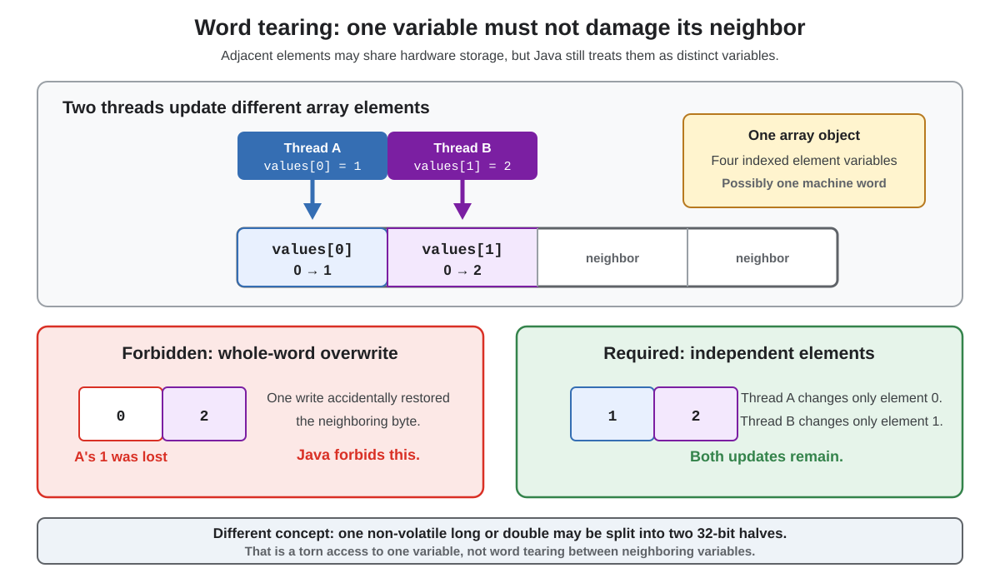

# Concurrency. Word Tearing

## Front

What is **word tearing**, and why are adjacent Java array elements protected from it?

## Back

**Word tearing means that writing one variable accidentally changes a different, nearby variable; Java forbids it.** Every field and every array element is distinct, even when adjacent values share one hardware machine word.



### Why the array matters

`byte[] values = new byte[2]` creates one array object, while `values` holds a reference to it. Inside that object, `values[0]` and `values[1]` are separate **array-component variables** selected by their indexes. They are not two pieces of one Java variable. The JVM may represent adjacent bytes inside the same hardware word, but that cannot change their independence in the language.

Some processors cannot update a single byte directly. A naive implementation might read a whole word, modify one byte, then write the whole word back. With two concurrent writers, that could restore an old value in a neighboring byte. A Java Virtual Machine (JVM) must use another strategy so this interference cannot happen.

### Example

```java
byte[] values = new byte[2];

// Thread A writes one variable
values[0] = 1;

// Thread B writes a different variable
values[1] = 2;
```

Assuming both threads share this array reference, the writes can run concurrently. They are not conflicting accesses to the same variable because each index selects a different component. `values[0] = 1` must not overwrite `values[1]`, or vice versa.

This is only **isolation between distinct variables**. It does not make concurrent operations on the same element safe: `values[0]++`, for example, is still a non-atomic read–modify–write operation.

### Do not confuse two kinds of tearing

JLS §17.7 separately permits an implementation to treat a non-`volatile` `long` or `double` write as two 32-bit writes. A racing read may then combine halves from different writes. That concerns **one 64-bit variable**, not neighboring variables. Reads and writes of `volatile long` and `volatile double` are always atomic, but `value++` is still compound and requires synchronization or an atomic class when threads share it.

> **Memory aid:** word tearing damages a neighbor; a torn 64-bit access mixes halves of the same value.

## Sources

- [JLS 17.6: Word Tearing](https://docs.oracle.com/javase/specs/jls/se25/html/jls-17.html#jls-17.6)
- [JLS 17.7: Non-Atomic Treatment of `double` and `long`](https://docs.oracle.com/javase/specs/jls/se25/html/jls-17.html#jls-17.7)
- [JLS 4.12.3: Kinds of Variables](https://docs.oracle.com/javase/specs/jls/se25/html/jls-4.html#jls-4.12.3)
- [JLS 17.4.1: Shared Variables](https://docs.oracle.com/javase/specs/jls/se25/html/jls-17.html#jls-17.4.1)
