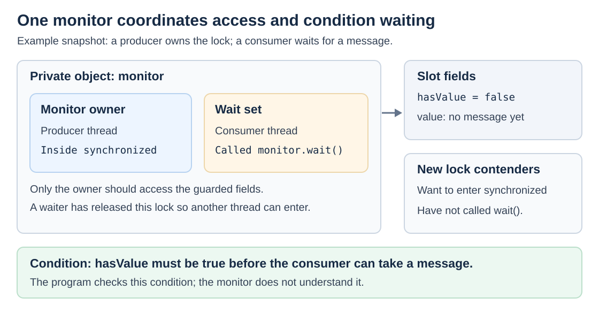
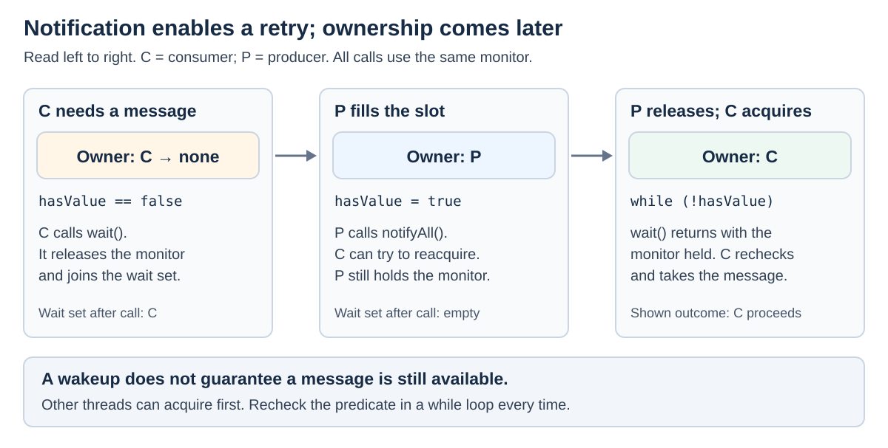
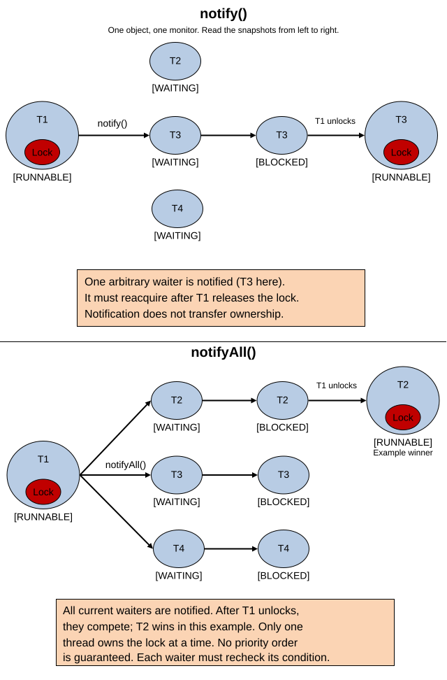

# Concurrency. wait(), notify() and notifyAll()

<sub>[Back to Java](../Readme.md#content)</sub>

* **`wait()` lets a thread release an object's monitor and wait for a condition to change.**
* **`notify()` and `notifyAll()` let waiting threads try again; they do not transfer the lock or make the condition true.**

These are final instance methods of `Object`. Use them together with `synchronized` and a condition stored in shared state. This article builds that model, compares one and all notifications, and develops a complete producer–consumer example. It then explains memory visibility, timeouts, interruption, thread states, and higher-level alternatives. API details and implementation notes use Java SE 25 / OpenJDK 25 as an explicit baseline; the example was compiled and run on JDK 25.

## One object, one monitor, one wait set

A **monitor** provides the intrinsic lock used by `synchronized`. Only one thread can own that lock at a time. An object's **wait set** contains threads that called `wait()` on it and have not yet been awakened.

A **condition**, or predicate, is an expression your program checks, such as `hasValue`. The monitor does not know what that expression means. Your code must protect the relevant fields and check whether it can proceed.

In the diagram, `monitor` is a private object used to coordinate access to a message slot. The fields belong to the slot; the program chooses to guard them with this object's lock. Waiting for ownership and waiting in the wait set are different situations.



The same object must connect the whole protocol: `synchronized (monitor)`, `monitor.wait()`, and `monitor.notifyAll()`. Owning some other object's lock is insufficient and causes `IllegalMonitorStateException` when calling these methods.

An instance `synchronized` method locks `this`, so an unqualified `wait()` inside it waits on `this`. A static synchronized method locks the declaring class's `Class` object.

## What the three methods do

| Call while owning the object's monitor | Effect | Releases ownership? |
| --- | --- | --- |
| `monitor.wait()` | Suspends the caller in this object's wait set; reacquires the monitor before returning | Yes, while waiting |
| `monitor.notify()` | Selects one arbitrary thread from this object's current wait set, if any | No |
| `monitor.notifyAll()` | Awakens all threads in this object's current wait set | No |

`wait()` releases **only the target object's monitor**. Locks held on other objects remain held. If the caller acquired the same monitor repeatedly through nested synchronized calls, waiting releases its full ownership of that monitor and restores the nesting count before resuming.

The following snapshots show a consumer waiting for a message. The producer fills the slot and notifies while still inside its synchronized block. Only after the producer releases ownership can the consumer reacquire it and recheck the condition.



If the producer spends another ten seconds holding the monitor after notification, the consumer cannot return from `wait()` during those ten seconds. Exiting the synchronized block normally or exceptionally releases that block's lock acquisition; with nested acquisitions, ownership must be fully released.

## The condition is the source of truth

A **guarded block** performs an action only when its condition permits it. Its waiting side uses a `while` loop. These are method-body excerpts; `ready`, `monitor`, and `useResult()` are supplied by the surrounding class, and the waiting method declares `throws InterruptedException`.

```java
synchronized (monitor) {
    while (!ready) {
        monitor.wait();
    }
    useResult(); // Still holding the monitor; ready was checked here.
}
```

The publishing side stores the result, changes the condition, and sends a notification under the same lock:

```java
synchronized (monitor) {
    // Store the result in fields guarded by monitor.
    ready = true;
    monitor.notifyAll();
}
```

Use `while`, because returning from `wait()` does not prove that `ready` is true:

- A **spurious wakeup** can occur without a notification, interruption, or timeout.
- Another thread can change the shared state before this thread reacquires the monitor.
- A notification may concern a different condition guarded by the same monitor.

For example, two consumers can wake for one message. The first removes it; the second must check again and wait. An `if` statement would let the second continue without another check.

### A notification is not stored for later

If nobody is waiting, `notify()` and `notifyAll()` do not save a signal. Calling `wait()` unconditionally afterward can leave a thread waiting indefinitely.

The flag or queued item preserves what happened. If a producer sets `ready = true` before the consumer starts, the consumer later sees that state under the lock and skips `wait()`. The notification is no longer needed.

Checking the condition and entering `wait()` under the same monitor prevents a gap in which the producer could acquire that monitor, change the state, and notify between those two operations. Checking outside the synchronized block breaks this reasoning.

## Choosing notify() or notifyAll()

Both calls leave the notifying thread in control of the monitor. The difference is how many waiters become eligible to reacquire it. There is no guarantee that the longest-waiting or highest-priority thread wins.

The diagram's bracketed labels are Java `Thread.State` values. `RUNNABLE` includes threads executing or awaiting processor time. Here, `WAITING` means suspended in an untimed `wait()`, and `BLOCKED` means waiting to acquire a monitor held by another thread.

Read each panel from left to right. T1 initially owns the monitor; T2, T3, and T4 are waiting on the same object. The top panel follows T3 as one possible selection by `notify()`; T2 and T4 remain in the wait set. The bottom panel shows all three competing after `notifyAll()`, with T2 acquiring the monitor in the illustrated outcome. Repeated thread names show successive states of the same thread, and a red `Lock` badge marks ownership. Reacquisition happens only after T1 releases the monitor.



`notify()` can be sufficient when any selected waiter can make the required progress and one wakeup is enough. For example, a single producer and single consumer can coordinate a one-slot buffer this way. Correctness must still follow from the whole protocol.

With several kinds of waiter, a single notification can select an unhelpful thread. Consider producers waiting for space and consumers waiting for data on one monitor. After a consumer empties the slot, `notify()` could select another consumer. That consumer checks the empty slot and waits again while a producer remains asleep. Without another useful notification, progress can stop.

For this mixed-condition protocol, use `notifyAll()` and let every awakened thread test its own predicate. This avoids depending on which kind of waiter is selected, at the cost of extra lock competition and repeated checks. It does not guarantee fairness or fix an incorrect predicate.

## Complete example: a slot holding one integer

`put()` waits for an empty slot; `take()` waits for a full one. Both methods guard `value` and `hasValue` with the same private monitor. Each successful operation changes the condition needed by the other side and calls `notifyAll()`.

The demo has one producer and one consumer, so `notify()` would suffice here. `IntSlot` deliberately uses `notifyAll()` because its two conditions share one wait set: the slot's waiting protocol remains correct if more producers or consumers are added. Each awakened thread still checks its own condition in a loop.

Save this complete program as `SlotDemo.java`:

```java
public class SlotDemo {
    static final class IntSlot {
        private final Object monitor = new Object();
        private int value;
        private boolean hasValue;

        public void put(int next) throws InterruptedException {
            synchronized (monitor) {
                while (hasValue) {
                    monitor.wait();
                }
                value = next;
                hasValue = true;
                monitor.notifyAll();
            }
        }

        public int take() throws InterruptedException {
            synchronized (monitor) {
                while (!hasValue) {
                    monitor.wait();
                }
                int result = value;
                hasValue = false;
                monitor.notifyAll();
                return result;
            }
        }
    }

    public static void main(String[] args) throws InterruptedException {
        IntSlot slot = new IntSlot();
        Thread consumer = new Thread(() -> {
            try {
                for (int i = 0; i < 3; i++) {
                    System.out.println(slot.take());
                }
            } catch (InterruptedException e) {
                Thread.currentThread().interrupt();
                // End this worker's task after cancellation.
            }
        }, "consumer");

        consumer.start();
        try {
            for (int value = 1; value <= 3; value++) {
                slot.put(value);
            }
            consumer.join();
        } finally {
            // Also stop a waiting consumer if main is interrupted.
            consumer.interrupt();
        }
    }
}
```

Compile and run:

```bash
javac SlotDemo.java
java SlotDemo
```

Without interruption, the output is:

```text
1
2
3
```

The consumer may start before or after the first `put()`. Either ordering works because `hasValue` records the slot's state. No timing delay is needed to make the threads coordinate.

The copy into `result` occurs while the lock is held. A subsequent producer can replace `value` without changing that local copy. Printing happens after `take()` returns and releases its synchronized block.

This teaching example has a fixed number of transfers. An application that accepts an unknown number of messages also needs a shutdown protocol, such as a closed flag checked by waiters. For ordinary producer–consumer code, a `BlockingQueue` already provides blocking `put()` and `take()` operations.

## Why the shared fields are visible

Releasing a monitor **happens-before** a later acquisition of that same monitor: writes before the release are visible after the acquisition. This is the visibility guarantee that makes the slot's fields work across threads.

`value` and `hasValue` do not need `volatile` in this example because all their accesses use the same monitor. A notification prompts another check; monitor release and reacquisition provide the relevant memory ordering. Marking a flag `volatile` alone would not combine condition checking, waiting, and consuming into this protected protocol.

## Timeouts, interruption, and thread states

| Wait form | Meaning |
| --- | --- |
| `wait()` or `wait(0)` | No time limit |
| `wait(millis)` with a positive argument | A timed wait, which can also end early for other wakeup reasons |
| `wait(millis, nanos)` | Accepts a nanosecond component in the range `0`–`999999`, but OpenJDK 25 rounds positive `nanos` up to an extra millisecond unless `millis == Long.MAX_VALUE`; both zero means no time limit |

For example, `wait(0, 500_000)` delegates to `wait(1)` in OpenJDK 25. The nanosecond argument does not provide sub-millisecond timeout precision.

Negative milliseconds or nanoseconds outside `0`–`999999` cause `IllegalArgumentException`. A timeout does not promise that the method returns at that instant: the thread must still regain the monitor and be scheduled. For an overall timeout, recompute the remaining duration in the condition loop; restarting the full duration after each wakeup can extend the total wait. Decide explicitly what to do when the time budget expires.

An interruption can cause `wait()` to throw `InterruptedException`. The monitor is held when that exception reaches the caller, and throwing it clears the thread's interrupted status. Methods such as `put()` and `take()` can propagate the exception. At a worker boundary that cannot propagate it, restoring the status and ending the task is a common cancellation policy, as shown above. An empty catch followed by continued work hides that request.

These Java thread states distinguish execution from different reasons for suspension:

| Situation | `Thread.State` |
| --- | --- |
| Executing in the Java virtual machine, possibly awaiting an operating-system resource such as processor time | `RUNNABLE` |
| In an untimed `Object.wait()` | `WAITING` |
| In a positive timed `Object.wait()` | `TIMED_WAITING` |
| Trying to acquire or reacquire a monitor that another thread holds | `BLOCKED` |

A notified waiter can therefore be `BLOCKED` before it continues. Waking all waiters does not let them execute the synchronized region simultaneously.

`Thread.sleep()` is different: it pauses the current thread without releasing monitor ownership. Sleeping inside the slot's synchronized block would prevent the other thread from entering that block to change the condition.

## Implementation detail and higher-level alternatives

In OpenJDK 25, the public `wait` overloads have Java bodies, and the implementation uses a private native `wait0(long)` method. Virtual machine (VM) support underlies the mechanism, but the placement of `native` is an implementation detail, not the rule an application should depend on.

Use these monitor methods to understand or maintain intrinsic-lock coordination. For a standard producer–consumer handoff, prefer a `BlockingQueue`. When a custom protocol needs separate waiting groups, a `ReentrantLock` can create multiple `Condition` objects: `await()` waits, while `signal()` and `signalAll()` notify the corresponding group. For example, separate `notEmpty` and `notFull` conditions let a buffer signal the relevant kind of waiter. Those conditions still need predicate loops.

# Sources

- Original study note: **Java (sorting) → wait(), notify() and notifyAll()**, local Anki note ID `1470247887577`, including its three syntax images. Used as the starting material; expanded and corrected against the sources below.
- [Diagram reference: NotifyVsNotifyAll.png, adapted with corrected lock-acquisition captions and Java thread-state names](https://i0.wp.com/vkd.pfs.mybluehost.me/website_6d0f205d//index.php/wp-content/uploads/2016/03/NotifyVsNotifyAll.png?w=1300)
- [Java SE 25 Object API: wait, notify, and notifyAll](https://docs.oracle.com/en/java/javase/25/docs/api/java.base/java/lang/Object.html#wait(long,int))
- [Java Language Specification 25, §17.1–17.4: Threads and Locks](https://docs.oracle.com/javase/specs/jls/se25/html/jls-17.html)
- [Oracle Java Tutorials: Guarded Blocks](https://docs.oracle.com/javase/tutorial/essential/concurrency/guardmeth.html)
- [Oracle Java Tutorials: Intrinsic Locks and Synchronization](https://docs.oracle.com/javase/tutorial/essential/concurrency/locksync.html)
- [Java SE 25 Thread.State API](https://docs.oracle.com/en/java/javase/25/docs/api/java.base/java/lang/Thread.State.html)
- [Java SE 25 Thread API](https://docs.oracle.com/en/java/javase/25/docs/api/java.base/java/lang/Thread.html#sleep(long))
- [Oracle Java Tutorials: Interrupts](https://docs.oracle.com/javase/tutorial/essential/concurrency/interrupt.html)
- [OpenJDK 25 Object.java source](https://github.com/openjdk/jdk/blob/jdk-25-ga/src/java.base/share/classes/java/lang/Object.java)
- [Java SE 25 Condition API](https://docs.oracle.com/en/java/javase/25/docs/api/java.base/java/util/concurrent/locks/Condition.html)
- [Java SE 25 BlockingQueue API](https://docs.oracle.com/en/java/javase/25/docs/api/java.base/java/util/concurrent/BlockingQueue.html)
