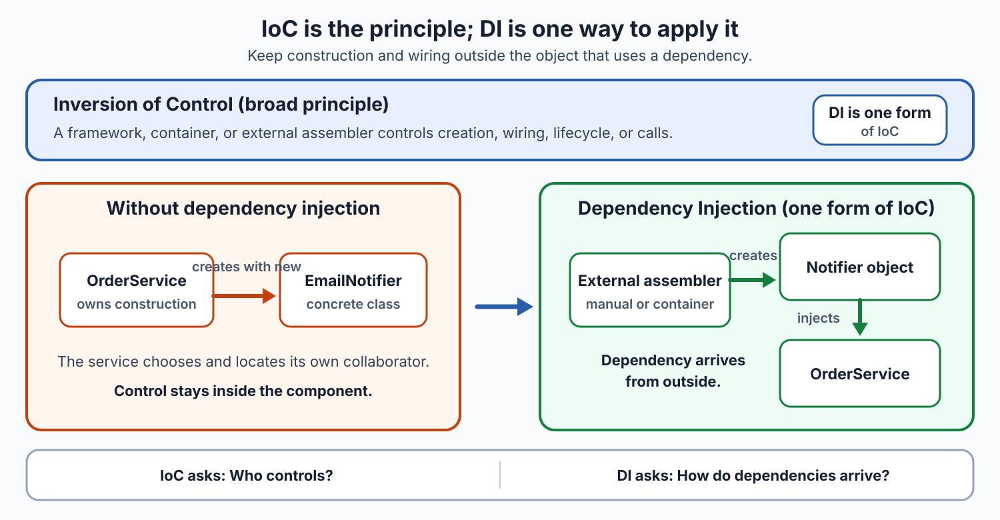

# Dependency Injection vs. Inversion of Control

## Front

What is the difference between **Inversion of Control (IoC)** and **Dependency Injection (DI)**?

## Back

**IoC is a broad design principle.**

**DI is a specific way to apply it to object dependencies.**



| Concept | Meaning | Memory question |
|---|---|---|
| **IoC** | Control that used to belong to application code moves to a framework, container, or external assembler. This may include object creation, wiring, lifecycle, or when code is called. | **Who controls?** |
| **DI** | An object declares the collaborators it needs; something outside supplies them instead of the object constructing or locating them. | **How do dependencies arrive?** |


DI is therefore **one form of IoC**, not a synonym for every kind of IoC. A framework calling your event handler is IoC even when no dependency is injected. DI can also be performed manually; a container is optional.

### Constructor injection in Java

```java
interface Notifier {
    void send(String message);
}

final class OrderService {
    private final Notifier notifier;

    OrderService(Notifier notifier) {
        this.notifier = notifier;
    }

    void placeOrder() {
        notifier.send("Order placed");
    }
}

final class App {
    static OrderService createService() {
        Notifier consoleNotifier = System.out::println;
        return new OrderService(consoleNotifier);
    }
}
```

`OrderService` declares a required dependency through its constructor. `App.createService()` is the external **composition root**: it chooses an implementation and injects it. This keeps the service unaware of the concrete notifier and makes another implementation easy to supply.

### Spring connection

Spring’s IoC container demonstrates both ideas: it controls bean creation and assembly (**IoC**) and supplies bean dependencies through constructors, factory-method arguments, or properties (**DI**).

> **Remember:** IoC says *control comes from outside*; DI says *dependencies come from outside*.

## Sources

- [Spring Framework — Introduction to the IoC Container and Beans](https://docs.spring.io/spring-framework/reference/core/beans/introduction.html)
- [Martin Fowler — Inversion of Control Containers and the Dependency Injection pattern](https://martinfowler.com/articles/injection.html)
