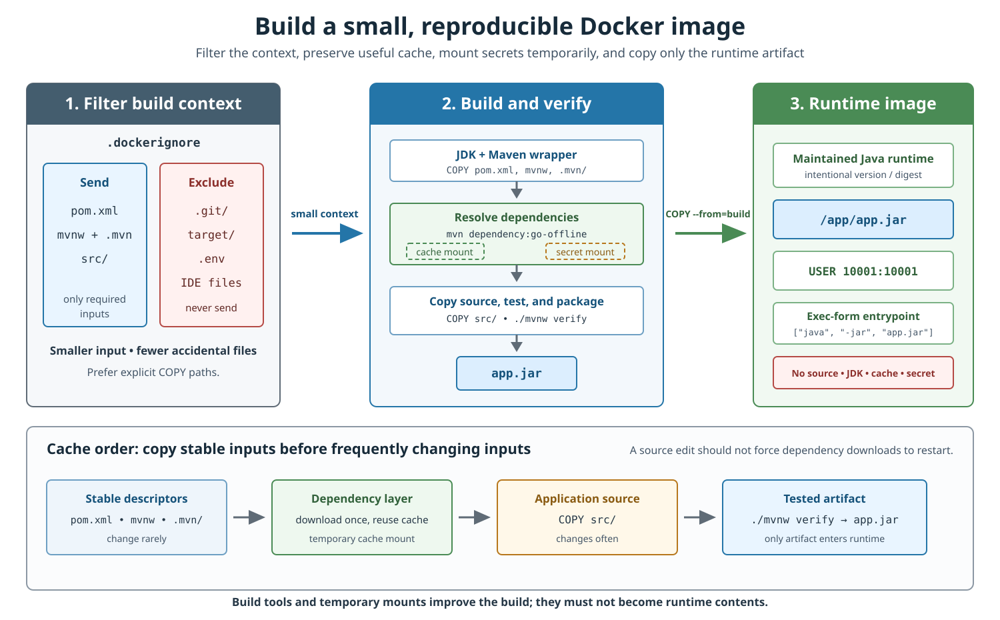
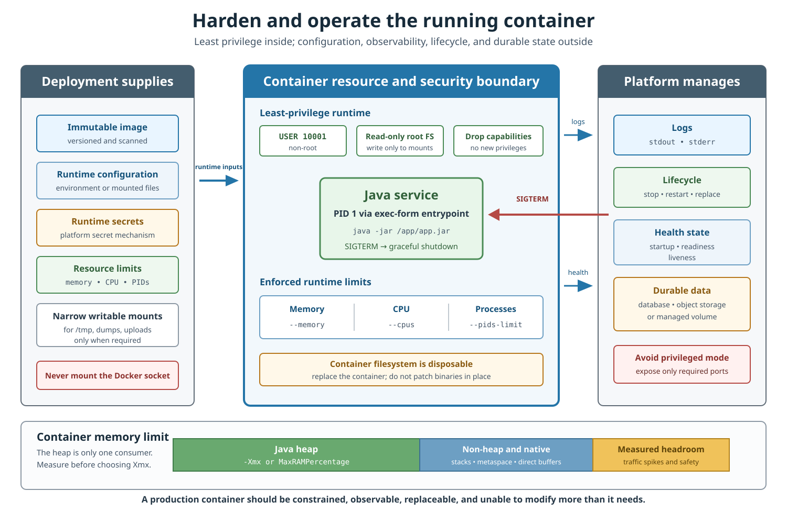

# Docker Best Practices for Java Applications

## Front

What practices make a Dockerized Java service secure, reproducible, fast to rebuild, correctly resource-sized, and safe to replace in production?

## Back

A production Java container should be **built from trusted, intentionally versioned inputs; contain only runtime necessities; run with least privilege and explicit limits; receive signals directly; keep secrets and durable state outside the image; and be rebuilt, tested, scanned, observed, and replaced rather than patched in place**.

The mental model has two contracts:

- **Build contract:** controlled inputs become an immutable, auditable image without leaking tools, caches, or secrets.
- **Runtime contract:** the platform supplies configuration and limits to a disposable process with the minimum required privileges.

Everything else in this card supports one of those contracts.

## Build a clean, repeatable image

The build should progressively narrow what enters the final image. A `.dockerignore` filters the input; a tool-rich build stage compiles and tests; a smaller runtime stage receives only the tested artifact.



Read the upper flow from left to right. The lower row explains cache order: stable dependency descriptors come before frequently changing source code, so editing one class does not force every dependency to download again.

### A production-oriented Maven Dockerfile

```dockerfile
# syntax=docker/dockerfile:1

# Build stage: JDK, Maven wrapper, source, tests, and temporary cache.
FROM eclipse-temurin:25-jdk AS build
WORKDIR /workspace

# Stable inputs first, so source edits can reuse the dependency layer.
COPY --chmod=0755 mvnw ./mvnw
COPY .mvn/ ./.mvn/
COPY pom.xml ./pom.xml

RUN --mount=type=cache,target=/root/.m2 \
    ./mvnw -B -DskipTests dependency:go-offline

COPY src/ ./src/

# Tests are part of the image-build gate.
RUN --mount=type=cache,target=/root/.m2 \
    ./mvnw -B verify

# Runtime stage: only the runtime and tested application artifact.
FROM eclipse-temurin:25-jre AS runtime

RUN groupadd --system --gid 10001 javaapp \
    && useradd --system --uid 10001 --gid 10001 \
       --home-dir /app --shell /usr/sbin/nologin javaapp

WORKDIR /app

COPY --from=build --chown=10001:10001 \
    /workspace/target/app.jar /app/app.jar

USER 10001:10001

# Documents the listening port; it does not publish the port.
EXPOSE 8080

# Exec form makes the JVM the container's main process.
ENTRYPOINT ["java", "-jar", "/app/app.jar"]
```

`app.jar` is an example artifact name. Make the real build produce a predictable name rather than relying on a wildcard that might copy the wrong file.

Java 25 is used as a current long-term-support example. Select the Java major version and operating-system variant from the application's explicit support policy. Do not change base family, libc, or architecture merely because another tag is smaller.

### Why multi-stage builds matter

The build stage legitimately needs a JDK, wrapper, source, tests, dependency cache, and perhaps private-repository credentials. The runtime stage normally needs only:

- a Java runtime;
- the application artifact;
- required certificates, time-zone data, fonts, or native libraries.

```text
tool-rich build stage ── copies tested artifact ──▶ minimal runtime stage
```

The final image should not contain Maven or Gradle, source files, test reports, downloaded build caches, private settings, or a compiler unless runtime behavior genuinely needs them.

### Choose a trusted and maintained base

- Prefer Docker Official Images, Verified Publisher images, or another approved source with traceable maintenance.
- Choose an explicit Java major and compatible OS variant; avoid `latest`.
- Rebuild regularly because an image is a snapshot of its base and packages at build time.
- Use `docker build --pull ...` when CI must check for a newer base image behind the selected tag.
- Scan the **final image**, not only application dependencies.

A smaller image often downloads faster and may contain fewer unnecessary packages, but size alone is not a security property. Provenance, timely maintenance, compatibility, and the packages actually present matter more.

### Tags, digests, and updates

Image tags are mutable. A build using the same tag months later can receive a different base image.

```dockerfile
FROM eclipse-temurin:25-jre@sha256:<approved-digest>
```

Digest pinning makes that input exact and auditable, but also freezes it. Pair pinning with automated update proposals, security scanning, and regular rebuilds. Otherwise, “reproducible” silently becomes “permanently vulnerable.”

### Keep the build context small

The **build context** is the set of files available to Docker's build. Filter it before the Dockerfile executes.

Example `.dockerignore`:

```text
.git
.idea
.vscode
target
build
*.iml
*.log
.env
compose*.yml
```

Do not send local artifacts, Git history, IDE files, or credentials when the build does not need them. Prefer explicit `COPY` instructions. `COPY . .` can make accidental inclusion and cache invalidation harder to see even when `.dockerignore` exists.

### Design layers for cache reuse

Docker can reuse an instruction only while the instruction and the inputs it depends on still match. Put inexpensive or frequently invalidated work later:

```text
wrapper + pom.xml
        ↓
resolve dependencies
        ↓
copy source
        ↓
test and package
```

BuildKit cache mounts persist downloaded artifacts between builds without copying that cache into the resulting image layer:

```dockerfile
RUN --mount=type=cache,target=/root/.m2 \
    ./mvnw -B verify
```

The cache is a performance optimization. The build must remain correct when the cache is empty.

### Never bake build secrets into layers

Build arguments and environment variables are inappropriate for passwords, tokens, private keys, or private Maven settings because image metadata, history, logs, or intermediate layers can expose them.

Use a BuildKit secret mount:

```dockerfile
RUN --mount=type=secret,id=maven_settings,\
target=/root/.m2/settings.xml,required=true \
    --mount=type=cache,target=/root/.m2 \
    ./mvnw -B verify
```

```bash
docker build \
  --secret id=maven_settings,src=/secure/path/settings.xml \
  -t example/orders:1.4.2 .
```

The secret is available to that build instruction but is not copied into the final layer. Avoid commands that print it. Runtime secrets are a separate concern and should come from the deployment platform when a container starts.

## Run with a narrow, observable contract

The image supplies application code. The deployment supplies configuration, secrets, writable mounts, resource limits, networking, and lifecycle. The container emits logs and health state, while durable data lives outside its disposable filesystem.



The centre box is the security and resource boundary. Connector arrows show what crosses it deliberately. The lower bar prevents a common Java mistake: the heap is only one part of total container memory.

### Run as a dedicated non-root user

Use a stable numeric user and group, and own only the required paths:

```dockerfile
USER 10001:10001
```

Do not make the whole filesystem world-writable to avoid a permissions problem. Give write access only to directories used for temporary files, uploads, heap dumps, Java Flight Recorder data, or generated output.

Where the environment supports it, add defense in depth:

```bash
--read-only
--tmpfs /tmp:rw,noexec,nosuid,size=64m
--cap-drop=ALL
--security-opt=no-new-privileges:true
```

Test this configuration: frameworks, certificate handling, font caches, crash logs, and native libraries may expect writable paths. Add a narrow mount or `tmpfs` for a demonstrated need rather than restoring broad write access.

Never use `--privileged` for a normal application service, and never mount the Docker daemon socket into it. Control of the socket is effectively control of the Docker host.

### Make the JVM receive lifecycle signals

Use exec-form `ENTRYPOINT` or `CMD`:

```dockerfile
ENTRYPOINT ["java", "-jar", "/app/app.jar"]
```

Shell form introduces a shell as the main process and can interfere with signal delivery:

```dockerfile
# Avoid for the main service process
ENTRYPOINT java -jar /app/app.jar
```

If a startup script is necessary, replace the script process with Java:

```sh
exec java -jar /app/app.jar
```

Then Docker's stop signal can reach the JVM directly. The application still needs graceful-shutdown behavior: stop taking new work, handle in-flight work, close consumers and pools, and flush telemetry before the platform's stop timeout expires.

If the service creates child processes, consider `docker run --init` or a suitable init process to reap orphaned children and zombies. “One concern per container” is a useful design rule; “exactly one operating-system process” is not an absolute requirement.

### Supply configuration and secrets at runtime

Use the same image in every environment. Change deployment configuration rather than rebuilding different binaries for development, test, and production.

- Non-sensitive configuration can come from environment variables or mounted configuration files.
- Secrets should come from the platform's secret mechanism, preferably as short-lived credentials or mounted files where appropriate.
- Do not place secrets in the Dockerfile, image labels, command history, `JAVA_TOOL_OPTIONS`, or committed `.env` files.
- Do not log resolved secrets, authorization headers, or tokens.

An environment variable is convenient but not magically secret. Choose the mechanism according to the deployment platform and threat model.

### Set and test resource limits

Docker containers have no CPU or memory constraints by default. Configure limits in Docker, Compose, Kubernetes, or the production scheduler:

```bash
docker run --rm \
  --memory=768m \
  --cpus=1.5 \
  --pids-limit=256 \
  example/orders:1.4.2
```

Choose values from load tests and production measurements. A low PID limit can prevent Java from creating required native threads. A CPU quota affects the processor count HotSpot uses for GC and common thread-pool ergonomics, so test under the same constraints used in production.

On Linux, current HotSpot container detection is enabled by default. Inspect what the JVM sees:

```bash
java -XshowSettings:system -XshowSettings:vm -version
```

For detailed container detection:

```bash
java -Xlog:os+container=trace -version
```

Use `-XX:ActiveProcessorCount` only for an intentional override. Prefer correcting inaccurate deployment limits rather than hiding them with a JVM flag.

### Leave memory outside the Java heap

The container limit must cover more than `-Xmx`:

```text
container memory
├── Java heap
├── metaspace and class metadata
├── JIT code cache
├── Java and native thread stacks
├── direct and mapped buffers
├── GC/JVM native structures
├── native libraries and agents
└── measured safety headroom
```

Therefore, do not set `-Xmx` equal to the container memory limit. Choose an explicit heap size or a percentage only after measuring non-heap and native usage:

```bash
-Xmx512m
```

or:

```bash
-XX:MaxRAMPercentage=65
```

`65` is an example, not a universal best value. Traffic, thread counts, direct buffers, agents, garbage collector, and framework behavior change the required headroom.

### Keep logs, health, and durable state outside

Write normal logs to `stdout` and errors to `stderr`. Docker logging drivers or the deployment platform can collect, rotate, retain, and forward them. Avoid unbounded application log files in the writable container layer.

Dockerfile `HEALTHCHECK` provides one container health status. Some orchestration platforms distinguish:

- **startup** — initialization is still legitimately in progress;
- **readiness** — the instance can receive traffic;
- **liveness** — the process is stuck and should be restarted.

Keep probes fast and bounded by timeouts. Liveness should not restart a healthy process merely because one downstream dependency is temporarily unavailable. Avoid installing a large shell or HTTP client only to probe an otherwise minimal image; an external platform probe may be a better fit.

Treat the container filesystem as temporary:

- store durable data in a database, object storage, or a managed volume;
- externalize session state when instances must be replaceable;
- mount only the paths that genuinely need persistence;
- replace the container to deploy or roll back; never download replacement application binaries into a running container.

`EXPOSE 8080` only documents the port. Publishing it is a runtime decision such as `-p 8080:8080`, and production exposure should be limited to required interfaces and networks.

## Java runtime image choices

### Maintained JRE image

A maintained JRE image is simple and broadly compatible. Choose a supported OS variant intentionally and rebuild it regularly.

### Custom `jlink` runtime

`jlink` can create a smaller runtime containing selected modules. It adds verification work: service providers, TLS, management, monitoring, reflection-heavy frameworks, unusual code paths, and optional features may need modules not obvious from a basic test.

Use it when size or attack-surface measurements justify the maintenance cost, not as a ritual.

### Alpine and native compatibility

Alpine-based Java images use `musl` rather than `glibc`. Test JNI/JNA libraries, DNS, fonts, locale handling, certificates, agents, performance, and diagnostic tooling before changing OS families for size alone.

For multi-platform images, run tests on every supported architecture. A successful ARM64 build does not prove that every embedded native library supports ARM64.

## Make the image auditable in CI

A production pipeline should:

- build and test the image on source changes;
- test the **final container image**, not only the JAR outside it;
- scan application dependencies, base packages, and the final image;
- attach or retain a Software Bill of Materials (SBOM) and provenance;
- identify the source revision with standard image metadata;
- publish immutable image digests;
- automate base-image and dependency update proposals;
- exercise replacement, rollback, signal handling, health behavior, and resource limits.

BuildKit can attach provenance and SBOM attestations to an image:

```bash
docker buildx build \
  --provenance=mode=max \
  --sbom=true \
  --push \
  -t registry.example.com/orders:1.4.2 .
```

Attestation support depends on the BuildKit driver and image store. Verify that the chosen registry and build pipeline preserve the attached metadata.

## Common anti-patterns

| Anti-pattern | Better approach |
|---|---|
| `FROM ...:latest` | Intentional version/variant, optionally pinned digest, with update automation |
| Build and run in one JDK image | Separate build and runtime stages |
| Send the complete repository | `.dockerignore` plus explicit `COPY` inputs |
| Copy source before dependency resolution | Stable descriptors first, source later |
| Secrets in `ARG`, `ENV`, or copied settings | BuildKit secret mounts and runtime secret mechanisms |
| Run as root | Dedicated numeric UID/GID |
| World-writable filesystem | Read-only root with narrow writable mounts |
| Shell-form Java entrypoint | JSON exec form or `exec` in a wrapper |
| No resource limits | Measured memory, CPU, and PID limits |
| `-Xmx` equals container memory | Leave measured non-heap/native headroom |
| Logs only in local files | `stdout`/`stderr` plus platform collection |
| Durable state only in writable layer | External durable storage or managed volumes |
| Install tools “just in case” | Minimal production image; separate diagnostic workflow |
| Mount `/var/run/docker.sock` | Keep Docker control outside the application container |
| Pin forever without rebuilding | Automated update, scan, rebuild, and redeploy cycle |

## Review checklist

```text
[ ] Trusted, intentionally versioned base images
[ ] Multi-stage build with only runtime necessities in the final stage
[ ] .dockerignore and explicit COPY paths
[ ] Stable dependency inputs copied before source
[ ] Tests gate the produced artifact
[ ] Cache mounts improve speed but are not required for correctness
[ ] No build or runtime secrets in image layers, metadata, or logs
[ ] Non-root numeric UID/GID
[ ] Read-only filesystem and dropped capabilities tested where practical
[ ] Exec-form entrypoint and graceful SIGTERM handling
[ ] CPU, memory, and PID limits tested under load
[ ] Heap leaves measured non-heap/native headroom
[ ] Logs use stdout/stderr
[ ] Health behavior is fast, bounded, and semantically correct
[ ] Durable state lives outside the disposable container layer
[ ] Final image scanned; SBOM/provenance retained
[ ] Base updates, replacement, and rollback are automated and tested
```

## Remember

> **Build with more tools than you ship; ship fewer privileges than Docker can grant; inject environment-specific data only when the container starts; and treat every running container as constrained, observable, and replaceable.**

## Sources

- [Docker Docs — Building best practices](https://docs.docker.com/build/building/best-practices/)
- [Docker Docs — Multi-stage builds](https://docs.docker.com/build/building/multi-stage/)
- [Docker Docs — Build secrets](https://docs.docker.com/build/building/secrets/)
- [Docker Docs — Optimize cache usage](https://docs.docker.com/build/cache/optimize/)
- [Docker Docs — Dockerfile reference](https://docs.docker.com/reference/dockerfile/)
- [Docker Docs — Resource constraints](https://docs.docker.com/engine/containers/resource_constraints/)
- [Docker Docs — Docker Engine security](https://docs.docker.com/engine/security/)
- [Docker Docs — Container logs](https://docs.docker.com/engine/logging/)
- [Docker Docs — Build attestations](https://docs.docker.com/build/metadata/attestations/)
- [Oracle JDK 26 — `java` launcher and container options](https://docs.oracle.com/en/java/javase/26/docs/specs/man/java.html)
- [Eclipse Temurin Docker Official Image](https://hub.docker.com/_/eclipse-temurin)
