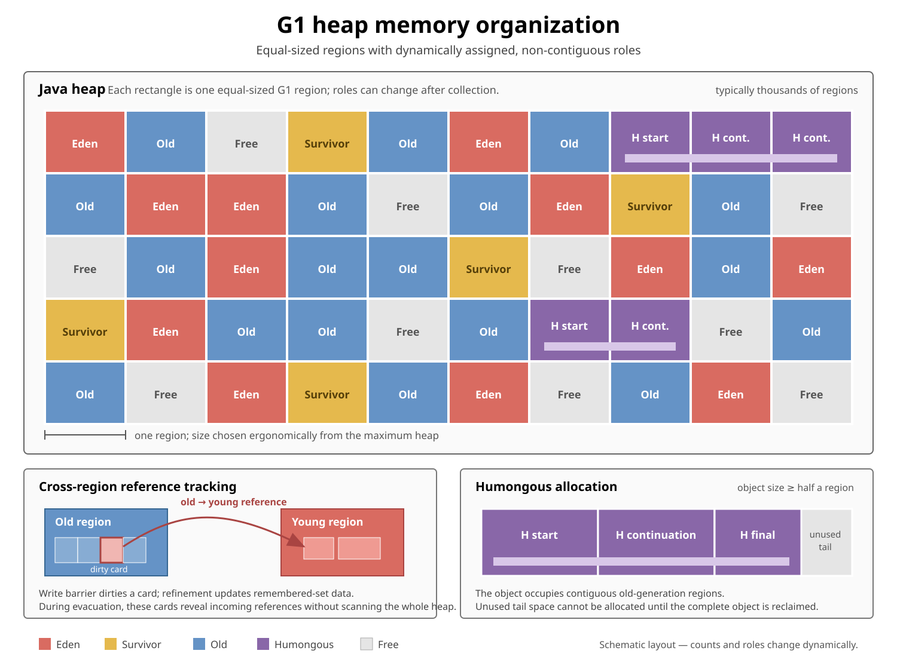
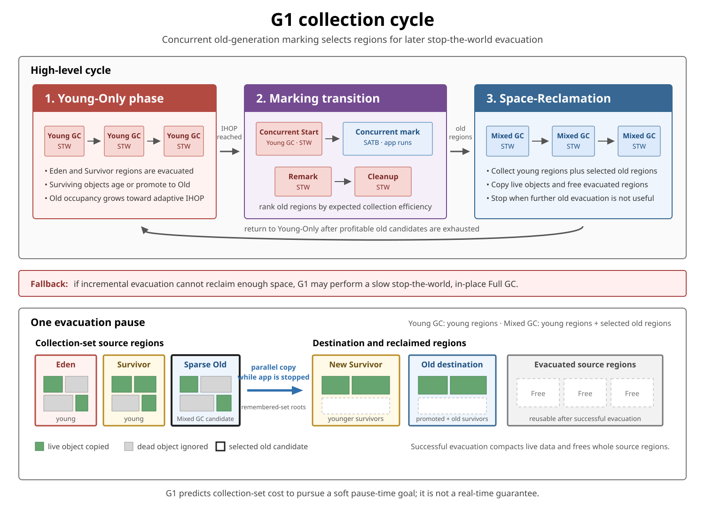

# GC. Garbage-First (G1)

## Front

How does the **Garbage-First (G1) garbage collector** organize the heap, reclaim young and old objects, and pursue a pause-time goal?

## Back

**Garbage-First (G1)** is HotSpot's region-based, **generational**, incremental, parallel, mostly concurrent, stop-the-world, evacuating collector. It divides the heap into equal-sized regions and reclaims selected regions by copying their live objects elsewhere. Regions with much garbage and relatively little live data are attractive old-generation candidates—hence “garbage first.”

G1 is designed to balance throughput and pause latency. It predicts the cost of a collection set and tries to keep each evacuation pause near a configurable **soft goal**. It is not a real-time collector and cannot guarantee a maximum pause.

In current HotSpot, G1 is normally the default collector. This card first explains the region layout, then evacuation and remembered sets, and finally the Young-Only → marking → Mixed collection cycle.

```bash
# Usually selected ergonomically
java -jar application.jar

# Select G1 explicitly
java -XX:+UseG1GC -jar application.jar
```

### Core vocabulary

| Term | Meaning |
|---|---|
| **Region** | One equal-sized, contiguous heap segment; the basic allocation and reclamation unit |
| **Young generation** | The current Eden and Survivor regions |
| **Old generation** | Old regions plus humongous-object regions |
| **Collection set** | Source regions G1 attempts to reclaim in one stop-the-world pause |
| **Evacuation** | Copying live objects out of collection-set regions into destination regions |
| **Remembered set** | Locations outside the collection set that may point into it |
| **Concurrent marking** | Finding old-generation liveness while application threads mostly continue running |
| **Mixed collection** | A pause that evacuates young regions plus selected old regions |

> **G1 is generational.** “Region-based” changes the physical layout; it does not remove the young/old generations.

## Heap organization

G1 splits the Java heap into many equal-sized regions. A region's role can change after collection, so Eden, Survivor, and Old are **logical sets of regions**, not three permanently contiguous memory areas.



Read the top grid as physical heap order. Its scattered colours show that regions belonging to the same generation need not be adjacent. The lower-left panel shows how a card records a cross-region reference; the lower-right panel shows why a humongous object needs contiguous regions.

### Region roles

At a particular moment, a region can be:

- **Free** — available for a new role.
- **Eden** — receives most new objects.
- **Survivor** — holds young objects that survived an evacuation.
- **Old** — holds promoted or long-lived objects.
- **Humongous start/continuation** — holds one unusually large object across contiguous regions.

Most objects are allocated in Eden, commonly through a thread-local allocation buffer. After a young collection, a live young object is copied to Survivor or promoted to Old. Dead objects are not copied.

```text
Free → Eden → Survivor → Old
          │         │       │
          └─────────┴───────┴── selected and evacuated → Free
```

That path is a mental model, not a mandatory journey. An object can be promoted directly to Old when it is old enough or Survivor space is insufficient.

### Region size

G1 normally chooses region size from the maximum heap size, targeting roughly 2,048 regions. In JDK 26, the ergonomic size is capped at 32 MB. An explicit `G1HeapRegionSize` must be a power of two from 1 MB through 512 MB:

```bash
java -XX:+UseG1GC -XX:G1HeapRegionSize=8m -jar application.jar
```

Leave this ergonomic unless measurements show a specific problem. Region size changes evacuation granularity, metadata trade-offs, and the threshold for humongous objects.

## Evacuation: how G1 reclaims space

A normal young or Mixed collection is a **stop-the-world, parallel evacuation pause**. Application threads stop while GC workers:

- find roots entering the collection set;
- copy live objects to Survivor or Old destination regions;
- update references to the copied objects;
- leave dead objects behind;
- turn completely evacuated source regions into Free regions.

```text
Before:  source region = [live][dead][live][dead]
                              │          │
Pause:                        └── copy ──┘

After:   destination = [live][live][free space]
         source region = Free
```

Copying packs live objects together, so evacuation compacts the collected portion of the heap. G1 does **not** normally relocate these objects while application threads run; this is an important difference from ZGC.

### Where surviving objects go

| Source object | Normal destination |
|---|---|
| Young and still below the aging threshold | Survivor region |
| Young and ready for promotion | Old region |
| Object from a selected Old region | Another Old region |
| Dead object | Not copied |

The pause cost grows with the live bytes to copy, roots and cards to scan, references to update, reference-processing work, and available parallel GC workers. A region full of garbage is cheap to evacuate; a region full of live, highly connected objects is expensive.

## Remembered sets and card barriers

Suppose an Old object points into an Eden region selected for evacuation:

```text
Old object ─────────▶ young object in collection set
```

G1 must update that Old reference if the young object moves, but scanning the complete old generation during every young collection would be too expensive.

G1 divides the heap logically into small **cards**—512 bytes by default. A post-write barrier marks the card containing a potentially relevant reference write. Concurrent refinement processes dirty-card information and helps build remembered-set data.

At collection time, remembered-set entries identify approximate locations outside the collection set that may contain incoming references. G1 scans those locations as heap roots instead of scanning the whole heap.

```text
external roots + code roots + remembered-set heap roots
                              ↓
                  trace the collection set
                              ↓
                    copy reachable objects
```

Remembered sets save scanning work but consume CPU and metadata. Many cross-region writes can increase refinement work and the `Merge Heap Roots` or `Scan Heap Roots` parts of a pause.

### Two write-barrier responsibilities

| Barrier responsibility | Observes | Purpose |
|---|---|---|
| **SATB pre-write marking barrier** | Old reference before overwrite | Preserves the beginning-of-marking reachability view |
| **Card/remembered-set post-write barrier** | Written location and new relationship | Records possible cross-region references for partial collection |

G1 needs both. They may both run around a reference update, but they solve different correctness problems.

## The G1 collection cycle

At the highest level, G1 alternates between a **Young-Only phase** and a **Space-Reclamation phase**. Concurrent marking forms the transition by discovering which Old regions contain reclaimable space.



The upper half is the time sequence. The lower half zooms into one evacuation pause: green live objects move to compact destinations, dead objects remain behind, and successfully evacuated source regions become Free.

### Young-Only phase

G1 performs Normal young collections. A normal young collection typically evacuates the entire current young generation:

```text
Normal Young GC → Normal Young GC → Normal Young GC → ...
```

Survivors age or promote, so Old occupancy gradually grows. These pauses are stop-the-world even though they use several GC worker threads in parallel.

### Adaptive IHOP and Concurrent Start

**Initiating Heap Occupancy Percent (IHOP)** is the Old occupancy threshold used to trigger the marking transition. Adaptive IHOP is enabled by default. G1 predicts when marking must begin from observed marking duration and the amount of Old allocation expected while marking runs.

The initial `InitiatingHeapOccupancyPercent` is 45% until G1 has enough observations for a better prediction. This is a starting input, not a fixed “collect Old at 45%” rule when Adaptive IHOP is active.

When the threshold is reached, G1 schedules a **Concurrent Start** young collection. This is still a stop-the-world young evacuation, but it also establishes the logical starting snapshot for marking. If G1 discovers that marking is unnecessary, it can perform a short Concurrent Mark Undo and remain in the Young-Only phase.

### Concurrent marking with SATB

After Concurrent Start, GC threads mark while application threads run. Normal young collections can still occur during this interval.

G1 uses **Snapshot-At-The-Beginning (SATB)** marking. Objects reachable at the logical start are treated as live for this marking cycle. A pre-write barrier preserves overwritten old references when necessary, preventing concurrent mutations from hiding part of that starting graph.

An object that becomes unreachable after the snapshot can remain conservatively live until the next marking cycle. This is **floating garbage**, not necessarily a memory leak.

### Remark, Cleanup, and Prepare Mixed

Marking ends with two special stop-the-world pauses:

- **Remark** completes marking, processes reference objects, performs class unloading when enabled, reclaims completely empty regions, and cleans marking structures.
- Between Remark and Cleanup, G1 calculates liveness and region connectivity used for candidate selection.
- **Cleanup** finalizes whether a Space-Reclamation phase should follow.

If reclaiming Old space is worthwhile, one **Prepare Mixed** young collection finishes the Young-Only phase and prepares G1 for Mixed collections.

### Space-Reclamation phase and Mixed collections

Each Mixed collection is a stop-the-world evacuation whose collection set contains:

```text
current young regions
+ selected Old candidate regions
= Mixed collection set
```

G1 prefers Old candidates with high expected **collection efficiency**: much reclaimable space, little live data to copy, lower connectivity, and a predicted cost that fits the pause budget.

Candidate selection includes mandatory regions for progress, additional candidates when predicted time remains, and optional candidates that can be attempted if the pause still has room. Successful pauses incrementally reclaim Old space without compacting the whole heap at once.

The Space-Reclamation phase ends after useful marking candidates are exhausted. G1 then returns to Young-Only collections.

## What is concurrent and what stops the application?

| Activity | Application threads |
|---|---|
| Normal Young GC | **Stopped** |
| Concurrent Start young collection | **Stopped** |
| Concurrent marking | Usually **running** alongside GC threads |
| Remark and Cleanup | **Stopped** |
| Prepare Mixed | **Stopped** |
| Mixed GC | **Stopped** |
| Full GC fallback | **Stopped** |

“Mostly concurrent” describes global marking. G1's normal space reclamation—copying live objects and updating their references—occurs in stop-the-world pauses.

## Why the name “Garbage-First”?

Concurrent marking estimates live bytes and connectivity for Old regions. G1 uses that information plus its pause-cost model to choose regions expected to return useful free space efficiently.

It does **not** simply choose the region with the greatest number of dead bytes. A sparse but highly connected region may cost more to collect than another candidate. G1 also must include young regions and mandatory Old candidates, so the final collection set is constrained by correctness and progress as well as profitability.

## Humongous objects

An object is **humongous** when its size is at least half of one G1 region:

```text
region size = 8 MB
humongous threshold = 4 MB
```

Humongous objects:

- are allocated directly into a contiguous sequence of Old-generation regions;
- begin at the start of the first region;
- leave the unused tail of the final region unavailable until the object is reclaimed;
- can trigger an early Concurrent Start check;
- are normally reclaimed after liveness analysis or opportunistically during a pause;
- are moved only in a very slow last-resort effort.

Frequent humongous allocation can increase fragmentation and heap pressure. Increasing region size raises the humongous threshold, but also makes each evacuation unit coarser. Change it only after confirming humongous objects are the actual problem.

## Pause-time goal

In JDK 26, the ergonomic G1 default is:

```bash
-XX:MaxGCPauseMillis=200
```

This is a **goal**, not a deadline. G1 uses measured costs to choose young-generation size and collection-set work.

| Lower pause goal | Higher pause goal |
|---|---|
| Usually smaller young generation | Usually larger young generation |
| More frequent pauses | Less frequent pauses |
| Less work permitted per pause | More work permitted per pause |
| Can reduce throughput | Can improve throughput but permit longer pauses |

G1 can miss the goal when mandatory work does not fit—for example, when much live data must be copied, remembered-set processing is large, objects are pinned, or the operating system does not schedule enough CPU time.

## Evacuation failure and Full GC

An **evacuation failure** means G1 could not move every required object from a selected region:

- **Allocation failure:** destination space was insufficient.
- **Pinned failure:** an object could not move safely, for example while native code uses a critical JNI array access.

The failed source region cannot immediately become Free. G1 makes failed regions high-priority candidates for later evacuation.

If incremental collections cannot free space, G1 can fall back to a stop-the-world **Full GC** that compacts the entire heap in place. Full GC is a slow recovery path to investigate, not a normal phase of the G1 cycle.

## Observe before tuning

A useful starting command is:

```bash
java \
  -XX:+UseG1GC \
  -Xmx8g \
  -Xlog:gc*,safepoint \
  -jar application.jar
```

For phase detail:

```bash
-Xlog:gc+phases=debug
```

Watch for:

- Young and Mixed pause duration;
- Eden, Survivor, Old, and Humongous region counts;
- `Merge Heap Roots`, `Scan Heap Roots`, and `Object Copy` time;
- promotion rate and Old occupancy;
- concurrent-marking duration;
- evacuation failures and Full GC;
- application latency percentiles and throughput.

Start with G1's ergonomic defaults. Set a realistic maximum heap and change the pause goal only when measurements justify it. Avoid fixing the young-generation size with options such as `-Xmn`: G1 uses young sizing as a primary pause-control mechanism, so a fixed young size can effectively disable that adaptation.

## Common misconceptions

- **“G1 is not generational because regions are mixed.”** False. Eden and Survivor regions form the young generation; Old and humongous regions form the old generation.
- **“Concurrent means pause-free.”** False. Marking is mostly concurrent, but evacuation is stop-the-world.
- **“One collection processes one region.”** False. A collection set normally contains many regions.
- **“Mixed GC means Full GC.”** False. Mixed GC selects young regions and only some Old regions; Full GC compacts the whole heap.
- **“`MaxGCPauseMillis` is a hard maximum.”** False. It is an input to a predictive policy.
- **“A 4 MB object is always humongous.”** False. The threshold is relative to the configured region size.
- **“Dead objects are copied and then deleted.”** False. Evacuation copies live objects; the remaining source region is reclaimed as a unit.

## Remember

```text
Equal-sized regions with changing roles
        ↓
Young evacuation copies live objects during STW pauses
        ↓
Remembered sets reveal incoming cross-region references
        ↓
Adaptive IHOP triggers concurrent SATB marking
        ↓
Mixed pauses evacuate young + garbage-rich Old regions
        ↓
The cost model pursues a soft pause-time goal
```

## Sources

- [Oracle JDK 26 — Garbage-First (G1) Garbage Collector](https://docs.oracle.com/en/java/javase/26/gctuning/garbage-first-g1-garbage-collector1.html)
- [Oracle JDK 26 — Garbage-First Garbage Collector Tuning](https://docs.oracle.com/en/java/javase/26/gctuning/garbage-first-garbage-collector-tuning.html)
- [Oracle JDK 26 — Garbage Collection Ergonomics](https://docs.oracle.com/en/java/javase/26/gctuning/ergonomics.html)
- [Oracle JDK 26 — `java` launcher and G1 options](https://docs.oracle.com/en/java/javase/26/docs/specs/man/java.html)
- [OpenJDK — G1 barrier-set source](https://github.com/openjdk/jdk/blob/master/src/hotspot/share/gc/g1/g1BarrierSet.hpp)
- [JEP 423: Region Pinning for G1](https://openjdk.org/jeps/423)
