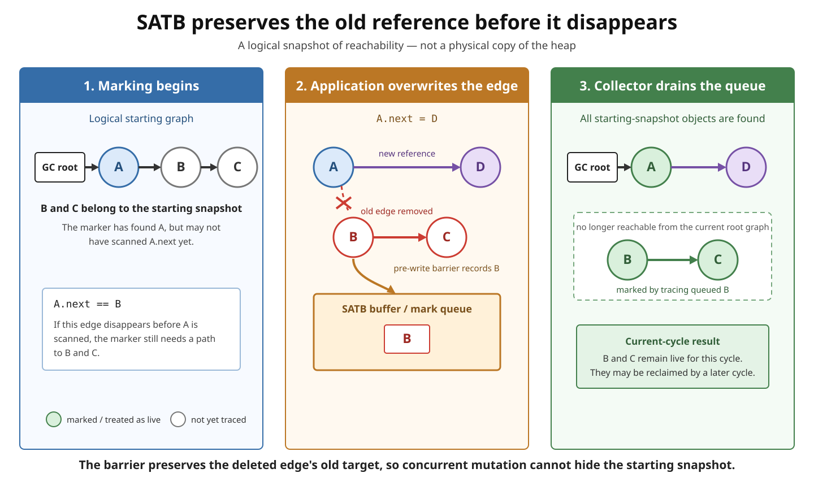
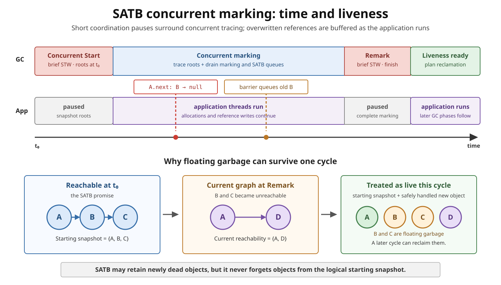

# GC. Snapshot-At-The-Beginning (SATB)

## Front

What is **Snapshot-At-The-Beginning (SATB)** marking, and how does its pre-write barrier let a garbage collector mark objects while application threads keep changing references?

## Back

**Snapshot-At-The-Beginning (SATB)** is a concurrent GC marking strategy that preserves one rule:

> Every object reachable from a GC root at the logical beginning of marking is treated as live for that marking cycle.

The “snapshot” is **not a copy of the heap**. It is a logical view of reachability. While GC threads trace that view, application threads may keep allocating objects and replacing references. A **pre-write barrier** records an old reference before a write can hide it from the marker.

G1 uses SATB for concurrent marking. Generational ZGC also uses SATB, although its barrier implementation is different.

This card first follows one overwritten reference, then places that event in the full marking timeline, and finally explains floating garbage, new allocations, and how SATB differs from remembered-set barriers.

### Essential vocabulary

| Term | Simple meaning |
|---|---|
| **GC root** | A starting reference the collector trusts, such as one from a thread stack or a static field |
| **Reachable** | Can be found by following references from a GC root |
| **Mutator** | An application thread that changes the object graph |
| **Concurrent marking** | GC threads trace objects while application threads are also running |
| **Barrier** | Small JVM-inserted code that runs around a reference access or write |
| **SATB buffer** | A usually thread-local buffer that temporarily holds old references for the marker |

### Why an overwritten reference matters

Assume marking begins with this graph:

```text
GC root → A → B → C
```

The collector has found `A`, but has not yet scanned `A.next`. The application then executes:

```java
A.next = D;
```

The current graph becomes:

```text
GC root → A → D

B → C        // no longer reachable in the current graph
```

`B` and `C` were reachable at the beginning, so SATB must still account for them. Otherwise, the marker could lose part of the graph that its logical snapshot promised to preserve.



Conceptually, the write behaves like this:

```text
old = A.next                 // old is B
if (SATB marking needs old):
    enqueue old              // preserve B for tracing
A.next = D                   // perform the requested write
```

The exact fast-path checks are collector-specific, but the important order is stable: **observe the old value before overwriting the field**. The collector later removes `B` from the queue and follows `B → C`.

Application code does not call this barrier. HotSpot inserts the required machine code when it compiles reference writes.

### The complete marking timeline



For G1, a **Concurrent Start** stop-the-world pause establishes the logical starting point. GC threads then trace concurrently with the application. Reference overwrites can add old values to SATB buffers while this work is active.

Near the end, G1 performs a stop-the-world **Remark** pause. It completes the remaining marking work, including outstanding SATB information needed before liveness is finalized. The completed mark information can then guide later region selection and evacuation. SATB determines which objects are treated as live; it does not itself move objects or return their storage.

### Why SATB is called an old-value or deletion barrier

SATB preserves paths that existed at the beginning. A reference write destroys an old edge and creates a new one:

```text
before: owner.field → oldObject
after:  owner.field → newObject
```

The disappearing edge is the threat to the starting view, so the SATB barrier is commonly described as:

- a **pre-write barrier**, because it runs before the store;
- an **old-value barrier**, because it observes `oldObject`;
- a **deletion barrier**, because it reacts to an edge being removed.

This does not mean that every non-null old value always enters a queue. Implementations use marking state, mark bits, filters, and buffered fast paths to avoid unnecessary work.

### Tri-colour mental model

The following colours are a reasoning model, not fields stored in Java objects:

| Colour | Meaning during tracing |
|---|---|
| **White** | Not yet discovered by the marker |
| **Grey** | Discovered, but its outgoing references still need scanning |
| **Black** | Discovered and scanned |

The risky mutation removes the last known path from a discovered object to a white object. Recording the old referent makes that white object available to the marker even after the application removes the original edge.

HotSpot represents this work with collector-specific mark metadata, queues, and buffers rather than literal colour values.

### Floating garbage: safe but temporarily retained

SATB deliberately answers a historical question: “What was reachable when marking began?” It does not promise to identify every object that becomes unreachable during the cycle.

```text
At marking start:        root → A → B
Later in the cycle:      root → A
SATB result this cycle:  A and B are treated as live
Later marking cycle:     B can be found unreachable
```

`B` is **floating garbage**: unreachable now, but retained because it belonged to the starting snapshot. Oracle's G1 documentation describes this conservative retention and states that such objects can be reclaimed during the next marking cycle.

Floating garbage is not a memory leak by itself. It is a bounded consequence of using an older logical view. However, a high allocation or mutation rate can increase temporary heap pressure, so the collector needs enough headroom to finish marking.

### What about objects allocated after marking starts?

New objects were not part of the starting graph, but the JVM must still prevent them from being reclaimed while the application uses them. The handling is collector-specific.

In G1, each region has a **top-at-mark-start (TAMS)** boundary. Objects allocated above that boundary after the snapshot are treated as implicitly live for the current marking cycle; the concurrent marker does not need to rediscover each one through the old graph. This rule complements SATB's preservation of pre-existing reachability.

Do not generalize G1's TAMS mechanism to every SATB collector. SATB defines the marking invariant; each collector chooses metadata and barriers that maintain it.

### SATB barrier vs remembered-set/card barrier

The two mechanisms are both triggered by reference writes, but they answer different questions:

| Mechanism | Usually observes | Question it answers |
|---|---|---|
| **SATB marking barrier** | The old reference before overwrite | “Did this write hide an object that belonged to the starting snapshot?” |
| **Remembered-set/card barrier** | The written field and/or new reference | “Did this write create a cross-region or cross-generation reference that a partial collection must remember?” |

G1 therefore needs both responsibilities:

- its SATB pre-write path preserves concurrent-marking reachability;
- its post-write/card path maintains information used when collecting only selected regions.

Generational ZGC also uses SATB, but its store-barrier machinery can combine marking and remembered-set work. The responsibilities remain conceptually distinct even when one optimized barrier handles several checks.

### SATB vs incremental-update marking

Both approaches repair the collector's view while the object graph changes, but they preserve different views:

| SATB | Incremental update |
|---|---|
| Preserves reachability from the beginning of marking | Moves the marker's knowledge toward the changing current graph |
| Focuses on an overwritten old reference | Focuses on a newly installed reference or modified object |
| Commonly uses a pre-write/deletion barrier | Commonly uses a post-write/insertion barrier or rescanning |
| Naturally permits floating garbage from the starting view | May require more rescanning of objects changed after they were scanned |

This is a conceptual comparison. Real collectors may combine techniques and aggressively optimize their barriers.

### Costs and benefits

**Benefits:**

- Much of the graph can be marked while application threads run.
- The logical invariant is simple: preserve objects live at the start.
- G1 uses SATB to limit work that must be completed in its Remark pause.

**Costs:**

- Reference writes execute a barrier fast path.
- Old references may fill per-thread buffers that GC threads must drain.
- Heavy reference mutation can create additional marking work.
- Remaining buffered work can add to Remark time.
- Floating garbage and implicitly live new allocations can temporarily retain more heap.

### Common misconceptions

- **“Snapshot” means a heap copy.** No: it is a logical reachability guarantee.
- **The heap is frozen.** No: application threads continue changing references during concurrent marking.
- **SATB immediately reclaims everything that dies.** No: objects that die after the snapshot may survive this cycle.
- **The barrier is Java code in the application.** No: it is inserted and managed by the JVM.
- **SATB is the remembered set.** No: they solve different correctness problems.
- **SATB alone reclaims memory.** No: it produces liveness information; collector-specific evacuation or relocation reclaims space.

### Remember

```text
SATB preserves the beginning-of-marking reachability view.

Before a reference disappears:
    save the old referent when required
    let the marker trace it

Result:
    concurrent marking stays conservative and correct
    some newly dead objects may wait for a later cycle
```

## Sources

- [Oracle Java 26 GC Tuning Guide — G1 marking and SATB](https://docs.oracle.com/en/java/javase/26/gctuning/garbage-first-g1-garbage-collector1.html)
- [JEP 439: Generational ZGC — SATB marking and store barriers](https://openjdk.org/jeps/439)
- [OpenJDK — G1 pre-write barrier implementation](https://github.com/openjdk/jdk/blob/master/src/hotspot/share/gc/g1/g1BarrierSet.hpp)
- [OpenJDK — G1 TAMS/SATB allocation handling](https://github.com/openjdk/jdk/blob/master/src/hotspot/share/gc/g1/g1YoungCollector.cpp)
