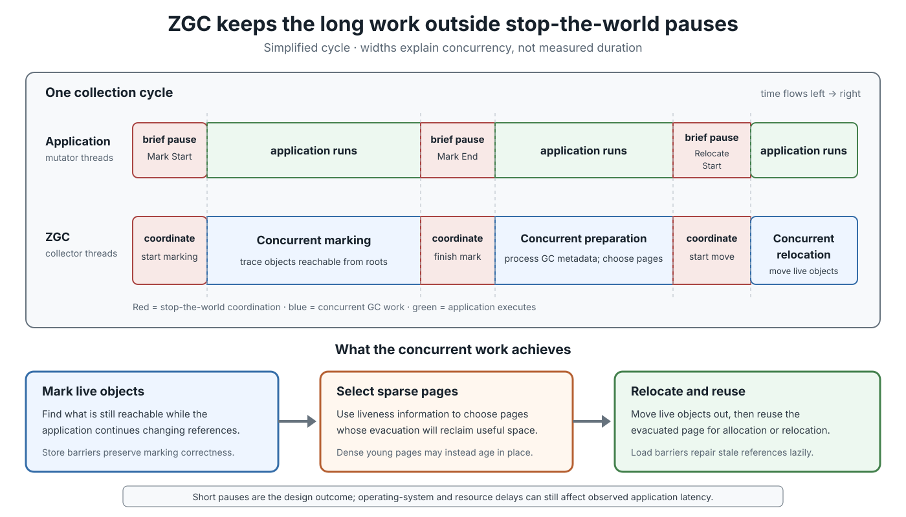
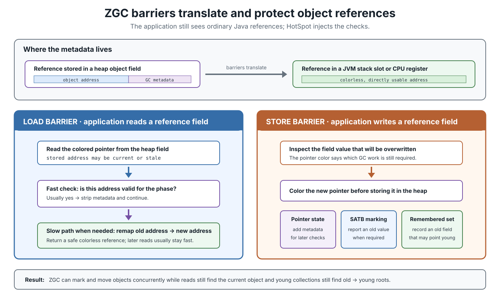

# GC. ZGC

## Front

How does modern ZGC keep garbage-collection pauses short?

Explain its generational heap, concurrent collection cycle, colored pointers, load/store barriers, relocation, remembered sets, configuration, monitoring, and main trade-offs.

## Back

**The Z Garbage Collector (ZGC) became production-ready in JDK 15 with JEP 377; JDK 24 removed ZGC's legacy non-generational mode with JEP 490, so `-XX:+UseZGC` now always selects generational ZGC.**

ZGC is HotSpot's scalable, concurrent, compacting collector for applications where **very short garbage-collection pauses** matter. It keeps the expensive work—tracing objects, processing references, selecting pages, and moving live objects—mostly concurrent with application threads. Brief stop-the-world pauses coordinate those concurrent phases.

This card builds the model in four layers: heap organization → collection cycle → barriers that preserve correctness → production configuration and diagnosis.

### Version map

| JDK | ZGC milestone |
|---:|---|
| 15 | ZGC became production-ready, JEP 377 |
| 21 | Generational ZGC added, JEP 439 |
| 23 | Generational mode became the default ZGC mode, JEP 474 |
| 24 | Non-generational implementation removed, JEP 490 |

**G1 is also a generational garbage collector.** Both G1 and modern ZGC divide objects into young and old generations. “Only generational ZGC remains” means that HotSpot no longer offers ZGC's earlier non-generational mode; it does **not** mean that ZGC is the only collector with generations.

For JDK 24 and later, enable modern generational ZGC with only:

```bash
java -XX:+UseZGC -Xmx16g -jar application.jar
```

ZGC is not HotSpot's general default collector; `-XX:+UseZGC` opts into it. Do not copy old examples that add `-XX:+ZGenerational`: that transition flag is obsolete/removed in modern JDKs.

### Vocabulary

- **Application or mutator thread:** a thread running application code and changing the object graph.
- **Live object:** an object reachable from a garbage-collection root, directly or through other live objects.
- **Live set:** all objects that must remain after a collection.
- **Stop-the-world (STW) pause:** an interval in which application threads are stopped at a safepoint.
- **Concurrent work:** collector work performed while application threads continue running.
- **Relocation:** moving a live object to another address; this compacts the heap.
- **Barrier:** small JVM-generated code executed around a reference load or store to keep concurrent GC correct.
- **Remembered set:** old-generation field locations that may contain references to young objects.

“Concurrent” does **not** mean “pause-free.” It means that long work is moved outside pauses.

### Heap organization: young and old are logical page sets

Modern ZGC divides the heap into young and old generations because most new objects die quickly. It can collect young objects frequently without repeatedly tracing all long-lived objects.


Read the diagram from top to bottom:

- **Young generation:** receives new objects and is collected frequently.
- **Old generation:** holds long-lived or promoted objects and is collected less frequently.
- **ZPages:** logical heap pages that can be used for allocation, survival, relocation, promotion, or reuse.
- **Remembered entries:** make an old field that may point to a young object visible to a young collection.
- **Virtual reservation versus commitment:** `-Xmx` limits usable heap capacity; physical memory is committed as required and may later be uncommitted.

The generations are not a fixed contiguous layout such as:

```text
Eden | Survivor 0 | Survivor 1 | Old
```

ZGC dynamically resizes generations, adjusts tenuring thresholds, and scales collector threads. Pages can change roles as objects age.

#### Dense pages and large objects

After marking, ZGC knows how many live bytes each page contains. Sparse pages are profitable relocation candidates. A dense young page may be too expensive to evacuate, so ZGC can age it in place, keep it as a survivor page, or promote it to old.

Generational ZGC may also allocate large objects in young pages. A short-lived large object can die in the young generation; a long-lived large object's page can be promoted without copying the object merely to change its age.

### Collection cycle: coordinate briefly, work concurrently

The following timeline is simplified; generation-specific cycles can overlap and exact internal phase details may evolve. The essential idea is stable: pauses establish phase boundaries, while heap-scale work runs concurrently.



A typical cycle alternates three brief coordination boundaries with longer concurrent spans. **Mark Start** establishes marking, then concurrent marking traces reachable objects while the application changes references. **Mark End** completes marking coordination. ZGC next performs generation-appropriate preparation and chooses pages whose relocation will reclaim useful space. **Relocate Start** begins relocation coordination, after which live objects move concurrently and evacuated pages become reusable.

These labels also appear in detailed ZGC logs, but the young and old collectors can have separate activity. Do not interpret every cycle as one monolithic full-heap collection.

Oracle's JDK 26 guide describes ZGC pauses as at most about one millisecond and independent of the heap size in use. Treat this as the collector's low-latency design behavior, **not** a hard real-time guarantee. CPU starvation, safepoint delays, operating-system scheduling, page faults, and logging can still hurt end-to-end latency.

### How can an object move while the application uses it?

Assume an application field still contains the old address of object `A`, but ZGC has moved `A`:

```text
field ──▶ old address of A
                     ZGC relocates A ──▶ new address of A
```

ZGC uses colored pointers plus load and store barriers so the application still reaches the current object.



#### Colored pointers

A reference stored in a heap object field contains an object address plus ZGC metadata. The metadata can describe facts such as whether an address is known to be correct for the current phase. The “color” is JVM metadata; Java code cannot inspect it as an object property.

In generational ZGC, object fields store colored pointers. References in hardware stack slots and CPU registers are colorless, directly usable addresses. Barriers translate between those forms.

#### Load barrier: make a loaded reference safe

HotSpot injects a load barrier when compiled application code loads an object reference from a heap field.

- **Fast path:** metadata says no extra work is needed; remove the metadata and continue.
- **Slow path:** if the object moved, use relocation information to translate the stale address to the current address, then return a safe reference.
- The pointer metadata is updated so later loads normally return to the fast path.

Conceptually:

```text
read colored reference
        ↓
address valid for this phase?
   yes ───────▶ return current colorless address
   no  ───────▶ remap old address, then return current address
```

This lazy repair is why ZGC does not need to stop every application thread and eagerly rewrite every reference before allowing the application to continue.

#### Store barrier: preserve marking and generational roots

HotSpot injects a store barrier when application code writes a reference into an object field. Generational ZGC uses it to:

- add the required metadata to the pointer stored in the heap;
- support **snapshot-at-the-beginning (SATB)** concurrent marking by reporting an overwritten reference when required;
- record an old-generation field that may now point to a young object.

SATB means that objects reachable from the roots when marking began must still be discovered even if the application breaks a reference while marking is in progress. The store barrier preserves the old value long enough for the collector to process it. An object that dies during the cycle may therefore survive until a later cycle as **floating garbage**; this is safe but temporarily conservative.

#### Remembered set: do not scan all old objects during young GC

An old object can be the only thing keeping a young object alive:

```text
old OrderCache.customer ──▶ young Customer
```

A young collection cannot ignore that reference, but scanning every old object would defeat the generational benefit. ZGC therefore records the **field location** in a remembered set. During young marking, those remembered fields act as additional roots.

Generational ZGC uses precise, double-buffered bitmaps per old-generation region: application barriers populate one bitmap while GC threads process and clear the other, and the roles swap at a young collection boundary.

### Young and old collections cooperate

| Young collection | Old collection |
|---|---|
| Targets recently allocated objects | Targets promoted and long-lived objects |
| Runs more frequently | Runs less frequently |
| Uses old-to-young remembered fields as roots | Needs young-to-old references as roots |
| Reclaims dead young objects | Reclaims dead old objects |
| Relocates profitable sparse pages; may age dense pages in place | Marks and relocates old pages concurrently |

The two collectors are logically independent but not isolated. For example, when old marking needs young-to-old references, ZGC coordinates with a young collection to discover them.

### Why the pauses stay short

Pause duration is not intended to contain work proportional to the whole heap:

- graph tracing is concurrent;
- reference processing and relocation preparation are concurrent;
- object relocation and compaction are concurrent;
- load barriers repair stale references lazily;
- store barriers preserve concurrent marking and cross-generation information.

The cost moves elsewhere: barriers execute in application code, collector threads consume CPU concurrently, and the heap needs enough free headroom for allocation and relocation progress.

### Configuration: start with heap capacity

The most important tuning option is `-Xmx`. It must cover:

```text
live set
+ allocations made while ZGC is collecting
+ relocation and operational headroom
```

If allocation consumes memory faster than concurrent GC reclaims it, application threads may experience an **allocation stall**. Possible remedies are more heap headroom, a lower allocation rate, or enough CPU capacity for collector threads—not an arbitrary collection of tuning flags.

A practical starting command is:

```bash
java \
  -XX:+UseZGC \
  -Xms4g \
  -Xmx16g \
  -Xlog:gc*,safepoint:file=gc.log:time,uptime,level,tags \
  -jar application.jar
```

Let ZGC adapt generation sizes, GC thread counts, and tenuring thresholds before overriding advanced options.

#### Soft maximum versus hard maximum

```bash
-Xmx16g -XX:SoftMaxHeapSize=12g
```

`SoftMaxHeapSize=12g` asks ZGC heuristics to stay near 12 GB. ZGC may temporarily grow up to the hard 16 GB `-Xmx` limit to prevent an application stall. The soft maximum is therefore a preference, not a safety boundary.

#### Returning unused memory

By default, ZGC may uncommit unused memory and return it to the operating system. It never shrinks below `-Xms`. The default uncommit delay is 300 seconds and can be changed with:

```bash
-XX:ZUncommitDelay=300
```

Committing and uncommitting can affect latency. For an extremely latency-sensitive service on a dedicated, correctly sized host, a measured alternative is:

```bash
-Xms16g -Xmx16g -XX:+AlwaysPreTouch
```

Equal `-Xms` and `-Xmx` implicitly prevent heap uncommit; `AlwaysPreTouch` backs the heap during startup. The trade-off is slower startup and a large fixed physical-memory footprint.

### Observe before tuning

Use unified logs, Java Flight Recorder (JFR), Java Mission Control, application metrics, and operating-system/container metrics together.

Watch:

- pause percentiles and maximums, not only averages;
- allocation rate and live-set size;
- allocation stalls;
- young versus old cycle frequency;
- concurrent GC CPU usage and overall CPU saturation;
- committed heap, process resident memory, and container limits;
- application p99 and p99.9 latency.

`-Xlog:gc*,safepoint` is useful during investigation, but very verbose logging can itself add overhead. Test the chosen logging level under realistic load.

### When ZGC is a strong choice

- Tail-latency service-level objectives make long GC pauses unacceptable.
- The application uses a large heap or has a large live set.
- The system has enough CPU for concurrent collector work.
- The heap has headroom above the live set and concurrent allocation demand.
- Predictable short pauses matter more than maximum throughput or minimum footprint.

ZGC may be a poor fit for a short batch job, a CPU-saturated environment, a severely memory-constrained container, or a workload already meeting its latency target with a higher-throughput collector.

### ZGC, G1, and Parallel GC

| Collector | Main design goal | Where live-object movement happens | Typical trade-off |
|---|---|---|---|
| ZGC | Extremely low pauses | Mostly concurrent with the application | Barrier, CPU, and headroom cost |
| G1 | Balanced server latency and throughput | Primarily in bounded STW evacuation pauses | Longer, workload-sensitive pauses |
| Parallel GC | High throughput | Parallel work during STW collections | Potentially long pauses |

This is a starting model, not a benchmark result. Choose with production-like allocation rates, live sets, traffic, CPU limits, and latency objectives.

### Common mistakes

- **“Concurrent means no pauses.”** ZGC still has brief coordination pauses and safepoints.
- **“Heap-size-independent pauses mean heap size does not matter.”** Heap size still controls headroom and the risk of allocation stalls.
- **“Young and old are fixed adjacent address ranges.”** They are logical collections of pages that ZGC resizes dynamically.
- **“Colored pointers replace reachability tracing.”** ZGC still traces the object graph; pointer metadata and barriers make concurrent tracing and relocation safe.
- **“ZGC is a real-time collector.”** It targets very low pauses but provides no hard scheduling deadline.
- **“A smaller `-Xmx` always lowers latency.”** Too little headroom can increase cycle frequency and stall allocation.
- **“ZGC must have the highest throughput.”** Concurrent work and barriers consume resources; measure against alternatives.

### Remember

> Modern ZGC is a generational, region-based, concurrent compacting collector. Young and old objects occupy dynamic page sets; brief pauses coordinate concurrent marking and relocation; colored pointers plus load/store barriers keep references correct while objects move; and remembered sets let young GC find old-to-young roots. Its main operational requirement is enough heap and CPU headroom to reclaim memory faster than the application allocates it.

## Sources

- [Oracle JDK 26 HotSpot Garbage Collection Tuning Guide — ZGC](https://docs.oracle.com/en/java/javase/26/gctuning/hotspot-virtual-machine-garbage-collection-tuning-guide.pdf)
- [JEP 377 — ZGC: A Scalable Low-Latency Garbage Collector (Production)](https://openjdk.org/jeps/377)
- [JEP 439 — Generational ZGC](https://openjdk.org/jeps/439)
- [JEP 474 — ZGC: Generational Mode by Default](https://openjdk.org/jeps/474)
- [JEP 490 — ZGC: Remove the Non-Generational Mode](https://openjdk.org/jeps/490)
