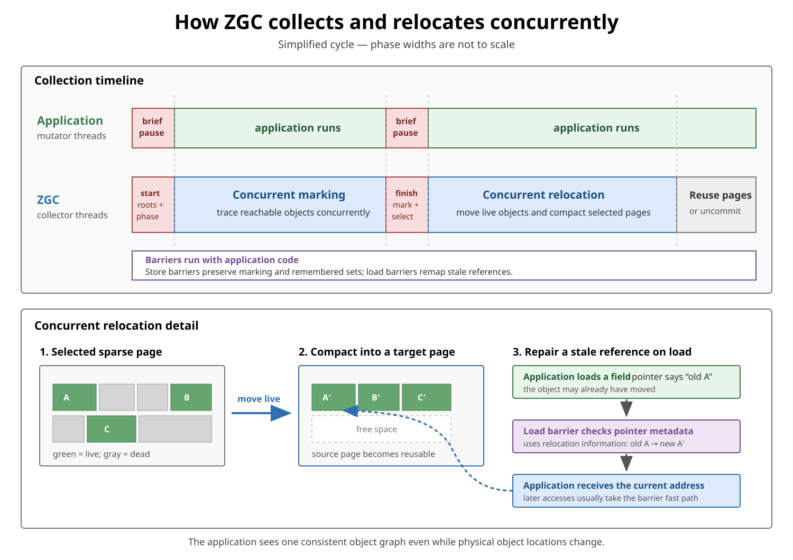

# Garbage Collection: ZGC

## Front

How does **ZGC** work in modern Java, how does it organize heap memory, why are its pauses short, and when should it be used?

## Back

**ZGC**, the Z Garbage Collector, is HotSpot's scalable, concurrent, compacting, low-latency garbage collector.

Its central goal is to perform expensive garbage-collection work while application threads continue running. Only brief coordination phases stop all application threads.

```text
Application threads:  run ── pause ───────── run ── pause ───────── run
ZGC threads:                 mark concurrently       relocate concurrently
```

ZGC is designed for applications where predictable response time matters more than achieving the highest possible throughput.

### Current status

- ZGC was introduced experimentally in JDK 11.
- It became production-ready in JDK 15.
- Generational ZGC was introduced in JDK 21.
- Generational mode became the default ZGC mode in JDK 23.
- Since JDK 24, the non-generational implementation has been removed.

In modern Java, enabling ZGC is enough:

```bash
java -XX:+UseZGC -Xmx16g -jar application.jar
```

Do not copy the old `-XX:+ZGenerational` advice into a new configuration. ZGC is now generational, and that option is obsolete or removed depending on the JDK version.

### Main characteristics

- **Concurrent:** marking, reference processing, relocation, and compaction are mostly performed alongside the application.
- **Generational:** the heap is split logically into young and old generations.
- **Region-based:** memory is managed as dynamically assigned heap pages, commonly called ZPages.
- **Compacting:** live objects are relocated so that fragmented pages can be reclaimed.
- **Barrier-based:** colored pointers plus load and store barriers keep references correct while objects move.
- **Adaptive:** ZGC adjusts generation sizes, GC thread usage, and tenuring thresholds according to the workload.
- **Low-pause:** expensive work is not proportional to the duration of stop-the-world pauses.

Oracle's current tuning guide describes application pauses as no longer than roughly one millisecond and independent of heap size. This is a design objective and observed collector behavior, not a hard real-time deadline: operating-system scheduling, page faults, logging, CPU starvation, and application behavior can still produce latency spikes.

## Memory organization


### Two logical generations

```text
ZGC heap
├── Young generation
│   ├── newly allocated objects
│   ├── objects surviving young collections
│   └── pages waiting to be aged, relocated, or promoted
└── Old generation
    ├── promoted and long-lived objects
    ├── independently marked and relocated pages
    └── remembered sets for possible old → young references
```

Most objects die shortly after allocation. ZGC therefore collects the young generation more frequently and the old generation less frequently.

The generations are **logical sets of pages**, not necessarily two adjacent, fixed-size address ranges. ZGC dynamically resizes them and can reclassify pages as objects age.

Do not assume that modern ZGC uses the classic fixed layout:

```text
Eden | Survivor 0 | Survivor 1 | Old
```

That picture is useful for some other collectors, but it is misleading for ZGC's dynamic region-based organization.

### ZPages

The heap consists of independently managed regions called **ZPages**. Current ZGC supports page categories for small, medium, and large objects.

A page can be associated with:

- Allocation in the young generation.
- Surviving young objects.
- Promoted or old objects.
- A relocation set selected for evacuation.
- Free space available for reuse.

Pages are selected for relocation according to their live-object density. ZGC can relocate live objects out of sparse pages and immediately reuse fully evacuated pages.

Dense young pages do not always have to be evacuated. ZGC may age such a page in place, keep it as a survivor page, or promote the page into the old generation. This avoids copying many live objects merely to advance their age.

Large objects may initially belong to the young generation. If they die quickly, a young collection can reclaim them; if they survive, their pages can be promoted without forcing an expensive object copy.

### Virtual versus physical memory

ZGC reserves a large virtual address range for the heap but commits physical memory only as needed. `-Xmx` bounds the maximum usable Java heap capacity; the implementation may reserve a larger virtual range for addressing and alignment.

```text
Reserved virtual address range

| committed pages | uncommitted range | committed pages | free reservation |
```

Committed pages need not form one continuous physical range. By default, ZGC can uncommit heap memory that remains unused and return it to the operating system, but it does not shrink below `-Xms`.

Modern generational ZGC does not use the older three-way multi-mapped heap design. Old diagrams showing the same physical heap mapped into several virtual address ranges describe non-generational ZGC and should not be used for JDK 24+.

## Why ZGC can relocate objects concurrently



Moving an object while application threads are reading references to it creates a problem:

```text
Application reference ──▶ old address

ZGC moves object: old address ──▶ new address
```

ZGC solves this with **colored pointers**, **load barriers**, and **store barriers**.

### Colored pointers

An object reference stored in a heap field contains both:

1. Information identifying the object's address.
2. Metadata bits describing GC state, such as whether the address is known to be correct for the current phase.

```text
object reference = address information + ZGC metadata
```

These are called colored pointers. The color is metadata, not a Java-visible object property.

Generational ZGC uses colored pointers in heap object fields. References in machine registers and on Java thread stacks are exposed to the runtime as ordinary colorless references; barriers translate between the representations.

### Load barrier

A **load barrier** is a small piece of JVM-generated code that runs when application code loads an object reference from a field.

Its fast path is cheap. If the pointer indicates that extra work is required, the slow path can:

- Discover that the referenced object was relocated.
- Translate a stale address to the object's current address.
- Return a safe reference to the application.
- Update metadata so later loads usually take the fast path.

Conceptually:

```text
load reference
    ↓
is the pointer already valid for this phase?
    ├── yes → use it directly
    └── no  → remap/repair it, then use it
```

This indirection lets ZGC move live objects while application threads continue to access the object graph.

### Store barrier

A **store barrier** runs when application code writes an object reference into a field.

In generational ZGC it helps to:

- Add the required metadata to the stored colored pointer.
- Support snapshot-at-the-beginning concurrent marking.
- Record fields in old objects that may point to young objects.

The store barrier reports overwritten references when required so that an object reachable at the beginning of marking is not accidentally missed while the application mutates the graph.

### Remembered sets

During a young collection, ZGC should not have to scan every object in the old generation. However, an old object may be the only object keeping a young object alive:

```text
Old object ─────────▶ Young object
```

ZGC therefore maintains a **remembered set** containing old-generation field locations that may hold old-to-young references. These entries are additional roots for a young collection.

Generational ZGC records precise potential field locations in per-region bitmaps. It uses two remembered-set buffers:

- Application threads populate the active bitmap through store barriers.
- GC threads process and clear the previous bitmap.
- The bitmaps are swapped when the next young collection starts.

This double buffering lets GC threads and application threads work concurrently on different remembered-set data.

## Simplified collection cycle

The precise internal phase names can change, but the essential process is:

### 1. Brief coordination pause

ZGC brings threads to a safepoint, establishes a consistent starting point, processes roots required by the phase, and starts the collection.

This pause performs coordination rather than tracing the entire heap.

### 2. Concurrent marking

GC threads trace reachable objects while application threads continue running.

Generational ZGC uses a snapshot-at-the-beginning marking model. Store barriers preserve the logical starting snapshot while the application changes references.

### 3. Mark completion and relocation planning

ZGC completes marking information, calculates page liveness, and selects profitable pages for relocation. Brief coordination work may require another safepoint.

### 4. Concurrent relocation and compaction

ZGC moves live objects from selected pages into target pages while application threads run.

```text
Selected source page: [live][dead][dead][live]
                                  │
                                  ▼
Target page:          [live][live][free][free]

Source page becomes reusable after its live objects are evacuated.
```

Load barriers redirect stale references to relocated objects. The application therefore sees a consistent object graph even when some stored references have not yet been repaired.

### 5. Reuse and uncommit

Evacuated pages can immediately become allocation or relocation targets. Pages left unused for long enough may be uncommitted and returned to the operating system.

## Young and old collections

### Young collection

- Focuses on recently allocated objects.
- Runs frequently because most new objects are expected to die young.
- Uses remembered-set entries as roots for old-to-young references.
- Reclaims dead young objects.
- Relocates sparse survivor pages when profitable.
- Ages dense pages in place or promotes them.

### Old collection

- Focuses on long-lived and promoted objects.
- Runs less frequently.
- Performs concurrent marking and relocation for the old generation.
- Coordinates with a young collection to find young-to-old references when necessary.
- Performs reference processing and class unloading associated with old-generation collection work.

Young and old collectors are logically independent but must cooperate where references cross generation boundaries.

## Enabling and observing ZGC

Basic configuration:

```bash
java \
  -XX:+UseZGC \
  -Xmx16g \
  -Xlog:gc*,safepoint \
  -jar application.jar
```

Useful production tools include:

- Unified GC logs with `-Xlog:gc*` and safepoint logging.
- Java Flight Recorder and Java Mission Control.
- Application latency percentiles, allocation rate, live-set size, and CPU utilization.
- Container and operating-system memory metrics.

Never evaluate a low-latency collector only by average pause time. Examine tail latency such as p99, p99.9, and maximum pauses, along with allocation stalls and application throughput.

## Tuning priorities

ZGC is designed to require minimal manual tuning. Start with defaults and change one measured constraint at a time.

### 1. Provide enough heap headroom

The most important option is `-Xmx`.

The heap must contain:

```text
live set
+ new allocations made while collection is running
+ relocation and operational headroom
```

If the application allocates faster than concurrent GC threads reclaim memory, application threads can experience **allocation stalls**. A common first response is to provide more headroom, reduce the allocation rate, or ensure that GC threads receive enough CPU.

### 2. Use a soft heap limit when appropriate

```bash
-Xmx16g -XX:SoftMaxHeapSize=12g
```

`SoftMaxHeapSize` tells ZGC to try to remain around 12 GB, but it may grow up to 16 GB to avoid stalling the application. `-Xmx` remains the hard limit.

This is useful when lower normal memory usage is desirable but emergency headroom is available.

### 3. Choose the footprint versus latency policy

By default, ZGC uncommits memory that has remained unused. The default uncommit delay is 300 seconds.

```bash
-XX:ZUncommitDelay=300
```

Committing and uncommitting memory can itself affect latency. For extremely latency-sensitive, dedicated systems, a measured alternative is:

```bash
-Xms16g -Xmx16g -XX:+AlwaysPreTouch
```

This commits and touches heap memory during startup and prevents ZGC from shrinking below 16 GB. The trade-off is a larger fixed footprint and slower startup.

### 4. Let ZGC size its thread usage first

ZGC normally chooses and scales concurrent GC thread usage automatically. Override `-XX:ConcGCThreads` only after logs and profiling demonstrate that the automatic choice is inadequate.

Too few concurrent GC threads can let allocation outrun collection. Too many can steal CPU from application threads.

### 5. Test large pages rather than assuming

`-XX:+UseLargePages` can improve throughput and latency on a correctly configured system, but it requires operating-system preparation. Transparent Huge Pages may introduce latency spikes on some Linux systems, so test the exact deployment environment.

## When ZGC is a good choice

- Latency-sensitive services with strict tail-latency requirements.
- Large heaps where long stop-the-world compaction pauses are unacceptable.
- Applications with enough CPU and memory headroom for concurrent GC work.
- Workloads that benefit from predictable pauses more than maximum throughput.
- Services where occasional multi-hundred-millisecond or multi-second pauses would violate an SLO.

## When ZGC may not be the best choice

- Small batch jobs where startup time or maximum throughput matters more than pause latency.
- CPU-saturated environments that cannot spare cycles for concurrent GC threads.
- Memory-constrained deployments with little room above the live set.
- Workloads already meeting latency targets with a simpler or higher-throughput collector.
- Systems requiring hard real-time guarantees; ZGC is low-latency, not a real-time collector.

## ZGC compared with common alternatives

| Collector | Main objective | Typical trade-off |
|---|---|---|
| ZGC | Extremely short, heap-size-independent pauses | Concurrent CPU/barrier overhead and extra headroom |
| G1 | Balanced latency and throughput for general server workloads | Pauses are usually longer and more workload-sensitive |
| Parallel GC | High throughput using stop-the-world parallel collection | Long pauses, especially with large live sets |

The correct choice must be based on the application's SLOs, allocation profile, live-set size, CPU budget, and measured behavior.

## Common misconceptions

### “Concurrent” means “no pauses”

False. ZGC still uses brief stop-the-world coordination phases and safepoints. It moves expensive heap-wide work out of those pauses.

### Heap size does not matter

False. Pause duration is designed not to scale with heap size, but heap capacity still determines whether ZGC has enough headroom to keep up with allocation.

### Generational ZGC has fixed contiguous Eden and Survivor spaces

False. Young and old generations are dynamic logical collections of pages. Pages can be relocated, aged in place, promoted, freed, committed, or uncommitted.

### ZGC always has the best throughput

False. Barriers and concurrent collector threads consume CPU. Parallel GC or G1 may provide better throughput when longer pauses are acceptable.

### Colored pointers eliminate the need for tracing

False. ZGC still marks reachable objects. Colored pointers and barriers make concurrent marking and relocation safe.

### A very small `-Xmx` reduces latency

Usually false. Insufficient headroom can cause frequent cycles and allocation stalls. The heap must fit the live set plus allocations made during concurrent collection.

## Interview summary

> ZGC is HotSpot's generational, region-based, concurrent compacting collector for low-latency workloads. It manages young and old generations as dynamic sets of ZPages, marks and relocates objects mostly while application threads run, and uses colored pointers with load and store barriers to keep references correct. Young collections reclaim short-lived objects frequently, while remembered sets track old-to-young references. The primary tuning concern is enough `-Xmx` headroom; ZGC trades extra CPU and memory headroom for very short pauses that do not grow with heap size.

## Official references

- [Oracle JDK 26 Garbage Collection Tuning Guide](https://docs.oracle.com/en/java/javase/26/gctuning/hotspot-virtual-machine-garbage-collection-tuning-guide.pdf)
- [OpenJDK ZGC documentation](https://wiki.openjdk.org/display/zgc/Main)
- [JEP 439: Generational ZGC](https://openjdk.org/jeps/439)
- [JEP 490: Remove the Non-Generational Mode](https://openjdk.org/jeps/490)
- [Java 26 launcher and ZGC options](https://docs.oracle.com/en/java/javase/26/docs/specs/man/java.html)
