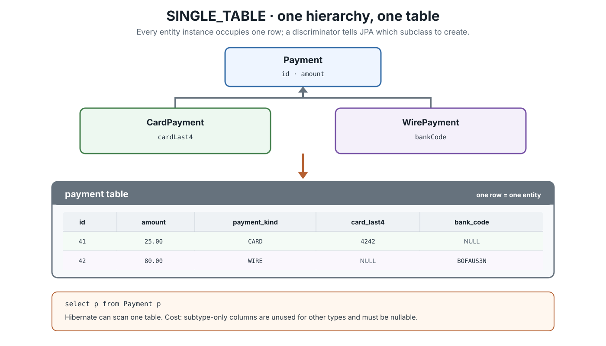
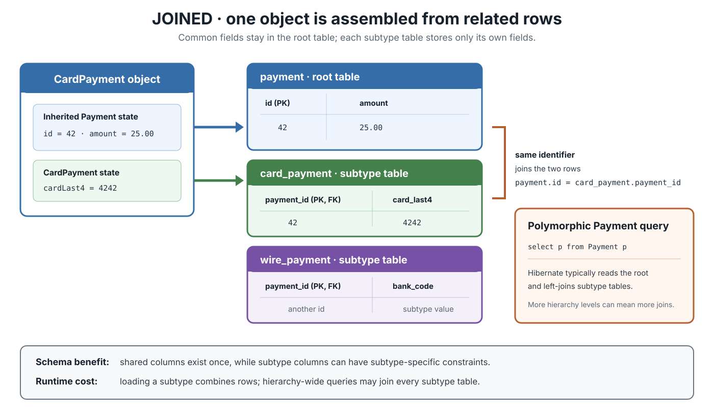
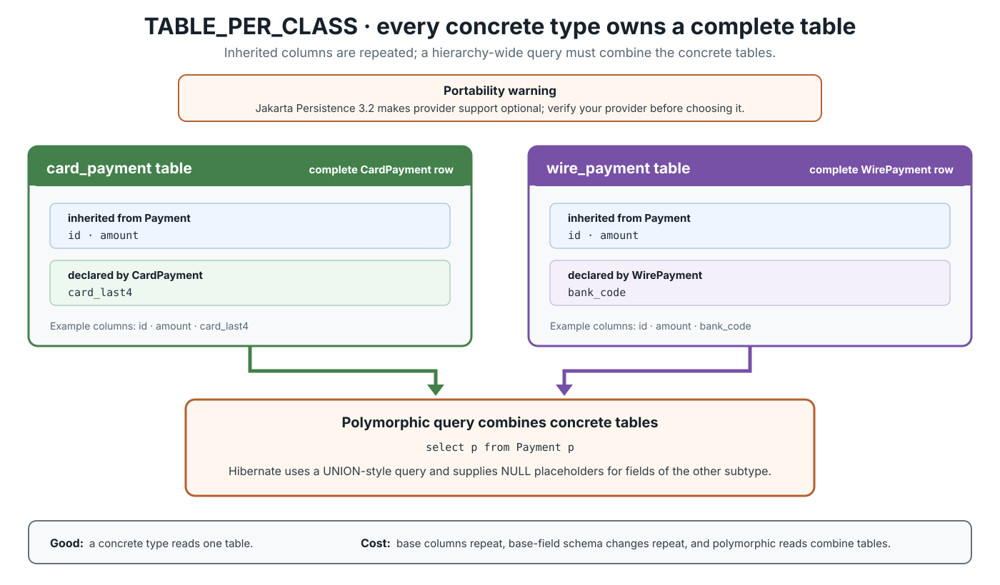

# JPA. Inheritance mapping

## Front

How does JPA store an entity inheritance hierarchy?

Explain `SINGLE_TABLE`, `JOINED`, and `TABLE_PER_CLASS`: their tables, annotations, polymorphic queries, trade-offs, and the difference between an entity hierarchy and `@MappedSuperclass`.

## Back

JPA maps one entity hierarchy with `@Inheritance` on its **root entity**:
- `SINGLE_TABLE` uses one table and a discriminator
- `JOINED` splits one object across related tables
- `TABLE_PER_CLASS` gives every concrete entity a complete table.

A query of the root entity is polymorphic—it also returns its entity subtypes.

Start with the domain model, then choose the database shape that best matches the important queries and constraints.

### Vocabulary first

- **Root entity:** the first `@Entity` in the hierarchy; it declares `@Inheritance` and owns the identifier mapping.
- **Concrete entity:** a non-abstract entity that can be instantiated and stored.
- **Discriminator:** a column value such as `CARD` that identifies which subtype a row represents.
- **Polymorphic query:** a query of a base entity type that includes instances of its entity subclasses.

The examples use one abstract root and two concrete payment types:

Each `public` class below belongs in its own `.java` file; they are grouped only to show the hierarchy together.

```java
@Entity
@Inheritance(strategy = InheritanceType.SINGLE_TABLE) // change per strategy
public abstract class Payment {
    @Id
    @GeneratedValue(strategy = GenerationType.SEQUENCE)
    private Long id;

    @Column(nullable = false)
    private BigDecimal amount;

    protected Payment() {
    }

    protected Payment(BigDecimal amount) {
        this.amount = amount;
    }
}

@Entity
public class CardPayment extends Payment {
    private String cardLast4;

    protected CardPayment() {
    }

    public CardPayment(BigDecimal amount, String cardLast4) {
        super(amount);
        this.cardLast4 = cardLast4;
    }
}

@Entity
public class WirePayment extends Payment {
    private String bankCode;

    protected WirePayment() {
    }

    public WirePayment(BigDecimal amount, String bankCode) {
        super(amount);
        this.bankCode = bankCode;
    }
}
```

The root owns `id`; entity subclasses inherit it. Put `@Inheritance` on `Payment`, not on every subtype. If the annotation or its `strategy` is omitted, JPA defaults to `SINGLE_TABLE`.

### `SINGLE_TABLE`: one table plus a type marker

All root and subtype fields become columns of one table. Each object uses exactly one row. The discriminator tells JPA whether that row is a `CardPayment` or `WirePayment`.



```java
@Entity
@Table(name = "payment")
@Inheritance(strategy = InheritanceType.SINGLE_TABLE)
@DiscriminatorColumn(name = "payment_kind")
public abstract class Payment {
    // id and amount
}

@Entity
@DiscriminatorValue("CARD")
public class CardPayment extends Payment {
    // cardLast4
}

@Entity
@DiscriminatorValue("WIRE")
public class WirePayment extends Payment {
    // bankCode
}
```

If a required discriminator column is not configured, its portable defaults are name `DTYPE` and type `STRING`. For a string discriminator, the default value is the entity name, but explicit stable values avoid coupling stored data to a renamed entity.

Why choose it:

- A root query normally reads one table; Hibernate does not need subtype joins.
- Inserts and subtype loads touch one table.
- It is required for every compliant JPA provider and is the default strategy.

Costs:

- Subtype-only columns are unused for other types, so they must be nullable at the column level.
- A large hierarchy can create a wide, sparse table.
- Subtype-specific invariants often need database `CHECK` constraints, triggers, or application validation instead of a simple `NOT NULL`.

### `JOINED`: normalized tables connected by the same ID

The root table stores inherited fields. Each subtype table stores its own fields, and its primary key is also a foreign key to the corresponding root row. A `CardPayment` therefore occupies one `payment` row **and** one `card_payment` row.



```java
@Entity
@Table(name = "payment")
@Inheritance(strategy = InheritanceType.JOINED)
public abstract class Payment {
    // id and amount
}

@Entity
@Table(name = "card_payment")
@PrimaryKeyJoinColumn(name = "payment_id")
public class CardPayment extends Payment {
    // cardLast4
}

@Entity
@Table(name = "wire_payment")
@PrimaryKeyJoinColumn(name = "payment_id")
public class WirePayment extends Payment {
    // bankCode
}
```

`@PrimaryKeyJoinColumn` customizes the subtype join column; it is not required when the default column mapping is suitable. A discriminator is not required for `JOINED`, because matching subtype rows can reveal the concrete type.

Why choose it:

- Shared columns exist once, and the schema mirrors the class hierarchy.
- Subtype columns can use subtype-specific `NOT NULL`, unique, and check constraints.
- It is required for every compliant JPA provider.

Costs:

- Loading a subtype requires at least one join with its parent table.
- Inserting or deleting one subtype touches multiple tables.
- In Hibernate, a root query commonly left-joins the subtype tables; deep or wide hierarchies can produce expensive SQL.

### `TABLE_PER_CLASS`: one complete table per concrete entity

Every concrete subtype has its own table containing both inherited and subtype-specific columns. With an abstract `Payment`, there is no `payment` row shared by the two concrete types.



```java
@Entity
@Inheritance(strategy = InheritanceType.TABLE_PER_CLASS)
public abstract class Payment {
    // id and amount
}

@Entity
@Table(name = "card_payment")
public class CardPayment extends Payment {
    // inherited id and amount, plus cardLast4
}

@Entity
@Table(name = "wire_payment")
public class WirePayment extends Payment {
    // inherited id and amount, plus bankCode
}
```

Why choose it:

- Reading one known concrete type needs only its table.
- Each concrete table can enforce constraints appropriate to that type.
- No irrelevant subtype columns and no parent-row join are needed.

Costs:

- Inherited columns and indexes are duplicated; changing a base mapping can require changes to every concrete table.
- A foreign key to the abstract root is difficult to represent as one ordinary database foreign key.
- Hibernate implements a root query with a `UNION`-style derived table, which gets more expensive as the hierarchy grows.
- **Portability warning:** Jakarta Persistence 3.2 makes provider support for this strategy optional.

Use it only after checking provider support and query plans; it fits small hierarchies queried mainly by concrete type.

### One JPQL query, three SQL shapes

The JPQL stays the same because `Payment` is an entity:

```java
List<Payment> payments = entityManager.createQuery(
        "select p from Payment p order by p.id",
        Payment.class
).getResultList();
```

It can return both `CardPayment` and `WirePayment`. The provider translates that semantic query to the chosen mapping:

| Strategy | Rows that represent one subtype object | Typical Hibernate root-query shape |
|---|---:|---|
| `SINGLE_TABLE` | One row in one hierarchy table | One table scan; inspect discriminator |
| `JOINED` | Root row + subtype row | Root table with joins to subtype tables |
| `TABLE_PER_CLASS` | One row in its concrete table | Union of concrete tables |

SQL shape is provider- and database-dependent; use generated SQL and real execution plans for performance decisions.

### `@MappedSuperclass` is reuse, not entity polymorphism

A mapped superclass contributes mappings to its entity subclasses but is **not** an entity, has no separate table, and cannot be queried or passed to `EntityManager` operations as an entity type.

```java
@MappedSuperclass
public abstract class AuditedEntity {
    @Id
    @GeneratedValue
    private Long id;

    @Column(nullable = false, updatable = false)
    private Instant createdAt;
}

@Entity
public class Customer extends AuditedEntity {
}

@Entity
public class Product extends AuditedEntity {
}
```

`Customer` and `Product` are independent entity roots. This JPQL is invalid because `AuditedEntity` is not an entity:

```java
// Invalid JPQL
select a from AuditedEntity a
```

Use an **abstract entity root** when you need root queries or associations such as `@ManyToOne Payment payment`. Use `@MappedSuperclass` when you only want inherited fields/mappings. A subclass may override an inherited mapping with `@AttributeOverride` or `@AssociationOverride`.

### Selection guide

| Need | Usually start with |
|---|---|
| Frequent polymorphic reads; small, stable hierarchy | `SINGLE_TABLE` |
| Strong subtype constraints; normalized schema | `JOINED` |
| Mostly concrete-type reads; small hierarchy; verified provider support | `TABLE_PER_CLASS` |
| Field/mapping reuse without root queries or root associations | `@MappedSuperclass` |

Before choosing:

1. Confirm the relationship is truly **is-a**; otherwise prefer composition or associations.
2. List the important queries: root-polymorphic or concrete-type?
3. Decide where subtype constraints must be enforced.
4. Inspect generated DDL and SQL against the production database.
5. Do not mix strategies inside one hierarchy in portable code; support for that combination is not required.

### Remember

> `SINGLE_TABLE` trades nullable columns for simple reads; `JOINED` trades joins for normalization; `TABLE_PER_CLASS` trades duplicated schema and unions for independent concrete tables; `@MappedSuperclass` provides mapping reuse without an entity hierarchy.

## Sources

- [Jakarta Persistence 3.2 specification — inheritance and mapping strategies](https://jakarta.ee/specifications/persistence/3.2/jakarta-persistence-spec-3.2#inheritance)
- [Jakarta Persistence 3.2 API — `InheritanceType`](https://jakarta.ee/specifications/persistence/3.2/apidocs/jakarta.persistence/jakarta/persistence/inheritancetype)
- [Jakarta Persistence 3.2 API — `DiscriminatorColumn`](https://jakarta.ee/specifications/persistence/3.2/apidocs/jakarta.persistence/jakarta/persistence/discriminatorcolumn)
- [Jakarta Persistence 3.2 API — `MappedSuperclass`](https://jakarta.ee/specifications/persistence/3.2/apidocs/jakarta.persistence/jakarta/persistence/mappedsuperclass)
- [Hibernate ORM 7.2 User Guide — inheritance](https://docs.hibernate.org/orm/7.2/userguide/html_single/#entity-inheritance)
