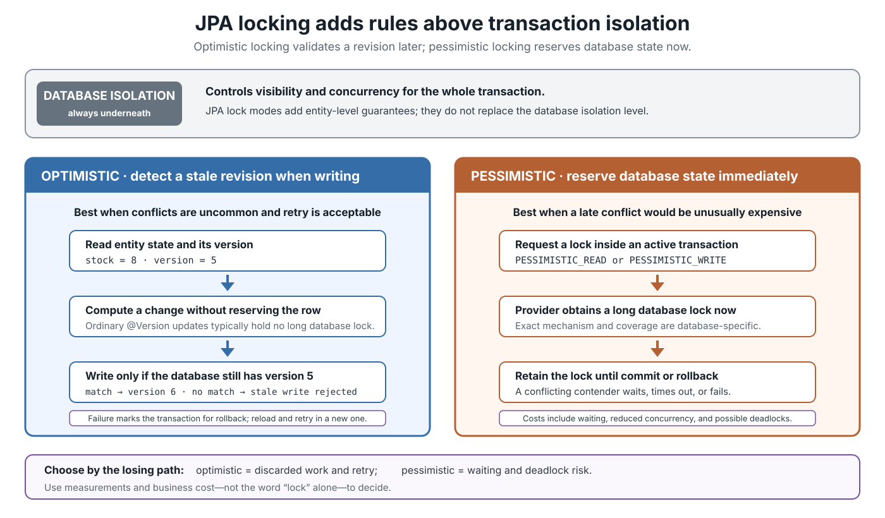
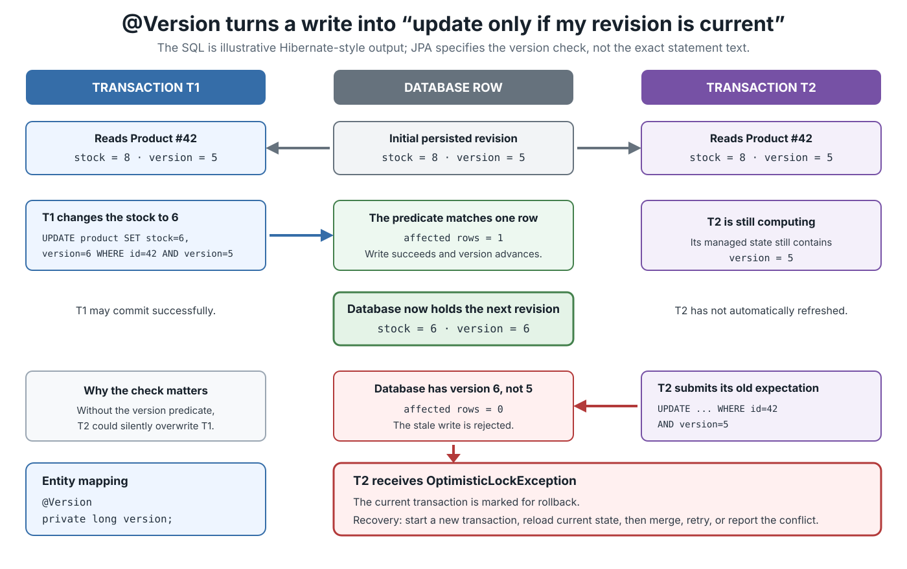
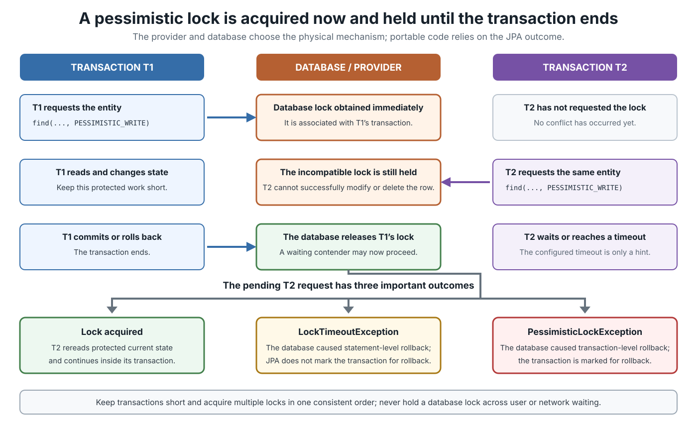

# JPA. Locking

## Front

How do optimistic and pessimistic locking work in JPA, what does each `LockModeType` mean, and when should each strategy be used?

## Back

**JPA locking prevents conflicting transactions from silently corrupting entity state in two different ways: `@Version` detects a stale write later, while a pessimistic lock reserves database state immediately and holds it until the transaction ends.** Database transaction isolation still applies underneath both strategies.

This card builds the mental model first, then covers version checks, explicit lock modes, timeouts, lock scope, exceptions, and selection rules.



### Vocabulary

- A **transaction** is a database unit of work that commits completely or rolls back.
- A **managed entity** is an object currently tracked by an `EntityManager`.
- A **version** identifies the revision of an entity’s persisted state.
- A **lock mode** asks the persistence provider for additional concurrency guarantees on selected entities.

JPA does not replace the database’s isolation level. Isolation controls visibility and concurrency for the transaction as a whole. JPA locking adds rules for particular entity instances.

### Optimistic locking with `@Version`

Optimistic locking assumes conflicts are uncommon. Transactions may work concurrently. When an entity is written, the provider verifies that the version read earlier is still current.

```java
import jakarta.persistence.Entity;
import jakarta.persistence.GeneratedValue;
import jakarta.persistence.Id;
import jakarta.persistence.Version;

@Entity
public class Product {
    @Id
    @GeneratedValue
    private Long id;

    private int stock;

    @Version
    private long version;

    protected Product() {
    }
}
```

For portable JPA, a version attribute may use:

- `int`, `Integer`, `short`, `Short`, `long`, or `Long`;
- `java.sql.Timestamp`;
- `java.time.Instant` or `java.time.LocalDateTime`.

An entity should have at most one version attribute. It should be declared by the root entity class or a mapped superclass and mapped to the primary table. Application code must not manually change the version; the provider owns it.

### How a version conflict is detected

The provider automatically applies optimistic locking whenever it writes a versioned entity. A Hibernate-style update might look like this:

```sql
UPDATE product
SET stock = 6, version = 6
WHERE id = 42 AND version = 5;
```

The exact SQL is not specified by JPA. The important rule is the conditional version check.



If another transaction already changed version `5` to `6`, the stale update cannot match the current row. The provider throws `OptimisticLockException` and marks the transaction for rollback.

The check often happens during flush, but the exact timing can vary:

- a normal update may be checked when SQL is flushed or during commit;
- a stale detached entity passed to `merge()` may be checked during `merge()`, flush, or commit.

Call `em.flush()` when application code must detect a conflict before leaving a specific block. After `OptimisticLockException`, do not keep using the same transaction. Start a new transaction, reload current state, reapply or merge the intended change, and retry only when that operation is safe.

### Explicit optimistic lock modes

Automatic `@Version` checking protects updates and deletes. Explicit optimistic modes are useful when an entity is only read but must remain unchanged until transaction completion.

| Mode | Meaning |
|---|---|
| `OPTIMISTIC` | Ensures the versioned entity is not successfully changed by another transaction before this transaction completes. |
| `OPTIMISTIC_FORCE_INCREMENT` | Provides optimistic protection and forces a version increment, even if this entity was not otherwise changed. |
| `READ` | Synonym for `OPTIMISTIC`; `OPTIMISTIC` is preferred in new code. |
| `WRITE` | Synonym for `OPTIMISTIC_FORCE_INCREMENT`; it is **not** a pessimistic write lock. |

```java
Product product =
    em.find(Product.class, id, LockModeType.OPTIMISTIC);

em.lock(product, LockModeType.OPTIMISTIC_FORCE_INCREMENT);
```

Explicit optimistic modes are portable for versioned entities. A provider is not required to support them for an unversioned entity. Also, “optimistic” does not guarantee that the provider never obtains a database lock: the specification permits different implementations as long as the required result is preserved.

`OPTIMISTIC_FORCE_INCREMENT` is useful for an aggregate root. For example, changing an `OrderLine` can force the parent `Order` version to advance so another workflow holding an older parent revision detects the aggregate change.

### Pessimistic locking

Pessimistic locking assumes that discovering a conflict late would be too costly. The provider must obtain a long-term database lock immediately and retain it until the transaction commits or rolls back.

| Mode | Meaning |
|---|---|
| `PESSIMISTIC_READ` | Provides pessimistic repeatable-read behavior while allowing compatible reads. A provider may promote it to `PESSIMISTIC_WRITE`. |
| `PESSIMISTIC_WRITE` | Serializes transactions attempting conflicting updates of the entity data. |
| `PESSIMISTIC_FORCE_INCREMENT` | Pessimistic write protection plus a forced version increment. Portable use requires a versioned entity. |

`PESSIMISTIC_READ` and `PESSIMISTIC_WRITE` must work for both versioned and unversioned entities. The force-increment mode is not portable for an unversioned entity.

Hibernate uses the database’s locking mechanism rather than an in-memory Java lock. The actual SQL might use `FOR UPDATE`, a lock hint, or another database-specific mechanism. JPA deliberately does not standardize that SQL, and the provider or database may lock more rows than the application selected.

### Database support for each distinct lock behavior

Database “support” has two layers. JPA defines the guarantee, while the provider translates it to SQL for a particular database. The table below covers the physical capabilities of common current engines; it is not a provider certification list. A provider may use a stronger lock when the database lacks an exact shared-lock equivalent.

| Distinct behavior | Databases with the required native or equivalent capability | Databases without the exact native behavior |
|---|---|---|
| Automatic `@Version` check and `OPTIMISTIC` | PostgreSQL, MySQL, MariaDB, Oracle, SQL Server, H2, and SQLite: the provider uses a version predicate or verification query, not a long-term row lock. | None of these engines lacks the basic SQL capability. Explicit `OPTIMISTIC` still requires a versioned entity for portable JPA. |
| `OPTIMISTIC_FORCE_INCREMENT` | All engines above can execute the provider’s version-column `UPDATE`. | There is no special database lock mode to support. Portable use requires a versioned entity and a provider that supports that database. |
| `PESSIMISTIC_READ` | PostgreSQL (`FOR SHARE`), MySQL 8.4 with InnoDB (`FOR SHARE`), MariaDB with InnoDB (`LOCK IN SHARE MODE`), and SQL Server (transaction-held shared locks via lock hints). | Oracle and H2 have no selected-row shared-lock form equivalent to `FOR SHARE`; Hibernate can promote the request to the stronger `FOR UPDATE`. SQLite has no row-level locks, so it cannot provide the exact guarantee. |
| `PESSIMISTIC_WRITE` | PostgreSQL, MySQL/InnoDB, MariaDB/InnoDB, Oracle, and H2 use `FOR UPDATE`; SQL Server provides equivalent update/exclusive lock hints. | SQLite serializes writers with database-file locking instead of locking the selected rows, so exact row-level behavior is unavailable. |
| `PESSIMISTIC_FORCE_INCREMENT` | On a versioned entity, a provider composes an immediate version `UPDATE` with pessimistic write protection. Therefore PostgreSQL, MySQL/InnoDB, MariaDB/InnoDB, Oracle, SQL Server, and H2 have the needed capabilities. | No listed database exposes this as one native lock type; it is provider-created behavior. SQLite still lacks the required exact row-level pessimistic lock. |

`READ` has the same database support as `OPTIMISTIC`, and `WRITE` has the same support as `OPTIMISTIC_FORCE_INCREMENT`, because they are aliases rather than distinct behaviors. `NONE` requests no lock, so database support does not apply.

### Acquiring a pessimistic lock

The following calls must run in an active transaction.

```java
import jakarta.persistence.LockModeType;
import jakarta.persistence.Timeout;

Product product = em.find(
    Product.class,
    id,
    LockModeType.PESSIMISTIC_WRITE,
    Timeout.seconds(2)
);
```

Jakarta Persistence 3.2 introduced the type-safe `Timeout` option. It did not remove the older property form:

```java
Product product = em.find(
    Product.class,
    id,
    LockModeType.PESSIMISTIC_WRITE,
    Map.of("jakarta.persistence.lock.timeout", 2_000)
);
```

For a query:

```java
Product product = em.createQuery(
        "select p from Product p where p.sku = :sku",
        Product.class
    )
    .setParameter("sku", sku)
    .setLockMode(LockModeType.PESSIMISTIC_WRITE)
    .getSingleResult();
```

`em.lock(entity, mode)` requires an already-managed entity. Prefer requesting a pessimistic mode during `find()` or the query when the read itself must be protected; loading first and locking later leaves a concurrency window between those operations.



### Timeouts and lock exceptions

`Timeout.seconds(2)` and the `jakarta.persistence.lock.timeout` value are **hints**. The provider or database may ignore them. A timeout of `0` requests no-wait locking, but portable code must still handle a provider that cannot honor the request.

| Result | JPA exception | Transaction state |
|---|---|---|
| Optimistic version verification fails | `OptimisticLockException` | Marked for rollback |
| Database lock failure causes statement-level rollback | `LockTimeoutException` | JPA must not mark the transaction for rollback |
| Database lock failure causes transaction-level rollback | `PessimisticLockException` | Marked for rollback |

The exception class describes the database failure scope. It does not make retrying an arbitrary business operation automatically safe.

### Pessimistic lock scope

`PessimisticLockScope.NORMAL` is the default. It covers database rows that store the entity’s non-collection state, including required secondary or joined-inheritance rows. A relationship whose foreign key is stored in those rows is covered as a row value, but the referenced entity’s own state is not automatically locked.

`PessimisticLockScope.EXTENDED` additionally covers rows for owned element collections and owned relationships stored in join tables. It still does **not** lock the state of the referenced entities.

```java
import jakarta.persistence.PessimisticLockScope;

Order order = em.find(
    Order.class,
    id,
    LockModeType.PESSIMISTIC_WRITE,
    PessimisticLockScope.EXTENDED,
    Timeout.seconds(2)
);
```

The provider must observe the requested scope, but it may lock more rows than requested. Lock collection members explicitly when their entity state must also be protected.

### Transaction isolation versus JPA locking

These mechanisms cooperate but answer different questions:

| Mechanism | Main question |
|---|---|
| Database isolation | Which changes may this transaction see, and how do concurrent database operations interact? |
| Automatic `@Version` locking | Is the revision I am about to update or delete still current? |
| Explicit optimistic mode | Did a selected versioned entity remain unchanged until my transaction completed? |
| Pessimistic mode | Can I reserve selected database state before performing conflicting work? |

An isolation level alone cannot detect that a detached object became stale while no transaction was open—for example, while a user edited a form. A version column survives that gap and is checked when the object is later merged or updated.

### Choosing a strategy

| Situation | Good starting point |
|---|---|
| Ordinary CRUD with low or moderate contention | `@Version` |
| User edits data across separate transactions | `@Version`, then report or safely retry conflicts |
| Reading a hot row before an immediate update | `PESSIMISTIC_WRITE` with a timeout |
| Need repeatable-read behavior for selected entity data | `OPTIMISTIC` or `PESSIMISTIC_READ`, depending on whether late failure is acceptable |
| A child change must invalidate readers of the aggregate root | `OPTIMISTIC_FORCE_INCREMENT` on the root |
| Pessimistic writer must also invalidate older optimistic readers | `PESSIMISTIC_FORCE_INCREMENT` |

Start with `@Version` for concurrently edited entities. Choose pessimistic locking when contention or the cost of a late failure justifies waiting and deadlock risk. Keep pessimistic transactions short and acquire multiple locks in one consistent order.

### Common mistakes

- Assuming `LockModeType.WRITE` means `PESSIMISTIC_WRITE`; it is an optimistic alias.
- Retrying after `OptimisticLockException` inside the already-doomed transaction.
- Assuming every optimistic check occurs only at commit.
- Assuming `PESSIMISTIC_WRITE` always produces the same SQL on every database.
- Treating a lock timeout as guaranteed instead of a provider/database hint.
- Believing `PessimisticLockScope.EXTENDED` locks every referenced entity.
- Holding a pessimistic lock while waiting for user input, a remote service, or message delivery.
- Assuming an entity without `@Version` receives portable automatic optimistic protection.

## Sources

- [Jakarta Persistence 3.2 specification — Locking and Concurrency](https://jakarta.ee/specifications/persistence/3.2/jakarta-persistence-spec-3.2#locking-and-concurrency)
- [Jakarta Persistence 3.2 API — `Version`](https://jakarta.ee/specifications/persistence/3.2/apidocs/jakarta.persistence/jakarta/persistence/version)
- [Jakarta Persistence 3.2 API — `LockModeType`](https://jakarta.ee/specifications/persistence/3.2/apidocs/jakarta.persistence/jakarta/persistence/lockmodetype)
- [Jakarta Persistence 3.2 API — `EntityManager`](https://jakarta.ee/specifications/persistence/3.2/apidocs/jakarta.persistence/jakarta/persistence/entitymanager)
- [Jakarta Persistence 3.2 API — `Timeout`](https://jakarta.ee/specifications/persistence/3.2/apidocs/jakarta.persistence/jakarta/persistence/timeout)
- [Jakarta Persistence 3.2 API — `PessimisticLockScope`](https://jakarta.ee/specifications/persistence/3.2/apidocs/jakarta.persistence/jakarta/persistence/pessimisticlockscope)
- [Hibernate ORM 7.2 User Guide — Locking](https://docs.hibernate.org/orm/7.2/userguide/html_single/#locking)
- [PostgreSQL 18 documentation — Explicit row-level locking](https://www.postgresql.org/docs/18/explicit-locking.html#LOCKING-ROWS)
- [MySQL 8.4 Reference Manual — InnoDB locking reads](https://dev.mysql.com/doc/refman/8.4/en/innodb-locking-reads.html)
- [MariaDB documentation — `LOCK IN SHARE MODE`](https://mariadb.com/docs/server/reference/sql-statements/data-manipulation/selecting-data/lock-in-share-mode)
- [Oracle AI Database 26 documentation — Data concurrency and locking](https://docs.oracle.com/en/database/oracle/oracle-database/26/cncpt/data-concurrency-and-consistency.html)
- [Microsoft SQL Server documentation — Table lock hints](https://learn.microsoft.com/en-us/sql/t-sql/queries/hints-transact-sql-table)
- [H2 documentation — `SELECT ... FOR UPDATE`](https://h2database.github.io/html/commands.html#select)
- [SQLite documentation — Isolation and database-file write serialization](https://www.sqlite.org/isolation.html)
