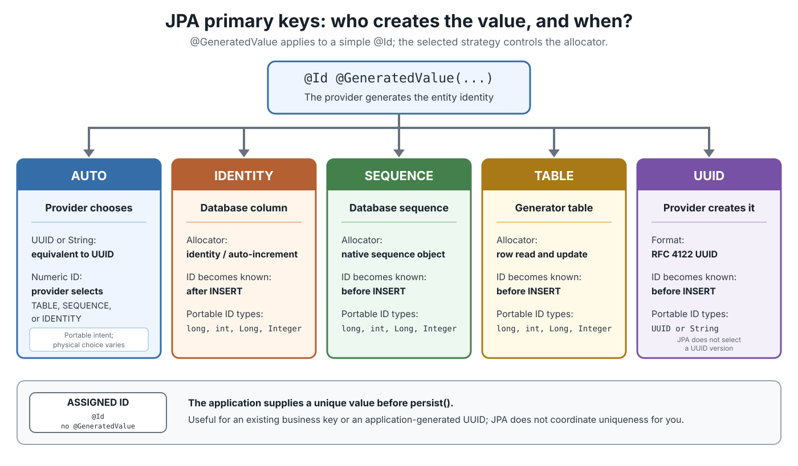
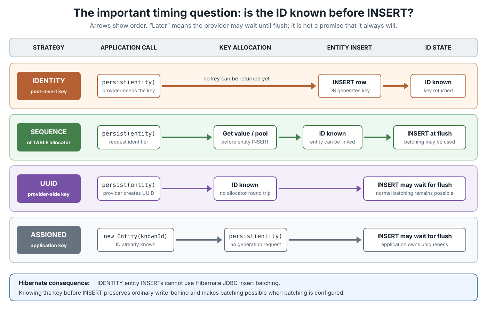
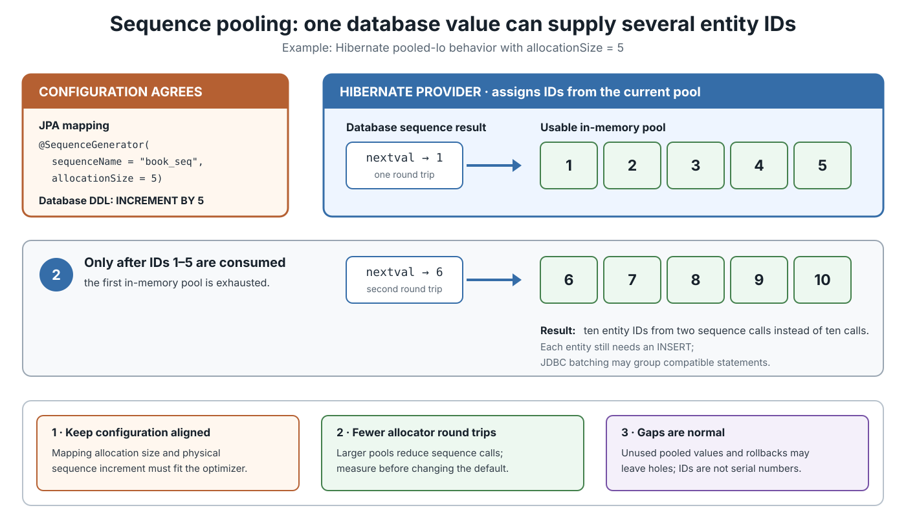

# JPA. Primary key generation

## Front

How does JPA generate a primary key, and how should you choose between `AUTO`, `IDENTITY`, `SEQUENCE`, `TABLE`, `UUID`, and an application-assigned ID?

## Back

**JPA primary-key generation** uses `@GeneratedValue` for a simple entity ID. 

Jakarta Persistence 3.2 defines five strategies; 

`GenerationType.UUID` has been standard since Jakarta Persistence 3.1. 

The main question is: **who allocates the value, and is it known before the entity’s `INSERT`?**

This card first builds that mental model, then compares timing, Hibernate batching, sequence pooling, mappings, and common mistakes.



### The smallest useful mapping

`@Id` marks the attribute that identifies an entity. `@GeneratedValue` tells the **persistence provider**—for example, Hibernate—to generate it.

```java
import jakarta.persistence.Entity;
import jakarta.persistence.GeneratedValue;
import jakarta.persistence.GenerationType;
import jakarta.persistence.Id;

@Entity
public class Book {
    @Id
    @GeneratedValue(strategy = GenerationType.IDENTITY)
    private Long id;

    protected Book() {
    }
}
```

Portable JPA support is required only for **simple primary keys**. Do not expect `@GeneratedValue` to generate one part of an `@EmbeddedId`, an `@IdClass`, or a derived ID.

### Strategy comparison

| Choice | Who allocates the ID? | Portable Java ID types | ID known relative to entity `INSERT` | Hibernate insert batching |
|---|---|---|---|---|
| `AUTO` | Provider chooses | `UUID`/`String`, or `long`/`int` and wrappers | Depends on chosen strategy | Depends |
| `IDENTITY` | Database identity/auto-increment column | `long`, `int`, `Long`, `Integer` | **After** the row is inserted | Not available for those entity inserts |
| `SEQUENCE` | Database sequence | Numeric types above | **Before** the row is inserted | Remains possible when configured |
| `TABLE` | A row in a generator table | Numeric types above | **Before** the row is inserted | Remains possible, but allocation needs table coordination |
| `UUID` | Persistence provider | `UUID` or `String` | **Before** the row is inserted | Remains possible when configured |
| Assigned | Application code | A valid mapped ID type | Before `persist()` | No generator restriction; application owns uniqueness |

“Batching remains possible” is not a promise that batching is enabled. Hibernate batching also depends on settings such as `hibernate.jdbc.batch_size` and on the rest of the mapping.



### Database support for each real choice

Database support has two layers: the engine must have the needed physical capability, and the persistence provider must know how to use it. The table covers common current engines—PostgreSQL 18, MySQL 8.4, current MariaDB, Oracle AI Database 26, SQL Server, H2 2.x, and SQLite 3. It is a capability comparison, not a provider certification list.

| Choice | Databases with native or equivalent support | Databases without the exact native feature |
|---|---|---|
| `AUTO` | All listed databases, because the provider selects the physical strategy. With Hibernate 7.2, numeric `AUTO` uses a sequence on PostgreSQL, MariaDB, Oracle, SQL Server, and H2, but a table-backed allocator on MySQL and SQLite; `UUID` or `String` uses `UUID`. | No database guarantees one fixed `AUTO` result. The provider and dialect determine the choice. |
| `IDENTITY` | PostgreSQL (`GENERATED ... AS IDENTITY`), MySQL and MariaDB (`AUTO_INCREMENT`), Oracle (`GENERATED ... AS IDENTITY`), SQL Server (`IDENTITY`), H2 (`GENERATED ... AS IDENTITY`), and SQLite through automatic `INTEGER PRIMARY KEY`/ROWID assignment. | SQLite has equivalent generated-key behavior but no SQL-standard identity-column syntax; the provider’s SQLite dialect must bridge that difference. |
| `SEQUENCE` | PostgreSQL, MariaDB, Oracle, SQL Server, and H2 have standalone sequence objects. | MySQL 8.4 and SQLite have no standalone sequence object. Hibernate’s `SequenceStyleGenerator` can substitute a generator table there, but that is provider emulation rather than native `SEQUENCE`; another provider may reject the mapping. |
| `TABLE` | All listed databases can use a normal table as an ID allocator. | None lacks the basic capability. SQLite serializes writes at database level, so the allocator has coarser contention than a row-locking server database. |
| `UUID` | All listed databases: JPA requires the provider to generate the UUID, so no database-side UUID generator or native UUID column type is required. | None of the listed databases is excluded; the provider maps the `UUID` or `String` ID to an appropriate column representation. |
| Assigned | All listed databases, because application code supplies the value before `persist()`. | None; uniqueness is the application’s responsibility. |

### `AUTO`: portable request, provider-specific result

A bare `@GeneratedValue` uses `AUTO`.

```java
@Id
@GeneratedValue
private Long id;
```

Jakarta Persistence 3.2 defines the high-level decision:

- `UUID` or `String` ID → behave like `UUID`.
- `long`, `int`, `Long`, or `Integer` ID → the provider chooses `TABLE`, `SEQUENCE`, or `IDENTITY`.

The exact physical mechanism is provider-specific. In Hibernate ORM 7.2, numeric `AUTO` uses `SequenceStyleGenerator`: it uses a real sequence when the database supports sequences and a table-backed allocator otherwise. Therefore, **do not assume `AUTO` means auto-increment**.

Use `AUTO` when provider choice is acceptable. Name the strategy explicitly when schema behavior, batching, or migration scripts depend on it.

### `IDENTITY`: the database generates the key during `INSERT`

```java
@Id
@GeneratedValue(strategy = GenerationType.IDENTITY)
private Long id;
```

The database must insert the row before it can return the key. This is a **post-insert** generator.

That timing has an important Hibernate consequence: Hibernate cannot use JDBC insert batching for entities whose IDs use `IDENTITY`. It may also need to insert earlier than it would with an ID known in advance.

`IDENTITY` is still a sensible choice when the database naturally uses identity columns, inserts are not batch-heavy, and simple schema behavior matters more than write-behind.

### `SEQUENCE`: get an ID before the entity row is inserted

```java
import jakarta.persistence.SequenceGenerator;

@Id
@GeneratedValue(
    strategy = GenerationType.SEQUENCE,
    generator = "book_ids"
)
@SequenceGenerator(
    name = "book_ids",          // JPA generator name
    sequenceName = "book_seq",  // physical database sequence
    allocationSize = 50
)
private Long id;
```

The provider asks a database sequence for values before the entity `INSERT`. Because the ID already exists, Hibernate can keep normal **write-behind**—collecting SQL until flush—and can batch compatible inserts when batching is enabled.

`@SequenceGenerator` defaults `allocationSize` to `50`. It describes how many values the provider allocates at a time, not how many entity rows one SQL `INSERT` statement contains.



Hibernate’s pooled optimizers reduce allocator round trips. In the illustrated pooled-lo example, a sequence value of `1` plus an increment/allocation size of `5` supplies IDs `1–5`; the next sequence value, `6`, supplies `6–10`.

Keep the mapping, provider optimizer, and physical sequence definition consistent. For that example, migration DDL would include:

```sql
CREATE SEQUENCE book_seq
    START WITH 1
    INCREMENT BY 5;
```

Do not treat generated IDs as gapless serial numbers. A rollback, a stopped application, or an unused pool can leave holes. The purpose of a primary key is stable uniqueness, not consecutive numbering.

### `TABLE`: emulate a sequence with a normal table

```java
import jakarta.persistence.TableGenerator;

@Id
@GeneratedValue(
    strategy = GenerationType.TABLE,
    generator = "book_ids"
)
@TableGenerator(
    name = "book_ids",
    table = "id_generator",
    pkColumnName = "segment_name",
    valueColumnName = "next_value",
    pkColumnValue = "book",
    allocationSize = 50
)
private Long id;
```

The provider reads and updates a row that stores the next allocation value. Hibernate’s documented flow uses row locking and an update, so this allocator requires more database coordination than reading a native sequence. Pooling reduces how often that coordination is needed.

Use it mainly when sequence-like behavior is required but a native sequence is unavailable. Remember that Hibernate may choose a table-backed allocator for numeric `AUTO` on such a database.

### `UUID`: provider-generated, database-independent identity

```java
import java.util.UUID;

@Id
@GeneratedValue(strategy = GenerationType.UUID)
private UUID id;
```

The provider generates an RFC 4122 UUID. Jakarta Persistence intentionally does **not** require one UUID version, so portable code must not assume random, time-based, or time-ordered values.

Current Hibernate defaults its `@UuidGenerator` to random UUID version 4. It also exposes Hibernate-specific styles, including an incubating version 7 style:

```java
import java.util.UUID;
import org.hibernate.annotations.UuidGenerator;

@Id
@GeneratedValue
@UuidGenerator(style = UuidGenerator.Style.VERSION_7)
private UUID id;
```

Use the second mapping only when depending on that Hibernate version and its incubating API is acceptable. Prefer a native UUID or 16-byte database type when available instead of storing the textual 36-character form merely for display convenience.

### Application-assigned IDs

`@GeneratedValue` is optional. The application may set an ID before persistence:

```java
import java.util.UUID;

@Id
private UUID id = UUID.randomUUID();
```

This gives the application immediate access to the ID and avoids a database allocator. In return, the application must guarantee uniqueness and must have clear rules for distinguishing new and existing entities.

### How to choose

- Choose `SEQUENCE` when the database supports sequences and write-behind or batch inserts matter.
- Choose `IDENTITY` when identity columns are the natural database mechanism and high-volume insert batching is not important.
- Choose `UUID` or an assigned distributed ID when independent writers need IDs without a shared database sequence.
- Choose `TABLE` only when you need a database-coordinated numeric allocator without native sequence support.
- Choose `AUTO` only when letting the provider and database decide is genuinely acceptable.

### Common mistakes

- Assuming `AUTO` has the same physical behavior on every provider and database.
- Expecting Hibernate to batch entity inserts that use `IDENTITY`.
- Setting `allocationSize` without aligning database DDL and the provider’s optimizer expectations.
- Reusing a generator name accidentally: JPA generator names are global within a persistence unit.
- Requiring generated keys to be gapless or using them as legally meaningful document numbers.
- Assuming `GenerationType.UUID` promises UUIDv4 or UUIDv7.
- Applying `@GeneratedValue` to a composite or derived key and expecting portable behavior.

## Sources

- [Jakarta Persistence 3.2 — `GeneratedValue`](https://jakarta.ee/specifications/persistence/3.2/apidocs/jakarta.persistence/jakarta/persistence/generatedvalue)
- [Jakarta Persistence 3.2 — `GenerationType`](https://jakarta.ee/specifications/persistence/3.2/apidocs/jakarta.persistence/jakarta/persistence/generationtype)
- [Jakarta Persistence 3.2 — `SequenceGenerator`](https://jakarta.ee/specifications/persistence/3.2/apidocs/jakarta.persistence/jakarta/persistence/sequencegenerator)
- [Jakarta Persistence 3.2 — `TableGenerator`](https://jakarta.ee/specifications/persistence/3.2/apidocs/jakarta.persistence/jakarta/persistence/tablegenerator)
- [Hibernate ORM 7.2 User Guide — identifiers and generators](https://docs.hibernate.org/orm/7.2/userguide/html_single/#identifiers-generators)
- [Hibernate ORM current API — `UuidGenerator.Style`](https://docs.hibernate.org/orm/current/javadocs/org/hibernate/annotations/UuidGenerator.Style.html)
- [PostgreSQL 18 documentation — Identity columns](https://www.postgresql.org/docs/18/ddl-identity-columns.html)
- [PostgreSQL 18 documentation — `CREATE SEQUENCE`](https://www.postgresql.org/docs/18/sql-createsequence.html)
- [MySQL 8.4 Reference Manual — `AUTO_INCREMENT`](https://dev.mysql.com/doc/refman/8.4/en/create-table.html)
- [MariaDB documentation — `AUTO_INCREMENT`](https://mariadb.com/docs/server/reference/data-types/auto_increment)
- [MariaDB documentation — Sequence objects](https://mariadb.com/docs/server/reference/sql-structure/sequences/sequence-overview)
- [Oracle AI Database 26 documentation — Identity columns](https://docs.oracle.com/en/database/oracle/oracle-database/26/sqlrf/CREATE-TABLE.html#GUID-B436EC8F-54F0-4C99-9DB8-7D2528A846F1)
- [Oracle AI Database 26 documentation — `CREATE SEQUENCE`](https://docs.oracle.com/en/database/oracle/oracle-database/26/sqlrf/CREATE-SEQUENCE.html)
- [SQL Server documentation — `IDENTITY` property](https://learn.microsoft.com/en-us/sql/t-sql/statements/create-table-transact-sql-identity-property)
- [SQL Server documentation — `CREATE SEQUENCE`](https://learn.microsoft.com/en-us/sql/t-sql/statements/create-sequence-transact-sql)
- [H2 documentation — Identity columns and `CREATE SEQUENCE`](https://h2database.github.io/html/commands.html)
- [SQLite documentation — ROWID and `AUTOINCREMENT`](https://www.sqlite.org/autoinc.html)
