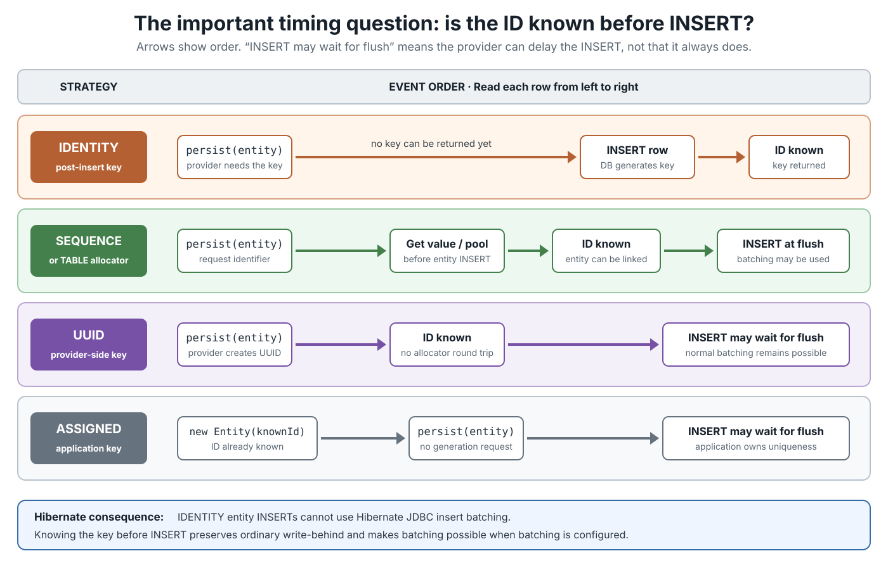
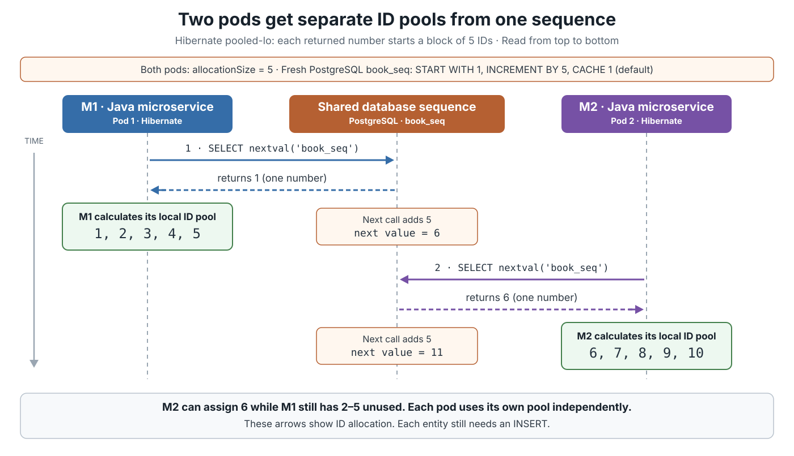
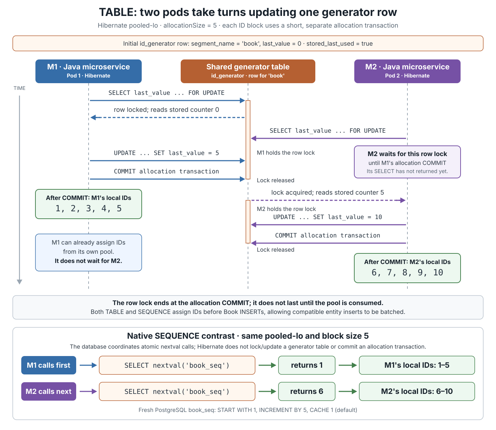

# JPA. Primary key generation

<!-- Card mode: complex. Validate with --mode complex. -->

## Front

How does JPA generate a primary key, and how should you choose between `AUTO`, `IDENTITY`, `SEQUENCE`, `TABLE`, `UUID`, and an application-assigned ID?

## Back

**Java Persistence API (JPA) primary-key generation** uses `@GeneratedValue` for a simple entity ID. Jakarta Persistence 3.2 defines five strategies; `GenerationType.UUID` was introduced in Jakarta Persistence 3.1.

The Hibernate-specific behavior and examples below target **Hibernate ORM 7.4.7.Final**, which implements Jakarta Persistence 3.2, except where a production example names its own release.

The main question is: **who allocates the value, and is it known before the entity’s `INSERT`?**

This card first builds that mental model, then compares timing, Hibernate batching, sequence pooling, mappings, and common mistakes. The overview below groups the five generated strategies by who allocates the ID.


### Basic annotations

`@Id` marks the attribute that identifies an entity. `@GeneratedValue` tells the **persistence provider**—for example, Hibernate—to generate it.

Portable JPA support is required only for **simple primary keys**. Do not expect `@GeneratedValue` to generate one part of an `@EmbeddedId`, an `@IdClass`, or a derived ID.

### Strategy comparison

| Choice | Who allocates the ID? | Portable Java ID types | ID known relative to entity `INSERT` | Hibernate insert batching |
|---|---|---|---|---|
| `AUTO` | Provider chooses | `UUID`/`String`, or `long`/`int` and wrappers | Depends on chosen strategy | Depends |
| `IDENTITY` | Database identity/auto-increment column | `long`, `int`, `Long`, `Integer` | **After** the row is inserted | Not available for those entity inserts |
| `SEQUENCE` | Database sequence | Numeric types above | **Before** the row is inserted | Remains possible when configured |
| `TABLE` | A row in a generator table | Numeric types above | **Before** the row is inserted | Remains possible, but allocation needs table coordination |
| `UUID` | Persistence provider | `UUID` or `String` | **Before** the row is inserted | Remains possible when configured |
| Assigned | Application code | A valid mapped ID type | Before `persist()` | No generator restriction; application owns uniqueness |

“Batching remains possible” is not a promise that batching is enabled. Hibernate batching also depends on settings such as `hibernate.jdbc.batch_size` and on the rest of the mapping. Read each row of the timeline from left to right to compare when allocation and insertion happen.



### Database support for each real choice

Database support has two layers: the engine must have the needed physical capability, and the persistence provider must know how to use it. The table covers common current engines—PostgreSQL 18, MySQL 8.4, current MariaDB, Oracle AI Database 26, SQL Server, H2 2.x, and SQLite 3. It is a capability comparison, not a provider certification list.

| Choice | Databases with native or equivalent support | Databases without the exact native feature |
|---|---|---|
| `AUTO` | All listed databases, because the provider selects the physical strategy. With Hibernate 7.4, numeric `AUTO` uses a sequence on PostgreSQL, MariaDB, Oracle, SQL Server, and H2, but a table-backed allocator on MySQL and SQLite; `UUID` or `String` uses `UUID`. | No database guarantees one fixed `AUTO` result. The provider and dialect determine the choice. |
| `IDENTITY` | <ul><li>PostgreSQL (<code>GENERATED ... AS IDENTITY</code>)</li><li>MySQL and MariaDB (<code>AUTO_INCREMENT</code>)</li><li>Oracle (<code>GENERATED ... AS IDENTITY</code>)</li><li>SQL Server (<code>IDENTITY</code>)</li><li>H2 (<code>GENERATED ... AS IDENTITY</code>)</li><li>SQLite through automatic <code>INTEGER PRIMARY KEY</code>/ROWID assignment</li></ul> | SQLite has equivalent generated-key behavior but no SQL-standard identity-column syntax; the provider’s SQLite dialect must bridge that difference. |
| `SEQUENCE` | PostgreSQL, MariaDB, Oracle, SQL Server, and H2 have standalone sequence objects. | MySQL 8.4 and SQLite have no standalone sequence object. Hibernate’s `SequenceStyleGenerator` can substitute a generator table there, but that is provider emulation rather than native `SEQUENCE`; another provider may reject the mapping. |
| `TABLE` | All listed databases can use a normal table as an ID allocator. | None lacks the basic capability. SQLite serializes writes at database level, so the allocator has coarser contention than a row-locking server database. |
| `UUID` | All listed databases: JPA requires the provider to generate the UUID, so no database-side UUID generator or native UUID column type is required. | None of the listed databases is excluded; the provider maps the `UUID` or `String` ID to an appropriate column representation. |
| Assigned | All listed databases, because application code supplies the value before `persist()`. | None; uniqueness is the application’s responsibility. |

### `AUTO`: portable request, provider-specific result

A bare `@GeneratedValue` uses `AUTO`.

```java
@Id
@GeneratedValue
private Long id;
```

Jakarta Persistence 3.2 defines the high-level decision:

- `UUID` or `String` ID → behave like `UUID`.
- `long`, `int`, `Long`, or `Integer` ID → the provider chooses `TABLE`, `SEQUENCE`, or `IDENTITY`.

The exact physical mechanism is provider-specific. In Hibernate ORM 7.4, numeric `AUTO` uses `SequenceStyleGenerator`: it uses a real sequence when the database supports sequences and a table-backed allocator otherwise. Therefore, **do not assume `AUTO` means auto-increment**.

Use `AUTO` when provider choice is acceptable. Name the strategy explicitly when schema behavior, batching, or migration scripts depend on it.

### `IDENTITY`: the database generates the key during `INSERT`

An **identity column** is a database column whose numeric value the **database generates automatically when a row is inserted**. It is commonly used for an `id`.

For example, in PostgreSQL:

```sql
CREATE TABLE book (
    id BIGINT GENERATED ALWAYS AS IDENTITY PRIMARY KEY,
    title TEXT
);
```

Insert books **without supplying an ID**:

```sql
INSERT INTO book (title) VALUES ('Dune');
INSERT INTO book (title) VALUES ('Foundation');
```

An identity column is **not automatically a primary key**. In this example, the separate `PRIMARY KEY` declaration makes `id` the primary key and enforces uniqueness; `IDENTITY` alone does not guarantee uniqueness.

The database must insert the row before it can return the key. This is a **post-insert** generator.

```java
import jakarta.persistence.Entity;
import jakarta.persistence.GeneratedValue;
import jakarta.persistence.GenerationType;
import jakarta.persistence.Id;

@Entity
public class Book {
    @Id
    @GeneratedValue(strategy = GenerationType.IDENTITY)
    private Long id;

    protected Book() {
    }
}
```

That timing has an important Hibernate consequence: Hibernate cannot use JDBC insert batching for entities whose IDs use `IDENTITY`. It may also need to insert earlier than it would with an ID known in advance.

`IDENTITY` is a practical choice when an existing schema uses identity or auto-increment columns and the loss of Hibernate insert batching is acceptable. For example, a transaction that creates one support ticket has no group of ticket inserts to batch. The batching opportunity depends on how many compatible inserts can be grouped within a transaction, not on the application's total number of users.

**One row per transaction is not a requirement.** `IDENTITY` also works when a transaction inserts many rows, but Hibernate executes those entity inserts individually. For bulk entity insertion, prefer `SEQUENCE` when the database supports it, so Hibernate can batch compatible inserts when batching is enabled.

### `SEQUENCE`: get an ID before the entity row is inserted

A **database sequence** is a database object that returns the next number whenever an application asks for it. It exists separately from the entity rows, so the application can obtain an ID **before inserting a row**.

For example, create this shared sequence in PostgreSQL:

```sql
CREATE SEQUENCE book_seq
    START WITH 1
    INCREMENT BY 5;
```

`START WITH 1` makes the first value `1`. `INCREMENT BY 5` makes successive values `1, 6, 11, 16, …`. Each `nextval('book_seq')` call returns **one number**; it does not insert a book.

Suppose the same Java service runs in two **Kubernetes** pods, **M1** and **M2**—two running instances. Both share `book_seq` and use this ID field mapping inside their `Book` entity:

```java
import jakarta.persistence.GeneratedValue;
import jakarta.persistence.GenerationType;
import jakarta.persistence.Id;
import jakarta.persistence.SequenceGenerator;

@Id
@GeneratedValue(
    strategy = GenerationType.SEQUENCE,
    generator = "book_ids"
)
@SequenceGenerator(
    name = "book_ids",          // JPA generator name
    sequenceName = "book_seq",  // physical database sequence
    allocationSize = 5
)
private Long id;
```

`allocationSize = 5` configures allocation in blocks of five IDs, matching the database increment in this example. The annotation's default is `50`; the allocation size does not specify how many rows one SQL `INSERT` contains.

For the exact ranges below, set this Hibernate property in both pods:

```properties
hibernate.id.optimizer.pooled.preferred=pooled-lo
```

This selects Hibernate's **`pooled-lo` optimizer**, which treats each returned sequence number as the **first ID in a local block**. The Java annotations alone do not select this optimizer; Hibernate ORM 7.4 otherwise defaults to `pooled`, which interprets the number as the upper end of a block.

Read the sequence diagram from top to bottom, starting with the fresh `book_seq` above. M1 requests a value first and receives `1`, giving it IDs `1–5`. M2 requests the next value and receives `6`, giving it IDs `6–10`.



The database allocates sequence values atomically, so concurrent requests receive distinct values. With the matching configuration above, the pods' ID blocks do not overlap. Each pod assigns IDs from its block locally; M2 does not wait for M1 to use all five IDs. ID order therefore need not match insertion order.

Pooling supplies **five entity IDs per sequence query**. Each entity still needs an `INSERT`. Because the ID is already known, Hibernate can keep **write-behind**—collecting SQL until flush—and batch compatible inserts when batching is enabled.

Do not treat generated IDs as gapless serial numbers. A rollback, a stopped application, or an unused pool can leave holes. The purpose of a primary key is stable uniqueness, not consecutive numbering.

### `TABLE`: emulate a sequence with a normal table

**`TABLE` generates IDs using a shared counter stored in a row of an ordinary database table.** Hibernate locks that row, reads the counter, and updates it to reserve IDs. The generator table is separate from the table containing the entities; no native database sequence object is needed.

For example, create a generator table and its counter row in PostgreSQL:

```sql
CREATE TABLE id_generator (
    segment_name VARCHAR(64) PRIMARY KEY,
    last_value BIGINT NOT NULL
);

INSERT INTO id_generator (segment_name, last_value)
VALUES ('book', 0);
```

`segment_name = 'book'` identifies the counter shared by both pods for book IDs. With the Hibernate configuration below, `last_value` stores the **highest reserved ID**, not the number of books already inserted. Starting at `0` allows the first reserved block to be `1–5`.

Both pods use this ID field mapping inside their `Book` entity:

```java
import jakarta.persistence.GeneratedValue;
import jakarta.persistence.GenerationType;
import jakarta.persistence.Id;
import jakarta.persistence.TableGenerator;

@Id
@GeneratedValue(
    strategy = GenerationType.TABLE,
    generator = "book_table_ids"
)
@TableGenerator(
    name = "book_table_ids",
    table = "id_generator",
    pkColumnName = "segment_name",
    valueColumnName = "last_value",
    pkColumnValue = "book",
    initialValue = 0,
    allocationSize = 5
)
private Long id;
```

For this Hibernate ORM 7.4 example, use these properties in both pods:

```properties
hibernate.id.optimizer.pooled.preferred=pooled-lo
hibernate.id.generator.stored_last_used=true
```

`pooled-lo` selects the same block-allocation algorithm as in the sequence example. `stored_last_used=true` makes the table store the last reserved value; this is Hibernate's default storage mode. Together with `allocationSize = 5`, these settings make the counter advance **`0 → 5 → 10`**, reserving IDs **`1–5`**, then **`6–10`**.

Read the sequence diagram from top to bottom. M1 and M2 try to reserve IDs from the same `'book'` row. `SELECT … FOR UPDATE` reads and locks that row, so M2 must wait while M1 holds the lock. Hibernate commits each reservation in a **separate, short allocation transaction**, releasing the lock before the pod uses its ID block for entity inserts.



The difference from a native database sequence is the work needed to reserve each block:

- **Native `SEQUENCE`:** PostgreSQL's `nextval('book_seq')` allocates a value atomically. Hibernate does not issue a separate locked read and update of a generator-table row.
- **`TABLE`:** Hibernate performs a locked read and an update, then commits the allocation transaction. Pods using the same counter row may wait for that lock, adding SQL work and contention. Pooling reduces how often they need a new reservation.
- **Both:** pods can assign IDs from their reserved blocks independently. IDs are known before the entity `INSERT`, and Hibernate can batch compatible entity inserts when batching is enabled.

M2 waits for M1's **allocation commit**, not for M1 to insert all five books or commit its business transaction. If M1 later rolls back its book inserts, the reserved IDs remain consumed, so gaps are possible.

Use it mainly when sequence-like behavior is required but a native sequence is unavailable. Remember that Hibernate may choose a table-backed allocator for numeric `AUTO` on such a database.

### `UUID`: provider-generated, database-independent identity

**A universally unique identifier (UUID) is a 128-bit identifier. `GenerationType.UUID` makes the persistence provider responsible for creating it.** With Hibernate, generation happens in the Java process before the entity's `INSERT`; it needs no database sequence, auto-increment column, or database UUID function.

Modern, portable ID field mapping inside an entity:

```java
import jakarta.persistence.GeneratedValue;
import jakarta.persistence.GenerationType;
import jakarta.persistence.Id;
import java.util.UUID;

@Id
@GeneratedValue(strategy = GenerationType.UUID)
private UUID id;
```

The practical benefit is that the provider can allocate record IDs before insertion without a shared database counter. Hibernate insert batching remains possible when configured. **Having an ID does not mean the transaction has committed**; saving the record still requires a database.

The provider generates an RFC 4122 UUID. Jakarta Persistence intentionally does **not** require one UUID version, so portable code must not assume random, time-based, or time-ordered values.

Hibernate ORM 7.4 defaults its `@UuidGenerator` to random UUID version 4. It also exposes Hibernate-specific styles, including an incubating version 7 style. Alternative ID field mapping:

```java
import java.util.UUID;
import org.hibernate.annotations.UuidGenerator;

@Id
@GeneratedValue
@UuidGenerator(style = UuidGenerator.Style.VERSION_7)
private UUID id;
```

Use the version 7 mapping only when depending on Hibernate ORM 7.4 and its incubating API is acceptable. Prefer a native UUID or 16-byte database type when available instead of storing the textual 36-character form merely for display convenience.

#### **Production example: Apache Airflow 3 (outside Java)**

This example uses **Python/SQLAlchemy**. In **Airflow 3.0.0**, `DagVersion` stores versions of workflow definitions. Its SQLAlchemy mapping contains this Python field declaration:

```python
id = Column(UUIDType(binary=False), primary_key=True, default=uuid6.uuid7)
```

`DagVersion.write_dag()` creates the record without supplying an ID and adds it to the SQLAlchemy session. When preparing the `INSERT`, SQLAlchemy invokes the Python function `uuid6.uuid7` and sends the generated UUIDv7 as the primary-key value. The declaration passes the function without calling it, so SQLAlchemy can generate a value for each inserted record that lacks an ID.

This demonstrates **provider-generated, database-independent UUID identity outside JPA**: SQLAlchemy performs generation in the Python process, with no database-side UUID function or sequence. The database still stores and enforces the primary key. This example uses Python/SQLAlchemy rather than Java's `GenerationType.UUID` annotation.

### Application-assigned IDs

**Application-assigned means application code supplies the ID before `persist()`.** The value can still be a UUID; the difference is who creates it and when it becomes available. Omit `@GeneratedValue` for this mapping.

For example, this entity-field fragment assigns an ID when a Java object is constructed:

```java
import jakarta.persistence.Id;
import java.util.UUID;

@Id
private UUID id = UUID.randomUUID();
```

Assigned IDs also fit an import that must preserve a source system's stable, unique identifiers. They do not have to be UUIDs: the application can supply another valid mapped ID type.

**Production details:** UUID collisions are extremely unlikely with a sound random generator, but they are not mathematically impossible; keep the database primary-key constraint. Application code owns ID assignment and must distinguish new entities from existing ones.

**The following production-system examples demonstrate Java code assigning UUID identity outside JPA.** They show why an ID can be useful before storage; neither example uses `GenerationType.UUID`.

#### **Production example: Apache Kafka 4.0.0 — topic identity**

A topic is a named stream of records. In `ReplicationControlManager.createTopic()`, the controller generates the topic's UUID in Java with `Uuid.randomUuid()` and places it in a `TopicRecord` before the record is persisted in the metadata log. `Uuid` is Kafka's own UUID class.

This lets Kafka distinguish two topics with the same name at different times. For example, deleting the `orders` topic and creating another `orders` topic gives the new topic a fresh identity. The UUID identifies the topic in metadata; it is not a JPA entity primary key.

#### **Production example: Apache Cassandra (4.1 source branch) — node identity**

A node is a Cassandra server participating in the cluster. `SystemKeyspace.getOrInitializeLocalHostId()` reuses the stored host ID when one exists. Otherwise, its default generator uses Java's `UUID.randomUUID()`, writes the new value to `system.local.host_id`, and flushes it to disk.

The stored UUID lets the node retain its identity across restarts while its local system data is preserved. Here, `host_id` identifies the node; the primary key of the `system.local` table is the separate `key` column. Cassandra is itself a database, but this ID is generated by Java code without a database-side UUID function or sequence.

### How to choose

- Choose `SEQUENCE` when the database supports sequences and write-behind or batch inserts matter.
- Choose `IDENTITY` when mapping identity or auto-increment columns and the loss of Hibernate insert batching is acceptable for the workload.
- Choose `UUID` or an assigned distributed ID when independent writers need IDs without a shared database sequence.
- Choose `TABLE` only when you need a database-coordinated numeric allocator without native sequence support.
- Choose `AUTO` only when letting the provider and database decide is genuinely acceptable.

### Common mistakes

- Assuming `AUTO` has the same physical behavior on every provider and database.
- Expecting Hibernate to batch entity inserts that use `IDENTITY`.
- Setting `allocationSize` without aligning database DDL and the provider’s optimizer expectations.
- Reusing a generator name accidentally: JPA generator names are global within a persistence unit.
- Requiring generated keys to be gapless or using them as legally meaningful document numbers.
- Assuming `GenerationType.UUID` promises UUIDv4 or UUIDv7.
- Applying `@GeneratedValue` to a composite or derived key and expecting portable behavior.

## Sources

- [Jakarta Persistence 3.1 — introduction of UUID generation](https://jakarta.ee/specifications/persistence/3.1/)
- [Jakarta Persistence 3.2 — `GeneratedValue`](https://jakarta.ee/specifications/persistence/3.2/apidocs/jakarta.persistence/jakarta/persistence/generatedvalue)
- [Jakarta Persistence 3.2 — `GenerationType`](https://jakarta.ee/specifications/persistence/3.2/apidocs/jakarta.persistence/jakarta/persistence/generationtype)
- [Jakarta Persistence 3.2 — `SequenceGenerator`](https://jakarta.ee/specifications/persistence/3.2/apidocs/jakarta.persistence/jakarta/persistence/sequencegenerator)
- [Jakarta Persistence 3.2 — `TableGenerator`](https://jakarta.ee/specifications/persistence/3.2/apidocs/jakarta.persistence/jakarta/persistence/tablegenerator)
- [Hibernate ORM 7.4 — releases and Jakarta Persistence compatibility](https://hibernate.org/orm/releases/7.4/)
- [Hibernate ORM 7.4 User Guide — identifiers and generators](https://docs.hibernate.org/orm/7.4/userguide/html_single/#identifiers-generators)
- [Hibernate ORM 7.4 — preferred pooled optimizer setting](https://docs.hibernate.org/orm/7.4/javadocs/org/hibernate/cfg/MappingSettings.html#PREFERRED_POOLED_OPTIMIZER)
- [Hibernate ORM 7.4 — generator-table value storage setting](https://docs.hibernate.org/orm/7.4/javadocs/org/hibernate/cfg/MappingSettings.html#TABLE_GENERATOR_STORE_LAST_USED)
- [Hibernate ORM 7.4.7 source — table generator allocation](https://github.com/hibernate/hibernate-orm/blob/7.4.7/hibernate-core/src/main/java/org/hibernate/id/enhanced/TableGenerator.java)
- [Hibernate ORM 7.4.7 source — separate JDBC allocation transactions](https://github.com/hibernate/hibernate-orm/blob/7.4.7/hibernate-core/src/main/java/org/hibernate/resource/transaction/backend/jdbc/internal/JdbcIsolationDelegate.java)
- [Hibernate ORM 7.4 API — `UuidGenerator.Style`](https://docs.hibernate.org/orm/7.4/javadocs/org/hibernate/annotations/UuidGenerator.Style.html)
- [Apache Airflow 3.0.0 source — UUIDv7 primary-key default and workflow-version persistence](https://github.com/apache/airflow/blob/3.0.0/airflow-core/src/airflow/models/dag_version.py)
- [SQLAlchemy 2.0 documentation — Python defaults invoked before sending data to the database](https://docs.sqlalchemy.org/en/20/core/defaults.html#python-executed-functions)
- [Apache Kafka 4.0.0 source — generating a topic UUID before metadata persistence](https://github.com/apache/kafka/blob/4.0.0/metadata/src/main/java/org/apache/kafka/controller/ReplicationControlManager.java)
- [Apache Kafka KIP-516 — distinguishing topics with UUID identifiers](https://cwiki.apache.org/confluence/spaces/KAFKA/pages/127406437/KIP-516%2BTopic%2BIdentifiers)
- [Apache Cassandra 4.1 branch source — generating, storing, and reusing node host IDs](https://github.com/apache/cassandra/blob/cassandra-4.1/src/java/org/apache/cassandra/db/SystemKeyspace.java)
- [Java SE 25 API — `UUID.randomUUID()` creates a version 4 UUID](https://docs.oracle.com/en/java/javase/25/docs/api/java.base/java/util/UUID.html)
- [RFC 9562 — UUID format, distributed generation, and collision resistance](https://www.rfc-editor.org/rfc/rfc9562.html)
- [PostgreSQL 18 documentation — Identity columns](https://www.postgresql.org/docs/18/ddl-identity-columns.html)
- [PostgreSQL 18 documentation — `CREATE SEQUENCE`](https://www.postgresql.org/docs/18/sql-createsequence.html)
- [PostgreSQL 18 documentation — sequence functions and concurrent allocation](https://www.postgresql.org/docs/18/functions-sequence.html)
- [PostgreSQL 18 documentation — row locks and `SELECT FOR UPDATE`](https://www.postgresql.org/docs/18/explicit-locking.html#LOCKING-ROWS)
- [MySQL 8.4 Reference Manual — `AUTO_INCREMENT`](https://dev.mysql.com/doc/refman/8.4/en/create-table.html)
- [MariaDB documentation — `AUTO_INCREMENT`](https://mariadb.com/docs/server/reference/data-types/auto_increment)
- [MariaDB documentation — Sequence objects](https://mariadb.com/docs/server/reference/sql-structure/sequences/sequence-overview)
- [Oracle AI Database 26 documentation — Identity columns](https://docs.oracle.com/en/database/oracle/oracle-database/26/sqlrf/CREATE-TABLE.html#GUID-B436EC8F-54F0-4C99-9DB8-7D2528A846F1)
- [Oracle AI Database 26 documentation — `CREATE SEQUENCE`](https://docs.oracle.com/en/database/oracle/oracle-database/26/sqlrf/CREATE-SEQUENCE.html)
- [SQL Server documentation — `IDENTITY` property](https://learn.microsoft.com/en-us/sql/t-sql/statements/create-table-transact-sql-identity-property)
- [SQL Server documentation — `CREATE SEQUENCE`](https://learn.microsoft.com/en-us/sql/t-sql/statements/create-sequence-transact-sql)
- [H2 documentation — Identity columns and `CREATE SEQUENCE`](https://h2database.github.io/html/commands.html)
- [SQLite documentation — ROWID and `AUTOINCREMENT`](https://www.sqlite.org/autoinc.html)
- [SQLite documentation — isolation and serialized writes](https://www.sqlite.org/isolation.html)
