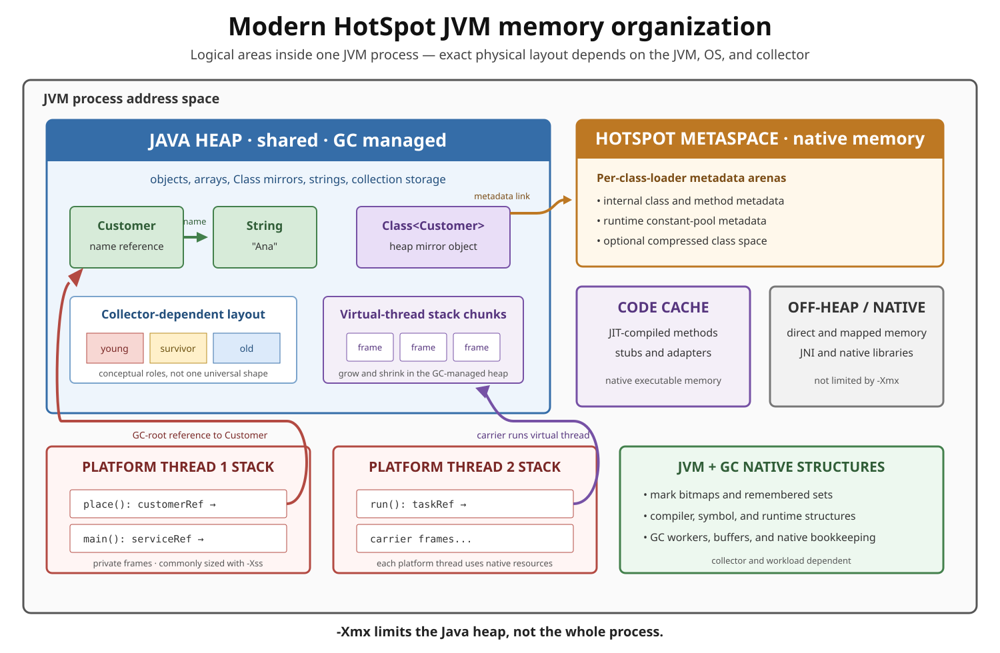
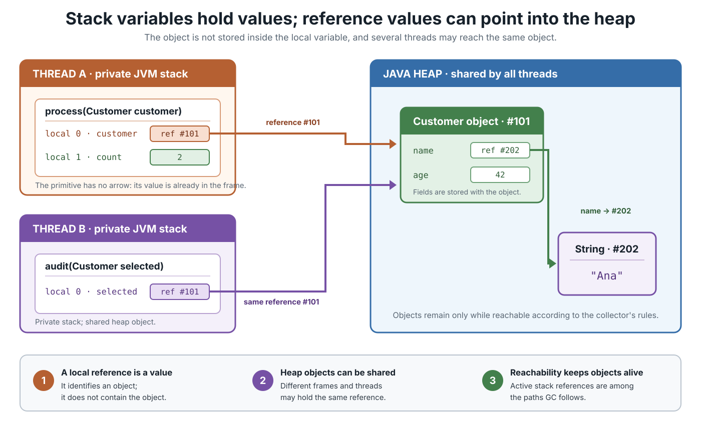
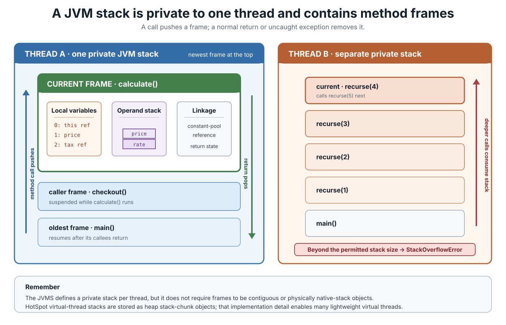
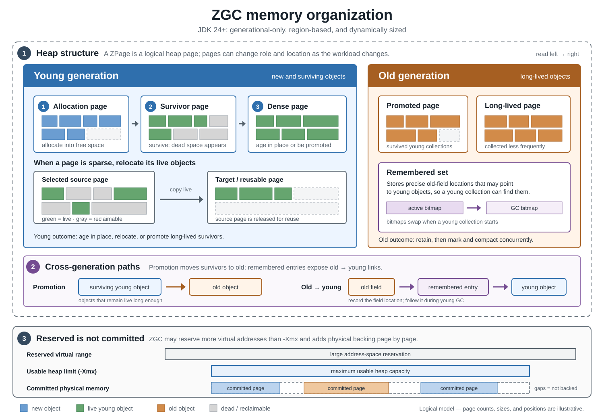
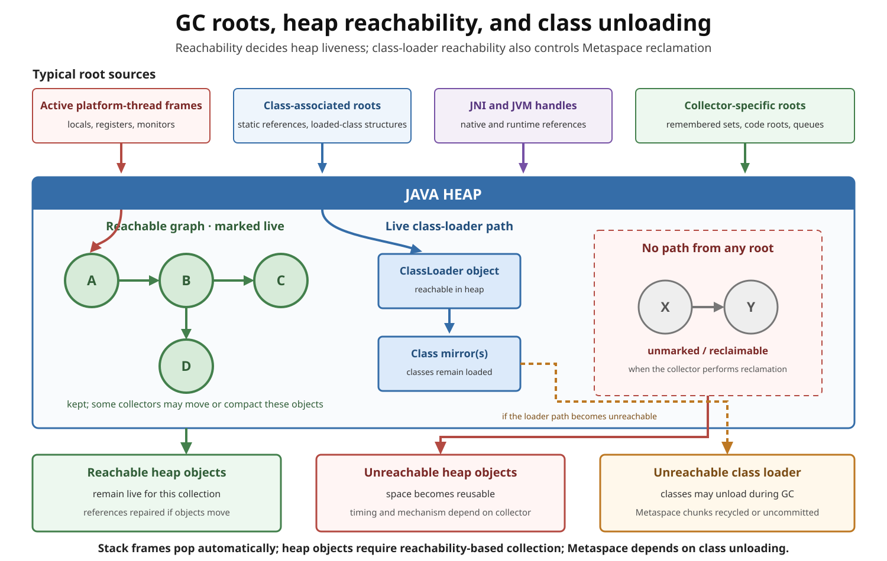

# JVM Memory Organization: Heap, Stacks, Metaspace, and Native Memory

## Front

How does a modern HotSpot JVM organize memory, and how are stack variables, heap objects, G1 or ZGC heap layouts, Metaspace, code cache, garbage collection, and common memory failures connected?

## Back

A JVM process does **not** use one memory pool. The Java Virtual Machine Specification (JVMS) defines logical runtime areas, while HotSpot and its selected garbage collector decide many physical implementation details. The central rule is: **objects and arrays live in the shared Java heap; each thread has private execution state; class metadata, compiled code, and JVM bookkeeping also consume memory outside the heap.**

Read this card from the overall map to stack-to-heap references, stack frames, collector-specific heap layouts, garbage-collection reachability, and finally diagnosis.



## Specification model vs. HotSpot implementation

The JVMS defines the behavior a conforming JVM must provide. It does not require one exact physical layout.

| JVMS concept | Who can use it? | Typical HotSpot realization |
|---|---|---|
| Heap | All threads | Garbage-collected Java heap |
| Method area | All threads | Mostly class metadata in native Metaspace, with related data elsewhere |
| Runtime constant pool | All threads through its class | Part of the method-area model; HotSpot metadata is mainly in Metaspace |
| JVM stack and `pc` register | One thread | Frames and execution state for that thread |
| Native method stack | Usually one thread | Native stack support for JVM and native calls |

This distinction prevents a common mistake: **the JVMS method area and HotSpot Metaspace are related, but they are not interchangeable definitions.** The specification describes required semantics; Metaspace is one implementation mechanism.

## How stack variables reach heap objects

A local variable can contain a primitive value such as `int`, or a reference value that identifies an object. The reference is in the frame; the object is in the heap. Two frames—even frames owned by different threads—can contain references to the same object.



In the diagram:

- `count` contains the primitive value `2` directly in Thread A's frame.
- `customer` and `selected` are separate locals, but both contain a reference to the same `Customer` object.
- The `Customer` object contains another reference in its `name` field, which reaches a separate `String` object.
- A Java reference should not be treated as a guaranteed raw machine address. Its representation is a JVM implementation detail.

The phrase “a local object” usually means “an object reachable through a local variable.” It does **not** mean that the object is stored inside the stack frame. A JVM may optimize allocation when behavior remains equivalent, but source-level scope alone does not define physical placement.

## Java heap

The heap is created when the JVM starts and is shared by all JVM threads. It supplies storage for **all class instances and arrays**. Garbage collection (GC) reclaims heap storage automatically; Java code does not explicitly free an object.

Important controls are:

- `-Xms<size>`: initial/minimum Java heap size used by normal HotSpot sizing behavior.
- `-Xmx<size>`: maximum Java heap size.

`-Xmx` is **not** a limit for the whole process. Thread stacks, Metaspace, code cache, garbage-collector structures, direct buffers, native libraries, and other native allocations can make the process much larger.

Two size words matter in diagnostics:

- **Reserved** memory is address space kept available for possible future use.
- **Committed** memory has backing storage made available to the process and is the more immediate footprint concern.

## JVM stack area and frames

Every JVM thread has a private JVM stack. A new **frame** is created for each method invocation. The current method's frame is active; calling another method creates a new current frame, and completing a method removes its frame.



Each frame has at least these logical parts:

- **Local-variable array:** parameters, `this` for an instance method, primitive values, and reference values.
- **Operand stack:** temporary values used by bytecode instructions. It is separate from the thread's stack of frames.
- **Linkage information:** includes access to the current class's runtime constant pool and information needed to return to the caller.

Frame sizes for the local-variable array and operand stack are described by the method's class-file data. A frame belongs only to its creating thread and cannot be referenced by another thread.

### Frame lifetime and failure

Returning normally or leaving because of an uncaught exception discards the current frame. This is deterministic stack cleanup; GC does not “collect” finished frames.

If a computation needs more stack than the JVM permits, it throws `StackOverflowError`. Deep or infinite recursion is the usual cause. If the JVM cannot create or expand a stack because memory is unavailable, an `OutOfMemoryError` can occur instead.

Platform-thread stack sizing is commonly influenced by `-Xss`. A smaller stack may allow more platform threads but reduces safe call depth; a larger stack does the opposite.

### Platform threads and virtual threads

A platform thread is backed by an operating-system thread while it runs and normally consumes per-thread native resources. A virtual thread is scheduled by the JDK onto carrier platform threads and does not permanently own one carrier.

In HotSpot, virtual-thread stacks are stored in the Java heap as garbage-collected **stack-chunk objects** that grow and shrink. This is why a very large number of virtual threads does not imply the same number of large native stacks. It also means virtual-thread stack storage contributes to heap occupancy and GC work.

The JVMS deliberately permits frames to be heap allocated, so “stack” describes execution semantics—not necessarily one fixed physical block. Also note an important HotSpot detail: virtual-thread stacks themselves are not treated as GC roots in the same way as platform-thread stacks; the collector handles their heap representation through its normal concurrent mechanisms.

## Heap organization depends on the collector

The JVMS does not prescribe generations, regions, pages, compaction, or a particular GC algorithm. Those are collector choices. Therefore, do not apply a classic contiguous “Eden → Survivor → Old” picture to every modern collector.

### G1 heap organization

Garbage-First (G1) is a generational, region-based collector. It divides the heap into many **equal-sized regions**. A region can be free or assigned a role such as Eden, Survivor, Old, or Humongous; young and old regions are usually non-contiguous.


Key points:

- Normal allocation goes into young-generation Eden regions; sufficiently large humongous objects are allocated directly in contiguous old-generation regions.
- A region is a unit of allocation and reclamation. Its role can change after collection.
- G1 usually reclaims selected regions by **evacuating** live objects to other regions. Copying compacts the survivors and leaves the source regions reusable.
- Remembered-set and card information tracks relevant cross-region references, so G1 need not scan the entire heap during every young collection.
- G1 performs evacuation during stop-the-world pauses, while expensive work such as global marking is largely concurrent. Its pause-time target is a goal, not a real-time guarantee.

### ZGC heap organization

In current HotSpot releases, ZGC is a **generational low-latency collector**. JDK 24 removed its non-generational mode. It separates young and old objects logically, uses internal heap pages (`ZPage` objects), and performs expensive work concurrently so application pauses stay very short.



Key points:

- Recently allocated objects enter the young generation; survivors may remain young or be promoted to old.
- Young and old generations are collected independently and resized as the workload changes.
- ZGC can relocate live objects concurrently. Load barriers and collector metadata let application threads continue using references while relocation is in progress.
- Remembered-set metadata records relevant old-to-young reference locations so a young collection can find those paths.
- `-Xmx` is the main sizing control. A concurrent collector needs headroom for new allocations while collection is running.
- ZGC may uncommit unused heap memory and return it to the operating system, subject to its sizing options.

### G1 and ZGC: do not confuse their maps

| Question | G1 | ZGC |
|---|---|---|
| Main heap unit shown here | Equal-sized G1 region | Internal ZGC page |
| Young/old model | Generational | Generational in current JDKs |
| Moving live objects | Primarily evacuation in stop-the-world collection pauses | Primarily concurrent relocation |
| Main design emphasis | Balance throughput with predictable pause goals | Very low pause times, with some throughput cost |
| Diagram shape mandated by JVMS? | No | No |

## Method area, Metaspace, and class mirrors

The JVMS method area is shared and stores per-class structures such as runtime constant pools, field and method data, and method code. It is a logical specification area and is described as logically part of the heap, but the JVMS does not mandate its location or collection policy.

HotSpot stores most internal class metadata in **Metaspace**, a native-memory manager outside the Java heap. Typical metadata includes internal descriptions of classes, methods, fields, and constant-pool structures.

Keep three related things separate:

1. `Customer.class` evaluates to a `Class<Customer>` mirror object in the Java heap.
2. HotSpot's internal metadata describing `Customer` is mainly in Metaspace.
3. JIT-compiled machine code for hot `Customer` methods is in the code cache.

Metaspace allocation is organized around class loaders. When a class loader and all of its loaded classes become unloadable, HotSpot can release that loader's metadata arena. Dropping ordinary object references is not enough to unload a class while its defining loader is still reachable.

Useful options include `-XX:MetaspaceSize` as an initial threshold that influences metadata-GC behavior and `-XX:MaxMetaspaceSize` as an optional cap. They are not the equivalents of `-Xms` and `-Xmx` for one fixed contiguous heap.

## Code cache and other native memory

HotSpot's JIT compilers translate frequently executed methods into native machine code. That generated code, plus runtime stubs and adapters, occupies the **code cache**, which is native executable memory. Modern HotSpot can segment it into code heaps for non-method code, profiled methods, and non-profiled methods.

Other process memory can include:

- platform-thread stacks and native method support;
- garbage-collector remembered sets, marking bitmaps, queues, and worker structures;
- direct or mapped buffers and memory used through the Foreign Function and Memory API;
- JNI libraries and third-party native allocations;
- symbols, compiler structures, class-data-sharing mappings, and operating-system bookkeeping.

This is why increasing `-Xmx` can worsen a process-level memory problem: a larger heap leaves less address-space or physical-memory headroom for everything outside it.

## How garbage collection decides what survives

GC starts from known **roots** and follows reference paths. An object reachable through a strong path is live. An unreachable object is eligible for reclamation; “eligible” does not promise immediate collection.



Typical root sources include active platform-thread execution state, static references associated with loaded classes, JNI handles, and JVM or collector runtime structures. References inside ordinary heap objects extend the reachable graph.

The diagram also separates three cleanup rules:

- **Stack frame:** removed when its method finishes.
- **Heap object:** reclaimed only after it is unreachable under the active reference rules and the collector processes it.
- **Metaspace allocation:** reclaimed in groups when the defining class loader and its classes can be unloaded.

GC can affect more than heap occupancy. It may process roots from execution state and generated code, maintain native metadata, unload classes, and enable Metaspace chunks to be returned or reused.

## Complete example: where the data goes

```java
final class MemoryExample {
    private static Customer featured;

    static final class Customer {
        private final String name;

        Customer(String name) {
            this.name = name;
        }
    }

    static int adjustedNameLength(Customer customer) {
        int adjustment = 1;
        String localName = customer.name;
        return localName.length() + adjustment;
    }

    public static void main(String[] args) {
        Customer customer = new Customer("Ana");
        featured = customer;
        System.out.println(adjustedNameLength(customer));
    }
}
```

Conceptually:

- The `Customer`, its `String`, the `String[] args`, and the `Class` mirror objects are in the heap.
- `customer`, `localName`, and `args` are reference values in active frames; `adjustment` is a primitive local.
- The static field `featured` stores a reference associated with the loaded class and keeps the `Customer` reachable after `main`'s local would otherwise disappear.
- Class metadata for `MemoryExample` and `Customer` is mainly in Metaspace.
- Interpreted execution uses bytecode metadata; if the methods become hot and are compiled, their native code is placed in the code cache.

Exact optimization details can differ. A JIT compiler may eliminate or scalar-replace an allocation when observable behavior is unchanged, so a diagnostic snapshot need not look exactly like the conceptual source-level model.

## Failure symptoms by memory area

| Symptom | First area to investigate | Typical cause |
|---|---|---|
| `StackOverflowError` | One thread's call stack | Deep or infinite recursion; insufficient permitted stack depth |
| `OutOfMemoryError: Java heap space` | Java heap | Live set or allocation pressure cannot fit within the available heap |
| `OutOfMemoryError: Metaspace` | Class metadata | Too many live loaded classes/loaders or an overly small metadata cap |
| `OutOfMemoryError: Compressed class space` | Compressed class metadata space | Class-pointer space is exhausted |
| `OutOfMemoryError: unable to create native thread` | Native/process thread resources | Too many platform threads or insufficient native resources |
| Direct-buffer allocation failure | Direct/native memory | Direct buffers remain live or native headroom is too small |
| Code-cache-full warnings and reduced compilation | Code cache | Generated code cannot fit; compilation or code sweeping becomes constrained |

A heap dump is excellent for heap objects but cannot explain every native allocation. Likewise, a low heap occupancy does not prove the process has enough native memory.

## Practical diagnosis

Start with the area named by the error or the evidence—not by immediately increasing a limit.

### Heap and GC

```bash
jcmd <pid> GC.heap_info
jcmd <pid> GC.class_histogram
jcmd <pid> GC.heap_dump /path/to/heap.hprof
```

Use GC logs such as `-Xlog:gc*` to see collection timing, heap transitions, promotion, and allocation failures. Use Java Flight Recorder (JFR) for allocation, GC, thread, and runtime events over time.

### Threads and stacks

```bash
jcmd <pid> Thread.print
```

Look for recursive call patterns and an unexpectedly large number of platform threads. Remember that virtual-thread diagnostics have dedicated commands and formats in newer JDKs.

### Native memory

Native Memory Tracking (NMT) must be enabled when the JVM starts:

```bash
java -XX:NativeMemoryTracking=summary MemoryExample
jcmd <pid> VM.native_memory summary
jcmd <pid> VM.native_memory baseline
jcmd <pid> VM.native_memory summary.diff
```

NMT groups HotSpot-managed usage into categories such as Java Heap, Class, Thread, Code, GC, and Compiler. It distinguishes reserved from committed memory. It does **not** track all memory allocated by third-party native code, so operating-system tools may still be necessary. Enabling NMT also has overhead.

## Common misconceptions

- **“Local objects live on the stack.”** Local variables live in frames; ordinary objects and arrays are allocated from the heap.
- **“GC clears the stack.”** Frames are popped by method completion. GC uses execution references to determine heap reachability.
- **“Metaspace is the whole off-heap area.”** It is primarily HotSpot class-metadata memory; code cache, stacks, GC structures, buffers, and libraries are separate concerns.
- **“The method area is exactly Metaspace.”** The method area is a JVMS concept; Metaspace is a HotSpot implementation component.
- **“G1 has one contiguous young block and one contiguous old block.”** G1 assigns roles to non-contiguous equal-sized regions.
- **“All collectors organize the heap like G1.”** ZGC uses different page and metadata structures even though both collectors are generational.
- **“Unreachable means immediately freed.”** It means eligible for reclamation when the collector processes it.
- **“`-Xmx` caps JVM process memory.”** It caps the Java heap, not the process.
- **“A large reserved value is already fully used.”** Reserved address space and committed memory are different measurements.

## Summary

1. The **heap** is shared and stores objects and arrays.
2. A **JVM stack** is private to a thread and stores frames; frames contain locals, an operand stack, and linkage state.
3. A local reference points to a heap object; multiple frames or threads can reach the same object.
4. **G1** uses equal-sized, dynamically assigned regions; **ZGC** uses its own page-based, generational organization and mostly concurrent relocation.
5. The JVMS **method area** is a logical contract; HotSpot stores most class metadata in native **Metaspace**.
6. JIT-compiled native code lives in the **code cache**, while stacks, collector data, buffers, and libraries add more native memory.
7. GC keeps strongly reachable objects, reclaims unreachable heap storage, and can enable class unloading. Finished frames are popped independently.
8. Diagnose the named area with heap tools, thread data, GC logs/JFR, or NMT. `-Xmx` alone never describes the whole process.

## Sources

- [Java SE 26 JVMS §2 — Runtime data areas and frames](https://docs.oracle.com/en/java/javase/26/docs/specs/jvms/jvms-2.html)
- [Oracle Java SE 26 — Garbage-First (G1) Garbage Collector](https://docs.oracle.com/en/java/javase/26/gctuning/garbage-first-g1-garbage-collector1.html)
- [Oracle Java SE 26 — HotSpot VM Garbage Collection Tuning Guide](https://docs.oracle.com/en/java/javase/26/gctuning/hotspot-virtual-machine-garbage-collection-tuning-guide.pdf)
- [OpenJDK JEP 439 — Generational ZGC](https://openjdk.org/jeps/439)
- [OpenJDK JEP 490 — ZGC: Remove the Non-Generational Mode](https://openjdk.org/jeps/490)
- [OpenJDK source — Current `ZPage` implementation](https://github.com/openjdk/jdk/blob/master/src/hotspot/share/gc/z/zPage.hpp)
- [OpenJDK JEP 444 — Virtual Threads](https://openjdk.org/jeps/444)
- [OpenJDK JEP 387 — Elastic Metaspace](https://openjdk.org/jeps/387)
- [OpenJDK Wiki — Current HotSpot Metaspace design](https://wiki.openjdk.org/display/HotSpot/Metaspace)
- [OpenJDK JEP 197 — Segmented Code Cache](https://openjdk.org/jeps/197)
- [Oracle Java SE 26 Troubleshooting Guide — Diagnostic tools and Native Memory Tracking](https://docs.oracle.com/en/java/javase/26/troubleshoot/diagnostic-tools.html)
