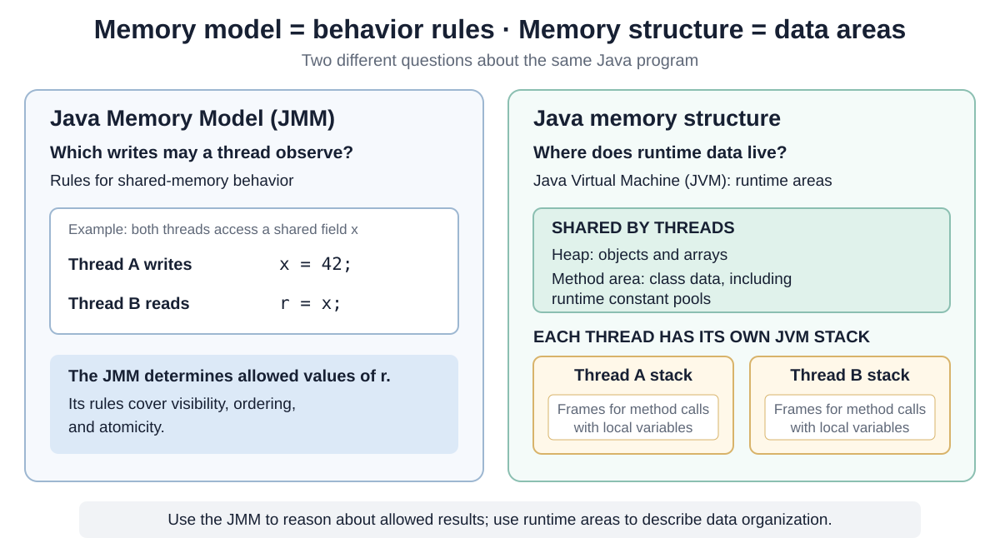
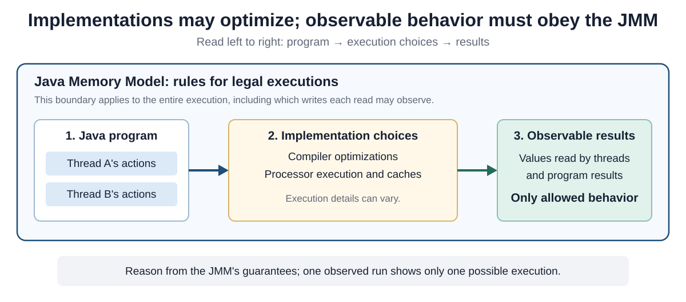

# Java Memory Model

<!-- Card mode: complex. Validate with --mode complex. -->

## Front

What does the **Java Memory Model (JMM)** specify, and how does it differ from JVM memory structure?

Explain how visibility, ordering, atomicity, and happens-before fit together; how Java constructs provide these guarantees; and whether virtual threads change the rules.

## Back

The **Java Memory Model (JMM)** specifies which values a thread is allowed to observe when threads read and write shared memory. It gives Java programs rules for reasoning about communication between threads, while allowing compilers and processors to optimize execution within those rules.

Start with the distinction between behavior and storage, connect the core concurrency concepts, then examine Java's guarantees and the implementation model behind them.

## Java Memory Model vs. Java Memory Structure

The two names answer different questions. The **model** describes allowed behavior; **structure** describes the runtime areas of the **Java Virtual Machine (JVM)**. Read the left side of the diagram as a set of rules and the right side as a map of logical storage areas.



For example, “an object is allocated in the heap” describes structure. “Which write to that object's field may another thread read?” is a JMM question. Sharing an object does not by itself establish visibility of later changes to its fields.

The diagram shows selected logical areas from the Java Virtual Machine Specification, rather than a required physical memory layout. Heap objects and arrays are shared runtime storage; JVM stacks hold each thread's method frames and local variables. The shared method area holds per-class data, including runtime constant pools. Garbage collection manages storage reclamation; it is not the definition of the JMM.

## The concepts in one place

**Shared variables** include instance fields, static fields, and array elements. A method's local variables are private to its execution, but a local reference can point to an object that another thread also accesses.

| Concept | Question it answers | Essential distinction |
|---|---|---|
| **Visibility** | Which writes can another thread observe? | An ordinary write alone does not guarantee that another thread will observe the update. |
| **Ordering** | In what order may memory operations be observed? | Optimizations must preserve each thread's semantics and the JMM's cross-thread guarantees. |
| **Atomicity** | Is an operation indivisible? | An atomic read or write does not make a read–modify–write sequence atomic. |
| **Happens-before** | Which actions have a guaranteed visibility and ordering relationship? | It is a relation defined by Java's rules, not just by elapsed time. |

These concepts are connected, but one guarantee does not automatically supply the others. For example, reading and writing an `int` are individually atomic, yet `count++` consists of a read, an addition, and a write. Two threads can read the same old count and overwrite one another's updates.

## The most important JMM concept: happens-before

If action A **happens-before** action B, A is visible to and ordered before B in the sense defined by the JMM. The relation is **transitive**: if A happens-before B and B happens-before C, then A happens-before C.

This connects earlier ordinary writes in one thread to later reads in another thread through a synchronization operation.

| Operation A | Happens-before operation B |
|---|---|
| Earlier action in one thread's program order | Later action in that same thread |
| Unlock of a `synchronized` monitor | Subsequent lock of the **same monitor** |
| Write to a `volatile` variable | Subsequent read of the **same variable** |
| Call to `Thread.start()` | Actions in the started thread |
| All actions in a thread | Another thread detects its termination, for example by returning from `join()` |

A **monitor** is the lock associated with a Java object. “Subsequent” in the monitor and volatile rules refers to synchronization order. Merely waiting, sleeping, or observing that one operation happened earlier by a clock does not create the required relationship. A timed `join` that returns before termination is not enough either.

Happens-before constrains observable behavior; it does not require every machine instruction to execute in that literal order. It also does not promise a particular old value when additional writes can intervene.

## One example connecting it all

In this complete class, both threads use the **same `Message` instance**. Thread A calls `publish()` once; Thread B calls `readIfReady()`. Assume the instance is initialized before either thread starts and there are no other writes.

```java
final class Message {
    private int data = 0;
    private volatile boolean ready = false;

    // Thread A
    void publish() {
        data = 42;
        ready = true;
    }

    // Thread B
    int readIfReady() {
        if (ready) {
            return data;
        }
        return -1; // No message observed by this call.
    }
}
```

**With `volatile`:**

- `ready == false` → return `-1`: no message observed.
- `ready == true` → return `42`: the message data is visible.

**Why `42` is guaranteed:** Thread A writes `data = 42` before setting `ready = true`. When Thread B reads that `true`, the volatile write and read establish happens-before. By transitivity, the earlier write to `data` is visible when Thread B reads it.

**Without `volatile`:**

- Thread B could see `ready == true` but still read `data == 0`.
- A loop checking `ready` could keep seeing `false`; it is not guaranteed to notice the update.

## `synchronized` and `volatile` provide different guarantees

**`synchronized`** provides mutual exclusion: only one thread at a time can hold a particular monitor. Its unlock-to-subsequent-lock relationship also provides visibility and ordering.

This complete class protects both accesses with the same instance's monitor:

```java
final class LockedValue {
    private int value;

    synchronized void set() {
        value = 42;
    }

    synchronized int get() {
        return value;
    }
}
```

**How the synchronized version works:**

1. Thread A enters `set()` and acquires this instance's monitor.
2. A writes `value = 42`, then leaves the method and releases the monitor.
3. Thread B subsequently enters `get()` and acquires the **same monitor**.
4. That unlock-to-lock relationship makes A's write visible to B, so B returns `42`.

The unlock is the **release** side of the handoff; the later lock is the matching **acquire** side. Both participate. Synchronizing only the setter would leave an ordinary getter without that handoff.

**What if `get()` runs first?** It returns the initial `0`. The lock controls who may enter the methods together; it does not require the setter to run first.

### Reads without monitor contention: `volatile`

Here, each method only reads or assigns one field. A volatile field supplies the needed visibility and ordering without acquiring the instance's monitor:

```java
final class VolatileValue {
    private volatile int value;

    void set() {
        value = 42;
    }

    int get() {
        return value;
    }
}
```

**How the volatile version works:**

1. Thread A's `value = 42` is a **volatile write**, which acts as a release.
2. Thread B's `return value` performs a **volatile read**, which acts as an acquire.
3. The write happens-before every subsequent read of that **same field on the same instance**. A read after this write returns `42`.

Here, “subsequent” means later in synchronization order. A read before the write returns the initial `0`. If the calls overlap, either result is possible, depending on the order of the field accesses.

**Why a lock is unnecessary here:** each method performs only one `int` read or write, which is already atomic. There is no “read the old value, decide, then update” sequence and no group of fields to protect. Volatile supplies the visibility and ordering needed for these independent calls.

**Performance advantage:** synchronized getters on the same instance serialize their protected reads: only one thread can hold that monitor at a time. Volatile getters do not acquire it, so readers can proceed concurrently without waiting for one another to release a lock. This removes monitor contention from the read path and can improve throughput when concurrent readers were competing for that monitor.

**Why this is not an unconditional timing guarantee:** a synchronized call waits only when another thread holds the monitor; an uncontended call does not have that wait. HotSpot can also eliminate locks when it proves an object is confined to one thread. Removing monitor contention is a definite change, while the measured speedup depends on the actual sharing, workload, and generated code.

**Limit:** `volatile` does not make a compound operation such as `count++` or “check, then update” atomic. If the class needs those operations or must keep several fields consistent, use suitable locking or an atomic operation such as `AtomicInteger.incrementAndGet()`. Volatile reads and writes of `long` and `double` are also atomic, but compound operations on them still need the same care.

### The article's example: keep the first object

Shipilëv's quiz applies the same reasoning to a container named `C<T>`, where `T` is the type of object stored. It adds a requirement: **keep the first non-null value and ignore later attempts to replace it**.

Assume the container is created and shared before these calls, and callers pass non-null values. The field starts as `null`, meaning “empty.” Passing `null` would leave it empty.

This is the setter from the article, reformatted as a method excerpt; `val` is the container's field:

```java
public synchronized void set(T v) {
    if (val == null) {
        val = v;
    }
}
```

The starting version also synchronizes the getter. That gives it two protections:

- **Between setters:** the lock keeps checking for `null` and assigning the reference together. Another setter cannot enter halfway through.
- **Between setter and getter:** releasing and later acquiring the same monitor establishes visibility, including earlier writes to the stored object's fields.

### Faster reads: a volatile reference and a synchronized setter

The corrected version lets getters avoid the monitor while setters still use it. This complete adaptation uses descriptive names and an early return for an already-filled container:

```java
final class VolatileBox<T> {
    private volatile T value;

    synchronized void set(T next) {
        if (value != null) {
            return;
        }
        value = next;
    }

    T get() {
        return value;
    }
}
```

**Why the getter works without locking:** suppose Thread A prepares a `Payload` object whose ordinary `int answer` field is `42`, then passes it to the empty box.

1. A writes `payload.answer = 42`.
2. A's setter stores the payload reference in the **volatile `value` field**.
3. B's getter reads that **same volatile field** and obtains the payload reference.
4. B can then read `payload.answer` as `42`, assuming no later writes to `answer`.

The volatile write and read provide the matching release and acquire. The getter's handoff comes from the assignment to `value`; the monitor still coordinates competing setters. Program order and transitivity extend the guarantee from the reference to the object initialization that preceded its publication. This is **safe publication**: making a prepared object available to another thread with its earlier writes visible.

A getter that reads before publication may return `null`. Also, making the reference volatile does not make future mutations of the object's fields thread-safe.

**Why the setter still needs its lock:** without it, two setters could interleave like this:

| Thread A | Thread B |
|---|---|
| Reads `value`: it is `null` | |
| | Reads `value`: it is still `null` |
| Stores object A | |
| | Stores object B, replacing A |

Every volatile access can work correctly while the overall “keep the first object” rule fails. The synchronized setter prevents this by allowing only one setter to check and assign at a time. This requirement is absent from the earlier `VolatileValue`, whose setter simply assigns `42`.

**Performance advantage:** synchronized getters would compete for the same monitor with both other getters and setters. The volatile getter removes readers from that competition: getters do not acquire the monitor, while setters still serialize their check-and-assign operations. This removes a read bottleneck when getters contend for the monitor; the resulting throughput depends on the workload and JVM.

### Two shortcuts that do not establish the required handoff

| Attempt | Why it is unsafe here |
|---|---|
| Keep a plain field and synchronize only the setter | The getter never acquires the setter's monitor. It can miss the reference update; even seeing a non-null reference does not guarantee visibility of the object's earlier ordinary field writes. |
| Read an unrelated volatile field, such as the article's `BARRIER`, before reading the plain field | That read does not match the setter's monitor release. An arbitrary acquire is insufficient; the operations must establish the relevant synchronization relationship. |

For this box, **the synchronized setter protects “check, then assign”; the volatile reference publishes the object to readers**. Each mechanism has a specific job.

## `final` has special initialization semantics

A properly constructed object's **final fields** have an additional guarantee: a thread that obtains the object reference only after construction finishes sees the constructor-initialized final values, even if the reference is passed without ordinary synchronization. Preventing the object from escaping during construction is essential—for example, do not register `this` with another thread from the constructor.

This complete immutable class initializes every final field:

```java
final class User {
    private final String name;
    private final int age;

    User(String name, int age) {
        this.name = name;
        this.age = age;
    }

    String name() {
        return name;
    }

    int age() {
        return age;
    }
}
```

These semantics protect initialization; they do not guarantee that another thread will ever obtain the reference. A final reference also does not make its referent immutable: later changes to a referenced mutable object still need their own concurrency discipline.

## Data race

A **data race** occurs when two threads access the same shared variable, at least one access is a write, and the two accesses are not ordered by happens-before. For example, an ordinary field write in one thread and a read in another can form a data race even if they happen at different wall-clock times.

A correctly synchronized program has no data races in any sequentially consistent execution. The JMM then guarantees that all its executions appear **sequentially consistent**: as if each thread's actions were interleaved into one sequence that respects each thread's program order.

That still does not make a group of actions atomic. Concurrent increments of a volatile counter can lose updates even though the individual volatile accesses do not form a data race. Correct coordination must also protect the application's compound operations.

## Modern Java adds finer-grained memory ordering

Since Java 9, **`VarHandle`** has provided typed access to variables with selectable memory semantics. Its modes give library authors more control than ordinary field access.

| Mode | Main guarantee |
|---|---|
| Plain | Ordinary non-volatile access; no ordering for communication between threads |
| Opaque | Indivisible access with coherent ordering for the same variable; no publication ordering for other variables |
| Acquire read | Later loads and stores cannot move before the acquire |
| Release write | Earlier loads and stores cannot move after the release |
| Volatile | Acquire/release effects plus a total order among volatile operations |

A **load** reads a value; a **store** writes one. When an acquire read observes a matching release write to the same variable, it can make the writes before that release visible to accesses after the acquire. An unrelated acquire and release do not establish this handoff.

The chosen access mode matters even when the underlying field is declared `volatile`: using plain `VarHandle.get()` does not acquire volatile semantics from the declaration.

`VarHandle` also offers atomic updates such as `compareAndSet`, `getAndSet`, and `getAndAdd`, and ordering fences such as `acquireFence`, `releaseFence`, and `fullFence`. A fence constrains reordering; it does not by itself transfer a value to another thread or replace a complete communication protocol.

These tools are most useful when implementing concurrent libraries and low-level algorithms. For application code, prefer a higher-level operation whose documented guarantee matches the task.

## What about locks, atomic classes, and concurrent collections?

The `java.util.concurrent` library exposes operations with defined memory-consistency effects. The guarantee belongs to the operation and its matching use, rather than merely to the class name.

| Tool | Relevant guarantee |
|---|---|
| `Lock` / `ReentrantLock` | Successful locking and unlocking provide monitor-like memory effects. Failed or reentrant operations need not add synchronization effects. |
| `AtomicInteger` | `get()` and `set()` use volatile semantics; `incrementAndGet()` is an atomic update with volatile read/write effects. Methods such as `getPlain()` have weaker semantics. |
| Concurrent collection | Actions before inserting an element happen-before actions after another thread accesses or removes that element. This does not automatically protect later mutations of the element. |
| `Executor` and `Future` | Actions before task submission happen-before task execution; task actions happen-before actions after retrieval of its result with `Future.get()`. |

For example, a queue can safely transfer a prepared message, and an atomic increment can avoid lost counter updates. Several individually thread-safe calls do not automatically become one atomic operation when combined.

## What about virtual threads?

**Virtual threads obey the same Java Memory Model as platform threads.** They change how the runtime schedules and scales threads, while shared-state communication still requires the same visibility, ordering, atomicity, and synchronization guarantees.

Replacing a platform thread with a virtual thread therefore does not repair a data race or make an unsafe counter increment atomic.

## A useful modern mental model

Read this diagram from the Java program, through implementation choices, to the results the program can observe. The surrounding JMM boundary is a set of semantic rules that constrains those results; it is not a runtime component that checks each access.



The JVM's **just-in-time (JIT) compiler** and the **central processing unit (CPU)** may optimize execution through instruction reordering, registers, and caches. Java's rules do not require every field access to go directly to **random-access memory (RAM)**, or prescribe one particular cache-flushing strategy.

To reason about correctness, identify the shared variables, the operations on them, and the relationships that constrain what reads can observe. A conforming implementation may choose different machine instructions on different processors, but it must preserve behavior allowed by the JMM.

## Interview summary

The **JMM describes allowed shared-memory behavior**; JVM memory structure describes runtime storage areas. Visibility, ordering, and atomicity are distinct guarantees. Happens-before connects actions through program order, synchronization, and transitivity. Java language constructs and library operations provide specific ways to establish those guarantees. Final fields have special initialization semantics, and virtual threads follow the same rules as platform threads. The compiler and hardware retain freedom to optimize within the JMM's constraints.

## Sources

- [Aleksey Shipilëv — Java Memory Model Pragmatics: Happens-Before quiz (setter excerpt and adapted box example)](https://shipilev.net/blog/2014/jmm-pragmatics/#_happens_before_test_your_understanding)
- [Java SE 25 JLS §8.3.1.4 — Volatile fields and their distinction from locking](https://docs.oracle.com/javase/specs/jls/se25/html/jls-8.html#jls-8.3.1.4)
- [Java SE 25 JLS §17.4 — Memory model, shared variables, data races, and happens-before](https://docs.oracle.com/javase/specs/jls/se25/html/jls-17.html#jls-17.4)
- [Java SE 25 JLS §17.5 — Final-field semantics](https://docs.oracle.com/javase/specs/jls/se25/html/jls-17.html#jls-17.5)
- [Java SE 25 JLS §17.7 — Atomic reads and writes](https://docs.oracle.com/javase/specs/jls/se25/html/jls-17.html#jls-17.7)
- [Java SE 25 JVMS §2.5 — Runtime data areas](https://docs.oracle.com/javase/specs/jvms/se25/html/jvms-2.html#jvms-2.5)
- [Java SE 25 HotSpot performance enhancements — Escape analysis and lock elimination](https://docs.oracle.com/en/java/javase/25/vm/java-hotspot-virtual-machine-performance-enhancements.html)
- [Java SE 25 API — VarHandle access modes, atomic updates, and fences](https://docs.oracle.com/en/java/javase/25/docs/api/java.base/java/lang/invoke/VarHandle.html)
- [Java SE 25 API — Lock memory-synchronization semantics](https://docs.oracle.com/en/java/javase/25/docs/api/java.base/java/util/concurrent/locks/Lock.html)
- [Java SE 25 API — AtomicInteger operation-specific semantics](https://docs.oracle.com/en/java/javase/25/docs/api/java.base/java/util/concurrent/atomic/AtomicInteger.html)
- [Java SE 25 API — java.util.concurrent memory-consistency properties](https://docs.oracle.com/en/java/javase/25/docs/api/java.base/java/util/concurrent/package-summary.html#MemoryVisibility)
- [Java SE 25 API — Platform and virtual threads](https://docs.oracle.com/en/java/javase/25/docs/api/java.base/java/lang/Thread.html)
- [OpenJDK State of Loom — Virtual-thread memory consistency (Scheduling section)](https://cr.openjdk.org/~rpressler/loom/loom/sol1_part1.html)
