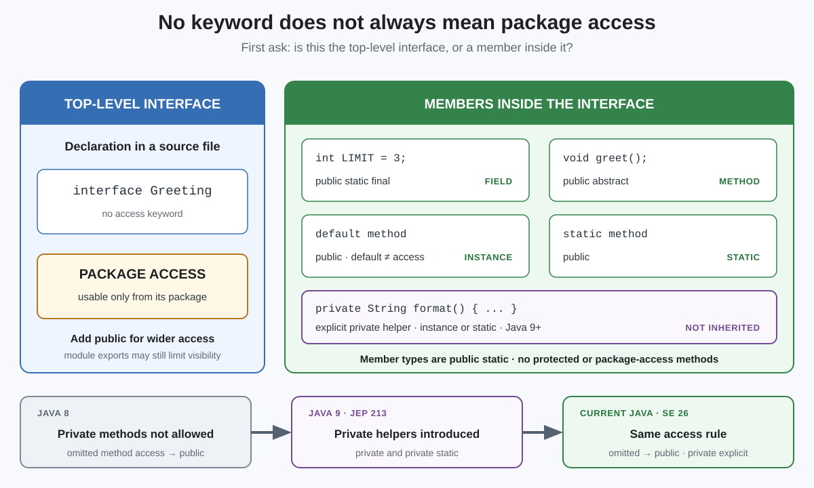

# Modifiers. Interface Default Access Modifier

## Front

What access is implied when an interface or one of its members has no access modifier, and what changed in Java 9?

## Back

**Private interface methods were introduced in Java SE 9 by JEP 213, “Milling Project Coin.”**

A top-level interface and the members inside it use different defaults: the interface itself has **package access** when `public` is omitted, but its fields, methods, and member types are implicitly **public** when they have no access modifier.



`default` is **not** an access modifier. It means that an interface instance method supplies an implementation; that method is still public unless declared `private`—and a private method cannot be `default`.

| Declaration with no access modifier | Effective modifiers |
|---|---|
| Top-level `interface Service` | package access |
| Field `int LIMIT = 3` | `public static final` |
| Method `void run();` | `public abstract` |
| `default` or `static` method | `public` |
| Member class or interface | `public static` |

Since Java 9, an interface may explicitly declare a `private` instance or `private static` method with a body. It is a helper for code inside that interface and is not inherited or overridden. Interface methods cannot have `protected` or package access.

```java
interface Greeting {
    String PREFIX = "Hello"; // public static final

    void greet(String name);  // public abstract

    default void welcome(String name) { // public
        System.out.println(format(name));
    }

    private String format(String name) { // Java 9+
        return PREFIX + ", " + name;
    }
}
```

Before Java 9, `private` was not permitted on interface methods. In current Java, including Java SE 26, omission still means `public` for an interface method; use the explicit `private` keyword for a private helper.

## Sources

- [OpenJDK — JEP 213: Milling Project Coin](https://openjdk.org/jeps/213)
- [Java Language Specification §6.6.1 — Determining Accessibility](https://docs.oracle.com/en/java/javase/26/docs/specs/jls/jls-6.html#jls-6.6.1)
- [Java Language Specification §§9.3–9.5 — Interface Members](https://docs.oracle.com/en/java/javase/26/docs/specs/jls/jls-9.html#jls-9.3)
- [Java SE 8 Language Specification §9.4 — Method Declarations](https://docs.oracle.com/javase/specs/jls/se8/html/jls-9.html#jls-9.4)
