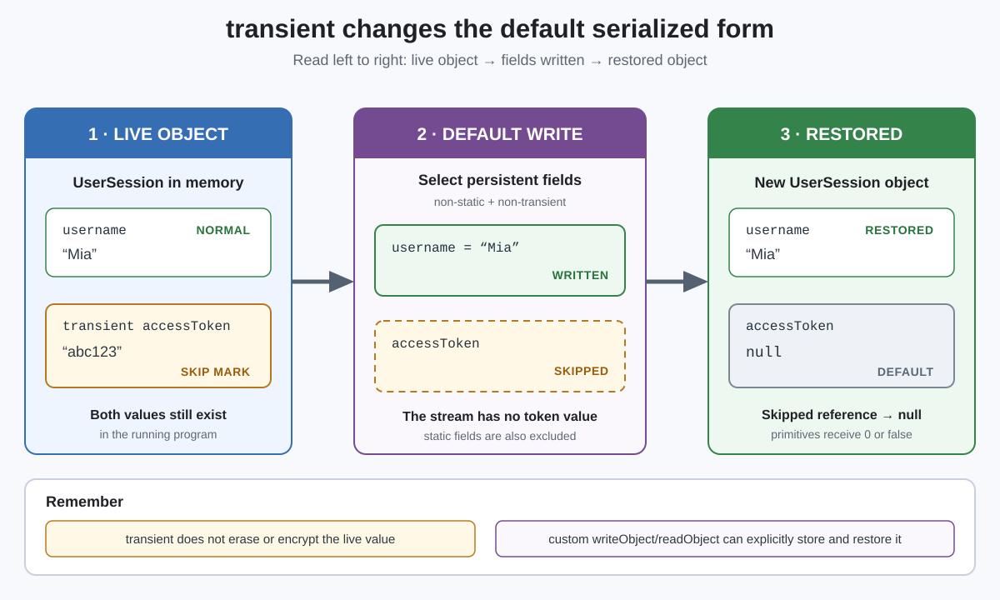

# Modifiers. `transient`

## Front

What does `transient` do during Java object serialization, and what value does the field have after deserialization?

## Back

`transient` excludes a field from Java's **default object-serialization field set**. The live object still contains the value; the default serialized form does not.



Serialization converts an object's state into a byte stream. Deserialization creates an object from that stream.

```java
import java.io.Serializable;

final class UserSession implements Serializable {
    private static final long serialVersionUID = 1L;

    private String username;
    private transient String accessToken;

    UserSession(String username, String accessToken) {
        this.username = username;
        this.accessToken = accessToken;
    }
}
```

With the default `ObjectOutputStream` mechanism:

- `username` is written and later restored.
- `accessToken` is skipped. It is not available in the stream.

The restored transient field keeps its type's default value because ordinary deserialization does not run the constructors or field initializers of the serializable class:

| Transient field type | Value after reading |
|---|---|
| Reference, such as `String` | `null` |
| `boolean` | `false` |
| Numeric primitive | `0` |

### Important limits

- `transient` is a **field modifier**. A `static` field is already excluded because it belongs to the class, not an individual object's serialized state.
- It does not erase, encrypt, or hide the value in memory, so it is not a security mechanism.
- A class can define private `writeObject` and `readObject` methods to explicitly write and restore data that the default mechanism skips.
- Deserializing untrusted data is dangerous; input filters and validation are separate protections.

Use `transient` for temporary or derived fields that can be safely recomputed, such as a cache. Do not use it when losing the field would leave the restored object invalid unless `readObject` reconstructs that field.

## Sources

- [Java Language Specification §8.3.1.3 — `transient` Fields](https://docs.oracle.com/en/java/javase/26/docs/specs/jls/jls-8.html#jls-8.3.1.3)
- [Java SE 26 API — `ObjectInputStream`](https://docs.oracle.com/en/java/javase/26/docs/api/java.base/java/io/ObjectInputStream.html)
- [Java Object Serialization Specification §2.3 — `writeObject`](https://docs.oracle.com/en/java/javase/26/docs/specs/serialization/output.html#the-writeobject-method)
- [Java Object Serialization Specification §3.4 — `readObject`](https://docs.oracle.com/en/java/javase/26/docs/specs/serialization/input.html#the-readobject-method)
