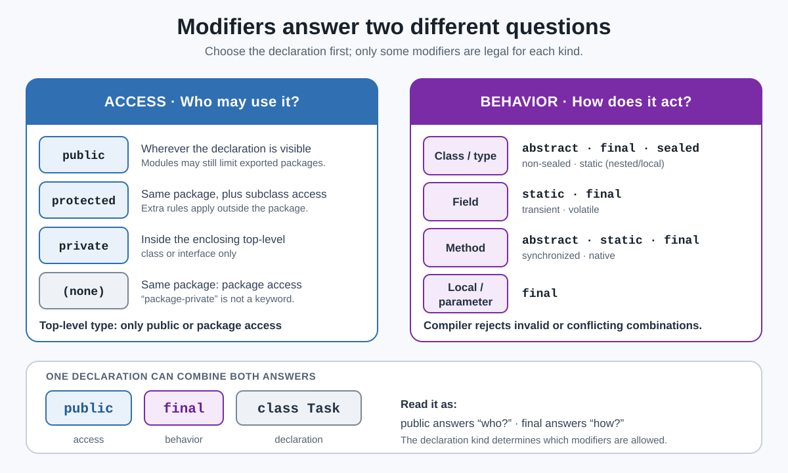

# Modifiers. Types of Modifiers

## Front

What are Java modifiers, what are their two practical categories, and why can the same modifier not be used on every declaration?

## Back

Java modifiers appear before a declaration and answer one of two practical questions: **who may access it?** or **how must it behave?**



### 1. Access modifiers — who may use it?

- `public` — accessible wherever the declaration is visible; modules can still limit exported packages.
- `protected` — accessible in the same package and, under extra rules, from subclasses outside that package.
- `private` — accessible only inside the enclosing top-level class or interface.
- **No access modifier** — most declarations receive **package access**, so code in the same package can use them. “Package-private” is common wording, but it is not a Java keyword.

A top-level class can have only `public` or package access. `protected` and `private` class declarations must be member classes. Interface members have additional implicit-access rules.

### 2. Other modifiers — how does it behave?

The legal set depends on the declaration; there is no single list that works everywhere.

| Declaration | Common examples |
|---|---|
| Class/type | `abstract`, `final`, `sealed`, `non-sealed`; `static` for a nested or local class |
| Field | `static`, `final`, `transient`, `volatile` |
| Method | `abstract`, `static`, `final`, `synchronized`, `native` |
| Local variable/parameter | `final` |

```java
public final class Task {
    private static final int LIMIT = 100;
    private boolean complete;

    public synchronized void finish() {
        complete = true;
    }
}
```

Here, `public` and `private` control access. `final`, `static`, and `synchronized` change behavior. A declaration may combine both categories, but the compiler rejects illegal or conflicting combinations such as `public private` or an `abstract final` class.

The Java Language Specification also permits annotations in modifier position; annotations provide metadata and are normally taught separately. `var` is **not** a modifier—it occupies the type position of a local-variable declaration.

## Sources

- [Java Language Specification §6.6 — Access Control](https://docs.oracle.com/en/java/javase/26/docs/specs/jls/jls-6.html#jls-6.6)
- [Java Language Specification §8.1.1 — Class Modifiers](https://docs.oracle.com/en/java/javase/26/docs/specs/jls/jls-8.html#jls-8.1.1)
- [Java Language Specification §8.3.1 — Field Modifiers](https://docs.oracle.com/en/java/javase/26/docs/specs/jls/jls-8.html#jls-8.3.1)
- [Java Language Specification §8.4.3 — Method Modifiers](https://docs.oracle.com/en/java/javase/26/docs/specs/jls/jls-8.html#jls-8.4.3)
