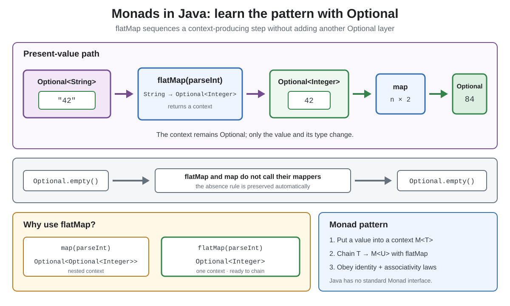

# Monads in Java

## Front

What is a monad, and how does Java's `Optional` demonstrate the pattern?

## Back

A **monad** is a composable context `M<T>` for sequencing dependent computations while preserving the context's rule. With `Optional<T>`, the rule is: if no value exists, later transformations are skipped and the result stays empty.



A monad provides:

- a way to put a value into the context (`pure`; `Optional.of` is analogous);
- a chaining operation like `flatMap`: `M<T>` plus `T -> M<U>` produces `M<U>`;
- left identity, right identity, and associativity laws, which make chains predictable when regrouped.

```java
Optional<Integer> doubled =
        Optional.of("42")
                .flatMap(s -> Optional.of(Integer.parseInt(s)))
                .map(n -> n * 2); // Optional[84]
```

`map` accepts `T -> U`. `flatMap` accepts `T -> Optional<U>` and returns that result directly, avoiding `Optional<Optional<U>>`. If the starting `Optional` is empty, neither mapper runs.

Java's standard library has no common `Monad` interface, so **monad-like pattern** is the careful term for this example. A type is not a monad merely because it has a method named `flatMap`; its operations must also obey the three laws.

## Sources

- [Java SE 26: `Optional`](https://docs.oracle.com/en/java/javase/26/docs/api/java.base/java/util/Optional.html)
- [Haskell 2010 Report: `Monad` class and laws](https://www.haskell.org/definition/haskell2010.pdf)
- [Philip Wadler: *Monads for Functional Programming*](https://homepages.inf.ed.ac.uk/wadler/topics/monads.html)
