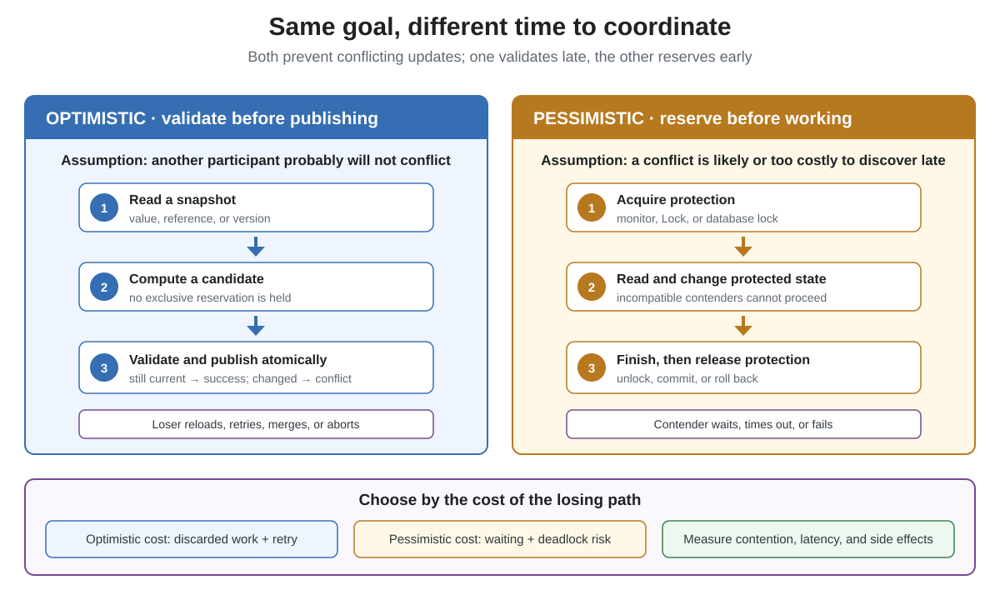
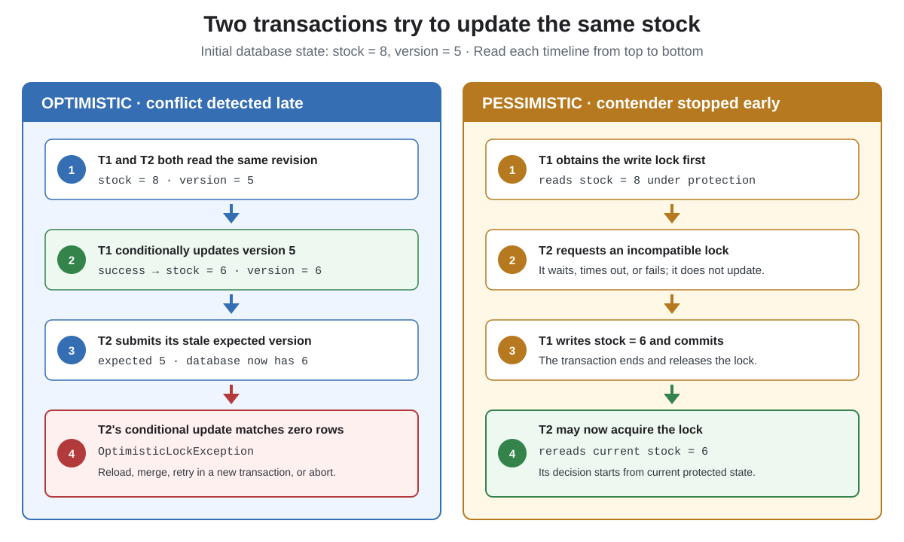

# Optimistic vs. Pessimistic Locking

## Front

How do optimistic and pessimistic locking differ in Java memory and Jakarta Persistence, what failures do they cause, and how should you choose between them?

## Back

**Optimistic locking works first and validates before publishing.**

**Pessimistic locking acquires protection before touching shared state.**

Optimistic control favors rare conflicts and cheap retries. Pessimistic control favors costly or frequent conflicts, but makes contenders wait.



Neither name identifies one Java class. They describe **when coordination happens**:

- **Optimistic:** read a snapshot, compute a candidate, then atomically verify that the snapshot is still current. A conflict rejects the candidate.
- **Pessimistic:** acquire a monitor, `Lock`, or database lock first; perform the protected work while incompatible contenders wait or fail to acquire it.

“Optimistic locking” often uses no held lock at all. Compare-and-set (CAS), a version column, and a conditional HTTP request all use the same validate-before-publish idea.

## Comparison

| Dimension | Optimistic | Pessimistic |
|---|---|---|
| Assumption | Conflicts are uncommon | Conflicts are likely or expensive |
| Coordination | At validation/update | Before protected work |
| Contender | Proceeds, then may conflict | Waits, times out, or fails |
| Main cost | Discarded work and retries | Blocking and lock management |
| Main risks | Retry storm, starvation, repeated side effects | Deadlock, convoying, starvation, timeout |
| Good fit | Read-heavy state, short cheap work | Hot state, costly or non-repeatable work |

## What happens when two updates collide

Both strategies can prevent a lost update, but the loser discovers the conflict at a different time.



Optimistic control allows both participants to start. Exactly one conditional update wins; the loser must reload, merge, retry, or report a conflict. Pessimistic control serializes the protected section: the second participant cannot perform the conflicting update until the first releases its lock.

## In-memory Java

This complete example applies the two strategies to the same account state:

```java
import java.util.concurrent.atomic.AtomicReference;
import java.util.concurrent.locks.ReentrantLock;

public class LockingDemo {
    record State(long balance) {}

    static final class OptimisticAccount {
        private final AtomicReference<State> state =
                new AtomicReference<>(new State(0));

        void deposit(long amount) {
            while (true) {
                State before = state.get();
                State after = new State(
                        Math.addExact(before.balance(), amount));

                if (state.compareAndSet(before, after)) {
                    return;
                }
            }
        }

        long balance() {
            return state.get().balance();
        }
    }

    static final class PessimisticAccount {
        private final ReentrantLock lock = new ReentrantLock();
        private long balance;

        void deposit(long amount) {
            lock.lock();
            try {
                balance = Math.addExact(balance, amount);
            } finally {
                lock.unlock();
            }
        }

        long balance() {
            lock.lock();
            try {
                return balance;
            } finally {
                lock.unlock();
            }
        }
    }

    public static void main(String[] args) {
        OptimisticAccount optimistic = new OptimisticAccount();
        PessimisticAccount pessimistic = new PessimisticAccount();
        optimistic.deposit(10);
        pessimistic.deposit(10);
        System.out.println(optimistic.balance() + " / "
                + pessimistic.balance());
    }
}
```

### Why the CAS loop is optimistic

`compareAndSet(before, after)` replaces the reference only if the current reference is still exactly `before`. A failed CAS changes nothing, so the loop reads fresh state and recomputes.

Use an immutable candidate. Never mutate the shared `before` object prior to validation. Also keep retry functions side-effect-free: `AtomicReference` update functions may be applied again after contention. Sending a payment, email, or message inside a retry can repeat it.

High contention can make many threads repeatedly compute and lose, consuming CPU. Use bounded retries, backoff, sharding, queueing, or a lock when measurements show a retry storm.

### Why `ReentrantLock` is pessimistic

`lock()` reserves the critical section before the balance is read or changed. Another thread trying the same lock waits until it becomes available. Always place `unlock()` in `finally`; timed or interruptible acquisition can bound waiting.

Keeping several locks at once can deadlock. Use a consistent acquisition order and keep locked sections short. A Java lock coordinates only threads sharing that lock object—normally one JVM—not other application instances.

## Jakarta Persistence and databases

### Optimistic entity versioning

The following is an illustrative Jakarta Persistence entity fragment:

```java
@Entity
class Product {
    @Id
    private Long id;

    @Version
    private long version;

    private int stock;
}
```

For a versioned entity, the provider automatically verifies that the revision read earlier is still current. The generated SQL is provider-specific, but the idea is a conditional update:

```sql
UPDATE product
SET stock = ?, version = 6
WHERE id = ? AND version = 5;
```

If another transaction has already advanced the version, zero rows match. The provider throws `OptimisticLockException` and marks the transaction for rollback. The exception may appear during an API call, `flush()`, or commit.

A safe retry must start a **new transaction**, reload current state, re-evaluate the business rule, and stop after a bounded number of attempts. Reusing the stale entity simply repeats the same mistake. External side effects require idempotency or transactional coordination because a database rollback cannot undo an already completed remote call.

### Pessimistic entity locking

An active transaction can request protection when loading an entity:

```java
Product product = entityManager.find(
        Product.class,
        productId,
        LockModeType.PESSIMISTIC_WRITE
);
```

Jakarta Persistence requires the provider to obtain a long-term database lock immediately. Once obtained, another transaction cannot successfully modify or delete the locked entity until the holder's transaction ends. The database mechanism and exact rows locked are provider- and database-dependent.

| Lock mode | Purpose |
|---|---|
| `PESSIMISTIC_READ` | Repeatable-read protection while allowing compatible readers |
| `PESSIMISTIC_WRITE` | Serialize transactions updating the entity |
| `PESSIMISTIC_FORCE_INCREMENT` | Write protection plus version increment |

Failure to obtain a lock may surface as `LockTimeoutException` when only the statement is rolled back, or `PessimisticLockException` when the transaction is marked for rollback. Use a bounded waiting policy and keep the transaction short; pessimistic locking introduces lock waits and deadlock risk.

## How to choose

Prefer **optimistic control** when:

- Real conflicts are rare.
- Work is short, cheap to recompute, and safe to retry.
- Holding a database lock across user think-time would be harmful.
- You need stale-edit detection for detached/versioned entities.

Prefer **pessimistic control** when:

- A small hot item is updated concurrently.
- Retrying wastes expensive computation.
- The operation cannot safely be repeated.
- A short read-modify-write sequence must exclude competitors immediately.

Measure conflict rate, retry count, lock-wait time, timeout rate, and deadlocks. A hybrid is valid: use optimistic control normally, then queue or serialize a demonstrably hot operation.

## Limits and common mistakes

- A database lock does not make an in-memory object thread-safe.
- A local `synchronized` block does not coordinate separate JVMs.
- Versioning one row does not automatically protect an invariant spanning several rows.
- Lock scope, transaction isolation, and database constraints are separate correctness layers.
- A pessimistic lock protects only the rows and relationships actually covered; it does not mean “lock everything.”
- Never retry forever or repeat non-idempotent side effects blindly.

## Summary

Optimistic locking pays when a conflict is detected; pessimistic locking pays by waiting before work. Choose according to measured contention, retry cost, side effects, required lock scope, and acceptable latency—not by the names alone.

## Sources

- [Java SE 26 API — `AtomicReference`](https://docs.oracle.com/en/java/javase/26/docs/api/java.base/java/util/concurrent/atomic/AtomicReference.html)
- [Java SE 26 API — `ReentrantLock`](https://docs.oracle.com/en/java/javase/26/docs/api/java.base/java/util/concurrent/locks/ReentrantLock.html)
- [Jakarta Persistence 3.2 specification — Locking and concurrency](https://jakarta.ee/specifications/persistence/3.2/jakarta-persistence-spec-3.2#locking-and-concurrency)
- [Jakarta Persistence 3.2 API — `Version`](https://jakarta.ee/specifications/persistence/3.2/apidocs/jakarta.persistence/jakarta/persistence/version)
- [Jakarta Persistence 3.2 API — `LockModeType`](https://jakarta.ee/specifications/persistence/3.2/apidocs/jakarta.persistence/jakarta/persistence/lockmodetype)
- [Jakarta Persistence 3.2 API — `OptimisticLockException`](https://jakarta.ee/specifications/persistence/3.2/apidocs/jakarta.persistence/jakarta/persistence/optimisticlockexception)
- [Jakarta Persistence 3.2 API — `LockTimeoutException`](https://jakarta.ee/specifications/persistence/3.2/apidocs/jakarta.persistence/jakarta/persistence/locktimeoutexception)
