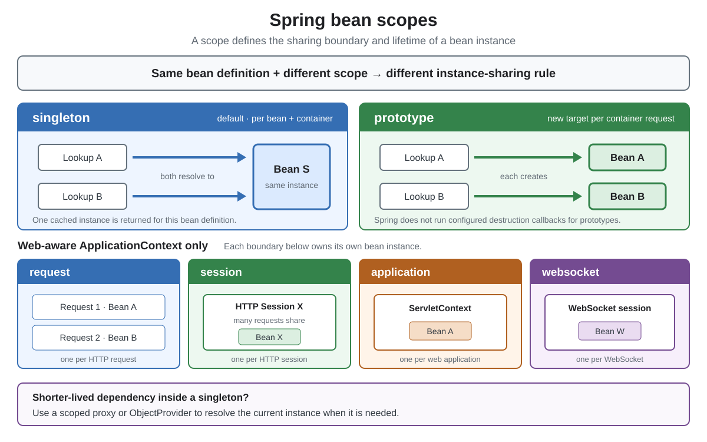
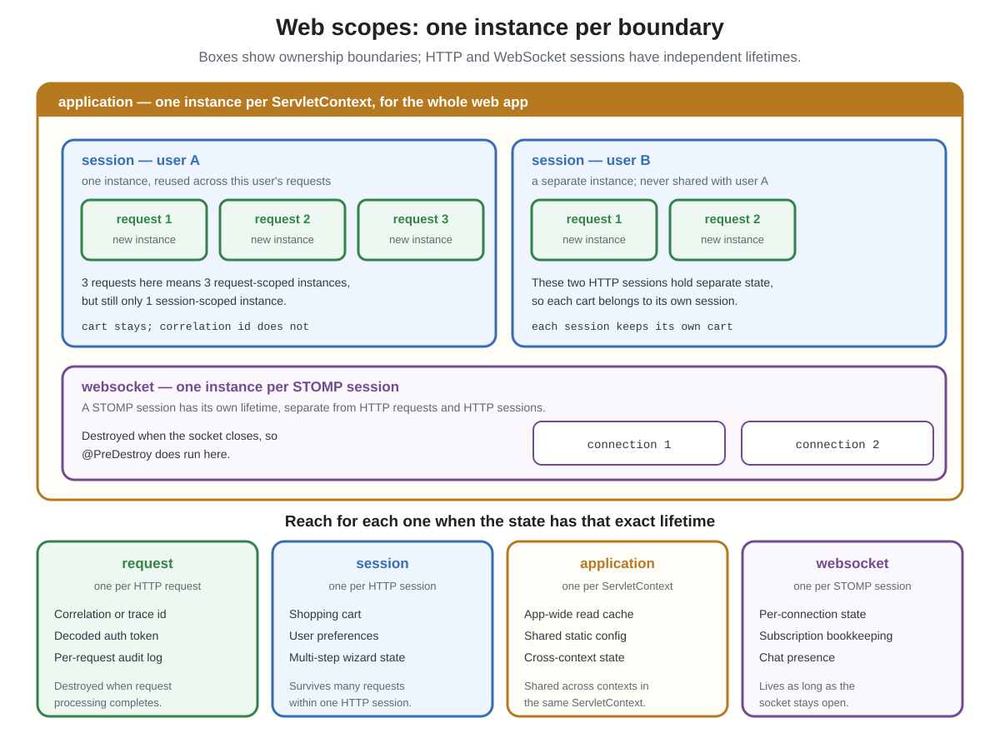

# Spring. Scopes

## Front

What does a Spring bean's scope control, what do the six built-in scopes mean, and for each web scope: what is it tied to, when should you reach for it, and what breaks if you use it wrong?

## Back

A bean's **scope** controls how many instances Spring creates and how long each instance is reused. `singleton` is the default: one instance **per bean definition per container** — unlike the Gang of Four singleton, which is one instance per class loader.



The card covers the two general scopes, the trap you hit when you mix lifetimes, then each web scope in turn.

The Java examples are fragments: imports, supporting domain types such as `Row`, and logging setup are omitted. The two `ReportService` definitions show alternative implementations.

| Scope | One instance per | Web only |
|---|---|---|
| `singleton` | bean definition, per container | no |
| `prototype` | every lookup or injection | no |
| `request` | HTTP request | yes |
| `session` | HTTP session | yes |
| `application` | `ServletContext` | yes |
| `websocket` | STOMP WebSocket session | yes |

## The two general scopes

### `singleton` — the default

One shared instance per bean definition in the container. An `ApplicationContext` creates singletons **eagerly by default**. `@Lazy` can defer creation until the bean is first needed, although an eager bean that directly depends on it still causes it to be created at startup. Singleton scope is the usual default for **stateless** services:

```java
@Service // no @Scope needed; singleton is the default
class PriceCalculator {

    private final TaxTable taxTable; // shared, immutable, safe

    PriceCalculator(TaxTable taxTable) {
        this.taxTable = taxTable;
    }

    Money price(Order order) {          // no mutable field touched,
        return taxTable.applyTo(order); // so concurrent calls are safe
    }
}
```

The rule that follows: a singleton is shared by **all concurrent requests**, so any mutable field on it is shared state. Storing the current user or the current request on a singleton field is a data race and a cross-request data leak.

### `prototype` — a new instance every time

Spring creates a fresh instance on each lookup or injection point:

```java
@Component
@Scope(ConfigurableBeanFactory.SCOPE_PROTOTYPE)
class ReportBuilder {

    private final List<Row> rows = new ArrayList<>(); // per-instance state

    ReportBuilder add(Row row) {
        rows.add(row);
        return this;
    }

    Report build() {
        return new Report(rows);
    }
}
```

Use it for **stateful, short-lived helpers** — builders, accumulators, per-job context objects — where sharing one instance would mix unrelated work together.

One caveat that catches people: Spring does not manage a prototype's full lifecycle. It instantiates, injects and runs initialization callbacks, then hands the object over and forgets it. **Destruction callbacks never run**, so anything holding a resource must be closed by your code.

## The trap: injecting a short lifetime into a long one

A singleton's dependencies are resolved **once**, when the singleton is created:

```java
@Component
class ReportService {

    private final ReportBuilder builder;   // injected when this service is created

    ReportService(ReportBuilder builder) { // the same instance forever,
        this.builder = builder;            // even though it is a prototype
    }
}
```

Every request now shares one builder and its accumulated rows. For this stateful builder, ask an `ObjectProvider<ReportBuilder>` for **one fresh, unproxied prototype per report**, then keep that same instance throughout the operation:

```java
@Component
class ReportService {

    private final ObjectProvider<ReportBuilder> builders;

    ReportService(ObjectProvider<ReportBuilder> builders) {
        this.builders = builders;
    }

    Report build(List<Row> rows) {
        ReportBuilder builder = builders.getObject(); // fresh, per call
        rows.forEach(builder::add);
        return builder.build();
    }
}
```

**A prototype proxy would lose this builder's state.** A scoped proxy is a stand-in that looks up a target bean for each method call. With `prototype`, every call gets a new target: `add(row1)`, `add(row2)`, and `build()` would use three different builders, producing an empty report. Keep `ReportBuilder` unproxied when using the provider above.

**A web-scoped proxy follows the current web boundary.** For example, a request-scoped proxy retrieves the same target throughout one request and a different target for another request. This lets a singleton controller or service use per-request state. The composed web-scope annotations shown below enable proxying by default.

## The four web scopes

The diagram groups beans by their sharing boundary. HTTP sessions and WebSocket sessions have separate lifetimes; either can end first.



These web scopes require different supporting context:

- **`request` and `session`:** a web-aware `ApplicationContext` registers the scopes, and access requires HTTP request attributes bound to the current thread. Spring MVC's `DispatcherServlet` binds them while processing a request. For access outside it, such as in a plain servlet or a filter, configure `RequestContextListener` or a suitably mapped `RequestContextFilter`.
- **`application`:** a web application context with a `ServletContext` registers this scope. It stores beans directly in that `ServletContext`; access does not require an HTTP request bound to the thread. For destruction callbacks at web-application shutdown, register `ContextCleanupListener` (or use `ContextLoaderListener`, which includes that cleanup), unless equivalent cleanup is already configured.
- **`websocket`:** Spring's STOMP (Simple Text Oriented Messaging Protocol) message-broker configuration, such as `@EnableWebSocketMessageBroker`, registers the scope. Message handling exposes the current messaging session's attributes. An HTTP request listener alone cannot provide that context.

### `request` — one per HTTP request

```java
@Component
@RequestScope // = request scope + a TARGET_CLASS proxy
class RequestContext {

    private final String correlationId = UUID.randomUUID().toString();
    private String tenant;

    String correlationId() { return correlationId; }
    String tenant() { return tenant; }
    void tenant(String tenant) { this.tenant = tenant; }
}
```

```java
@Service
class AuditingService {

    private final RequestContext context; // a proxy, not the instance

    AuditingService(RequestContext context) {
        this.context = context;
    }

    void record(String event) {                     // resolves to the
        log.info("{} {} {}", context.correlationId(), // instance belonging
                 context.tenant(), event);            // to *this* request
    }
}
```

**Why:** it carries per-request facts — correlation id, decoded token claims, resolved tenant — to code deep in the call stack without threading an extra parameter through every method signature.

**When:** the value is derived from this one request and is meaningless afterwards.

**Instead of what:** a field on a singleton (shared across concurrent requests — a race and a leak), or a hand-rolled `ThreadLocal` (works, but you lose dependency injection, lifecycle callbacks and easy test doubles).

### `session` — one per HTTP session

```java
@Component
@SessionScope
class ShoppingCart {

    private final List<Item> items = new ArrayList<>();

    synchronized void add(Item item) { items.add(item); }
    synchronized List<Item> items()  { return List.copyOf(items); }
}
```

**Why:** state that must survive many requests from the *same* user but must never be visible to another user.

**When:** shopping carts, multi-step wizard progress, per-user UI preferences.

**Concurrency:** two tabs or overlapping requests in the same HTTP session share this cart. Session scope does not serialize method calls. Both methods synchronize on the cart instance, so an update cannot overlap another update or the creation of the list snapshot. The snapshot protects the list structure; mutable `Item` objects would need their own protection.

**Cost to weigh:** session state is memory held per active user, and in a clustered deployment it must either be replicated (so the bean has to be serializable) or pinned with sticky sessions. Prefer a stateless design with the identifier in a token when you can.

### `application` — one per `ServletContext`

An `application`-scoped bean belongs to the whole web application. Several Spring contexts can share the same `ServletContext`, and a bean stored there is also visible as a servlet-context attribute.

**Good use — a checkout switch shared by separate web contexts.** Suppose one web application has an admin `DispatcherServlet` and a storefront `DispatcherServlet`, each with its own Spring context. Both register the following bean under the name `featureFlags` and use the same `ServletContext`. An administrator must be able to disable checkout for every shopper in that web application:

```java
@Component("featureFlags")
@ApplicationScope
class FeatureFlags {

    private final Map<String, Boolean> flags = new ConcurrentHashMap<>();

    boolean enabled(String key) {
        return flags.getOrDefault(key, false);
    }

    void setEnabled(String key, boolean enabled) {
        flags.put(key, enabled);
    }
}
```

In this usage fragment, `adminContext` and `shopContext` are those two configured web contexts:

```java
FeatureFlags adminFlags = adminContext.getBean(FeatureFlags.class);
FeatureFlags shopFlags = shopContext.getBean(FeatureFlags.class);

adminFlags.setEnabled("checkout", true); // initialize before serving requests
boolean initiallyAllowed = shopFlags.enabled("checkout"); // true

adminFlags.setEnabled("checkout", false);
boolean checkoutAllowed = shopFlags.enabled("checkout"); // false
```

The injected proxies can differ, but they resolve to the same stored flag registry. That sharing is intentional: checkout availability is a policy for the whole web application. `ConcurrentHashMap` supports concurrent flag reads and updates. With a separately defined `singleton` in each context, changing the admin copy would leave the storefront copy unchanged.

If both contexts can inherit one bean from a shared parent context, a singleton defined only in that parent is another way to share the registry. `@ApplicationScope` is useful when the `ServletContext` itself is the intended sharing boundary.

**Bad use — the current user of a request.** This bean incorrectly stores request-specific identity in application-wide state. The example is intentionally unsafe despite its synchronized methods:

```java
@Component
@ApplicationScope // BAD: every user's requests share this target
class CurrentUser {

    private String username;

    synchronized void setUsername(String username) {
        this.username = username;
    }

    synchronized String username() {
        return username;
    }
}
```

Imagine this ordering across two overlapping requests, both using the same application-scoped `currentUser`:

```java
currentUser.setUsername("alice"); // Alice's request starts
currentUser.setUsername("bob");   // Bob's request starts
String owner = currentUser.username(); // Alice's request now reads "bob"
```

Alice's work could now be recorded under Bob's identity. Synchronizing each method prevents simultaneous access inside those methods; it does not give each request its own value. For this request-specific bean, use `@RequestScope`, or pass the authenticated identity explicitly to the code that needs it.

**Choice rule:** use `application` for state that should be shared throughout one `ServletContext`. Use a narrower scope for request or user-session state. For an ordinary service shared within one Spring context, `singleton` is usually sufficient.

### `websocket` — one per STOMP session

`@WebSocketScope` was introduced in **Spring Framework 7.0**. With earlier versions, use `@Scope(value = "websocket", proxyMode = ScopedProxyMode.TARGET_CLASS)` instead.

```java
@Component
@WebSocketScope // Spring Framework 7.0+
class ConnectionState {

    private final Set<String> subscriptions = ConcurrentHashMap.newKeySet();

    @PostConstruct
    void init() { /* after injection */ }

    void subscribe(String topic) { subscriptions.add(topic); }

    @PreDestroy
    void close() { /* runs when the socket closes */ }
}
```

**Why:** a WebSocket connection is long-lived and independent of the HTTP request that opened it, so neither `request` nor `session` describes its lifetime.

**When:** per-connection bookkeeping in STOMP messaging — active subscriptions, chat presence, a per-connection rate limiter.

**Where it works:** controller methods handling WebSocket messages, and channel interceptors on the `clientInboundChannel`. Those are singletons that outlive any one session, so `@WebSocketScope` enables proxying for you.

**Concurrency:** inbound STOMP messages can be handled concurrently, including messages from the same session. The concurrent set makes individual subscription additions safe. A workflow with several dependent operations still needs its own synchronization or atomic operation.

**Nice property:** unlike `prototype`, this scope *does* run `@PreDestroy` when the session ends.

## Limits and gotchas

- **Request/session access needs bound request context.** Access on a worker thread without that context fails, as can happen with `@Async` or an executor. A non-async `CompletableFuture` continuation may run on the request thread. Explicit context propagation can also support access while the request/session remains valid; it does not extend their lifetimes. For independent background work, copy the needed values before handing work off.
- **A scoped proxy is a subclass.** The default `TARGET_CLASS` mode generates a CGLIB subclass, so the target cannot be `final` and private methods are not intercepted. Use `INTERFACES` mode when the bean implements one.
- **Destruction callbacks depend on scope and lifecycle setup.** Spring does not automatically run them for `prototype` beans. The other built-in scopes support `@PreDestroy` at their lifecycle boundary; `application` scope requires the cleanup wiring described above.
- **A wider scope is not a cache.** Widening a scope to avoid re-creating an object turns per-user or per-request data into shared mutable state. Pick the scope that matches the data's real lifetime, then cache deliberately.

## Sources

- [Spring Framework: Bean Scopes](https://docs.spring.io/spring-framework/reference/core/beans/factory-scopes.html)

  Defines the six scopes, the per-container singleton versus the GoF singleton, the prototype lifecycle limits, the web configuration required, the `application`-versus-`singleton` distinction, and the scoped-proxy and provider solutions.

- [Spring Framework: WebSocket Scope](https://docs.spring.io/spring-framework/reference/web/websocket/stomp/scope.html)

  Documents `@WebSocketScope`, where such beans may be injected, and that proxy mode is required because the injection targets outlive a session.

- [Spring Framework API: `@Scope`](https://docs.spring.io/spring-framework/docs/current/javadoc-api/org/springframework/context/annotation/Scope.html)

  Specifies `value` and `proxyMode`.

- [Spring Framework API: `@RequestScope`](https://docs.spring.io/spring-framework/docs/current/javadoc-api/org/springframework/web/context/annotation/RequestScope.html)

  A composed annotation for request scope with `proxyMode` set to `TARGET_CLASS`.

- [Spring Framework API: `@SessionScope`](https://docs.spring.io/spring-framework/docs/current/javadoc-api/org/springframework/web/context/annotation/SessionScope.html)

  The session-scope equivalent, also proxied by default.

- [Spring Framework API: `@ApplicationScope`](https://docs.spring.io/spring-framework/docs/current/javadoc-api/org/springframework/web/context/annotation/ApplicationScope.html)

  The `ServletContext`-scoped equivalent.

- [Spring Framework API: `ObjectProvider`](https://docs.spring.io/spring-framework/docs/current/javadoc-api/org/springframework/beans/factory/ObjectProvider.html)

  The on-demand lookup used to obtain a fresh instance from inside a longer-lived bean.

- [Spring Framework API: `RequestContextListener`](https://docs.spring.io/spring-framework/docs/current/javadoc-api/org/springframework/web/context/request/RequestContextListener.html)

  Binds the request to the servicing thread outside `DispatcherServlet`, which the request and session scopes require.

- [Spring Framework: Lazy-initialized Beans](https://docs.spring.io/spring-framework/reference/core/beans/dependencies/factory-lazy-init.html)

  Explains eager creation by default, `@Lazy`, and eager dependencies on lazy beans.

- [Spring Framework API: `ServletContextScope`](https://docs.spring.io/spring-framework/docs/current/javadoc-api/org/springframework/web/context/support/ServletContextScope.html)

  Defines application-scope storage in `ServletContext` and the listener requirement for destruction callbacks.

- [Spring Framework: Context Hierarchy](https://docs.spring.io/spring-framework/reference/web/webmvc/mvc-servlet/context-hierarchy.html)

  Explains separate Spring contexts for individual servlets and the alternative of sharing beans through one root Spring context.

- [Spring Framework API: `WebSocketMessageBrokerConfigurationSupport`](https://docs.spring.io/spring-framework/docs/current/javadoc-api/org/springframework/web/socket/config/annotation/WebSocketMessageBrokerConfigurationSupport.html)

  Documents the message-broker configuration and its WebSocket scope registration.

- [Spring Framework API: `@WebSocketScope`](https://docs.spring.io/spring-framework/docs/current/javadoc-api/org/springframework/web/socket/config/annotation/WebSocketScope.html)

  Specifies its introduction in 7.0 and default `TARGET_CLASS` proxy mode.

- [Jakarta Servlet 6.1: Session Threading Issues](https://jakarta.ee/specifications/servlet/6.1/jakarta-servlet-spec-6.1#threading-issues)

  Requires applications to protect session attribute objects against concurrent access.

- [Java Language Specification: `synchronized` Methods](https://docs.oracle.com/javase/specs/jls/se25/html/jls-8.html#jls-8.4.3.6)

  Defines the instance lock used by the cart's synchronized methods.

- [Spring Framework: Order of Messages](https://docs.spring.io/spring-framework/reference/web/websocket/stomp/ordered-messages.html)

  Describes concurrent inbound message processing and optional ordering within a session.

- [Java API: `ConcurrentHashMap`](https://docs.oracle.com/en/java/javase/25/docs/api/java.base/java/util/concurrent/ConcurrentHashMap.html)

  Defines concurrent operations and the set returned by `newKeySet()`.

- [Spring Framework: Asynchronous Request Context Propagation](https://docs.spring.io/spring-framework/reference/web/webmvc/mvc-ann-async.html#webmvc-ann-async-context-propagation)

  Describes explicit propagation of request attributes across threads.
