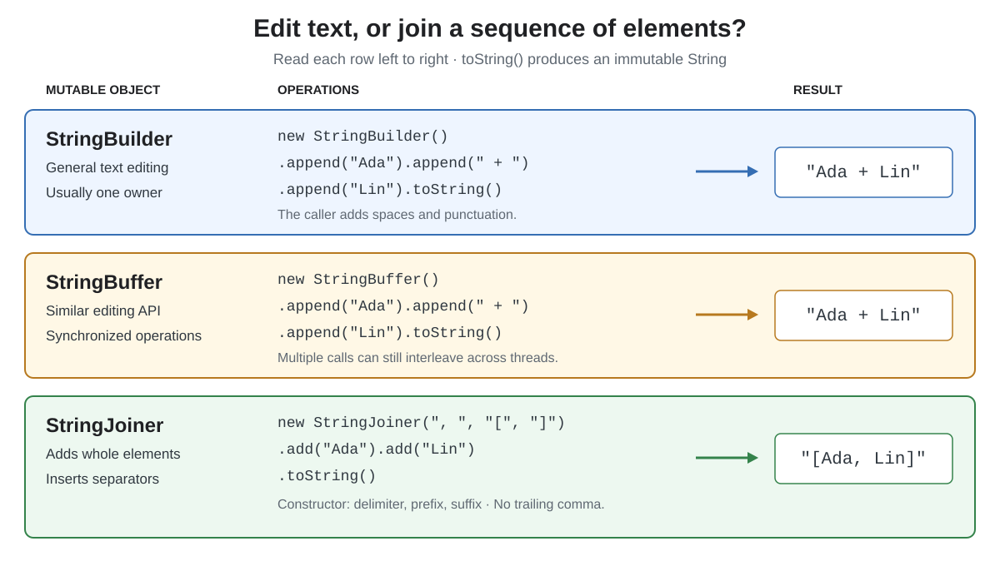
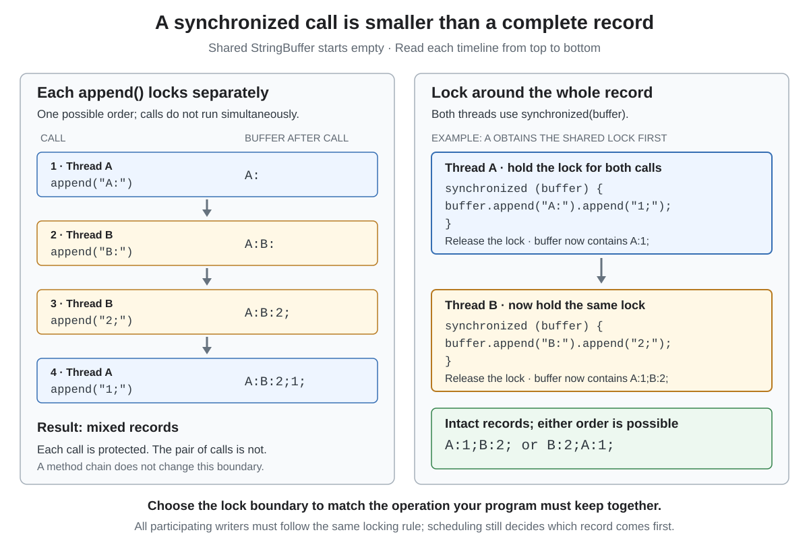

# StringBuffer vs StringJoiner vs StringBuilder

<sub>[Back to Java](../Readme.md#content)</sub>

**Use `StringBuilder` to assemble or edit text, `StringBuffer` when a shared mutable buffer needs synchronized operations, and `StringJoiner` to join elements with separators.** All three can produce an immutable `String`, but they solve different construction problems.

Start with the three classes, then compare joining, formatting and character-output alternatives. The application programming interface (API) contracts below use Java Standard Edition (Java SE) 26; the examples also run on Java 21.

## The basic model

A **mutable** object can change its contents. An **immutable** object cannot: a `String` operation that produces different text gives you another string value. Reassigning a `String` variable changes its reference, not the original object's contents.

A **delimiter** separates elements, such as the comma and space in `Ada, Lin`. A **prefix** and **suffix** surround the complete result, such as the brackets in `[Ada, Lin]`.

Read each row from the construction operation to the resulting text. Builders accept the punctuation you append; a joiner supplies the separators between elements.



| Question | `StringBuilder` | `StringBuffer` | `StringJoiner` |
|---|---|---|---|
| Main job | General text construction and editing | Similar editing API with synchronization | Delimited element assembly |
| Typical operations | `append`, `insert`, `delete`, `replace` | `append`, `insert`, `delete`, `replace` | `add`, `merge`, `setEmptyValue` |
| Automatically inserts separators? | No | No | Yes |
| Safe to mutate one shared instance without an external lock? | No | Individual operations are synchronized where necessary | No thread-safety guarantee |
| Produce a `String` | `toString()` | `toString()` | `toString()` |
| Usual choice | A local builder owned by one task | An API or design requiring a shared synchronized buffer | Elements with a delimiter and optional surrounding text |

`StringBuilder` and `StringBuffer` are in `java.lang`, so no import is needed. `StringJoiner` is in `java.util`.

## StringBuilder: assemble and edit text

Use a builder when the output takes shape through a loop, conditions or edits. `append` adds at the end; `insert` adds at an index; `delete` and `replace` modify a range.

The constructor argument in `new StringBuilder(32)` reserves **capacity**; it does not create 32 characters. **Length** counts the characters currently present. Capacity grows when needed. A reasonable initial capacity can reduce buffer growth when the approximate output size is known.

This complete example compares construction and shows that a previously produced string does not change with its builder:

```java
import java.util.StringJoiner;

public final class StringConstructionDemo {
    public static void main(String[] args) {
        StringBuilder builder = new StringBuilder(32);
        builder.append("Ada").append(" + ").append("Lin");
        String saved = builder.toString();
        builder.insert(0, "Hi, ");

        StringBuffer buffer = new StringBuffer();
        buffer.append("Ada").append(" + ").append("Lin");

        StringJoiner joiner = new StringJoiner(", ", "[", "]");
        joiner.add("Ada").add("Lin");

        System.out.println(saved);    // Ada + Lin
        System.out.println(builder);  // Hi, Ada + Lin
        System.out.println(buffer);   // Ada + Lin
        System.out.println(joiner);   // [Ada, Lin]
    }
}
```

The application may have many threads while each request uses its own local builder. Thread safety depends on **sharing the same object**, not merely on whether the application is multithreaded.

## StringBuffer: synchronized calls, not an atomic workflow

`StringBuffer` coordinates operations on the same instance. It does not automatically make a sequence of calls **atomic**—indivisible as one application operation. Chaining calls does not change that boundary.

In the left sequence, every `append` finishes before the next begins, yet two records become mixed. The right sequence protects each complete record with one lock; either record may still come first.



This complete class groups all the appends for one record under the buffer's monitor lock. A **monitor lock** lets one thread at a time execute code synchronized on that object.

```java
final class SharedLog {
    private final StringBuffer buffer = new StringBuffer();

    void add(String name, int value) {
        synchronized (buffer) {
            buffer.append(name).append(':').append(value).append(';');
        }
    }

    String snapshot() {
        return buffer.toString();
    }
}
```

The synchronized buffer operations use the same monitor, so another thread cannot take a snapshot halfway through this protected record. Java locks are **reentrant**: the owning thread can enter the buffer's synchronized methods while already holding its monitor.

A builder protected consistently by an external lock is another possible design. Often, each task can build its own string and hand off the finished result instead.

One further limit: appending from a mutable source does not automatically lock that source. The caller must keep the source stable while it is read.

## StringJoiner: add elements, let it place delimiters

`StringJoiner` represents a growing sequence of elements. It avoids manually deciding whether to insert a separator before the next element. It does not provide arbitrary character editing or automatically escape a structured format such as comma-separated values (CSV).

The following is a method-body fragment; import `java.util.StringJoiner`:

```java
StringJoiner tags = new StringJoiner(", ", "[", "]");
System.out.println(tags);                  // []

tags.setEmptyValue("(none)");
System.out.println(tags);                  // (none)

tags.add("java").add("backend");
System.out.println(tags);                  // [java, backend]

StringJoiner blank = new StringJoiner(", ", "[", "]");
blank.setEmptyValue("(none)").add("");
System.out.println(blank);                 // []
```

Adding `""` still adds an element, so the custom empty value no longer applies. `add(null)` inserts the literal text `"null"`; passing a null delimiter, prefix or suffix to a `StringJoiner` constructor throws `NullPointerException` at runtime.

`merge(other)` incorporates a nonempty joiner's contents without its outer prefix and suffix. This supports combining partial results; it does not make a joiner safe for concurrent mutation.

## String.join and Collectors.joining: convenient joining APIs

These are methods, not competing mutable classes:

- **`String.join`** joins character sequences supplied as variable arguments, an array or an `Iterable`, with a delimiter.
- **`Collectors.joining`** combines elements produced by a stream, optionally adding a prefix and suffix. A **collector** specifies how to accumulate and combine a stream's results.

This method-body fragment uses `java.util.List`, `java.util.Locale` and `java.util.stream.Collectors`:

```java
List<String> names = List.of("Ada", "Lin");

String plain = String.join(", ", names);
String transformed = names.stream()
        .map(name -> name.toUpperCase(Locale.ROOT))
        .collect(Collectors.joining(", ", "[", "]"));

System.out.println(plain);        // Ada, Lin
System.out.println(transformed);  // [ADA, LIN]
```

For an ordered stream, `joining` preserves **encounter order**—the order defined by the source and pipeline—even when collection runs in parallel. It does not sort the elements.

Parallel collection can use separate mutable containers for separate partitions and combine them afterward. A non-thread-safe accumulator can therefore work safely inside a properly implemented collector. This is different from having every worker append to one shared builder through `parallelStream().forEach(...)`; that pattern also does not preserve encounter order.

`String.join` turns a null element into `"null"`, but throws `NullPointerException` at runtime if the delimiter, the elements array or the `Iterable` argument is null. Decide whether missing values should be rejected, omitted or replaced before joining; do not rely on accidental output.

## Other related classes and interfaces

Choose by the operation and the API you need to call, rather than by the word “string” in a class name.

| Tool | Use it for | How it differs |
|---|---|---|
| `String` and `+` | Finished text and small concatenation expressions | Immutable values; no editable buffer |
| `String.format` / `String.formatted` | A fixed layout containing values | Formatting rules such as decimal precision or padding |
| `Formatter` | Repeated printf-style formatting into a destination | Interprets format patterns; can write to an `Appendable` |
| `MessageFormat` | Parameterized messages, including localized number/date formatting | Uses argument placeholders such as `{0}` and its own pattern rules |
| `StringWriter` | Capturing output from an API that accepts a `Writer` | Character-output adapter backed by a `StringBuffer` |
| `CharArrayWriter` | Capturing character output and obtaining a `char[]` | A growing character-array writer; `toCharArray()` returns a copy |
| `CharBuffer` | Buffer-based character processing and Java's new I/O (NIO) APIs | Has position, limit and fixed capacity; may be read-only |
| `Appendable` | Accepting destinations that support appending | An interface implemented by builders, buffers and writers; it does not promise thread safety |
| `CharSequence` | Accepting readable text without requiring a `String` | An interface; a readable view does not mean the underlying object is immutable |

`StringJoiner` implements neither `Appendable` nor `CharSequence`. Convert it with `toString()` when an API needs a text value.

### Formatting values

Use formatters when punctuation alone is insufficient. This method-body fragment imports `java.util.Locale`:

```java
String label = "User %s has %d points".formatted("Ada", 12);
String amount = String.format(Locale.ROOT, "%.2f", 12.5);

System.out.println(label);   // User Ada has 12 points
System.out.println(amount);  // 12.50
```

`%s` formats text, `%d` an integer and `%.2f` a floating-point value with two fractional digits. `formatted` uses the default formatting locale; use the locale overload of `String.format` when numeric output must follow an explicit locale. `Formatter` and `MessageFormat` instances require their own concurrency discipline; they are not replacements for `StringBuffer` synchronization.

### Capturing Writer output

A **`Writer`** is an API for character output. `StringWriter` is useful when an existing function expects one, even if the final destination is a string. This complete example uses `write` rather than rebuilding that function around `StringBuilder`:

```java
import java.io.IOException;
import java.io.StringWriter;
import java.io.Writer;

public final class WriterDemo {
    static void writeGreeting(Writer out) throws IOException {
        out.write("Hello, ");
        out.write("Ada");
    }

    public static void main(String[] args) throws IOException {
        StringWriter out = new StringWriter();
        writeGreeting(out);
        System.out.println(out.toString());  // Hello, Ada
    }
}
```

When output is large and can go directly to a file or another destination, write incrementally to an appropriate writer instead of retaining the whole result in a builder first.

## Performance and interview pitfalls

### A short + expression is fine

For `"User: " + name + ", points: " + points`, prefer readability. Java compilers may optimize concatenation; the language does not require each `+` to become a separate `StringBuilder`. Constant expressions can be evaluated at compile time.

Repeatedly assigning `result = result + piece` in a loop can repeatedly copy the growing prefix. Appending pieces to one local builder makes the accumulation explicit. Avoid calling `toString()` after every append when only the final string is needed.

There is no universal speed ratio between `StringBuilder`, `StringBuffer` and `StringJoiner`. Their workloads differ; synchronization, allocation, output size and runtime optimization affect the result. Choose the right semantics first and measure a real bottleneck.

### Capacity, encoding and equality are separate concerns

- **Capacity is not length.** Reserving space does not add visible text.
- **Character count is not necessarily visible-symbol count.** Java indexes text in 16-bit Unicode Transformation Format (UTF-16) code units; some Unicode characters occupy two units.
- **Backing storage is an implementation detail.** In the inspected Java Development Kit (JDK) 26 implementation, builders use the non-public `AbstractStringBuilder` implementation with a byte array and encoding marker. Do not assume a public `char[]` representation or treat that superclass as another application API.
- **Builder equality is not text equality.** Two separate `StringBuilder` objects containing `"Ada"` are not equal through `equals`. Compare their resulting strings when you mean content equality. The same identity-equality caveat applies to `StringBuffer`.
- **Null behavior depends on the overload.** `append((String) null)` appends `"null"`; it does not mean that every null argument is accepted.

## Choosing in an interview or code review

| Situation | Starting choice |
|---|---|
| A few values in one expression | `String` with `+` |
| A loop or conditional sequence assembles arbitrary text | Local `StringBuilder` |
| Incrementally add delimited elements | `StringJoiner` |
| Already have a collection of text elements | `String.join` |
| A stream filters or transforms elements before joining | `Collectors.joining` |
| A fixed layout needs precision, padding or localization | Formatting API |
| A library requires a `Writer` | `StringWriter` or `CharArrayWriter` for in-memory output |
| One mutable text buffer must be shared | `StringBuffer` or consistent external synchronization; protect complete compound operations |

The interview distinction to explain is **editing versus joining, followed by ownership and synchronization**. A multithreaded application can still use local builders, and a synchronized buffer can still need a larger critical section.

# Sources

- [Java SE 26 — StringBuilder](https://docs.oracle.com/en/java/javase/26/docs/api/java.base/java/lang/StringBuilder.html)
  mutable editing, capacity, snapshots, overloads and equality.

- [Oracle Java tutorial — The StringBuilder Class](https://docs.oracle.com/javase/tutorial/java/data/buffers.html)
  construction, length versus capacity and editing examples; this older tutorial is used only for behavior checked against the current API.

- [Java SE 26 — StringBuffer](https://docs.oracle.com/en/java/javase/26/docs/api/java.base/java/lang/StringBuffer.html)
  synchronization boundaries and mutable-source caveat.

- [Java SE 26 — StringJoiner](https://docs.oracle.com/en/java/javase/26/docs/api/java.base/java/util/StringJoiner.html)
  delimiters, empty elements, nulls and merging.

- [Java SE 26 — String](https://docs.oracle.com/en/java/javase/26/docs/api/java.base/java/lang/String.html)
  immutability, Unicode representation, joining and formatting.

- [Java SE 26 Java Language Specification (JLS) §15.18.1 — String concatenation](https://docs.oracle.com/javase/specs/jls/se26/html/jls-15.html#jls-15.18.1)
  concatenation semantics and permitted optimizations.

- [Java SE 26 JLS §17.1 — Synchronization](https://docs.oracle.com/javase/specs/jls/se26/html/jls-17.html#jls-17.1)
  monitors and reentrant locking.

- [Java SE 26 — Collectors.joining](https://docs.oracle.com/en/java/javase/26/docs/api/java.base/java/util/stream/Collectors.html#joining(java.lang.CharSequence,java.lang.CharSequence,java.lang.CharSequence))
  delimiters and encounter order.

- [Java SE 26 — Collector](https://docs.oracle.com/en/java/javase/26/docs/api/java.base/java/util/stream/Collector.html)
  isolated accumulation and combining in parallel reductions.

- [Java SE 26 — Formatter](https://docs.oracle.com/en/java/javase/26/docs/api/java.base/java/util/Formatter.html) and [MessageFormat](https://docs.oracle.com/en/java/javase/26/docs/api/java.base/java/text/MessageFormat.html)
  formatting roles, locale rules and concurrency limits.

- [Java SE 26 — StringWriter](https://docs.oracle.com/en/java/javase/26/docs/api/java.base/java/io/StringWriter.html) and [CharArrayWriter](https://docs.oracle.com/en/java/javase/26/docs/api/java.base/java/io/CharArrayWriter.html)
  in-memory character output.

- [Java SE 26 — CharBuffer](https://docs.oracle.com/en/java/javase/26/docs/api/java.base/java/nio/CharBuffer.html), [Appendable](https://docs.oracle.com/en/java/javase/26/docs/api/java.base/java/lang/Appendable.html) and [CharSequence](https://docs.oracle.com/en/java/javase/26/docs/api/java.base/java/lang/CharSequence.html)
  related buffer and interface contracts.

- [OpenJDK 26 — AbstractStringBuilder source](https://github.com/openjdk/jdk/blob/jdk-26-ga/src/java.base/share/classes/java/lang/AbstractStringBuilder.java)
  version-specific backing storage and the non-public superclass.

- [Java SE 26 — Stream.forEach](https://docs.oracle.com/en/java/javase/26/docs/api/java.base/java/util/stream/Stream.html#forEach(java.util.function.Consumer))
  ordering and synchronization requirements for side effects.
