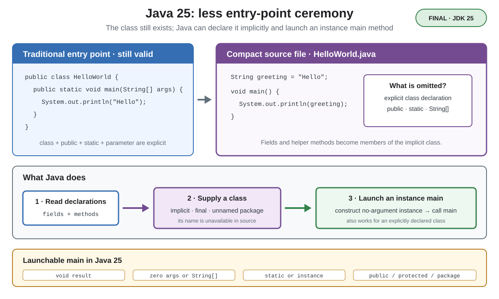

# Syntax. Compact Source Files and Instance Main Methods

## Front

What changed with compact source files and instance `main` methods in Java 25?

## Back

**Compact source files and instance `main` methods** became final in **JDK 25** with JEP 512.

**Java 25 lets a small program omit an explicit class declaration and use `void main()` as its entry point.** The compiler still creates a class, and the launcher creates an object before calling an instance `main` method. This feature is final in Java 25, not preview.



`HelloWorld.java` can contain fields and methods directly, without a wrapper:

```java
String greeting(String name) {
    return "Hello, " + name;
}

void main() {
    System.out.println(greeting("Ada"));
}
```

Run it directly with `java HelloWorld.java`, or compile and then run it with `javac HelloWorld.java` followed by `java HelloWorld`.

The compiler treats these declarations as members of an **implicitly declared final class** in the unnamed package. Its name cannot be used in source code. The file may contain fields, methods, and nested classes or interfaces, but not an explicit constructor.

The relaxed launch protocol also works in an ordinary class:

```java
class Application {
    void main() {
        System.out.println("Started");
    }
}
```

A launchable `main` must return `void` and accept either no parameters or one `String[]`/`String...` parameter. It may be `static` or an instance method and may have `public`, `protected`, or package access—not `private`. For an instance method, the launcher constructs the initial class with a no-argument constructor, then invokes `main`.

Compact source files also automatically import public top-level types from packages exported by `java.base`. The traditional `public static void main(String[] args)` remains valid.

## Sources

- [Java 25 Language Guide: Compact Source Files and Instance main Methods](https://docs.oracle.com/en/java/javase/25/language/compact-source-files-instance-main-methods.html)
- [JLS 25 §7.3: Compilation Units](https://docs.oracle.com/javase/specs/jls/se25/html/jls-7.html#jls-7.3)
- [JLS 25 §12.1.4: Invoke a main Method](https://docs.oracle.com/javase/specs/jls/se25/html/jls-12.html#jls-12.1.4)
