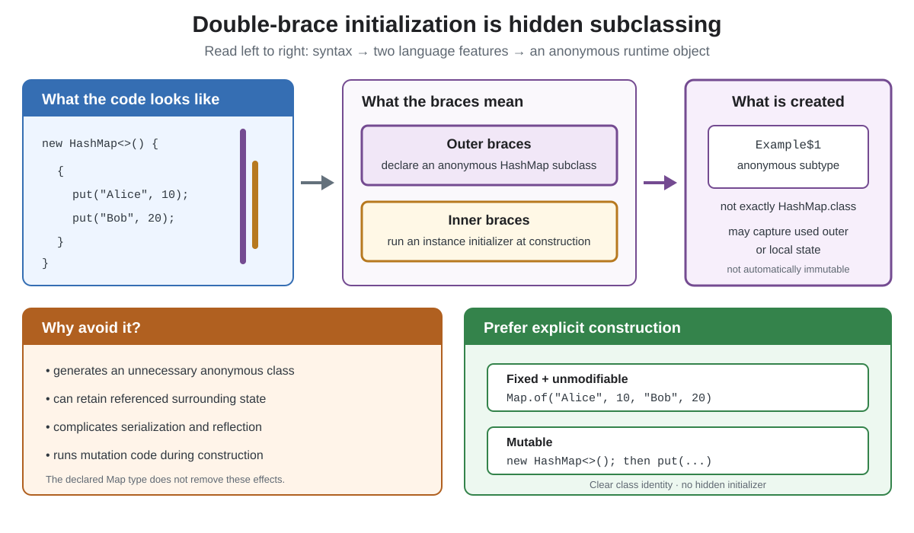

# Syntax. Double-Brace Initialization

## Front

What is double-brace initialization in Java, why is it discouraged, and what should replace it?

## Back

**Double-brace initialization is an idiom—not a collection literal—and should usually be avoided.** It creates an anonymous subclass and runs an instance initializer while constructing that subclass.



Inside a method, it may look like concise data initialization:

```java
Map<String, Integer> scores = new HashMap<>() {{
    put("Alice", 10);
    put("Bob", 20);
}};
```

The outer braces are the body of an anonymous `HashMap` subclass. The inner braces are an instance initializer that executes when its object is created. Therefore, the runtime object is an anonymous subtype, not an ordinary `HashMap` object.

Why avoid it?

- It generates an unnecessary class and cannot extend a `final` class.
- Initializer code runs during construction and can expose a partly constructed object.
- The anonymous class may capture referenced enclosing state or local values, extending their lifetime.
- Its generated class and captured fields can surprise serialization, reflection, and frameworks.

It is inaccurate to say that it *always* retains the enclosing object: since JDK 18, `javac` can omit an unused enclosing-instance field. Capture remains possible whenever surrounding state is used.

For fixed, unmodifiable data, prefer a factory:

```java
Map<String, Integer> scores = Map.of(
        "Alice", 10,
        "Bob", 20
);
```

For a mutable map, use ordinary statements:

```java
Map<String, Integer> scores = new HashMap<>();
scores.put("Alice", 10);
scores.put("Bob", 20);
```

`Map.of` rejects `null` keys and values and its result is unmodifiable. The explicit `HashMap` remains mutable and creates exactly the class named by the code.

## Sources

- [JLS 26 §15.9.5: Anonymous Class Declarations](https://docs.oracle.com/en/java/javase/26/docs/specs/jls/jls-15.html#jls-15.9.5)
- [JLS 26 §8.6: Instance Initializers](https://docs.oracle.com/en/java/javase/26/docs/specs/jls/jls-8.html#jls-8.6)
- [Error Prone: DoubleBraceInitialization](https://errorprone.info/bugpattern/DoubleBraceInitialization)
- [OpenJDK JDK-8271717: Omit unused enclosing-instance fields](https://bugs.openjdk.org/browse/JDK-8271717)
- [Java 26: Creating Unmodifiable Collections](https://docs.oracle.com/en/java/javase/26/core/creating-immutable-lists-sets-and-maps.html)
