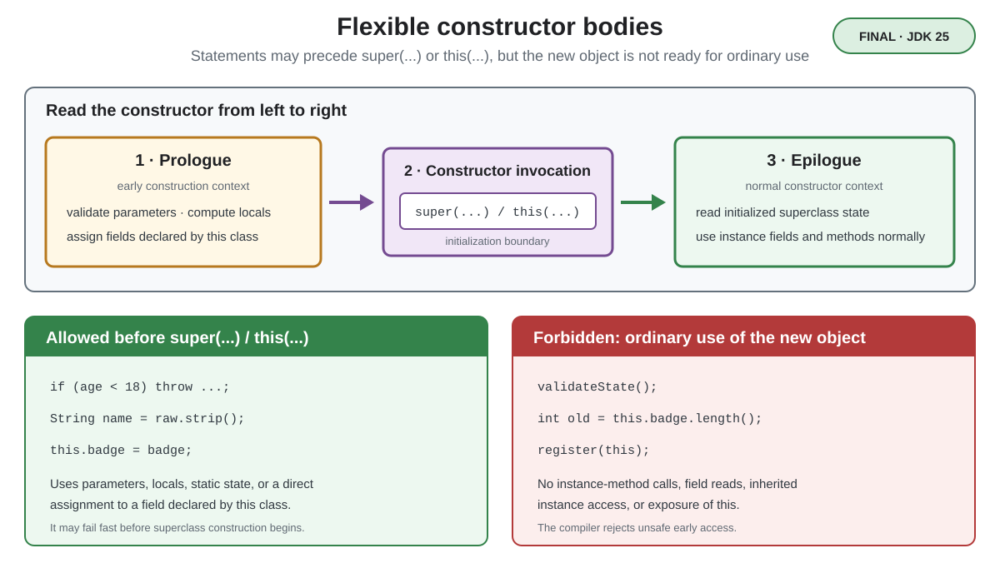

# Syntax. Flexible Constructor Bodies

## Front

What may a Java constructor do before `super(...)` or `this(...)`, and what remains forbidden?

## Back

**Flexible constructor bodies** became final in **JDK 25** with JEP 513.

They allow safe statements before an explicit `super(...)` or `this(...)` call. This first phase is the **prologue**; statements after the constructor invocation form the **epilogue**.



```java
class Person {
    Person(String name, int age) { }
}

class Employee extends Person {
    private final String badge;

    Employee(String name, int age, String badge) {
        if (age < 18) {
            throw new IllegalArgumentException("Under 18");
        }
        String normalized = name.strip();
        this.badge = badge;
        super(normalized, age);
    }
}
```

The prologue can:

- validate parameters and throw an exception;
- compute local values for constructor arguments;
- assign fields declared by the class being constructed.

However, it runs in an **early construction context**. The object is not ready for ordinary use, so the prologue cannot read its instance fields, invoke its instance methods, access inherited instance state, or pass/reference the object as `this`. Direct assignment such as `this.badge = badge` is a special permitted operation; reading `this.badge` there is not.

This enables fail-fast validation before superclass work starts and can initialize subclass fields before a superclass constructor exposes them through an overridden method. The `super(...)` or `this(...)` invocation still separates early construction from normal instance use.

The feature was first previewed in JDK 22 as JEP 447 and became permanent in JDK 25. Existing constructors keep their previous meaning.

## Sources

- [Java 25 Language Guide: Flexible Constructor Bodies](https://docs.oracle.com/en/java/javase/25/language/flexible-constructor-bodies.html)
- [JEP 513: Flexible Constructor Bodies](https://openjdk.org/jeps/513)
- [JLS 25 §8.8.7: Constructor Body](https://docs.oracle.com/javase/specs/jls/se25/html/jls-8.html#jls-8.8.7)
- [Java 25 Language Changes Summary](https://docs.oracle.com/en/java/javase/25/language/java-language-changes-summary.html)
