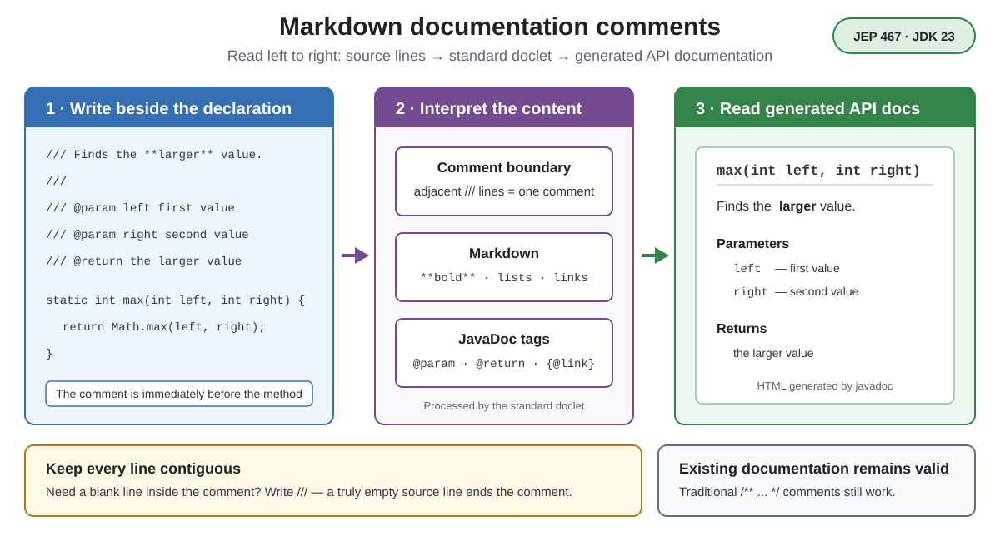

# Syntax. Markdown Documentation Comments

## Front

How do Markdown documentation comments work, and what rule keeps one comment together?

## Back

**Markdown documentation comments** were introduced in **JDK 23** with JEP 467.

They let the standard `javadoc` tool read Markdown from consecutive lines beginning with `///` and turn it into API documentation.



```java
public final class NumberTools {
    /// Returns the **larger** of two values.
    ///
    /// See [Math#max(int,int)].
    ///
    /// @param left the first value
    /// @param right the second value
    /// @return the larger value
    public static int max(int left, int right) {
        return Math.max(left, right);
    }
}
```

The standard doclet interprets a CommonMark variant of Markdown, enhanced links to program elements, simple pipe tables, and JavaDoc tags such as `@param`, `@return`, and `{@link ...}`.

The essential boundary rule is **continuity**:

- Adjacent `///` lines form one documentation comment.
- A blank line *inside* it must still be written as `///`.
- A truly empty source line ends the group; if another `///` group follows before the declaration, only the nearer group documents it.

Place the comment immediately before the declaration it documents. A normal `//` is not a documentation comment. Traditional `/** ... */` comments still work, and both styles may appear in one source file. This changes source documentation only, not runtime behavior.

## Sources

- [OpenJDK — JEP 467: Markdown Documentation Comments](https://openjdk.org/jeps/467)
- [Oracle JDK 23 JavaDoc Guide — Markdown in Documentation Comments](https://docs.oracle.com/en/java/javase/23/javadoc/using-markdown-documentation-comments.html)
- [Oracle JDK 23 — Documentation Comment Specification](https://docs.oracle.com/en/java/javase/23/docs/specs/javadoc/doc-comment-spec.html)
