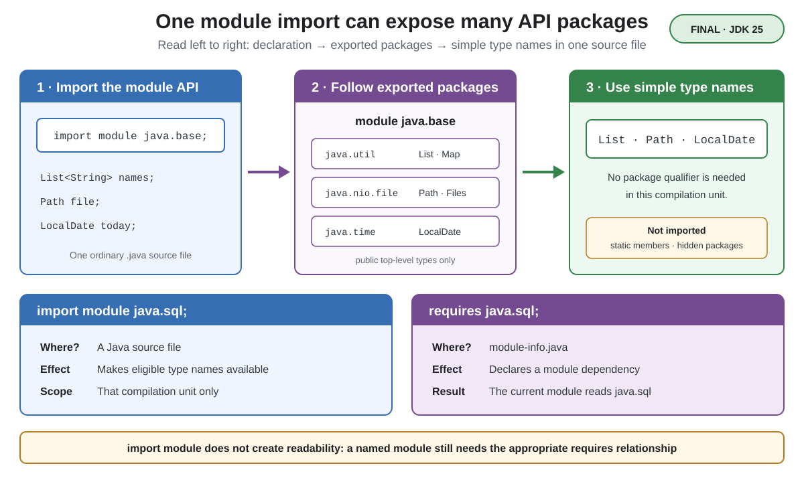

# Syntax. Module Import Declarations

## Front

What does `import module` do in Java, and how is it different from an ordinary import or `requires`?

## Back

**Module import declarations** became final in **JDK 25** with JEP 511.

A module import makes the accessible API of a named module available by simple type names in one compilation unit—a source file being compiled.



```java
import module java.base;

public final class Names {
    public static void main(String[] args) {
        List<String> names = List.of(" Ada ", " Linus ");
        names.stream()
             .map(String::strip)
             .forEach(System.out::println);
    }
}
```

`java.base` exports packages such as `java.util` and `java.util.stream`, so `List` and `Stream` are available without separate package imports.

`import module M;` imports on demand:

- public top-level classes and interfaces in packages that `M` exports to the current module;
- the same kinds of types from exported packages reached through `M`'s transitive module dependencies.

It does **not** import static members, non-public top-level types, or types from packages that are not exported to the current module.

## Import versus dependency

- `import java.util.List;` selects one type; `import java.util.*;` selects one package; `import module java.base;` spans the module's exported API packages.
- `requires java.sql;` belongs in `module-info.java` and declares a dependency that makes `java.sql` readable.
- `import module java.sql;` only brings eligible type names into scope. It does not replace `requires`; the current module must already read `java.sql`. The syntax can also be used by non-modular source code.

Broad imports can expose duplicate simple names. A more specific import resolves the ambiguity:

```java
import module java.base;
import module java.sql;
import java.sql.Date;

final class Report {
    Date createdOn;
}
```

The feature was first previewed in JDK 23 with JEP 476 and previewed again in JDK 24 with JEP 494.

## Sources

- [OpenJDK — JEP 511: Module Import Declarations](https://openjdk.org/jeps/511)
- [Oracle Java 25 Language Guide — Module Import Declarations](https://docs.oracle.com/en/java/javase/25/language/module-import-declarations.html)
- [Java Language Specification 25 — §7.5.5 Single-Module-Import Declarations](https://docs.oracle.com/javase/specs/jls/se25/html/jls-7.html#jls-7.5.5)
