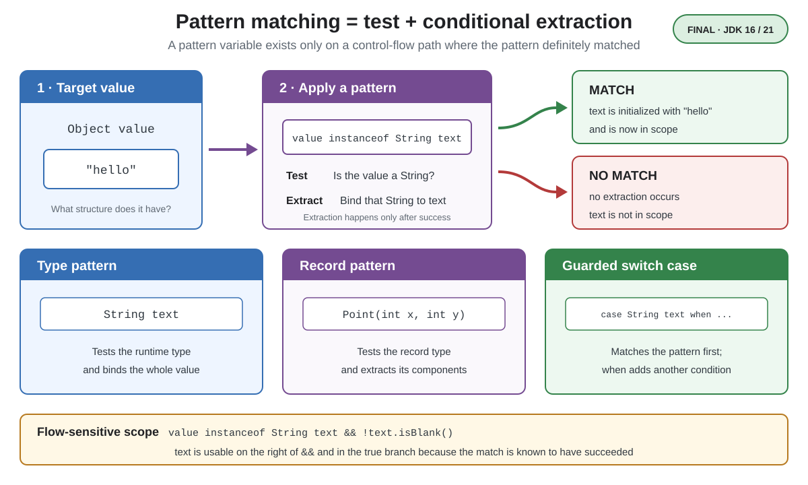

# Syntax. Pattern Matching

<sub>[Back to Java](../Readme.md#content)</sub>

# Front

What mental model unifies Java pattern matching, and how do type, record, and `switch` patterns differ?

# Back

**Pattern Matching for `instanceof` became final in JDK 16 with JEP 394.**

**Record Patterns and Pattern Matching for `switch` became final in JDK 21 with JEP 440 and JEP 441, respectively.**

A pattern combines a **test** with zero or more variables that are initialized only when the test succeeds. This removes separate casts and makes extracted values safe to use.



## Core forms

```java
record Point(int x, int y) {}

static String describe(Object value) {
    return switch (value) {
        case null -> "null";
        case Point(int x, int y) -> "point: " + x + ", " + y;
        case String text when text.isBlank() -> "blank text";
        case String text -> "text: " + text;
        default -> "other";
    };
}
```

- **Type pattern — `String text`:** tests the runtime type, converts the value, and binds the whole value to `text`.
- **Record pattern — `Point(int x, int y)`:** tests the record type and deconstructs it into component variables.
- **Pattern `switch`:** tries applicable case labels in order. A `when` guard adds a condition after its pattern matches. `case null` handles `null` explicitly.

## Flow-sensitive scope

A pattern variable is in scope only where the compiler knows the match succeeded:

```java
if (value instanceof String text && !text.isBlank()) {
    System.out.println(text.length()); // text is safe here
}
```

In a pattern `switch`, a broader case must not appear before a narrower case it already covers; that would make the narrower case dominated and cause a compile-time error. A `switch` expression must also be exhaustive, usually through complete cases or `default`.

# Sources

- [Oracle Java 25 Language Guide — Pattern Matching](https://docs.oracle.com/en/java/javase/25/language/pattern-matching.html)
- [OpenJDK — JEP 394: Pattern Matching for `instanceof`](https://openjdk.org/jeps/394)
- [OpenJDK — JEP 440: Record Patterns](https://openjdk.org/jeps/440)
- [OpenJDK — JEP 441: Pattern Matching for `switch`](https://openjdk.org/jeps/441)
