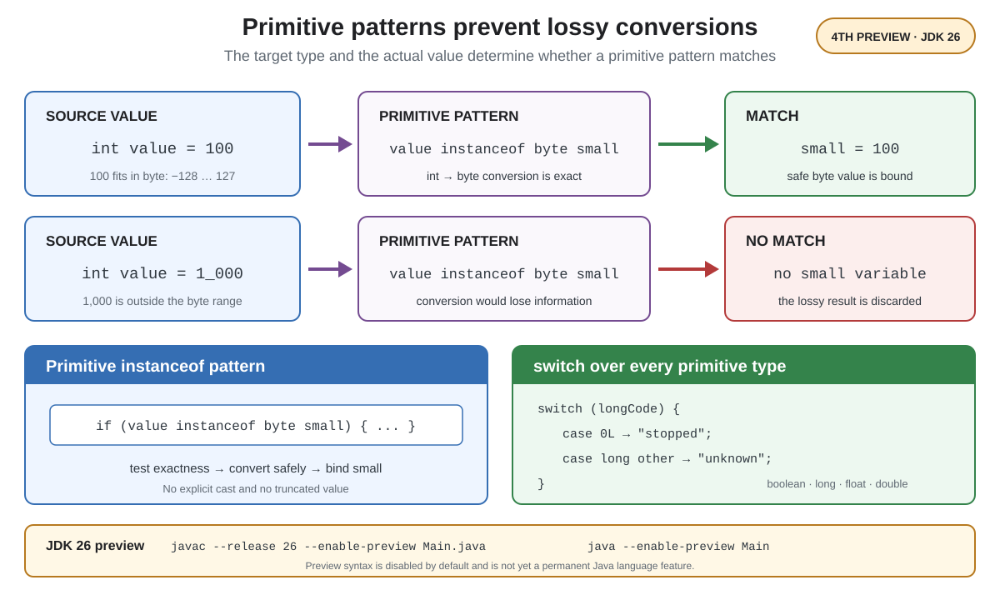

# Syntax. Primitive Types in Patterns

## Front

How do primitive patterns prevent lossy conversions, how do they expand `switch`, and are they final in JDK 26?

## Back

**Primitive Types in Patterns**, `instanceof`, and `switch` was previewed for a fourth time in **JDK 26** with JEP 530.

It allows primitive types in pattern contexts, extends `instanceof` to test primitive conversions, and lets `switch` use every primitive selector type. It is **not final**.



## Exact conversion decides the match

A primitive pattern matches only when converting the actual value to the pattern type loses no information. On success, Java binds the converted value:

```java
static String asByte(int value) {
    if (value instanceof byte small) {
        return "byte: " + small;
    }
    return "not exactly representable as byte";
}
```

- `asByte(100)` matches because `100` remains exactly `100` as a `byte`.
- `asByte(1_000)` does not match because narrowing it would lose information; no truncated value is exposed.

## Primitive `switch`

```java
static String status(long code) {
    return switch (code) {
        case 0L -> "stopped";
        case 1L -> "running";
        case long other -> "unknown: " + other;
    };
}
```

The selector may now be `boolean`, `long`, `float`, or `double`, in addition to previously supported types. Constants use the selector’s type—`0L`, not `0`, for `long`. The unconditional `case long other` binds every remaining value and makes this expression exhaustive.

## Preview requirement

```bash
javac --release 26 --enable-preview Main.java
java --enable-preview Main
```

Preview features are disabled by default and may change or disappear. The feature began as JEP 455 in JDK 23 and was re-previewed in JDK 24, 25, and 26.

## Sources

- [OpenJDK — JEP 530: Primitive Types in Patterns, `instanceof`, and `switch` (Fourth Preview)](https://openjdk.org/jeps/530)
- [Oracle Java 26 Language Guide — Primitive Types in Patterns, `instanceof`, and `switch`](https://docs.oracle.com/en/java/javase/26/language/primitive-types-patterns-instanceof-switch.html)
- [Java SE 26 Preview Specification — Exactness of Testing Conversions](https://docs.oracle.com/en/java/javase/26/docs/specs/primitive-types-in-patterns-instanceof-switch-jls.html#jls-5.7.1)
