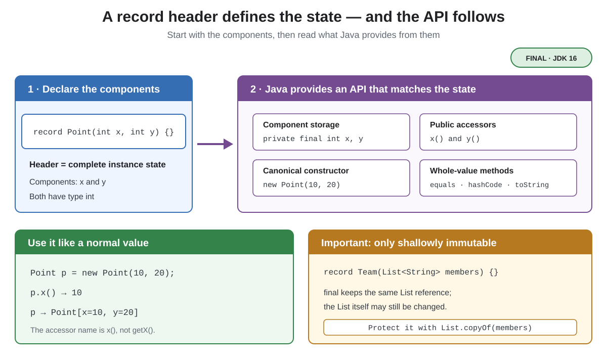

# Syntax. Record Classes

## Front

What is a Java record class, what does its header generate, and why is a record only shallowly immutable?

## Back

**Record classes** became final in **JDK 16** with JEP 395.

A record is a restricted class for representing a fixed set of values with little boilerplate. Its header is both the complete state description and the basis of its public API.



```java
record Point(int x, int y) {}

class Demo {
    public static void main(String[] args) {
        Point point = new Point(10, 20);
        System.out.println(point.x()); // 10 — x(), not getX()
        System.out.println(point);     // Point[x=10, y=20]
    }
}
```

For each component, such as `x`, the record has a `private final` field and a public accessor named `x()`. It also has:

- A **canonical constructor** whose parameters match the header.
- `equals()` and `hashCode()` based on the component values.
- A `toString()` that displays the record name, component names, and values.

A record is implicitly `final`, extends `java.lang.Record`, and cannot declare extra instance fields. It may still declare methods, static members, implement interfaces, and validate or normalize arguments in a compact canonical constructor:

```java
record User(String name, int age) {
    User {
        name = name.trim();
        if (age < 0) throw new IllegalArgumentException("negative age");
    }
}
```

After the compact constructor body, the normalized parameters are assigned to the component fields automatically.

## Shallow immutability

`final` prevents replacing a component field; it does not freeze a mutable object stored in that field. Make a defensive copy when the record must protect a collection:

```java
import java.util.List;

record Team(List<String> members) {
    Team {
        members = List.copyOf(members);
    }
}
```

## Sources

- [OpenJDK — JEP 395: Records](https://openjdk.org/jeps/395)
- [Java Language Specification §8.10 — Record Classes](https://docs.oracle.com/javase/specs/jls/se26/html/jls-8.html#jls-8.10)
- [Oracle Java 26 Language Guide — Record Classes](https://docs.oracle.com/en/java/javase/26/language/records.html)
