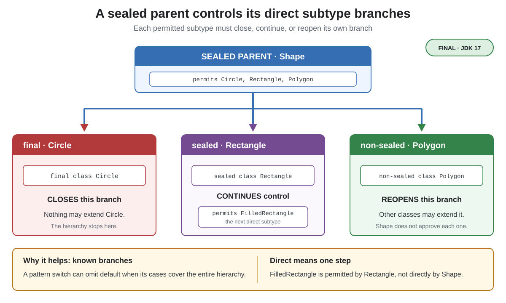

# Syntax. Sealed Classes

## Front

How does a sealed hierarchy control inheritance, and what do `final`, `sealed`, and `non-sealed` mean for each permitted branch?

## Back

**Sealed classes** became final in **JDK 17** with JEP 409.

A `sealed` class or interface names the types allowed to **directly** extend or implement it. This is useful when a domain has a controlled set of alternatives.



### `Shape.java`

```java
public sealed interface Shape
        permits Circle, Rectangle, Polygon {
    double area();
}
```

### `Circle.java`

```java
public final class Circle implements Shape {
    private final double radius;

    public Circle(double radius) {
        this.radius = radius;
    }

    @Override
    public double area() {
        return Math.PI * radius * radius;
    }
}
```

### `Rectangle.java`

```java
public sealed class Rectangle implements Shape
        permits FilledRectangle {
    private final double width;
    private final double height;

    public Rectangle(double width, double height) {
        this.width = width;
        this.height = height;
    }

    @Override
    public double area() {
        return width * height;
    }
}

final class FilledRectangle extends Rectangle {
    FilledRectangle(double width, double height) {
        super(width, height);
    }
}
```

### `Polygon.java`

```java
public non-sealed class Polygon implements Shape {
    private final double area;

    public Polygon(double area) {
        this.area = area;
    }

    @Override
    public double area() {
        return area;
    }
}
```

Every permitted direct subtype must choose how its branch continues:

- `final` — **closes** the branch; no subtype may extend it.
- `sealed` — **continues the restriction** with its own permitted direct subtypes.
- `non-sealed` — **reopens** that branch for ordinary extension.

`FilledRectangle` is absent from `Shape`'s `permits` list because it is an indirect subtype: its direct parent is `Rectangle`.

Knowing the permitted branches can make a pattern `switch` exhaustive: a `Rectangle` case also covers `FilledRectangle`, while a `Polygon` case covers subtypes in its reopened branch.

Permitted direct subtypes must be in the same named module as the sealed parent, or in the same package when using the unnamed module.

## Sources

- [OpenJDK — JEP 409: Sealed Classes](https://openjdk.org/jeps/409)
- [Java Language Specification §§8.1.1.2 and 8.1.6](https://docs.oracle.com/javase/specs/jls/se26/html/jls-8.html#jls-8.1.1.2)
- [Oracle Java 26 Language Guide — Sealed Classes](https://docs.oracle.com/en/java/javase/26/language/sealed-classes-interfaces.html)
