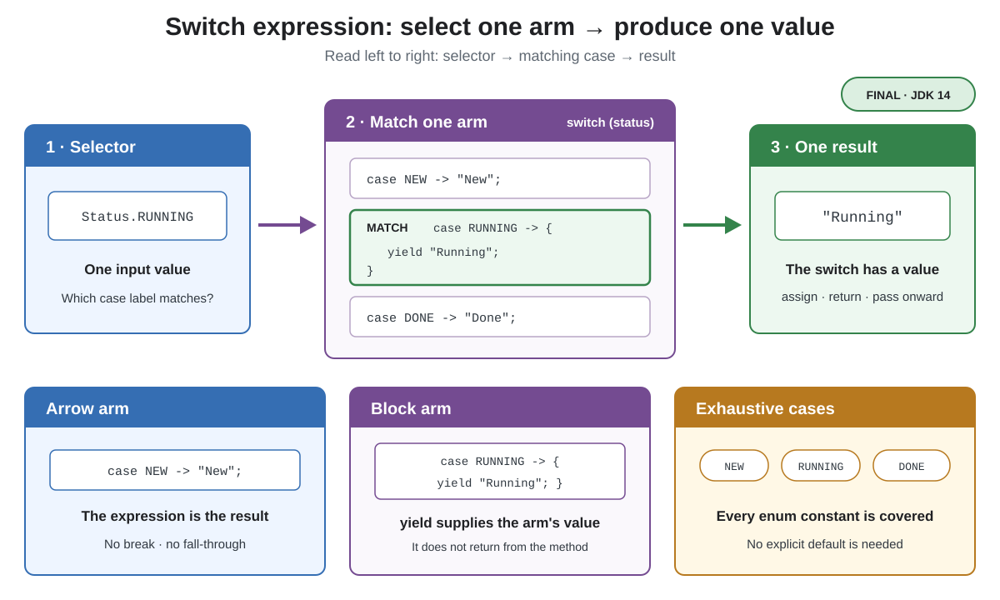

# Syntax. Switch Expression

## Front

How does a Java `switch` expression produce a value, and when are `yield` and exhaustive cases required?

## Back

**Switch expression** became final in **JDK 14** with JEP 361.

A `switch` expression selects one arm and produces one value. That value can be assigned, returned, or passed to another expression.



```java
enum Status { NEW, RUNNING, DONE }

public class SwitchExpressionDemo {
    static String label(Status status) {
        return switch (status) {
            case NEW -> "New";
            case RUNNING -> {
                System.out.println("still working");
                yield "Running";
            }
            case DONE -> "Done";
        };
    }

    public static void main(String[] args) {
        System.out.println(label(Status.RUNNING));
    }
}
```

- `case ... -> expression` makes the expression the arm's result. Arrow arms do **not** fall through, so they need no `break`.
- If an arm needs multiple statements, use a block. Every path that finishes normally must `yield` a value. `yield` supplies the enclosing `switch`; `return` would exit the method.
- A `switch` expression must be **exhaustive**: every possible selector value needs a matching label. Covering every enum constant makes this example exhaustive without `default`; an open-ended selector normally needs `default`.

The semicolon after `}` completes the surrounding `return` statement. Arrow labels also work in switch statements, but only a switch **expression** produces a result.

## Sources

- [OpenJDK — JEP 361: Switch Expressions](https://openjdk.org/jeps/361)
- [Java Language Specification §15.28 — `switch` Expressions](https://docs.oracle.com/javase/specs/jls/se26/html/jls-15.html#jls-15.28)
- [Oracle Java 26 Language Guide — Switch Expressions and Statements](https://docs.oracle.com/en/java/javase/26/language/switch-expressions-statements.html)
