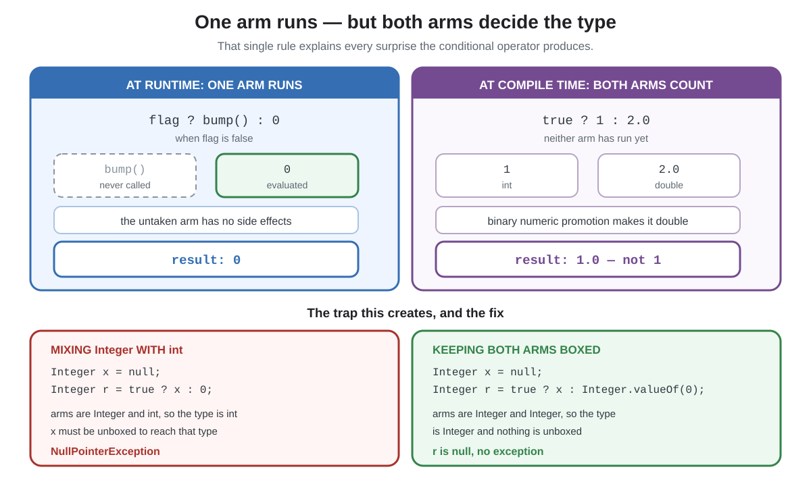

# Syntax. Ternary operator

## Front

What does Java's `? :` operator evaluate to, and why can `cond ? a : b` throw a `NullPointerException` or hand back a value whose type you never wrote?

## Back

**`? :` is the conditional operator — Java's only ternary operator, and an expression rather than a shorthand `if`.** It evaluates exactly one arm, but the compiler decides the type of the whole expression from **both** arms. That split explains every surprise it produces.



```java
int abs = n < 0 ? -n : n;               // produces a value, so it can be assigned
String word = n == 1 ? "one"            // right-associative, so chains nest rightward
            : n == 2 ? "two" : "many";
```

Being an expression is the point: it fits anywhere a value fits — an argument, a field initializer, a `return`. An `if` statement fits none of those.

### The two rules

1. **Exactly one arm is evaluated.** The untaken arm never runs, so its side effects never happen.
2. **Both arms determine the type**, before either has run. When both are numeric, binary numeric promotion applies.

| Expression | Result | Why |
|---|---|---|
| `true ? 1 : 2.0` | `1.0` | `int` and `double` promote to `double` |
| `false ? bump() : 0` | `0` | `bump()` is never called |
| `true ? x : 0`, with `Integer x = null` | `NullPointerException` | arms are `Integer` and `int`, so the type is `int` and `x` must be unboxed |
| `true ? x : Integer.valueOf(0)` | `null` | both arms are `Integer`, so nothing is unboxed |

The third row is the one that bites in real code: a boxed value and a literal in the same conditional silently make the expression primitive.

### Limits and misconceptions

- **The condition must be `boolean` or `Boolean`.** A `null` `Boolean` is unboxed and throws.
- **It is not a shorter `if`.** Both arms must yield a value, so it cannot hold statements — and an `if` cannot be assigned.
- **Chaining is legal but costly to read.** Past one level, prefer an `if` or a `switch` expression.

## Sources

- [JLS §15.25 — Conditional Operator `? :`](https://docs.oracle.com/javase/specs/jls/se26/html/jls-15.html#jls-15.25)

  Specifies the operator, the `boolean` or `Boolean` condition, that only the chosen operand is evaluated, and how the expression's type is derived from both operands.

- [JLS §5.6.2 — Binary Numeric Promotion](https://docs.oracle.com/javase/specs/jls/se26/html/jls-5.html#jls-5.6.2)

  Defines the promotion applied to two numeric operands, which is why an `int` arm and a `double` arm produce a `double`.

- [JLS §5.1.8 — Unboxing Conversion](https://docs.oracle.com/javase/specs/jls/se26/html/jls-5.html#jls-5.1.8)

  Defines the conversion that turns a `null` wrapper into a `NullPointerException` when the expression's type is primitive.
