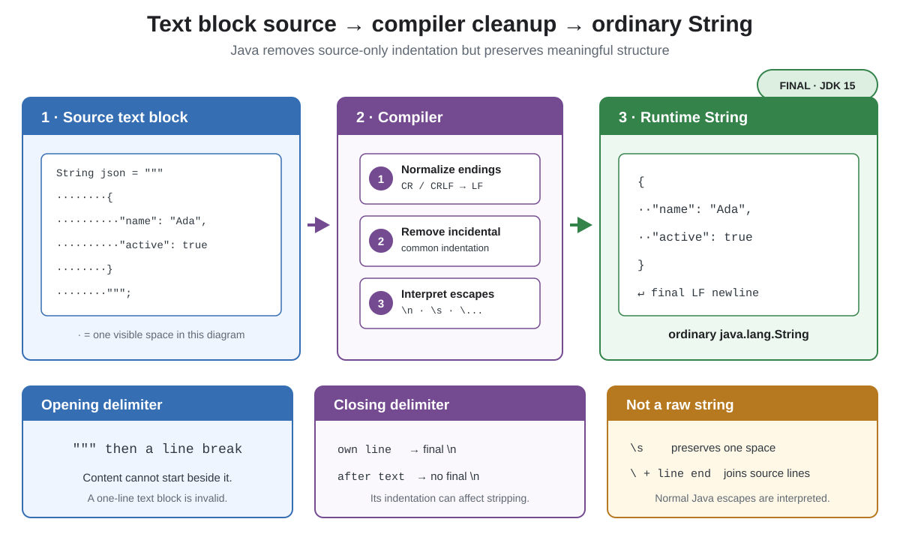

# Syntax. Text Block

## Front

What does a Java text block produce, and how do its delimiters, indentation, final newline, and escapes affect the result?

## Back

**Text blocks** became final in **JDK 15** with JEP 378.

A text block is a multiline spelling of an ordinary `String`. It starts with `"""` followed by a required line terminator; content cannot begin on the opening delimiter's line.



```java
public class TextBlockDemo {
    public static void main(String[] args) {
        String json = """
                {
                  "name": "Ada",
                  "active": true
                }
                """;

        System.out.print(json);
    }
}
```

The value is:

```text
{
  "name": "Ada",
  "active": true
}
```

The compiler processes the content in this order:

1. Normalizes source line endings to line feed (`\n`).
2. Removes common **incidental indentation** and trailing whitespace. Relative indentation, such as the two spaces before the JSON properties, remains.
3. Interprets Java escape sequences.

Because the closing `"""` is on its own line, the example's string ends with `\n`. Put the delimiter immediately after the final content to omit that newline:

```java
String word = """
        hello"""; // value is exactly "hello"
```

Text blocks are not raw strings. Ordinary escapes still work; `\s` preserves an intentional space, while a backslash immediately before a source line ending suppresses that newline. Double quotes usually need no escaping inside the block.

## Sources

- [OpenJDK — JEP 378: Text Blocks](https://openjdk.org/jeps/378)
- [Java Language Specification §3.10.6 — Text Blocks](https://docs.oracle.com/javase/specs/jls/se26/html/jls-3.html#jls-3.10.6)
- [Oracle Java 26 Language Guide — Text Blocks](https://docs.oracle.com/en/java/javase/26/language/text-blocks.html)
