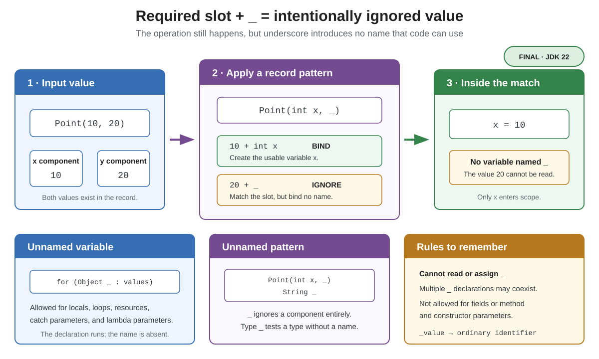

# Syntax. Unnamed Variables and Patterns

## Front

What does `_` mean in Java unnamed variables and patterns, where is it allowed, and can its value be read?

## Back

**Unnamed variables and patterns** became final in **JDK 22** with JEP 456.

`_` means: “the syntax requires this slot, but its value is intentionally unused.” It creates no usable name, so later code cannot read or assign `_`.



```java
import java.util.List;

record Point(int x, int y) {}

public class UnnamedDemo {
    static void inspect(List<Object> values) {
        int count = 0;

        for (Object _ : values) { // unnamed loop variable
            count++;
        }

        for (Object value : values) {
            if (value instanceof Point(int x, _)) {
                System.out.println("x = " + x); // y is ignored
            }
        }

        try {
            Integer.parseInt("not a number");
        } catch (NumberFormatException _) { // unnamed exception parameter
            System.out.println("invalid number");
        }

        System.out.println("count = " + count);
    }

    public static void main(String[] args) {
        inspect(List.of(new Point(10, 20), "text"));
    }
}
```

- An **unnamed variable** may appear as a local, loop or resource variable, `catch` parameter, or lambda parameter. It is initialized when required but cannot be referenced.
- An **unnamed pattern** `_` inside a record pattern matches the component without binding it. A type pattern such as `String _` still tests the type but creates no readable pattern variable.
- Multiple `_` declarations may share a scope because none introduces a name.

`_` is not allowed as a field or as a method or constructor parameter. It is also not an ordinary identifier: `int _ = 1;` declares an unusable local, while `_value` remains a normal identifier.

## Sources

- [OpenJDK — JEP 456: Unnamed Variables & Patterns](https://openjdk.org/jeps/456)
- [Java Language Specification §6.1 — Unnamed declarations](https://docs.oracle.com/javase/specs/jls/se26/html/jls-6.html#jls-6.1)
- [Oracle Java 26 Language Guide — Unnamed Variables and Patterns](https://docs.oracle.com/en/java/javase/26/language/unnamed-variables-patterns.html)
