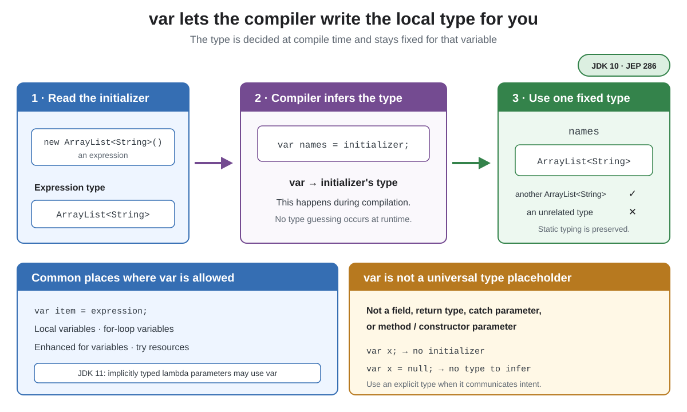

# Syntax. `var` Type

## Front

What does `var` do in Java, where can it be used, and does it make a variable dynamically typed?

## Back

**Local-variable type inference** was introduced in **JDK 10** with JEP 286.

`var` tells the compiler to infer a local variable's **static type** from its initializer. Only the type spelling is omitted; Java remains statically typed, and the inferred type is fixed for that variable.



```java
import java.util.ArrayList;

public class VarDemo {
    public static void main(String[] args) {
        var names = new ArrayList<String>(); // ArrayList<String>
        names.add("Ada");

        for (var name : names) {             // name is String
            System.out.println(name.toUpperCase());
        }

        var message = "hello";              // String
        message = "goodbye";                // valid: still String
        // message = 42;                     // error: int is not String
    }
}
```

Common legal positions are a local variable with an initializer, a basic or enhanced `for` variable, and a `try`-with-resources variable. JDK 11 added `var` for implicitly typed lambda parameters with JEP 323; either every lambda parameter uses `var`, or none does.

`var` cannot be used for a field, method or constructor parameter, return type, or `catch` parameter. The compiler also needs an initializer whose type it can determine. These declarations do not compile:

```java
var missing;          // error: no initializer
var nothing = null;   // error: null supplies no type
var task = () -> {};  // error: a lambda needs a target type
```

Inference uses the initializer's type, not the abstraction you might prefer: `var names = new ArrayList<String>()` means `ArrayList<String>`, not `List<String>`. Use an explicit type when that abstraction or the initializer's meaning is important to the reader.

## Sources

- [OpenJDK — JEP 286: Local-Variable Type Inference](https://openjdk.org/jeps/286)
- [Java Language Specification §14.4 — Local Variable Declarations](https://docs.oracle.com/javase/specs/jls/se26/html/jls-14.html#jls-14.4)
- [OpenJDK — JEP 323: Local-Variable Syntax for Lambda Parameters](https://openjdk.org/jeps/323)
