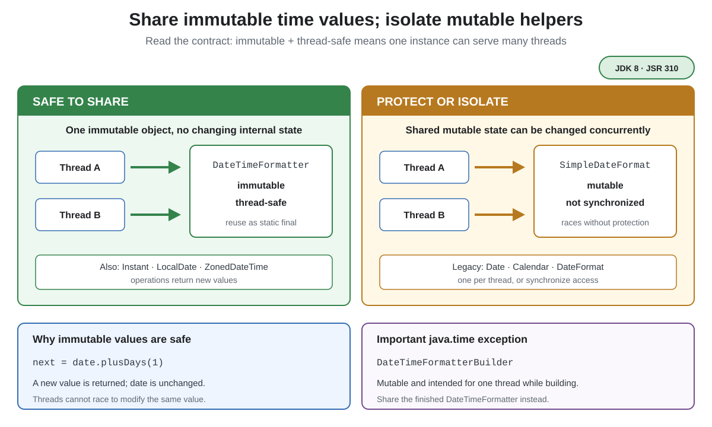

# Thread-Safe Time Classes

## Front

Which Java date-and-time objects can be shared between threads, and which ones need protection?

## Back

Anything in `java.time` is safe to share as a constant; anything in `java.util` or `java.text` with a date in its name is not.

`DateTimeFormatter` is also thread-safe, so the same instance may be shared. Legacy mutable objects such as `SimpleDateFormat` must not be used concurrently without protection.



**Immutable** means an object's state cannot change after creation. Methods such as `plusDays` return a new value instead of changing the original, so threads cannot race to update that state.

```java
import java.time.LocalDate;
import java.time.format.DateTimeFormatter;

public class ThreadSafeTime {
    private static final DateTimeFormatter DATE =
            DateTimeFormatter.ofPattern("uuuu-MM-dd");

    static String tomorrow(String text) {
        LocalDate today = LocalDate.parse(text, DATE);
        LocalDate next = today.plusDays(1); // today is unchanged
        return DATE.format(next);
    }

    public static void main(String[] args) {
        System.out.println(tomorrow("2026-08-23")); // 2026-08-24
    }
}
```

Safe shared examples include `Instant`, `LocalDate`, `LocalDateTime`, `ZonedDateTime`, `Duration`, `Period`, `ZoneId`, and `DateTimeFormatter`.

Do not apply the rule to every class under every `java.time` subpackage: `DateTimeFormatterBuilder` is mutable and intended for one thread. Finish building, then share the resulting `DateTimeFormatter`.

`Date`, `Calendar`, `DateFormat`, and `SimpleDateFormat` are legacy mutable types. Prefer `java.time`. If a legacy formatter is unavoidable, create one per thread or synchronize every shared access externally.

## Sources

- [Oracle — Java Date-Time APIs introduced in JDK 8](https://docs.oracle.com/javase/8/docs/technotes/guides/datetime/index.html)
- [Java SE 26 API — `java.time` package](https://docs.oracle.com/en/java/javase/26/docs/api/java.base/java/time/package-summary.html)
- [Java SE 26 API — `DateTimeFormatter`](https://docs.oracle.com/en/java/javase/26/docs/api/java.base/java/time/format/DateTimeFormatter.html)
- [Java SE 26 API — `DateTimeFormatterBuilder`](https://docs.oracle.com/en/java/javase/26/docs/api/java.base/java/time/format/DateTimeFormatterBuilder.html)
- [Java SE 26 API — `SimpleDateFormat` synchronization](https://docs.oracle.com/en/java/javase/26/docs/api/java.base/java/text/SimpleDateFormat.html)
- [Oracle tutorial — Legacy date-time code](https://docs.oracle.com/javase/tutorial/datetime/iso/legacy.html)
