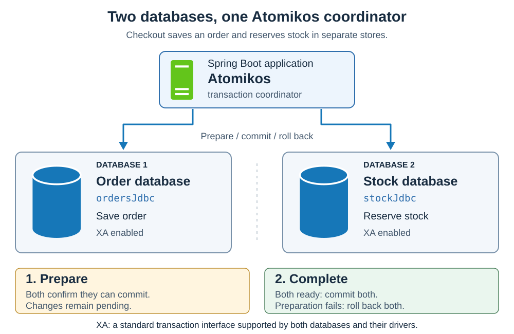

# Transactions. Atomikos

<sub>[Back to Java](../Readme.md#content)</sub>

# Front

What is Atomikos, and when does a Java application need it?

# Back

**Atomikos is an embeddable Java transaction manager that coordinates one transaction across multiple resources**, such as two databases. TransactionsEssentials needs no application server.

## The problem it solves

A **transaction** groups work into one outcome: **commit** makes changes permanent; **rollback** discards uncommitted changes. A local transaction belongs to one database; a **global transaction** coordinates multiple resources.

Checkout spans an order database and a stock database. Separate commits could save the order even if stock reservation fails.

The figure previews two-phase commit: arrows show coordination; numbered panels show its phases.



## How it works

- **JTA (Java Transaction API, now Jakarta Transactions)** defines transaction-management interfaces; Atomikos implements them.
- **XA (eXtended Architecture)** is the standard interface for coordinating compatible resources.
- **Two-phase commit (2PC)** has two phases: **prepare** (promise to commit; keep changes pending), then **complete** (commit if all are ready; roll back if preparation fails).

Recovery can finish work interrupted by a crash. **A timeout does not prove rollback.** At JTA `commit()`, `HeuristicMixedException` means some participants committed and others rolled back.

## Spring Boot example

**Spring Boot 3.4 / Atomikos 6.x** service fragment; schema and application configuration omitted. Use `com.atomikos:transactions-spring-boot3.4-starter` at a compatible version. Configure:

- An Atomikos-backed Spring `JtaTransactionManager` named `transactionManager`, with annotation-driven transactions enabled.
- Two `JdbcTemplate` beans (Spring SQL helpers), `ordersJdbc` and `stockJdbc`, backed by XA-configured `AtomikosDataSourceBean` pools with distinct resource names. Both join the same global transaction.

```java
import org.springframework.beans.factory.annotation.Qualifier;
import org.springframework.jdbc.core.JdbcTemplate;
import org.springframework.stereotype.Service;
import org.springframework.transaction.annotation.Transactional;

@Service
public class CheckoutService {
    private final JdbcTemplate orders;
    private final JdbcTemplate stock;

    public CheckoutService(
            @Qualifier("ordersJdbc") JdbcTemplate orders,
            @Qualifier("stockJdbc") JdbcTemplate stock) {
        this.orders = orders;
        this.stock = stock;
    }

    @Transactional(transactionManager = "transactionManager")
    public void checkout(long orderId, long productId) {
        orders.update("INSERT INTO orders(id, product_id) VALUES (?, ?)",
                orderId, productId);
        int changed = stock.update(
                "UPDATE inventory SET available = available - 1 "
                + "WHERE product_id = ? AND available > 0", productId);
        if (changed != 1) {
            throw new IllegalStateException("Stock unavailable");
        }
    }
}
```

Call through an injected `CheckoutService` from another bean so Spring's proxy intercepts it. The uncaught runtime exception triggers rollback, including the order insert. On success, Atomikos coordinates commit of both updates.

## When to use it

Use it when multiple XA-capable resources need one global transaction. XA message brokers can join it; arbitrary external calls do not join automatically. If **one local database transaction** covers the work, it is usually enough.

# Sources

- [Atomikos — TransactionsEssentials: embedded JTA/XA transaction management](https://www.atomikos.com/Main/TransactionsEssentials)
- [Atomikos — What is XA?](https://www.atomikos.com/Documentation/WhatIsXa)
- [Jakarta Transactions 2.0 — §2.4 XA-capable messaging, §3.3.1 required resource enlistment, and §3.4.8 recovery](https://jakarta.ee/specifications/transactions/2.0/jakarta-transactions-spec-2.0.html)
- [Jakarta Transactions API — `UserTransaction.commit()` and `HeuristicMixedException`](https://jakarta.ee/specifications/transactions/2.0/apidocs/jakarta/transaction/usertransaction)
- [Atomikos — Mixed heuristic outcomes: some participants commit, others roll back](https://www.atomikos.com/Documentation/HeuristicExceptions)
- [Atomikos — When not to use JTA/XA](https://www.atomikos.com/Documentation/WhenNotToUseJtaXa)
- [Atomikos — Spring Boot integration and version-specific starters](https://www.atomikos.com/Documentation/SpringBootIntegration)
- [Atomikos — XA-aware JDBC pools and transaction participation](https://www.atomikos.com/Documentation/ConfiguringJdbc)
- [Atomikos — JMS connection factories and XA participation](https://www.atomikos.com/Documentation/ConfiguringJms)
- [Atomikos — Known Problems: duplicate `uniqueResourceName` values and recovery conflicts](https://www.atomikos.com/Documentation/KnownProblems)
- [Spring Framework 6.2 — `@Transactional`, manager selection, rollback rules, and proxies](https://docs.spring.io/spring-framework/reference/6.2/data-access/transaction/declarative/annotations.html)
- [Spring Framework — `JtaTransactionManager`](https://docs.spring.io/spring-framework/docs/current/javadoc-api/org/springframework/transaction/jta/JtaTransactionManager.html)
- [Spring Framework — `DataSourceUtils` and `JdbcTemplate` transaction participation](https://docs.spring.io/spring-framework/docs/current/javadoc-api/org/springframework/jdbc/datasource/DataSourceUtils.html)
